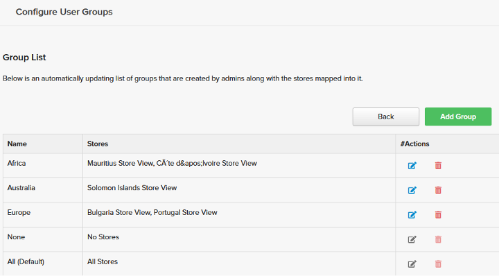

# Erweiterte Benutzerverwaltung

Die [!DNL Advanced User Management] bietet verbesserte Steuerelemente für die Datensichtbarkeit und ermöglicht die logische Datenfilterung anhand von Benutzergruppen (Organisationsregionen). Sie ermöglicht es Ihnen, die Datensichtbarkeit auf der Grundlage von Benutzergruppen anzupassen, und macht es überflüssig, eine Replikation vorhandener Dashboards zu erstellen, um regionsspezifische Berichtsanforderungen jedes Mal zu erfüllen, wenn das Unternehmen sich zu einer neuen Region erweitert.

[!DNL Advanced User Management] vereinfacht die Freigabe von Dashboards und die Sichtbarkeit von Daten und stellt gleichzeitig Sicherheit und Skalierbarkeit für große Unternehmen sicher. Die Flexibilität bei der Konfiguration von Benutzergruppen, Rollen und Berechtigungen macht Commerce Intelligence zu einem leistungsstarken Tool für Anforderungen auf Unternehmensebene.

Wenn [!DNL Advanced User Management] aktiviert ist, haben nur Admin-Benutzer Zugriff auf die Einrichtung von:

- Metriken
- Visual Report Builder
- SQL-basierte Berichte
- E-Mail-Zusammenfassung
- Rohexporte

## Funktionsmatrix

[!DNL Advanced User Management] wirkt sich auf mehrere Funktionen in Commerce Intelligence aus. In der folgenden Tabelle werden Funktionen, Berechtigungen und ihre Verfügbarkeit für verschiedene Rollen beschrieben, die auf der Aktivierung oder Deaktivierung der Funktion basieren.

<table><thead>
  <tr>
    <th colspan="3" rowspan="2">Commerce Intelligence-Funktionen</th>
    <th colspan="6">Erweiterte AUM-Funktionen (User Management)</th>
  </tr>
  <tr>
    <th colspan="3">Disabled</th>
    <th colspan="3">Aktiviert</th>
  </tr></thead>
<tbody>
  <tr>
    <td>Funktionsgruppe</td>
    <td>Funktion</td>
    <td>Berechtigungen</td>
    <td>Administrator</td>
    <td>Standard</td>
    <td>Schreibgeschützt</td>
    <td>Administrator</td>
    <td>Standard</td>
    <td>Schreibgeschützt</td>
  </tr>
  <tr>
    <td rowspan="7">Benutzer verwalten (für alle Administratoren zugänglich, für alle Rollen relevant)</td>
    <td>Konfigurieren von Benutzergruppen</td>
    <td></td>
    <td></td>
    <td></td>
    <td></td>
    <td>✓</td>
    <td></td>
    <td></td>
  </tr>
  <tr>
    <td>Benutzer einladen</td>
    <td></td>
    <td>✓</td>
    <td></td>
    <td></td>
    <td>✓</td>
    <td></td>
    <td></td>
  </tr>
  <tr>
    <td>Registerkarte „Berechtigungen“ - Rollenzuordnung</td>
    <td></td>
    <td>✓</td>
    <td></td>
    <td></td>
    <td>✓</td>
    <td></td>
    <td></td>
  </tr>
  <tr>
    <td>Registerkarte „Berechtigungen“ - Benutzergruppenzuordnung (AUM)</td>
    <td></td>
    <td></td>
    <td></td>
    <td></td>
    <td>✓</td>
    <td></td>
    <td></td>
  </tr>
  <tr>
    <td>Registerkarte „Berechtigungen“ - speichert die Zuordnung von Teilmengen (AUM)</td>
    <td></td>
    <td></td>
    <td></td>
    <td></td>
    <td>✓</td>
    <td></td>
    <td></td>
  </tr>
  <tr>
    <td>Registerkarte Metriken</td>
    <td></td>
    <td>✓</td>
    <td></td>
    <td></td>
    <td>✓</td>
    <td></td>
    <td></td>
  </tr>
  <tr>
    <td>Registerkarte Freigegebene Dashboards</td>
    <td></td>
    <td>✓</td>
    <td></td>
    <td></td>
    <td>✓</td>
    <td></td>
    <td></td>
  </tr>
  <tr>
    <td rowspan="2">Report Builder</td>
    <td>Visual Report Builder</td>
    <td></td>
    <td>✓</td>
    <td>✓</td>
    <td></td>
    <td>✓</td>
    <td></td>
    <td></td>
  </tr>
  <tr>
    <td>SQL-Report Builder</td>
    <td></td>
    <td>✓</td>
    <td></td>
    <td></td>
    <td>✓</td>
    <td></td>
    <td></td>
  </tr>
  <tr>
    <td rowspan="2">E-Mail-Zusammenfassung</td>
    <td>Erstellen von E-Mail-Zusammenfassungen ohne Datenpartitionierung</td>
    <td></td>
    <td>✓</td>
    <td>✓</td>
    <td></td>
    <td>✓</td>
    <td></td>
    <td></td>
  </tr>
  <tr>
    <td>Erstellen von E-Mail-Zusammenfassungen mit Datenpartitionierung (AUM)</td>
    <td></td>
    <td></td>
    <td></td>
    <td></td>
    <td>✓</td>
    <td></td>
    <td></td>
  </tr>
  <tr>
    <td rowspan="4">Dashboards  - Freigeben</td>
    <td>Freigeben des Dashboards für Benutzer in allen Rollen</td>
    <td></td>
    <td>✓</td>
    <td>✓</td>
    <td></td>
    <td></td>
    <td></td>
    <td></td>
  </tr>
  <tr>
    <td>Dashboard für Benutzergruppen und Administratoren freigeben (AUM)</td>
    <td></td>
    <td></td>
    <td></td>
    <td></td>
    <td>✓</td>
    <td></td>
    <td></td>
  </tr>
  <tr>
    <td rowspan="2">Freigeben eines Dashboards - Berechtigungen</td>
    <td>Bearbeiten</td>
    <td>✓</td>
    <td>✓</td>
    <td></td>
    <td></td>
    <td></td>
    <td></td>
  </tr>
  <tr>
    <td>anzeigen</td>
    <td>✓</td>
    <td>✓</td>
    <td></td>
    <td>✓</td>
    <td></td>
    <td></td>
  </tr>
  <tr>
    <td rowspan="18">Dashboards - Ansicht (Öffnet ein freigegebenes Dashboard mit gegebenen Berechtigungen)</td>
    <td rowspan="2">Freigeben eines freigegebenen Dashboards</td>
    <td>Bearbeiten</td>
    <td>✓</td>
    <td>✓</td>
    <td></td>
    <td></td>
    <td></td>
    <td></td>
  </tr>
  <tr>
    <td>anzeigen</td>
    <td></td>
    <td></td>
    <td></td>
    <td></td>
    <td></td>
    <td></td>
  </tr>
  <tr>
    <td rowspan="2">Datumsfilter (ohne Feature Flag „Zeitoptionen bearbeiten„)</td>
    <td>Bearbeiten</td>
    <td>✓</td>
    <td>✓</td>
    <td>✓</td>
    <td></td>
    <td></td>
    <td></td>
  </tr>
  <tr>
    <td>anzeigen</td>
    <td></td>
    <td></td>
    <td></td>
    <td>✓</td>
    <td></td>
    <td></td>
  </tr>
  <tr>
    <td rowspan="2">Datumsfilter (mit Feature Flag „Zeitoptionen bearbeiten„)</td>
    <td>Bearbeiten</td>
    <td>✓</td>
    <td>✓</td>
    <td>✓</td>
    <td></td>
    <td></td>
    <td></td>
  </tr>
  <tr>
    <td>anzeigen</td>
    <td>✓</td>
    <td>✓</td>
    <td></td>
    <td>✓</td>
    <td>✓</td>
    <td>✓</td>
  </tr>
  <tr>
    <td rowspan="2">Filter speichern (ohne Feature Flag „Zeitoptionen bearbeiten„)</td>
    <td>Bearbeiten</td>
    <td>✓</td>
    <td>✓</td>
    <td>✓</td>
    <td></td>
    <td></td>
    <td></td>
  </tr>
  <tr>
    <td>anzeigen</td>
    <td>✓</td>
    <td>✓</td>
    <td></td>
    <td>✓</td>
    <td>✓</td>
    <td></td>
  </tr>
  <tr>
    <td rowspan="2">Filter speichern (mit Feature Flag „Zeitoptionen bearbeiten„)</td>
    <td>Bearbeiten</td>
    <td>✓</td>
    <td>✓</td>
    <td>✓</td>
    <td></td>
    <td></td>
    <td></td>
  </tr>
  <tr>
    <td>anzeigen</td>
    <td>✓</td>
    <td>✓</td>
    <td></td>
    <td>✓</td>
    <td>✓</td>
    <td></td>
  </tr>
  <tr>
    <td rowspan="2">Dashboard-Daten - Filtern von Berichtsdaten basierend auf der Zuordnung von Benutzergruppen (AUM)</td>
    <td>Bearbeiten</td>
    <td></td>
    <td></td>
    <td></td>
    <td></td>
    <td></td>
    <td></td>
  </tr>
  <tr>
    <td>anzeigen</td>
    <td></td>
    <td></td>
    <td></td>
    <td>✓</td>
    <td>✓</td>
    <td>✓</td>
  </tr>
  <tr>
    <td rowspan="2">Bericht - Bearbeiten</td>
    <td>Bearbeiten</td>
    <td>✓</td>
    <td>✓</td>
    <td></td>
    <td>✓</td>
    <td></td>
    <td></td>
  </tr>
  <tr>
    <td>anzeigen</td>
    <td></td>
    <td></td>
    <td></td>
    <td>✓</td>
    <td></td>
    <td></td>
  </tr>
  <tr>
    <td rowspan="2">Berichtsexport (CSV, XLSX)</td>
    <td>Bearbeiten</td>
    <td>✓</td>
    <td>✓</td>
    <td>✓</td>
    <td>✓</td>
    <td></td>
    <td></td>
  </tr>
  <tr>
    <td>anzeigen</td>
    <td>✓</td>
    <td>✓</td>
    <td>✓</td>
    <td>✓</td>
    <td>✓</td>
    <td>✓</td>
  </tr>
  <tr>
    <td rowspan="2">Bericht - Rohexport</td>
    <td>Bearbeiten</td>
    <td>✓</td>
    <td>✓</td>
    <td></td>
    <td>✓</td>
    <td></td>
    <td></td>
  </tr>
  <tr>
    <td>anzeigen</td>
    <td>✓</td>
    <td>✓</td>
    <td></td>
    <td></td>
    <td></td>
    <td></td>
  </tr>
</tbody></table>

## Admin-Kontrolle

Admin-Benutzer können die folgenden Aufgaben verwalten:

- Konfigurieren von Benutzergruppen
- Zuweisen von Rollen und Benutzergruppen zu einzelnen Benutzern
- Freigeben von Dashboards für Benutzergruppen oder andere Administratoren mit Berechtigungen auf Dashboard-Ebene
- Planen von E-Mail-Zusammenfassungen mit Datenfilterung auf Benutzergruppenebene

### Konfigurieren von Benutzergruppen

Benutzergruppen sind logische Gruppierungen von Regionen, die bestimmten Speichern-Filtern zugeordnet sind (z. B. Benutzergruppen, die auf der Grundlage von Namen von Kontinenten, Ländern und Regionen erstellt wurden).

So konfigurieren Sie Benutzergruppen:

1. Gehen Sie [!UICONTROL **Benutzer verwalten**] > [!UICONTROL **User Groups]**, um bestehende Benutzergruppen anzuzeigen.

   

1. [!UICONTROL **Gruppe hinzufügen**] ermöglicht es Administratoren, eine neue Benutzergruppe zu erstellen:

   - Geben Sie einen Namen für die Gruppe ein (z. B. „Americas„).

   - Wählen Sie Stores oder Filter aus, die für die Benutzergruppe relevant sind.

   - Speichern Sie die Konfiguration.

     

1. Administratoren haben folgende Möglichkeiten:

   - Bearbeiten Sie Benutzergruppen, um Speicherzuordnungen zu aktualisieren oder aus Gründen der Übersichtlichkeit umzubenennen.

   - Benutzergruppen löschen, wenn sie nicht mehr benötigt werden. Administratoren müssen bestehende Benutzer, die der gelöschten Benutzergruppe zugeordnet sind, manuell neu zuweisen.

1. Standardgruppen:

   - [!UICONTROL **None]**: Eine Fallback-Gruppe für Benutzer, die noch keiner bestimmten Gruppe zugeordnet sind. Diese Benutzer sehen erst dann Daten, wenn sie einer entsprechenden Gruppe zugewiesen sind.

   - [!UICONTROL **Alle**]: Uneingeschränkter Zugriff auf alle Daten (normalerweise für Admin-Benutzer reserviert).

### Zuweisen von Benutzern zu Benutzergruppen

Administratoren können neue Benutzer während ihres Onboardings relevanten Gruppen zuordnen, indem sie die Option [!UICONTROL **Benutzer einladen**] verwenden. Vorhandene Benutzende können basierend auf geschäftlichen Anforderungen Benutzergruppen zugeordnet werden.

>[!TIP]
>
>- Solange ein [!UICONTROL **Standard**] oder [!UICONTROL **Schreibgeschützt**]-Benutzer keiner relevanten Benutzergruppe zugewiesen ist, können Sie ihn [!UICONTROL **Keine**] zuweisen, um sicherzustellen, dass er nicht versehentlich auf Dashboard-Daten zugreift.
>
>- Bei der Zuweisung von Berechtigungen an einen Benutzer auf der Grundlage von Geschäftsanforderungen besteht die Möglichkeit, bestimmte Stores innerhalb einer Gruppe einzuschränken, um die Kontrolle zu verbessern.

Admin-Benutzer werden standardmäßig immer [!UICONTROL **Alle**]-Stores zugeordnet, wodurch sie Dashboards mit der vollständigen Store-Ansicht anzeigen können.

### Freigeben von Dashboards

[!DNL Advanced User Management] bietet leistungsstarke Optionen zum Freigeben von Dashboards bei gleichzeitiger Wahrung der Datensicherheit.

- Administratoren können Dashboards für Benutzergruppen sowie für andere Administratoren freigeben, um mit ihnen zusammenzuarbeiten. Dies ermöglicht eine zentralisierte Verwaltung von Dashboards und vereinfacht die Verwaltung für große Unternehmen.

  

- Zu den Freigabeberechtigungen für Dashboards gehören:

   - [!UICONTROL **Bearbeiten**]: Nur für Administratoren verfügbar, um Dashboards zu ändern, Daten zu filtern, Berichte zu ändern oder Daten zu exportieren.

   - [!UICONTROL **Ansicht**]: Für Benutzer in allen Rollen mit (bestimmten Einschränkungen) verfügbar.

   - [!UICONTROL **Keine**]: Widerruft den Zugriff auf das Dashboard für bestimmte Benutzergruppen oder Administratoren.

  >[!NOTE]
  >
  >In der [Funktionsmatrix](#feature-matrix) finden Sie Informationen zur Benutzerfreundlichkeit verschiedener Commerce Intelligence-Funktionen, die auf den Regel- und Dashboard-Berechtigungen basieren, um verschiedene Kombinationen zu verstehen.

#### Dashboard-Ansichten

Admin-Benutzer können Dashboard-Daten mit Zugriff auf alle Stores anzeigen.

Benutzer können jedoch Dashboard-Daten anzeigen, die basierend auf den Stores gefiltert wurden, die ihnen während der Benutzerkonfiguration zugeordnet sind.

>[!TIP]
>
>Admins können Datumsfilter für freigegebene Dashboards aktivieren, sodass Benutzende Daten über verschiedene Datumsbereiche anstelle der bei der Berichterstellung festgelegten Standardzeitspanne anzeigen können. Diese Funktion kann je nach Geschäftsanforderungen ein- oder ausgeschaltet werden.

### E-Mail-Zusammenfassungen planen

[!DNL Advanced User Management] erweitert die Datenfilterfunktionen auf E-Mail-Zusammenfassungen. Je nach Zielgruppe können Admin-Benutzer Benutzergruppen angeben, nach denen die ausgewählten Berichte gefiltert werden müssen.

