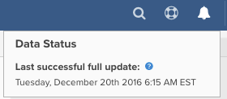

# Aktualisierungszyklus-Fortschritt

Wenn Sie sich bei Ihrem [!DNL Adobe Commerce Intelligence]-Dashboard anmelden, gibt es mehrere Möglichkeiten, den Status Ihres letzten Aktualisierungszyklus zu überprüfen. Alles hängt von der Art der [Benutzerberechtigungen](../administrator/user-management/user-management.md) ab, die Sie haben.

## Warum sollte ich den Status des Aktualisierungszyklus überprüfen?

Die Überprüfung des Status-Aktualisierungszyklus ist nützlich, wenn Sie die Daten in Ihrem [!DNL Commerce Intelligence]-Konto prüfen. Wenn Sie [Ergebnisse sehen, die nicht Ihren Erwartungen entsprechen](../data-analyst/data-warehouse-mgr/data-and-updates-faq.md) z. B. der tägliche Umsatz in [!DNL Commerce Intelligence] nicht mit dem übereinstimmt, was Sie auf Ihrer E-Commerce-Plattform oder in Ihrem [[!DNL Google] E-Commerce-Umsatz sehen](https://experienceleague.adobe.com/docs/commerce-knowledge-base/kb/troubleshooting/miscellaneous/diagnosing-google-ecommerce-revenue-discrepancies.html) können Sie den letzten Datenpunkt überprüfen, um festzustellen, ob das Problem behoben wird, sobald eine Aktualisierung abgeschlossen ist.

## [!UICONTROL Read-Only] und [!UICONTROL Standard] Benutzer

`Read-only` Benutzer können sich bei ihrem Dashboard anmelden und sehen, wie kürzlich die Daten aktualisiert wurden, indem sie den Mauszeiger über das Symbol oben rechts auf der Seite bewegen. Dies zeigt an, wann der letzte Datenpunkt abgerufen wurde.



## Benutzer [!UICONTROL Admin]

`Admin` Benutzer können sich beim Dashboard anmelden und den letzten obigen Datenpunkt zusammen mit einem kurzen Statussymbol ihrer Kontointegrationen sehen.

Admin-Benutzer können auch auf &quot;**[!UICONTROL Manage Data]**&quot; > &quot;**[!UICONTROL Integrations]**&quot; klicken, um weitere Informationen zu erhalten.


Auf dieser Seite werden der aktuelle Aktualisierungsstatus und die Zeit der letzten abgeschlossenen Aktualisierung angezeigt.

Wenn eine Aktualisierung ausgeführt wird, wird ein Link angezeigt, über den Sie nach Abschluss der Aktualisierung eine E-Mail-Benachrichtigung anfordern können.

Wenn keine Aktualisierung ausgeführt wird, wird ein Link angezeigt, über den Sie den Start einer Aktualisierung erzwingen können.

>[!NOTE]
>
>Wenn Sie Ausfallzeiten haben (Zeit, zu der Sie Ihre Daten nicht aktualisieren [!DNL Commerce Intelligence]), wird beim Erzwingen einer Aktualisierung ein Aktualisierungszyklus gestartet, der die Einschränkungen dieser Ausfallzeiten nicht berücksichtigt.


## Überprüfen des Status des Aktualisierungszyklus mithilfe der API

Sie können den zuletzt abgeschlossenen Aktualisierungszyklus mithilfe der **Aktualisierungszyklusstatus-API** abrufen.

**Anfrage**

```bash
curl -sS -H "X-RJM-API-Key: <EXPORT-API-KEY>" \
  https://api.rjmetrics.com/0.1/client/<CLIENT_ID>/fullupdatestatus
```

**Antwort (Beispiel)**

```json
{
  "clientId": 194,
  "lastCompletedUpdateJob": {
    "id": 13554,
    "type": { "id": 2, "name": "Full Update" },
    "start": "2025-12-09 03:26:25",
    "end": "2025-12-09 03:29:03",
    "status": { "id": 4, "name": "Completed Successfully" }
  },
  "lastCompletedUpdateJobWithDataSync": null,
  "timezoneAbbreviation": "EST"
}
```

Informationen zu Parametern, Authentifizierung, Fehlern und Ratenbeschränkungen finden Sie unter [Update Cycle Status API](https://developer.adobe.com/commerce/services/reporting/update-cycle/) in der Entwicklerdokumentation.
