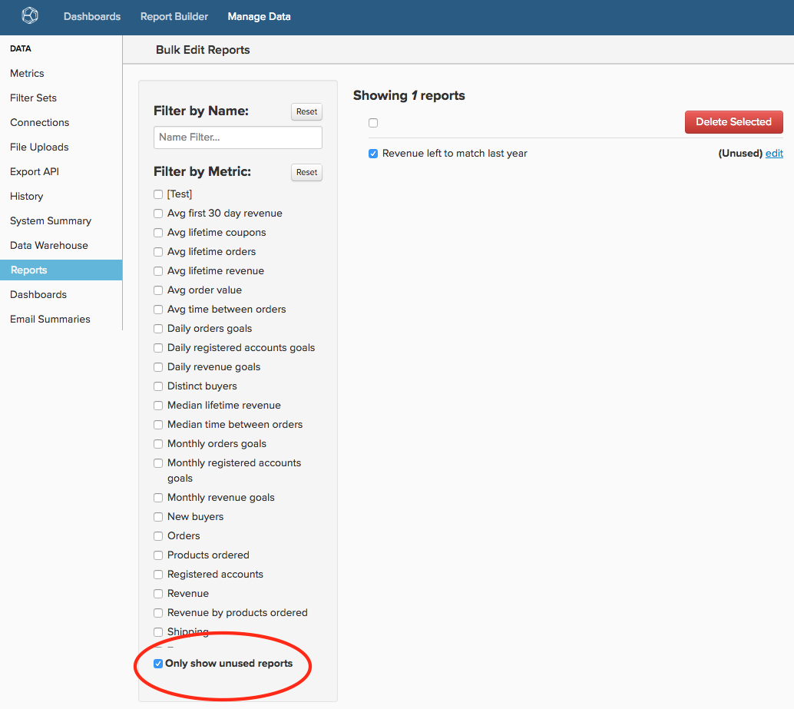
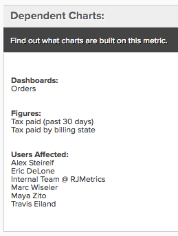

# [!DNL Adobe Commerce Intelligence] bereinigen

Unabhängig davon, ob Sie seit sechs Monaten oder sechs Jahren mit [!DNL Commerce Intelligence] arbeiten, ist die Pflege eines ordentlichen Kontos von größter Bedeutung, damit Ihr Unternehmen die Plattform optimal nutzen kann. Im Laufe der Zeit gibt es natürlich nicht mehr benötigte Benutzer, Dashboards, Berichte, Metriken und Spalten. Vielleicht haben Sie einen Bericht für die einmalige Verwendung erstellt und vergessen, oder ein Benutzer, der Ihr Unternehmen verlassen hat, hat sein Konto nie deaktiviert.

Mit [standardisierten, klaren Benennung für alle Elemente](../best-practices/naming-elements.md)) Ihres [!DNL Commerce Intelligence]-Kontos helfen Ihnen die folgenden Schritte zur Kontoprüfung, die Unübersichtlichkeit und unnötige Analysen für Ihre Benutzer zu reduzieren. Ein weiterer Vorteil ist [potenziell schnellere Aktualisierungszyklen](../best-practices/reduce-update-cycle-time.md).

## Schritt 1: Nicht aktive Benutzer identifizieren

Der erste Schritt bei der Bereinigung Ihres Kontos besteht darin, die Konten Ihrer nicht aktiven Benutzer zu deaktivieren, z. B. von Personen, die das Unternehmen verlassen haben oder [!DNL Commerce Intelligence] nicht mehr in ihren aktuellen Rollen verwenden.

Klicken Sie dazu in der Navigationsleiste oben rechts auf den Namen Ihres Unternehmens und wählen Sie dann **[!UICONTROL Manage Users]** aus. Wählen Sie anschließend den Benutzer aus, den Sie deaktivieren möchten, und klicken Sie auf **[!UICONTROL Deactivate User]**.

>[!NOTE]
>
>Sie benötigen [Administratorrechte](../administrator/user-management/user-management.md) um dies zu tun.

>[!WARNING]
>
>Wenn Sie einen Benutzer deaktivieren, werden die von diesem Benutzer erstellten Diagramme, Dashboards und anderen Assets entfernt. Wenn Sie diese Assets beibehalten möchten, wenden Sie sich an das [!DNL Commerce Intelligence][ Support](../guide-overview.md#Submitting-a-Support-Ticket)Team, bevor Sie den Benutzer deaktivieren. Der Support kann Ihnen dabei helfen, diese Assets auf einen anderen Benutzer zu übertragen.

### Benutzer reaktivieren

Um einen Benutzer erneut zu aktivieren, laden Sie ihn erneut ein, indem Sie sein Konto mit derselben E-Mail-Adresse neu erstellen, die deaktiviert wurde. Außerdem werden sein Zugriff und die Daten, deren Inhaber er war, bei der Anmeldung wiederhergestellt.

## Schritt 2: Löschen nicht verwendeter Dashboards und Berichte

Der nächste Schritt bei der Prüfung Ihres Kontos besteht darin, nicht verwendete Dashboards und Berichte zu löschen.

>[!NOTE]
>
>Dazu benötigen Sie `Admin` oder `Standard` [Benutzerberechtigungen](../administrator/user-management/user-management.md).

Jeder Benutzer mit `Admin` oder `Standard` Zugriff kann Berichte und Dashboards erstellen. Aus diesem Grund müssen alle Personen mit diesen Berechtigungen die folgenden Schritte ausführen, um nicht verwendete Berichte zu identifizieren und zu entfernen.

### Überprüfen von Dashboards und Berichten

Bevor Sie etwas löschen, sollten Sie Ihre Berichte und Dashboards überprüfen, um zu beurteilen, was verwendet wird. Sie können zwar die unten beschriebene Funktion **[!UICONTROL find unused reports]** verwenden, aber jede erste Überprüfung macht Ihre Bereinigungsbemühungen deutlich produktiver.

### Löschen von Dashboards und Berichten

Nachdem Sie auf Ihre Dashboards und Berichte zugegriffen haben, können Sie mit der Bereinigung Ihres Kontos beginnen.

**So entfernen Sie einen Bericht aus einem Dashboard**

1. Suchen Sie den Bericht, den Sie im Dashboard entfernen möchten.
1. Wählen Sie oben rechts im Bericht **[!UICONTROL Options]** aus.
1. Klicken Sie auf **[!UICONTROL Remove From Dashboard]**.

**So löschen Sie ein ganzes Dashboard**

1. Wählen Sie **[!UICONTROL Manage Data]** und dann **[!UICONTROL Dashboards**] aus.
1. Klicken Sie auf das Dashboard, das Sie löschen möchten.
1. Klicken Sie auf **[!UICONTROL Delete Dashboard]**.

Sie können auch **[!UICONTROL Dashboard Options]** und dann **[!UICONTROL Delete]** aus dem Dashboard selbst auswählen.

>[!NOTE]
>
>Beim Löschen eines Dashboards werden die darin enthaltenen Berichte nicht gelöscht. Daher müssen Sie einen weiteren Schritt ausführen, um die Berichte zu löschen.

**So löschen Sie nicht verwendete Berichte**

1. Wählen Sie **[!UICONTROL Manage Data]** und dann **[!UICONTROL Reports]** aus.
1. Aktivieren Sie das **Nur nicht verwendete Berichte anzeigen** unter der Metrikliste. Dadurch wird eine Liste von Berichten erstellt, die nicht in einem Dashboard oder in einer E-Mail-Zusammenfassung verwendet werden.
1. Wählen Sie die Berichte aus, die Sie löschen möchten. Sie können alle Berichte auswählen, indem Sie auf das Kontrollkästchen über der Berichtsliste klicken.
1. Klicken Sie auf **[!UICONTROL Delete Selected]**.

Im Folgenden finden Sie einen Überblick über den nicht verwendeten Löschvorgang von Berichten:

## Schritt 3: Nicht verwendete Metriken löschen

Nachdem Sie Ihre Benutzerliste, Dashboards und Berichte bereinigt haben, können Sie mit der Prüfung Ihrer Metrikliste fortfahren. Auf diese Weise können Sie alle Elemente identifizieren, die möglicherweise veraltet sind - z. B. wurde eine neue Metrik mit einer anderen Definition erstellt - oder nicht verwendet werden.

1. Um eine Liste abhängiger Berichte für eine Metrik zu erstellen, gehen Sie zu **[!DNL Manage Data]** und klicken Sie auf **[!UICONTROL Metrics]**.
1. Klicken Sie **[!UICONTROL Edit]** neben einer Metrik.
1. Unten auf der Seite sehen Sie einen Abschnitt namens **[!UICONTROL Dependent Charts]**. Klicken Sie auf den Link, um eine Liste abhängiger Berichte für diese Metrik zu erstellen.
1. Nachdem das System die Prüfung abgeschlossen hat, zeigt [!DNL Commerce Intelligence] eine Liste der Dashboards, Berichte und Benutzer an, die diese Metrik verwenden.

Wenn Sie feststellen, dass die Metrik nicht mehr benötigt wird, navigieren Sie zurück zur **[!UICONTROL Metrics]** Seite, indem Sie auf **[!UICONTROL Back to Metric List]** klicken, um die Metrik zu finden, die Sie löschen möchten. Klicken Sie auf **[!UICONTROL Delete]**.

## Schritt 4: Bewerten der synchronisierten Spalten

Der letzte Schritt besteht darin, die Spalten zu bewerten, die derzeit in Ihrer Data Warehouse synchronisiert werden. Durch das Aufheben der Synchronisierung von Spalten wird nicht nur Ihr Konto unübersichtlich, sondern es kann auch die Aktualisierungszeit verkürzen.

Wenn Sie dies fortsetzen möchten, wenden Sie sich an [!DNL Commerce Intelligence] [Support](../guide-overview.md#Submitting-a-Support-Ticket). Das Support-Team kann einen Bericht erstellen, der alle Spalten enthält, die in keinem Dashboard für einen Benutzer verwendet werden und die nicht in E-Mail-Zusammenfassungen verwendet werden, mit Ausnahme von SQL-Berichten. Anschließend können Sie diesen Bericht als Anleitung zur Auswahl der Spalten verwenden, deren Synchronisierung über Data Warehouse Manager aufgehoben werden soll.

>[!NOTE]
>
>Sie können jederzeit wieder mit der Synchronisierung dieser Spalten beginnen. Wenn Sie die Synchronisierung einer Spalte aufheben, werden alle Daten aus Ihrer Data Warehouse entfernt. Dies bedeutet nur, dass diese Spalte während des Aktualisierungszyklus nicht auf neue oder aktualisierte Werte überprüft wird.

**So heben Sie die Synchronisierung einer Spalte (oder von Spalten) auf**

1. Gehen Sie zu **[!DNL Manage Data]** und dann zu **[!UICONTROL Data Warehouse]**.
1. Navigieren Sie in der **[!UICONTROL Synced Tables]** zur Tabelle, die die Spalte enthält.
1. Aktivieren Sie ein oder mehrere Kontrollkästchen neben einer oder mehreren Spalten, deren Synchronisierung Sie aufheben möchten.
   >[!NOTE]
   >
   >Sie können die Synchronisierung einer Primären Schlüsselspalte nicht aufheben, ohne die gesamte Tabelle abzulegen.

1. Klicken Sie auf **[!UICONTROL Remove]** , um die Synchronisierung einer oder mehrerer Spalten aufzuheben.

Im Folgenden wird der gesamte Prozess beschrieben:

## Verpackung

Ihr [!DNL Commerce Intelligence]-Konto sollte jetzt für Sie und Ihr Team übersichtlicher und einfacher zu navigieren sein.
