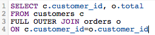
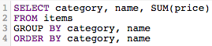

# SQL-Abfragen optimieren

Mit dem [!DNL SQL Report Builder] können Sie Ihre Abfragen jederzeit ausführen und ändern. Diese Funktion ist hilfreich, wenn Sie eine Abfrage sofort aktualisieren müssen, anstatt zu warten, bis ein Aktualisierungszyklus abgeschlossen ist, bevor Sie eine Spalte oder einen Bericht korrigieren.

Bevor eine Abfrage ausgeführt wird, [[!DNL Commerce Intelligence] schätzt ihre Kosten](https://experienceleague.adobe.com/docs/commerce-knowledge-base/kb/troubleshooting/miscellaneous/sql-queries-explain-cost-errors.html). Die Kosten berücksichtigen die Dauer und Anzahl der Ressourcen, die für die Ausführung einer Abfrage erforderlich sind. Wenn diese Kosten als zu hoch erachtet werden oder die Anzahl der zurückgegebenen Zeilen [!DNL Commerce Intelligence] Limit überschreitet, schlägt die Abfrage fehl. Für die Abfrage Ihrer [Data Warehouse](../data-analyst/data-warehouse-mgr/tour-dwm.md), mit der sichergestellt wird, dass Sie möglichst optimierte Abfragen schreiben, empfiehlt Adobe Folgendes.

## Verwenden von SELECT oder Auswählen aller Spalten

Die Auswahl aller Spalten führt nicht zu einer rechtzeitigen, einfach auszuführenden Abfrage. Die Ausführung von Abfragen, die `SELECT *` verwenden, kann recht lange dauern, insbesondere wenn die Tabelle viele Spalten hat.

Aus diesem Grund empfiehlt Adobe, nach Möglichkeit keine `SELECT *` zu verwenden und nur die benötigten Spalten einzubeziehen:

| **Stattdessen…** | **Jetzt testen!** |
|-----|-----|
|  |  |

{style="table-layout:auto"}

## Vollständige äußere Verknüpfungen verwenden

Äußere Joins Wählen die Gesamtheit beider verknüpfter Tabellen aus, was die Berechnungskosten der Abfrage erhöht. Das bedeutet, dass die Ausführung der Abfrage länger dauert und mit höherer Wahrscheinlichkeit fehlschlägt, da es länger als die Ausführungsbeschränkung dauern kann, bis die Ergebnisse zurückgegeben werden.

Anstatt diesen Join-Typ zu verwenden, sollten Sie einen inneren oder linken Join verwenden. Innere Joins geben nur dann Ergebnisse zurück, wenn es eine Spaltenübereinstimmung zwischen Tabellen gibt (z. B. `order_id` sowohl in einer typischen `customers`- als auch in `orders`). Links-Joins geben alle Ergebnisse aus der linken (ersten) Tabelle zusammen mit den entsprechenden Ergebnissen in der rechten (zweiten) Tabelle zurück.

Sehen Sie sich an, wie Sie eine Abfrage vom Typ VOLLSTÄNDIGER ÄUSSERER JOIN neu schreiben können:

| **Stattdessen…** | **Jetzt testen!** |
|-----|-----|
|  |  |

{style="table-layout:auto"}

Diese Abfragen sind in jeder Hinsicht identisch, mit Ausnahme des Typs von JOIN, den sie verwenden.

## Verwenden mehrerer Joins

Sie können zwar mehrere Joins in Ihre Abfrage einbeziehen, aber denken Sie daran, dass dies die Kosten der Abfrage in die Höhe treiben kann. Um zu vermeiden, dass der Kostenschwellenwert erreicht wird, empfiehlt Adobe, nach Möglichkeit mehrere Joins zu vermeiden.

## Verwenden von Filtern

Verwenden Sie nach Möglichkeit Filter. Die -Klauseln `WHERE` und `HAVING` Ihre Ergebnisse filtern und geben Ihnen nur die Daten, die Sie wirklich möchten.

## Verwenden von Filtern in JOIN-Klauseln

Wenn Sie bei der Durchführung eines Joins einen Filter verwenden, stellen Sie sicher, dass Sie ihn auf beide Tabellen im Join anwenden. Selbst wenn sie redundant ist, verringert dies die Rechenkosten der Abfrage und die Ausführungszeit.

| **Stattdessen…** | **Jetzt testen!** |
|-----|-----|
|  |  |

{style="table-layout:auto"}

## Verwenden von Operatoren

Erwägen Sie beim Schreiben von Abfragen, die möglichst „kostengünstigsten“ Operatoren zu verwenden. Jede Abfrage hat einen Rechenaufwand, der durch die Funktionen, Operatoren und Filter bestimmt wird, aus denen die Abfrage besteht. Einige Operatoren erfordern weniger Rechenaufwand, was sie kostengünstiger macht als andere Operatoren.

Vergleichsoperatoren (>, &lt;, = usw.) sind die kostengünstigsten, gefolgt von [LIKE. ÄHNLICH DEN UND POSIX-](https://www.postgresql.org/docs/9.5/functions-matching.html), die die teuersten Benutzer sind.

## Verwenden von „EXISTIERT“ versus „IN“

Die Verwendung von `EXISTS` im Vergleich zu `IN` hängt von der Art der Ergebnisse ab, die Sie zurückgeben möchten. Wenn Sie nur an einem einzelnen Wert interessiert sind, verwenden Sie die `EXISTS`-Klausel anstelle von `IN`. `IN` wird mit Listen von kommagetrennten Werten verwendet, was die Berechnungskosten der Abfrage erhöht.

Wenn `IN` Abfragen ausgeführt werden, muss das System zunächst die Unterabfrage (die `IN`) verarbeiten und dann die gesamte Abfrage basierend auf der in der `IN`-Anweisung angegebenen Beziehung. Die `EXISTS` Abfrage ist wesentlich effizienter, da die Abfrage nicht mehrmals ausgeführt werden muss. Beim Überprüfen der in der Abfrage angegebenen Beziehung wird ein Wert „true/false“ zurückgegeben.

Einfach ausgedrückt: Das System muss bei der Verwendung von `EXISTS` nicht so viel verarbeiten.

| **Stattdessen…** | **Jetzt testen!** |
|-----|-----|
|  |  |

{style="table-layout:auto"}

## Verwenden von ORDER BY

Die `ORDER BY` ist in SQL sehr aufwändig und kann die Kosten einer Abfrage erheblich erhöhen. Wenn Sie eine Fehlermeldung erhalten, in der Sie darauf hingewiesen werden, dass die Kosten für EXPLAIN Ihrer Abfrage zu hoch sind, sollten Sie `ORDER BY` aus Ihrer Abfrage entfernen, es sei denn, dies ist erforderlich.

Das soll nicht heißen, dass `ORDER BY` nicht verwendet werden kann - nur, dass es nur verwendet werden sollte, wenn es notwendig ist.

## Verwenden von GROUP BY und ORDER BY

Es kann einige Situationen geben, in denen dieser Ansatz nicht mit dem übereinstimmt, was Sie versuchen zu tun. Die allgemeine Regel lautet, dass bei Verwendung von `GROUP BY` und `ORDER BY` die Spalten in beiden Klauseln in derselben Reihenfolge angeordnet werden sollten. Beispiel:

| **Stattdessen…** | **Jetzt testen!** |
|-----|-----|
|  |  |

{style="table-layout:auto"}

## Verpackung

Der beste Weg, SQL zu schreiben - und das effizient zu tun - ist durch Ausprobieren. Um herauszufinden, was für Sie am besten funktioniert, versuchen Sie, einige Berichte nur mit dem SQL-Editor neu zu erstellen.
