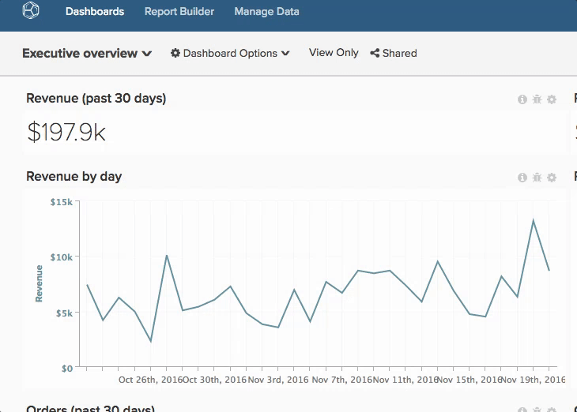

# Dashboard freigeben

Die Freigabe von Dashboards bedeutet, dass Sie und Ihr Team jederzeit über die gleichen Informationen verfügen, die eine Zusammenarbeit und Diskussion ermöglichen. Im Folgenden finden Sie einige Empfehlungen zum Freigeben von Dashboards und zum Unübersichtlichmachen Ihres [!DNL Adobe Commerce Intelligence]-Kontos.

## Vermeiden doppelter Dashboards

Manchmal finden Sie mehrere Dashboards mit demselben Namen. Dies liegt in der Regel daran, dass andere Benutzer ähnliche Dashboards erstellt und für Sie freigegeben haben. Bei diesen Dashboards kann es sich um Duplikate einer primären Kopie handeln. In diesem Fall empfiehlt Adobe, dass ein Benutzer die primäre Kopie des Dashboards gemeinsam nutzt und dann alle doppelten Dashboards entfernt.

Um zu sehen, wer Inhaber eines Dashboards ist, klicken Sie in der oberen linken Ecke auf das Dropdown-Menü Dashboard . Alle Dashboards, die keinen Namen darunter haben, gehören zu Ihnen.

So entfernen Sie alle doppelten Dashboards:

1. Synchronisieren Sie mit Ihrem Team und identifizieren Sie die Person, die das Dashboard verwalten soll.
1. [Heben Sie die Freigabe für sich selbst auf](../data-user/dashboards/leave-dashboard.md), mit Ausnahme des vom Hauptbenutzer freigegebenen Dashboards.
1. Wenn Sie über eine Kopie des Dashboards verfügen, löschen Sie es [1}.](../data-user/dashboards/deleting-dashboard.md)
1. Bitten Sie andere, ihre Version des Dashboards zu löschen.

## Erstellen eines Kernsatzes von Dashboards

Wenn neue Benutzer erstellt werden, besitzen sie keine Dashboards oder Diagramme. Nach der ersten Anmeldung wird ihnen jedoch eine Liste der beliebtesten Dashboards in Ihrer Organisation angezeigt (mit Anzeigen- oder Bearbeitungsrechten für das gesamte Team). Stellen Sie sicher, dass sich Dashboards immer in dieser Liste befinden, damit neue Benutzer einbezogen werden können.

## Dashboards für neue Benutzer freigeben

Neue Benutzer können auch vom Zugriff auf einige Dashboards profitieren, die nicht unternehmensweit freigegeben sind. In diesen Fällen empfiehlt Adobe, dass Dashboard-Inhaber [die entsprechenden Dashboards](../data-user/dashboards/share-dashboard-with-users.md) bei der Erstellung ihrer Konten für neue Benutzer freigeben.

## Selektiv mit Berechtigungen bearbeiten

`Edit` -Berechtigungen geben Benutzern viel Macht. Aber mit großer Macht kommt große Verantwortung. Um versehentliche Änderungen an Ihren Diagrammen und Dashboards zu verhindern, empfiehlt Adobe, dass Sie bezüglich der Personen, denen Sie `Edit` -Berechtigungen erteilen, selektiv vorgehen.

## Anmerkungen zu Diagrammen

Durch die Freigabe eines Dashboards erhalten Benutzer lediglich Zugriff auf dieselben Informationen. Um sicherzustellen, dass Informationen verstanden werden, empfiehlt Adobe, mithilfe der Diagrammnotiz-Funktion Wissen und Nuancen zu einem bestimmten Datenpunkt auszutauschen oder den Zweck einer Analyse zu vermitteln.
