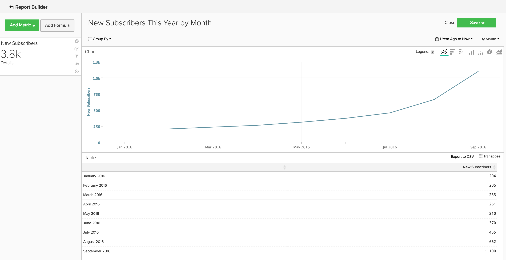
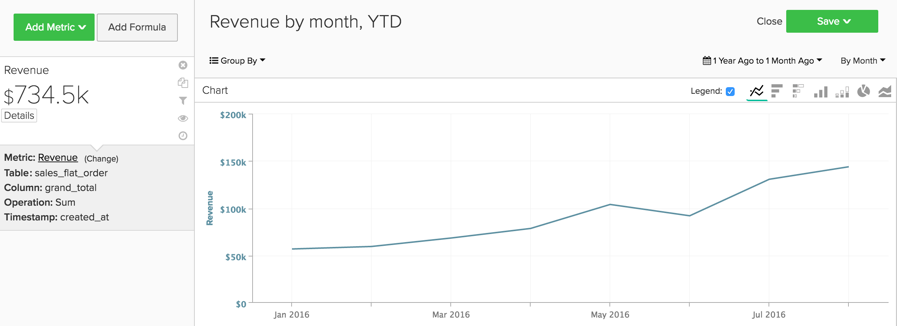
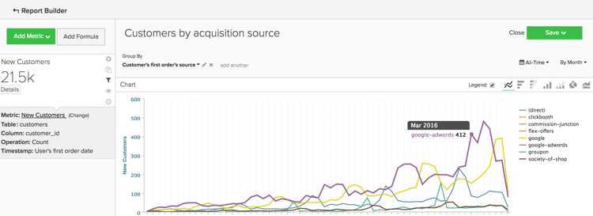

# Grundlegende Analysen

Sobald Sie mit der [!DNL Adobe Commerce Intelligence]-Plattform vertraut sind und über ein grundlegendes Verständnis des Tools verfügen, sollten Sie mit der Erstellung von Berichten beginnen. Eine der häufigsten Fragen, die Sie möglicherweise haben, ist: „Was sollte ich mir ansehen?“

Die folgenden Informationen beschreiben einige häufig verwendete Metriken und Berichte, die Sie möglicherweise nützlich finden. Einige dieser Berichte sind in Ihrem Konto vorhanden. Überprüfen Sie daher die in Ihrem Konto vorhandenen Metriken und Berichte, um Duplikate zu vermeiden.

## Tabellen und Spalten, die Sie verstehen möchten

Beim Erstellen einer Metrik müssen Sie vier Informationen kennen:

1. Die Tabelle, in der sich die Daten befinden,
1. Die spezifische Aktion, die Sie durchführen möchten,
1. Die Spalte, für die Sie diese Aktion durchführen möchten, und
1. Der Zeitstempel, den Sie zum Tracking dieser Daten verwenden möchten.

Höchstwahrscheinlich unterscheiden sich die Namen der in diesen Beispielen verwendeten Tabellen geringfügig von den Spalten- und Tabellennamen in Ihrer Datenbank, da jede Datenbank eindeutig ist. Verweisen Sie auf die folgenden Definitionen, wenn Sie Hilfe bei der Identifizierung einer entsprechenden Tabelle oder Spalte in Ihrer Datenbank benötigen.

## Tabelle „Kunden“

Diese Tabelle enthält die wichtigsten Informationen zu jedem Kunden, z. B. eine eindeutige Kunden-ID, eine E-Mail-Adresse usw. In den folgenden Beispielen wird **[!UICONTROL customer_entity]** als Name einer Beispiel-Kundentabelle verwendet.

Wenn einige dieser Berechnungen derzeit nicht in Ihrer Datenbank vorhanden sind, kann sie von einem beliebigen Admin-Benutzer in Ihrem Konto erstellt werden. Außerdem sollten Sie sicherstellen, dass diese Dimensionen für alle anwendbaren Metriken gruppierbar sind.

**Dimensionen**

* **[!UICONTROL Entity_id]**: Eine eindeutige Kennung für jeden Kunden. Dies kann auch eine eindeutige Kundennummer oder eine Kunden-E-Mail-Adresse sein und sollte als Referenzschlüssel für die Tabelle Ihrer Bestellung dienen.
* **[!UICONTROL Created_at]**: Das Datum, an dem das Konto des Kunden erstellt und zu Ihrer Datenbank hinzugefügt wurde.
* **[!UICONTROL Customer's lifetime revenue]**: Der von einem Kunden während der gesamten Lebensdauer generierte Umsatz.
* **[!UICONTROL Customer's first 30-day revenue]**: Der Gesamtbetrag des Umsatzes, der von einem Kunden in den ersten 30 Tagen generiert wurde.
* **[!UICONTROL Customer's lifetime number of orders]**: Die Anzahl der Bestellungen, die ein Kunde im Laufe seines Lebenszyklus aufgegeben hat.
* **[!UICONTROL Customer's lifetime number of coupons]**: Die Gesamtzahl der Coupons, die eine Kundin oder ein Kunde während ihres bzw. seines Lebenszyklus verwendet hat.
* **[!UICONTROL Customer's first order date]**: Das Datum der ersten Bestellung eines Kunden. Dies kann sich vom Datum der Erstellung unterscheiden, wenn ein Kunde zum Zeitpunkt seiner Erstellung keine Bestellung aufgegeben hat.

**Akzeptieren Sie Gastbestellungen?**

*Wenn ja, enthält diese Tabelle möglicherweise nicht alle Ihre Kunden. Wenden Sie sich an das [Support-Team](https://experienceleague.adobe.com/docs/commerce-knowledge-base/kb/troubleshooting/miscellaneous/mbi-service-policies.html), um sicherzustellen, dass Ihre Kundenanalysen alle Kunden einschließen.*

*Nicht sicher, ob Sie Gastbestellungen annehmen? Weitere Informationen finden Sie [ &quot;](../data-warehouse-mgr/guest-orders.md) Thema“*

## Tabelle mit Bestellungen

In dieser Tabelle stellt jede Zeile eine Reihenfolge dar. Die Spalten in dieser Tabelle enthalten grundlegende Informationen zu jeder Bestellung, wie z. B. die Auftrags-ID, das Erstellungsdatum, den Status, die ID des Kunden, der die Bestellung aufgegeben hat, usw. In den folgenden Beispielen wird **[!UICONTROL sales_flat_order]** als Name einer Beispieltabelle für Bestellungen verwendet.

**Dimensionen**

* **[!UICONTROL Customer_id]**: Eine eindeutige Kennung für den Kunden, der die Bestellung aufgegeben hat. Dies wird häufig verwendet, um Informationen zwischen den Tabellen „customer“ und „orders“ zu verschieben. In diesen Beispielen wird erwartet, dass die customer_id in der **[!UICONTROL sales_flat_order]** Tabelle mit der **[!UICONTROL entitiy_id]** in der **[!UICONTROL customer_entity]** Tabelle übereinstimmt.
* **[!UICONTROL Created_at]**: Das Datum, an dem die Bestellung erstellt oder aufgegeben wurde.
* **[!UICONTROL Customer_email]**: Die E-Mail-Adresse des Kunden, der die Bestellung aufgegeben hat. Dies kann auch die eindeutige Kennung für den Kunden sein.
* **[!UICONTROL Customer's lifetime number of orders]**: Eine Kopie der Spalte mit demselben Namen in Ihrer `Customers`.
* **[!UICONTROL Customer's order number]**: Die mit der Bestellung verknüpfte sequenzielle Bestellnummer des Kunden. Wenn es sich bei der betrachteten Zeile beispielsweise um die erste Bestellung eines Kunden handelt, lautet diese Spalte „1“. Wenn dies jedoch die 15. Bestellung des Kunden war, zeigt diese Spalte „15“ für diese Bestellung an. Wenn diese Dimension nicht in Ihrer `Customers` vorhanden ist, bitten Sie das [Support-Team](https://experienceleague.adobe.com/docs/commerce-knowledge-base/kb/troubleshooting/miscellaneous/mbi-service-policies.html), Sie beim Aufbau zu unterstützen.
* **[!UICONTROL Customer's order number (previous-current)]**: Eine Verkettung zweier Werte in der **[!UICONTROL Customer's order number]**. Sie wird in einem Beispielbericht unten verwendet, um die verstrichene Zeit zwischen zwei beliebigen Bestellungen anzuzeigen. Bei dieser Berechnung wird beispielsweise die Zeit zwischen dem ersten Bestelldatum eines Kunden und seinem zweiten Bestelldatum als „1-2“ dargestellt.
* **[!UICONTROL Coupon_code]**: Zeigt an, welche Coupons für jede Bestellung verwendet wurden.
* **[!UICONTROL Seconds since previous order]**: Die Zeit (in Sekunden) zwischen den Bestellungen eines Kunden.

## Tabelle mit Bestellartikeln

In dieser Tabelle stellt jede Zeile einen verkauften Artikel dar. Diese Tabelle enthält Informationen zu den in den einzelnen Bestellungen verkauften Artikeln, wie die Bestellnummer, die Produktnummer, die Menge usw. In den folgenden Beispielen wird `sales_flat_order_item` als Name einer Tabelle mit Beispielbestellartikeln verwendet.

**Dimensionen**

* **[!UICONTROL Item_id]**: Die eindeutige Kennung für jede Zeile in der Tabelle.
* **[!UICONTROL Order_id]**: Der Referenzschlüssel für Ihre `Orders`, der Ihnen mitteilt, welche Artikel in derselben Bestellung gekauft wurden. Wenn eine Bestellung mehrere Artikel enthält, wird dieser Wert wiederholt.
* **[!UICONTROL Product_id]**: Wenn Sie Informationen zu dem spezifischen gekauften Produkt wünschen (z. B. Farbe, Größe usw.), würden Sie diese Spalte verwenden, um diese Informationen aus Ihrer Produkttabelle abzurufen.
* **[!UICONTROL Order's created_at]**: Der Zeitstempel, mit dem die Bestellung aufgegeben wurde. Er wird normalerweise aus der `order line items` Tabelle in Ihre `Orders` kopiert.
* **[!UICONTROL Order's coupon_code]**: Ähnlich wie bei der Dimension `Order's created_at` wird diese Spalte aus Ihrer Tabelle Bestellungen kopiert.

## Tabelle zu Abonnements

Diese Tabelle wird verwendet, um Ihre Abonnementinformationen zu verwalten, z. B. die Abonnement-ID, die E-Mail-Adresse des Abonnenten, das Startdatum des Abonnements usw.

**Dimensionen**

* **[!UICONTROL Customer_id]**: Eine eindeutige Kennung für den Kunden, der die Bestellung aufgegeben hat. Dies ist eine gängige Methode zum Erstellen eines Pfads zwischen der Tabelle Customers und der Tabelle Orders. In diesen Beispielen wird erwartet, dass die customer_id in der Tabelle **sales_flat_order** mit der `entitiy_id` in der Tabelle `customer_entity` übereinstimmt.
* **[!UICONTROL Start date]**: Das Datum, an dem das Abonnement einer Kundin oder eines Kunden begann.

## Marketing-Ausgabentabelle

Bei der Analyse Ihrer Marketing-Ausgaben können Sie [!DNL Facebook], [!DNL Google AdWords] oder andere Quellen in Ihre Analysen einbeziehen. Wenn Sie mehrere Quellen für Marketingausgaben haben, wenden Sie sich an das [Managed Services-Team](https://business.adobe.com/products/magento/fully-managed-service.html), um Hilfe beim Einrichten einer konsolidierten Tabelle für Ihre Marketing-Kampagnen zu erhalten.

**Dimensionen**

* **[!UICONTROL Spend]**: Die gesamten Werbeausgaben. In [!DNL Facebook] wäre dies die Ausgabenspalte in der `facebook_ads_insights_####`. Dies wäre [!DNL Google AdWords] die `adCost` Spalte in der `campaigns####`.
* Die `####`, die an jede dieser Tabellen angehängt wird, bezieht sich auf die spezifische Konto-ID für Ihr [!DNL Facebook]- oder [!DNL Google AdWords].
* **[!UICONTROL Clicks]**: Die Gesamtzahl der Klicks. In [!DNL Facebook] wäre dies die Spalte mit den Klicks in der `facebook_ads_insights_####`. In [!DNL Google AdWords] wäre dies die Spalte adClicks in der `campaigns####`.
* **[!UICONTROL Impressions]**: Die Gesamtzahl der Impressionen. In [!DNL Facebook] wären dies die Eindrücke in der `facebook_ads_insights_####`. In [!DNL Google AdWords] wären dies die Eindrücke auf dem `campaigns####`.
* **[!UICONTROL Campaign]**: Die Gesamtzahl der Klicks. [!DNL Facebook] wäre dies die Spalte „campaign_name“ in der `facebook_ads_insights_####`. In [!DNL Google AdWords] wäre dies die Kampagnenspalte in der `campaigns####`.
* **[!UICONTROL Date]**: Die Zeit und das Datum, an dem die Aktivität (Ausgaben, Klicks oder Impressionen) für eine bestimmte Kampagne aufgetreten ist. [!DNL Facebook] wäre dies die `date_start` Spalte in der `facebook_ads_insights_####`. [!DNL Google AdWords] wäre dies die Datumsspalte in der `campaigns####`.
* **[!UICONTROL Customer's first order's source]**: Die Quelle der Bestellung aus der ersten Bestellung eines Kunden. Überprüfen Sie zunächst, ob Sie eine Spalte mit dem Namen `customer's first order's source` in Ihrem Konto haben. Wenn diese Spalte nicht angezeigt wird, können Sie die gewünschte Spalte mithilfe dieser Anweisungen erstellen.
* **[!UICONTROL Customer's first order's medium]**: Das Bestellmedium aus der ersten Bestellung eines Kunden. Überprüfen Sie zunächst, ob Sie eine Spalte mit dem Namen `customer's first order's source` in Ihrem Konto haben. Wenn diese Spalte nicht angezeigt wird, können Sie die gewünschte Spalte mithilfe dieser Anweisungen erstellen.
* **[!UICONTROL Customer's first order's campaign]**: Die Kampagne der Bestellung ab der ersten Bestellung eines Kunden. Überprüfen Sie zunächst, ob Sie eine Spalte mit dem Namen `customer's first order's source` in Ihrem Konto haben. Wenn diese Spalte nicht angezeigt wird, können Sie die gewünschte Spalte mithilfe dieser Anweisungen erstellen.

## Allgemeine Berichte und Metriken

Im Folgenden finden Sie einige Beispiele für nützliche Berichte und Metriken:

* [Customer Analytics](#customeranalytics)
* [Order Analytics](#orderanalytics)
* [Marketing-Ausgabenanalyse](#mktgspendanalytics)

## Kundenanalysen {#customeranalytics}

### Neue Benutzer

* **Beschreibung**: Eine Zählung der Gesamtzahl neu erworbener Benutzer in einem bestimmten Zeitraum. `New Users` unterscheidet sich von `Unique Customers`, da `New Users` den Zeitstempel hat, dass ein Konto mit Ihrem Service erstellt wurde (dies bedeutet nicht, dass sie unbedingt eine Bestellung aufgegeben haben), während `Unique Customers` mindestens eine Bestellung aufgegeben haben.
* **Metrikdefinition**: Diese Metrik führt eine **Anzahl** von `entity_id` aus `customer_entity` Tabelle aus, sortiert nach `created_at`.
* **Berichtsbeispiel**: Anzahl der im letzten Monat neu erstellten Benutzer
   * **[!UICONTROL Metric]**: `New Users`
   * **[!UICONTROL Time Range]**: `Last Month`
   * **[!UICONTROL Time Interval]**: `By Day`

<!--{: width="929"}-->

### Unique Customers

* **Beschreibung**: Eine Zählung der Gesamtzahl unterschiedlicher Kunden in einem bestimmten Zeitraum. Dies unterscheidet sich von `New Users`, da es nur Kunden verfolgt, die mindestens eine Bestellung aufgegeben haben. Der Bericht eines einzelnen Kunden verfolgt einen Kunden nur einmal in einem bestimmten Zeitintervall. Wenn Sie das Zeitintervall auf `By Day` setzen und ein Kunde an diesem Tag mehr als einen Kauf tätigt, wird der Kunde nur einmal gezählt. Wenn Sie eine allgemeine Gesamtanzahl von Käufen sehen möchten, sehen Sie sich `Number of Orders` an.
* **Metrikdefinition**: Diese Metrik führt eine **Anzahl Distinct** von `customer_id` aus `sales_flat_order` Tabelle aus, sortiert nach `created_at`.
* **Berichtsbeispiel**: Unterschiedliche Kunden nach Woche in den letzten 90 Tagen
   * **[!UICONTROL Metric]**: `Distinct Customers`
   * **[!UICONTROL Time Range]**: `Moving range > Last 90 Days`
   * **[!UICONTROL Time Interval]**: `By Day`

<!--{: width="929"}-->

### Neue Abonnenten

* **Beschreibung**: Anzahl der in einem bestimmten Zeitraum insgesamt akquirierten neuen Abonnenten.
* **Metrikdefinition**: Diese Metrik führt eine **Anzahl Distinct** von `customer_id` aus `subscriptions` Tabelle aus, sortiert nach `start_date`.
* **Berichtsbeispiel**: Neue Abonnenten dieses Jahr nach Monat
   * **[!UICONTROL Metric]**: `New Subscribers`
   * **[!UICONTROL Time Range]**: `1 Year Ago to 0 Days Ago`
   * **[!UICONTROL Time Interval]**: `By Month`

<!--{: width="929"}-->

### Kunden wiederholen

* **Beschreibung**: Die Gesamtzahl der Kunden, die mehr als eine Bestellung in einem Zeitraum aufgegeben haben. In einem Bericht zu Bestandskunden können Sie die `Distinct Customers` Metrik und die `Customer's Order Number` Dimension aus Ihrer `orders` verwenden.
* **Verwendete Metrik**: `Distinct Customers`
* **Berichtsbeispiel**: Anzahl der 2. und 3. Einkäufe im letzten Jahr
   * **[!UICONTROL Metric]**: `Distinct Customers`
   * **[!UICONTROL Time Range]**: `Moving Range > Last Year`
   * **[!UICONTROL Time Interval]**: `By Month`
   * **[!UICONTROL Group By]**: `Customer's Order Number`, dann `2` und `3`

  

* **Berichtsbeispiel 2**: Die Anzahl der Wiederholungskunden in den letzten Jahren
   * **[!UICONTROL Metric]**: `Distinct Customers`
   * **[!UICONTROL Filters]**: `Customer's Order Number Greater Than 1`
   * **[!UICONTROL Time Range]**: `Moving range > Last Year`
   * **[!UICONTROL Time Interval]**: `By Month`

  <!--{: width="929"}-->

### Top-Kunden nach Anzahl der Bestellungen über die gesamte Lebensdauer

* **Beschreibung**: Eine Liste der wichtigsten Kunden auf der Basis ihrer Gesamtzahl an Bestellungen. Auf diese Weise erhalten Sie eine direkte Liste Ihrer häufigsten Kunden.
* **Verwendete Metrik**: `Orders`
* **Berichtsbeispiel**: Die 25 wichtigsten Kunden nach Lebenszeitanzahl der Bestellungen
   * **[!UICONTROL Metric]**: `Orders`
   * **[!UICONTROL Time Range]**: `All Time`
   * **[!UICONTROL Time Interval]**: `None`
   * **[!UICONTROL Group By]**: `customer_email`
   * **[!UICONTROL Show Top/Bottom]**: Top 25 sortiert nach Bestellungen

  <!--{: width="929"}-->

### Top-Kunden nach Lebensdauerumsatz

* **Beschreibung**: Eine Liste der wichtigsten Kunden auf der Basis des lebenslangen Umsatzes.
* **Verwendete Metrik**: `Average Lifetime Revenue`
* **Berichtsbeispiel**: Die 25 wichtigsten Kunden nach Lebenszeitumsatz
   * **[!UICONTROL Metric]**: `Average Lifetime Revenue`
   * **[!UICONTROL Time Range]**: `All time`
   * **[!UICONTROL Time Interval]**: `None`
   * **[!UICONTROL Group By]**: `customer_email`
   * **[!UICONTROL Show Top Bottom]**: Top 25 sortiert nach Lebensdauerumsatz

  <!--{: width="929"}-->

### Durchschnittlicher Umsatz während der Lebensdauer nach Kohorte

* **Beschreibung**: Verfolgen Sie den [durchschnittlichen Lebenszeitumsatz verschiedener Kohorten](../dev-reports/lifetime-rev-cohort-analysis.md) von Benutzern im Zeitverlauf, um die leistungsstärksten Kohorten zu identifizieren. Kohorten werden nach einem gemeinsamen Datum gruppiert, z. B. Datum der ersten Bestellung oder Erstellungsdatum.
* **Verwendete Metrik**: `Revenue`
* **Berichtsbeispiel**: Durchschnittlicher lebenslanger Umsatz des Kunden nach Kohorte
   * **[!UICONTROL Metric]**: `Revenue`
   * **[!UICONTROL Cohort Date]**: `Customer's first order date`
   * **[!UICONTROL Time Interval]**: `Month`
   * **[!UICONTROL Time Period]**: Satz an Kohorten der letzten acht Kohorten mit Daten aus mindestens vier Monaten wird verschoben
   * **[!UICONTROL Duration]**: `12 Month(s)`
   * **[!UICONTROL Table]**: `Customer_entity`
   * **[!UICONTROL Perspective]**: Kumulativer Durchschnittswert pro Kohortenmitglied

  <!--{: width="929"}-->

### Kunden nach Couponverwendung

* **Beschreibung**: Zählung der Anzahl akquirierter Kunden, die einen Gutschein-/Rabattcode verwendet haben. Auf diese Weise erhalten Sie einen klaren Überblick über Rabattsuchende und Vollpreiskäufer.
* **Verwendete Metrik**: `New Users`
* **Berichtsbeispiel**: Gutschein- und Nicht-Gutschein-Kunden nach Monat
   * **[!UICONTROL Metric A]**: `Non coupon customers`
   * **[!UICONTROL Metric]**: `New Users`
   * **[!UICONTROL Filters]**: Anzahl der Bestellungen über die gesamte Kundenlebensdauer größer als 0 und Anzahl der Gutscheine über die gesamte Kundenlebensdauer gleich 0
   * **[!UICONTROL Metric B]**: `Coupon customers`
   * **[!UICONTROL Metric]**: `New Users`
   * **[!UICONTROL Filters]**: Anzahl der Bestellungen über die gesamte Kundenlebensdauer größer als 0 und Anzahl der Coupons über die Kundenlebensdauer größer als 0
   * **[!UICONTROL Time range]**: `All Time`
   * **[!UICONTROL Time interval]**: `By Month`

  <!--{: width="929"}-->

* **Berichtsbeispiel 2**: Prozentsatz der Coupon- und Nicht-Coupon-Kunden nach Monat
   * **[!UICONTROL Metric A]**: `Non coupon customers` (Metrik ausblenden)
      * **[!UICONTROL Metric]**: `New Users`
      * **[!UICONTROL Filters]**: `Customer's Lifetime Number of Orders Greater Than 0` und `Customer's Lifetime Number of Coupons Equal to 0`
   * **[!UICONTROL Metric B]**: `Coupon customers`
      * **[!UICONTROL Metric]**: `New Users`
      * **[!UICONTROL Filters]**: `Customers Lifetime Number of Orders Greater Than 0` und `Customer's Lifetime Number of Coupons Greater Than 0`
   * **[!UICONTROL Time Range]**: `All Time`
   * **[!UICONTROL Time Interval]**: `By Month`
   * **[!UICONTROL Formula]**: `B/(A+B)`

>[!NOTE]
>
> **Alle Metriken ausblenden**

<!--{: width="929"}-->

### Durchschnittlicher Umsatz für die ersten 30 Tage

* **Beschreibung**: Der Durchschnitt der Umsatzmenge, die von Kundinnen und Kunden innerhalb der ersten 30 Tage als Kundin oder Kunde generiert wird.
* **Metrikbeschreibung**: Diese Metrik führt einen **Durchschnitt** von `Customer's First 30 Day Revenue` aus `customer_entity` Tabelle aus, sortiert nach `created_at`.
* **Berichtsbeschreibung**: Allzeitdurchschnitt des ersten 30-Tage-Umsatzes des Kunden
* **[!UICONTROL Metric]**: `Average First 30 Day Revenue`
* **[!UICONTROL Time Range]**: `All Time`
* **[!UICONTROL Time Interval]**: `None`

<!--{: width="929"}-->

### Durchschnittlicher Umsatz über die Kundenlebensdauer

* **Beschreibung**: Die durchschnittliche Umsatzmenge, die von Ihren Kunden während ihrer Lebensdauer generiert wird.
* **Metrikbeschreibung**: Diese Metrik führt basierend auf der **einen** Durchschnitt`Customer's Lifetime Revenue` der `customer_entity` Spalte in der `created_at` aus.
* **Berichtsbeschreibung**: Allzeitdurchschnitt des lebenslangen Umsatzes des Kunden
   * **[!UICONTROL Metric]**: `Average Customer Lifetime Revenue`
   * **[!UICONTROL Time Range]**: `All Time`
   * **[!UICONTROL Time Interval]**: `None`

<!--{: width="929"}-->

## Bestellanalyse {#orderanalytics}

### Einnahmen

* **Beschreibung**: Die Umsatzmetrik zeigt den Gesamtumsatz an, der in einem bestimmten Zeitraum erzielt wurde.
* Diese Metrik führt eine **Summe** von `grand_total` aus `sales_flat_order` Tabelle aus, sortiert nach `created_at`.
* **Berichtsbeispiel**: Umsatz nach Monat, JbD
   * **[!UICONTROL Metric]**: `Revenue`
   * **[!UICONTROL Time Range]**: `1 Year Ago to 1 Month Ago`
   * **Zeitintervall**: `By Month`

>[!TIP]
>
>Stellen Sie sicher, dass die Berechnung Ihrer Umsatzmetrik mit der Definition übereinstimmt, die Sie intern besprechen. Beispielsweise können Sie den Umsatz aus bereits versendeten Bestellungen zählen, Währungen aus verschiedenen Regionen umrechnen oder Steuern ausschließen. Außerdem können Sie &quot;[&quot; verwenden](../../data-user/reports/ess-manage-data-filters.md) um die Konsistenz aller Metriken sicherzustellen, die auf derselben Tabelle basieren.

<!--{: width="929"}-->

### Bestellungen

* **Beschreibung**: Eine Zählung der Gesamtzahl der Bestellungen in einem bestimmten Zeitraum. Ein Bericht zu Bestellungen verfolgt Änderungen des Auftragsvolumens, die durch neue Produktangebote, Promotions oder alles andere verursacht werden, was das Transaktionsvolumen erhöhen (oder verringern) kann. Häufig empfiehlt es sich, diese Metrik zur Beantwortung Ihrer Fragen nach einigen Variablen zu segmentieren.
* **Metrikdefinition**: Diese Metrik führt eine **Anzahl** von `entity_id` aus `sales_flat_order` Tabelle aus, sortiert nach `created_at`.
* **Berichtsbeispiel**: Bestellungen nach Monat, JbD
   * **[!UICONTROL Metric]**: `number of orders`
   * **[!UICONTROL Time Range]**: `1 Year Ago to 1 Month Ago`
   * **[!UICONTROL Time Interval]**: `By Month`

>[!TIP]
>
>Genau wie bei der Umsatzmetrik sollten Sie über [Filtersätze](../../data-user/reports/ess-manage-data-filters.md) verfügen, um unvollständige, Testaufträge oder zurückgegebene Bestellungen auszuschließen.

<!--{: width="929"}-->

### Bestellte Produkte

* **Beschreibung**: Die Metrik Bestellte Produkte gibt die Anzahl der in einem bestimmten Zeitraum verkauften Artikel an.
* **Metrikdefinition**: Diese Metrik führt eine **Summe** von `qty_ordered` aus `sales_flat_order_item` Tabelle aus, sortiert nach `created_at`.
* **Berichtsbeispiel**: Artikel verkauft nach Monat, JbD
   * **[!UICONTROL Metric]**: `Products ordered`
   * **[!UICONTROL Time Range]**: `1 Year Ago to 1 Month Ago`
   * **[!UICONTROL Time Interval]**: `By Month`

  <!--{: width="929"}-->

* Kombinieren Sie diese Metrik mit Ihrer Metrik Anzahl der Bestellungen , um die Anzahl der Artikel pro Bestellung zu berechnen. Fügen Sie als Nächstes Couponcodes zum Bericht hinzu, um zu bestimmen, wie sich Ihre Aktionen auf die Warenkorbgröße auswirken, oder segmentieren Sie nach neuen oder wiederholten Bestellungen, um Ihr Kundenverhalten besser zu verstehen.
* **Berichtsbeispiel**: Produkte pro Bestellung: erste Bestellung vs. Wiederholungsbestellungen
   * **[!UICONTROL Metric A]**: Produkte bestellt: erste Bestellung
      * **[!UICONTROL Metric]**: `Products ordered`
      * **[!UICONTROL Filter]**: `Customer's order number = 1`
   * **[!UICONTROL Metric B]**: Bestellungen: erste Bestellung
      * **[!UICONTROL Metric]**: `Orders`
      * **[!UICONTROL Filter]**: `Customer's order number = 1`
   * **[!UICONTROL Metric C]**: Bestellte Produkte: Wiederholungsaufträge
      * **[!UICONTROL Metric]**: `Products ordered`
      * **[!UICONTROL Filter]**: `Customer's order number > 1`
   * **[!UICONTROL Metric D]**: Bestellungen: Wiederholungsaufträge
      * **[!UICONTROL Metric]**: `Orders`
      * **[!UICONTROL Filter]**: `Customer's order number > 1`
   * **[!UICONTROL Time Range]**: `1 Year Ago to 1 Month Ago`
   * **[!UICONTROL Time Interval]**: `By Week`
   * **[!UICONTROL Formula 1]**: `A/B`
   * **[!UICONTROL Formula 2]**: `C/D`

>[!NOTE]
>
>Deaktivieren Sie die `Multiple Y-Axes box` und `Hide` Sie alle Metriken

<!--{: width="929"}-->

### Durchschnittlicher Bestellwert

* **Beschreibung**: Verfolgen Sie den Durchschnittswert der aufgegebenen Bestellungen über einen Zeitraum. Verwenden Sie diese Metrik, um schnell zu ermitteln, wie stark sich Ihr durchschnittlicher Bestellwert (AOV) infolge Ihrer Marketing-Maßnahmen, Ihres Produktangebots und/oder anderer Änderungen in Ihrem Unternehmen verändert hat.
* **Metrikdefinition**: Diese Metrik führt einen **Durchschnitt** von `grand_total` aus `sales_flat_order` Tabelle aus, sortiert nach `created_at`.
* **Berichtsbeispiel**: AOV vs. Vorjahr, JbD
   * **[!UICONTROL Metric]**: `Average order value`
   * **[!UICONTROL Time Range]**: `1 Year Ago to 1 Month Ago`
   * **[!UICONTROL Time Interval]**: `By Month`
   * **[!UICONTROL Perspective]**: `Amount Change vs Previous Year`

  <!--{: width="929"}-->

### Am häufigsten gekaufte Produkte mit Coupons

* **Beschreibung**: Dieser Bericht liefert insight, an welche Produkte verkauft werden, wenn Sie Aktionen oder Coupons anbieten.
* **Verwendete Metrik**: Bestellte Produkte
* **Berichtsbeispiel**: Am häufigsten gekaufte Produkte mit Coupons
   * **[!UICONTROL Metric]**: `Products ordered`
   * **[!UICONTROL Filter]**: `Order's coupon_code Is Not \[NULL\]`
   * **[!UICONTROL Time Range]**: `All-Time`
   * **[!UICONTROL Time Interval]**: `None`
   * **[!UICONTROL Group By**]: `name` (oder `SKU` oder eine andere Produktkennung)
   * **[!UICONTROL Show top/bottom]**: Top 25 sortiert nach bestellten Produkten

  <!--{: width="929"}-->

### Zeit zwischen Bestellungen

* **Beschreibung**: Testen Sie Ihre Annahmen und Erwartungen über die Kaufzyklen Ihrer Kunden mit einer **Zeit zwischen** Bestellungen Analyse, die die durchschnittliche (oder mittlere!) Zeit zwischen den Käufen betrachtet. In der folgenden Grafik sehen Sie, dass Ihre besten Kunden - diejenigen, die mehr als drei Bestellungen aufgeben - ihren zweiten Kauf in weniger als sechs Monaten tätigen. Kunden, die keine vierte Bestellung aufgegeben haben, warten 14 Monate, bevor sie einen zweiten Kauf tätigen.
* **Metrikdefinition**: Diese Metrik führt einen **Durchschnitt** von `Time since previous order` aus `sales_flat_order` sortiert nach `created_at` durch.
* **Berichtsbeispiel**:
   * **Metrik 1**: ≤ 3 Bestellungen
      * **[!UICONTROL Metric]**: `Average time between orders`
      * **[!UICONTROL Filter]**: `Customer's lifetime number of orders ≤ 3`
   * **Metrik 2**: > 3 Bestellungen
      * **[!UICONTROL Metric]**: `Average time between orders`
      * **[!UICONTROL Filter]**: `Customer's lifetime number of orders > 3`
   * **[!UICONTROL Time Range]**: `All-Time`
   * **[!UICONTROL Time Interval]**: `None`
   * **[!UICONTROL Group By]**:` Customer's order number (previous-current)`

>[!NOTE]
>
>Deaktivieren Sie das `Multiple Y-Axes`.

<!--{: width="929"}-->

## Marketing-Ausgabenanalyse {#mktgspendanalytics}

### Werbeausgaben

* **Beschreibung**: Sie können Ihre Marketing-Ausgaben über verschiedene Zeiträume und Intervalle, nach Kampagnen oder Anzeigensätzen oder anderen Segmentierungen analysieren.
* **Metrikdefinition**: Diese Metrik führt eine Summe für die Ausgabenspalte in der `Marketing Spend` Tabelle aus, sortiert nach der `date`.
* **Beispiel für einen Bericht**: Werbeausgaben nach Kampagne
   * **[!UICONTROL Metric]**: `Ad spend`
   * **[!UICONTROL Time Range]**: `All-Time`
   * **[!UICONTROL Time Interval]**: `None`
   * **[!UICONTROL Group By]**: `campaign`

<!--{: width="929"}-->

### Anzeigenimpressionen und Anzeigenklicks

* **Beschreibung**: Neben der Analyse der Anzeigenausgaben können Sie auch Ihre Anzeigenimpressionen und Anzeigenklicks analysieren.
* **Metrikdefinition**: Diese Metrik führt eine Summe für die Spalte mit den Impressionen (oder Klicks) in der `Marketing Spend` Tabelle aus, sortiert nach der Spalte mit dem Datum.
* **Berichtsbeispiel**: Hinzufügen von Impressionen und Anzeigenklicks nach Tag
   * **[!UICONTROL Metric A]**: `Ad impressions`
   * **[!UICONTROL Metric B]**: `Ad clicks`
   * **[!UICONTROL Time Range]**: `1 Year Ago to 3 Months Ago`
   * **[!UICONTROL Time Interval]**: `By Day`

  <!--{: width="929"}-->

### Clickthrough-Rate (CTR)

* **Beschreibung**: Mithilfe der oben erstellten Metriken zu Ad-Impressions und Ad-Klicks können Sie Ihre Clickthrough-Rate im Laufe der Zeit nach verschiedenen Kampagnen analysieren.
* **Beispiel für Bericht**: CTR nach Kampagne
   * **[!UICONTROL Metric A]**: `Ad impressions`
   * **[!UICONTROL Metric B]**: `Ad clicks`
   * **[!UICONTROL Time Range]**:`All-Time`
   * **[!UICONTROL Time Interval]**: `None`
   * **[!UICONTROL Formula]**: `B/A`
   * Wählen Sie die Option `%` aus.
   * **[!UICONTROL Group By]**: `campaign`

>[!NOTE]
>
>Sie können **Formel** und `CTR` Metriken **ausblenden**.

<!--{: width="929"}-->

### Kosten pro Klick (CPC)

* **Beschreibung**: Mit den Metriken „Anzeigenausgaben“ und „Anzeigenklicks“, die Sie oben erstellt haben, können Sie Ihre Kosten pro Klick für verschiedene Kampagnen im Zeitverlauf analysieren.
* **Beispiel für einen Bericht**: CPC nach Kampagne
   * **[!UICONTROL Metric A]**: `Ad spend`
   * **[!UICONTROL Metric B]**: `Ad clicks`
   * **[!UICONTROL Time Range]**: `All-Time`
   * **[!UICONTROL Time Interval]**: `None`
   * **[!UICONTROL Formula]**: `A/B`
   * Wählen Sie die Option `currency` aus
   * **[!UICONTROL Group By]**: `campaign`

>[!NOTE]
>
>Sie können **Formel** und `CPC` Metriken **ausblenden**.

<!--{: width="929"}-->

### Kunden nach Akquise-Quelle

* **Beschreibung**: Wenn Sie die Quelle, das Medium und die Kampagne einer Bestellung mithilfe von [!DNL Google eCommerce] verfolgen, können Sie Ihre Kunden anhand ihrer Akquise-Quelle analysieren. Auf diese Weise können Sie erkennen, welche Marketing-Quellen Kunden gewinnen, und Fragen beantworten, z. B.: „Tätigen die meisten Ihrer Kunden ihre ersten Bestellungen über [!DNL Google], [!DNL Facebook] oder eine andere Quelle?“
* **Berichtsbeispiel**: Kunden nach Akquise-Quelle
   * **[!UICONTROL Metric Used]**: `New Customers`
   * **[!UICONTROL Time Range]**: `All-Time`
   * **[!UICONTROL Time Interval]**: `By Month`
   * **[!UICONTROL Group By]**: `Customer's first order's source`

>[!NOTE]
>
>In [diesem Artikel](../analysis/most-value-source-channel.md) finden Sie weitere Beispiele für Berichte, die die Akquise-Quelle verwenden.

<!--{: width="929"}-->

### Kunden nach Akquise-Medium und Akquise-Kampagne

* **Beschreibung**: Ähnlich wie bei der Analyse von Kunden nach Beschaffungsquelle können Sie auch Ihre Kunden anhand des Mediums und der Kampagne ihrer ersten Bestellung analysieren. Dies kann Ihnen bei der Beantwortung von Fragen helfen, z. B.: „Welche Kampagnen ziehen neue Kunden an?“
* **Beispiel für einen Bericht**: Kunden nach Akquise-Kampagne mit bezahltem Medium
   * **[!UICONTROL Metric Used]**: `New customers`
   * **[!UICONTROL Filter]**: `Customer's first order's medium IN ppc`
   * **[!UICONTROL Time Range]**: `All-Time`
   * **[!UICONTROL Time Interval]**: `None`
   * **[!UICONTROL Group By]**: `Customer's first order's campaign`

>[!NOTE]
>
>Für den Filter in Ihrer `New Customers` können Sie beliebige andere Medien hinzufügen, die als „bezahlte“ Medien für Ihr Unternehmen gelten, z. B. CPC oder Paid Search.

<!--{: width="929"}-->

### Kosten für die Kundenakquise (Customer Acquisition Cost, CAC) oder Kosten pro Akquise (Cost per Acquisition, CPA)

* **Beschreibung**: Eine Möglichkeit, die Kosten einer Kampagne zu analysieren, besteht darin, alle Kosten nur den Kunden zuzuordnen, die Sie durch die Kampagne erworben haben.
* **Beispiel für einen Bericht**: CAC nach Kampagne
   * **[!UICONTROL Metric A]**: `New customers`
   * **[!UICONTROL Filter]**: `Customer's first order's medium IN ppc`
   * **[!UICONTROL Metric B]**: `Ad Spend`
   * **[!UICONTROL Time Range]**: `All-Time`
   * **[!UICONTROL Time Interval]**: `None`
   * **[!UICONTROL Formula]**: `B/A`
   * Wählen Sie die Option `currency` aus
   * **[!UICONTROL Group By]**:
      * Wählen Sie für `A` Metrik `Customer's first order's campaign`
      * Wählen Sie für `B` Metrik `campaign`

  

>[!NOTE]
>
>Sie können **Formel** und `CTR` Metriken **ausblenden**. Weitere Informationen finden Sie auch [diesem Artikel](../analysis/roi-ad-camp.md) .

### Lebensdauerwert nach Akquise, Quelle, Medium und Kampagne

* **Beschreibung**: Neben der Analyse der Anzahl der von jeder Kampagne akquirierten Kunden können Sie auch den durchschnittlichen Umsatz über die gesamte Lebensdauer dieser Kunden analysieren. Auf diese Weise können Sie Folgendes identifizieren:
   * Wenn bestimmte Kampagnen eine große Anzahl von Kunden anziehen, diese Kunden jedoch einen niedrigen Lebenszeitwert haben.
   * Wenn bestimmte Kampagnen eine geringe Anzahl von Kunden anziehen, diese Kunden jedoch einen hohen Lebenszeitwert haben.
* **Berichtsbeispiel**: Fügen Sie zunächst die `New customers` hinzu. Fügen Sie dann die `Average lifetime revenue` hinzu. Wählen Sie den gewünschten Zeitrahmen und wählen Sie den `interval` wie `None` aus. Wählen Sie abschließend die Option `group by` als `Customer's first order's campaign`.
   * **[!UICONTROL Metric A]**: `New Customers`
   * **[!UICONTROL Filter A]**: `Customer's first order's source` WIE &#39;%google%&#39;
   * **[!UICONTROL Filter B]**: `Customer's first order's medium IN ppc`
   * **[!UICONTROL Metric B]**: `Average lifetime revenue`
   * **[!UICONTROL Filter A]**: `Customer's first order's source` WIE &#39;%google%&#39;
   * **[!UICONTROL Filter B]**: `Customer's first order's medium IN ppc`
   * **[!UICONTROL Time Range]**: `All-Time`
   * **[!UICONTROL Time Interval]**: `None`
   * **[!UICONTROL Group By]**: `Customer's first order's campaign`

>[!NOTE]
>
>Für die beiden Filter können Sie beliebige andere Medien hinzufügen, die als „bezahlte“ Medien für Ihr Unternehmen gelten (z. B. CPC oder Paid Search). Sie können auch beliebige andere Quellen hinzufügen, die Sie analysieren möchten, z. B. Facebook. In [ Artikel finden ](../analysis/roi-ad-camp.md) weitere Informationen zu CAC, LTV und ROI.

<!--{: width="929"}-->

### Return on Investment (ROI)

* **Beschreibung**: Eine Möglichkeit, den ROI nach Kampagne zu berechnen, besteht in der Analyse aller über die Kampagne aufgegebenen Bestellungen. Eine alternative Methode besteht jedoch darin, den Lebenszeitwert der durch eine Kampagne akquirierten Kunden zu analysieren. Zur Analyse des ROI ist es wichtig, dass die Kampagnennamen in Ihren Ausgaben- und Transaktionsdaten konsistent sind. Wenn Sie den folgenden Bericht erstellen und aufgrund nicht übereinstimmender Kampagnennamen keine ROI-Werte vorhanden sind, müssen Sie sich möglicherweise das von [ implementierte ](../../best-practices/utm-tagging-google.md)UTM-Tagging“ ansehen.
* **Beispiel für einen Bericht**: ROI nach Kampagne
   * **[!UICONTROL Metric A]**: `New Customers`
   * **[!UICONTROL Filter A]**: `Customer's first order's source` WIE &#39;%google%&#39;
   * **[!UICONTROL Filter B]**: `Customer's first order's medium IN ppc`
   * **[!UICONTROL Metric B]**: `Average lifetime revenue`
   * **[!UICONTROL Filter A]**: `Customer's first order's source` WIE &#39;%google%&#39;
   * **[!UICONTROL Filter B]**: `Customer's first order's medium IN ppc`
   * **[!UICONTROL Metric C]**: `Ad spend`
   * **[!UICONTROL Time Range]**: `All-Time`
   * **[!UICONTROL Time Interval]**: `None`
   * **[!UICONTROL Formula]**: `(B-(C/A))/(C/A)`
   * Wählen Sie die `% `Option
   * **[!UICONTROL Group By]**:
      * Wählen Sie für `A` und `B` die Option `Customer's first order's campaign`
      * Wählen Sie für `C` Metrik `campaign`

>[!NOTE]
>
>Sie können die Formel als „ROI“ bezeichnen und alle Metriken ausblenden. Darüber hinaus können Sie die Filter in den Metriken anpassen, um alternative Quellen und Medien zu analysieren. Weitere Informationen zu CAC[ LTV und ROI ](../analysis/roi-ad-camp.md) Sie auch unter diesem Thema).

<!--{: width="929"}-->

<!--{: width="929"}-->
