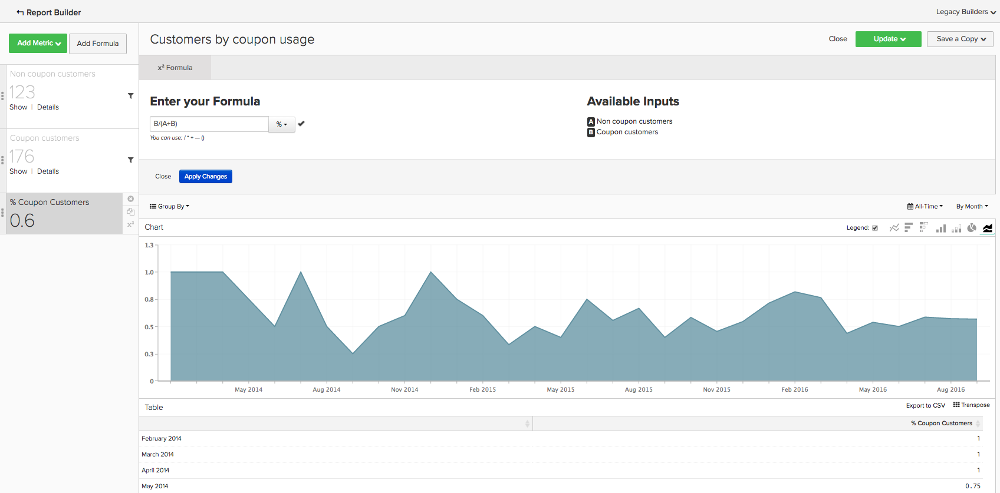

# Grundlegende Analytics

Sobald Sie mit dem [!DNL Adobe Commerce Intelligence] und über grundlegende Kenntnisse des Tools verfügen, sollten Sie mit der Erstellung von Berichten beginnen. Eine der häufigsten Fragen, die Sie möglicherweise haben, ist &quot;Was sollte ich mir ansehen?&quot;

Die folgenden Informationen beschreiben einige der häufig verwendeten Metriken und Berichte, die Sie möglicherweise für nützlich halten. Einige dieser Berichte sind in Ihrem Konto vorhanden. Überprüfen Sie daher die Metriken und Berichte, die in Ihrem Konto vorhanden sind, um Duplikate zu vermeiden.

## Tabellen und Spalten, die Sie verstehen möchten

Beim Erstellen einer Metrik müssen Sie vier Informationen kennen:

1. die Tabelle, in der die Daten gespeichert sind,
1. Die spezifische Aktion, die Sie ausführen möchten,
1. Die Spalte, für die Sie diese Aktion durchführen möchten, und
1. Der Zeitstempel, den Sie zum Tracking dieser Daten verwenden möchten.

Wahrscheinlich unterscheiden sich die Namen der in diesen Beispielen verwendeten Tabellen geringfügig von den Spaltennamen und Tabellennamen in Ihrer Datenbank, da jede Datenbank eindeutig ist. Referenzieren Sie die folgenden Definitionen, wenn Sie Hilfe bei der Identifizierung einer entsprechenden Tabelle oder Spalte in Ihrer Datenbank benötigen.

## Kundentabelle

Diese Tabelle enthält die wichtigsten Informationen zu den einzelnen Kunden, z. B. eine eindeutige Kunden-ID, E-Mail-Adresse usw. Die folgenden Beispiele verwenden **[!UICONTROL customer_entity]** als Name einer Beispiel-Kundentabelle.

Wenn einige dieser Berechnungen derzeit nicht in Ihrer Datenbank vorhanden sind, können sie von jedem Administrator in Ihrem Konto erstellt werden. Außerdem sollten Sie sicherstellen, dass diese Dimensionen für alle zutreffenden Metriken gruppierbar sind.

**Dimensionen**

* **[!UICONTROL Entity_id]**: Eine eindeutige Kennung für jeden Kunden. Dies kann auch eine eindeutige Kundennummer oder eine E-Mail-Adresse eines Kunden sein und sollte als Referenzschlüssel für die Tabelle Ihrer Bestellung dienen.
* **[!UICONTROL Created_at]**: Das Datum, an dem das Kundenkonto erstellt und zu Ihrer Datenbank hinzugefügt wurde.
* **[!UICONTROL Customer's lifetime revenue]**: Der Gesamtumsatz während der Lebensdauer, der von einem Kunden generiert wurde.
* **[!UICONTROL Customer's first 30-day revenue]**: Der Gesamtbetrag des Umsatzes, der von einem Kunden in den ersten 30 Tagen generiert wurde.
* **[!UICONTROL Customer's lifetime number of orders]**: Die Anzahl der Bestellungen, die ein Kunde während seiner Lebensdauer aufgegeben hat.
* **[!UICONTROL Customer's lifetime number of coupons]**: Die Gesamtzahl der Gutscheine, die ein Kunde während seiner Lebensdauer verwendet hat.
* **[!UICONTROL Customer's first order date]**: Das Datum der ersten Bestellung eines Kunden. Dies kann sich vom Datum created_at unterscheiden, wenn ein Kunde zum Zeitpunkt seiner Erstellung keine Bestellung aufgegeben hat.

**Akzeptieren Sie Gastbestellungen?**

*Wenn ja, enthält diese Tabelle möglicherweise nicht alle Ihre Kunden. Kontaktieren Sie die [Supportteam](https://experienceleague.adobe.com/docs/commerce-knowledge-base/kb/troubleshooting/miscellaneous/mbi-service-policies.html) , um sicherzustellen, dass Ihre Kundenanalysen alle Kunden einschließen.*

*Sind Sie nicht sicher, ob Sie Gastbestellungen annehmen? Siehe [dieses Thema](../data-warehouse-mgr/guest-orders.md) um mehr zu erfahren!*

## Bestelltabelle

In dieser Tabelle stellt jede Zeile eine Reihenfolge dar. Die Spalten in dieser Tabelle enthalten grundlegende Informationen zu den einzelnen Bestellungen, wie z. B. die Kennung der Bestellung, das Erstellungsdatum, den Status, die Kennung des Kunden, der die Bestellung aufgegeben hat, usw. Die folgenden Beispiele verwenden **[!UICONTROL sales_flat_order]** als Name einer Beispielbestellungstabelle.

**Dimensionen**

* **[!UICONTROL Customer_id]**: Eine eindeutige Kennung für den Kunden, der die Bestellung aufgegeben hat. Dies wird häufig verwendet, um Informationen zwischen den Kunden- und Auftragstabellen zu verschieben. In diesen Beispielen erwarten Sie die customer_id auf der **[!UICONTROL sales_flat_order]** -Tabelle, die mit der **[!UICONTROL entitiy_id]** auf **[!UICONTROL customer_entity]** Tabelle.
* **[!UICONTROL Created_at]**: Das Datum, an dem die Bestellung erstellt oder platziert wurde.
* **[!UICONTROL Customer_email]**: Die E-Mail-Adresse des Kunden, der die Bestellung aufgegeben hat. Dies kann auch die eindeutige Kennung für den Kunden sein.
* **[!UICONTROL Customer's lifetime number of orders]**: Eine Kopie der Spalte mit demselben Namen auf Ihrer `Customers` Tabelle.
* **[!UICONTROL Customer's order number]**: Die sequenzielle Bestellnummer des Kunden, die der Bestellung zugeordnet ist. Wenn die Zeile, die Sie sich ansehen, beispielsweise die erste Bestellung eines Kunden ist, lautet diese Spalte &quot;1&quot;. Wenn dies jedoch die 15. Bestellung des Kunden war, zeigt diese Spalte &quot;15&quot;für diese Bestellung an. Wenn diese Dimension nicht in Ihrer `Customers` Tabelle, fragen Sie die [Supportteam](https://experienceleague.adobe.com/docs/commerce-knowledge-base/kb/troubleshooting/miscellaneous/mbi-service-policies.html) um Ihnen beim Erstellen zu helfen.
* **[!UICONTROL Customer's order number (previous-current)]**: Eine Verkettung von zwei Werten im **[!UICONTROL Customer's order number]** Spalte. Er wird in einem Beispielbericht unten verwendet, um die verstrichene Zeit zwischen zwei beliebigen Bestellungen anzuzeigen. Beispielsweise wird die Zeit zwischen dem ersten Bestelldatum eines Kunden und dem zweiten Bestelldatum mit dieser Berechnung als &quot;1-2&quot;dargestellt.
* **[!UICONTROL Coupon_code]**: Zeigt, welche Gutscheine bei jeder Bestellung verwendet wurden.
* **[!UICONTROL Seconds since previous order]**: Die Zeit (in Sekunden) zwischen den Bestellungen eines Kunden.

## Auftragselementtabelle

In dieser Tabelle steht jede Zeile für einen verkauften Artikel. Diese Tabelle enthält Informationen zu den in den einzelnen Bestellungen verkauften Artikeln, wie z. B. Referenznummer, Produktnummer, Menge usw. Die folgenden Beispiele verwenden `sales_flat_order_item` als Name einer Beispielsortierungselementtabelle.

**Dimensionen**

* **[!UICONTROL Item_id]**: Die eindeutige Kennung für jede Zeile in der Tabelle.
* **[!UICONTROL Order_id]**: Der Referenzschlüssel für Ihre `Orders` -Tabelle, die angibt, welche Artikel in derselben Bestellung gekauft wurden. Wenn eine Bestellung mehrere Elemente enthält, wird dieser Wert wiederholt.
* **[!UICONTROL Product_id]**: Wenn Sie Informationen über das gekaufte Produkt erhalten möchten (z. B. Farbe, Größe usw.), können Sie diese Informationen in dieser Spalte aus Ihrer Produkttabelle abrufen.
* **[!UICONTROL Order's created_at]**: Der Zeitstempel, mit dem die Bestellung aufgegeben wurde, wird normalerweise in Ihre `order line items` aus der `Orders` Tabelle.
* **[!UICONTROL Order's coupon_code]**: Ähnlich wie bei `Order's created_at` aus, wird diese Spalte aus Ihrer Auftragstabelle kopiert.

## Abonnementtabelle

Diese Tabelle dient zur Verwaltung Ihrer Abonnementinformationen, wie z. B. Anmelde-ID, E-Mail-Adresse des Abonnenten, Startdatum des Abonnements usw.

**Dimensionen**

* **[!UICONTROL Customer_id]**: Eine eindeutige Kennung für den Kunden, der die Bestellung aufgegeben hat. Dies ist eine gängige Methode zum Erstellen eines Pfads zwischen der Tabelle &quot;Customers&quot;und der Tabelle &quot;Bestellungen&quot;. In diesen Beispielen erwarten Sie die customer_id auf der **sales_flach_order** -Tabelle, die mit der `entitiy_id` auf `customer_entity` Tabelle.
* **[!UICONTROL Start date]**: Das Datum, an dem das Abonnement eines Kunden begonnen hat.

## Tabelle für Marketing-Ausgaben

Bei der Analyse Ihrer Marketing-Ausgaben können Sie Folgendes einbeziehen: [!DNL Facebook], [!DNL Google AdWords]oder anderen Quellen in Ihren Analysen. Wenn Sie über mehrere Marketing-Ausgabenquellen verfügen, wenden Sie sich an den [Managed Services-Team](https://business.adobe.com/products/magento/fully-managed-service.html) Hilfe beim Einrichten einer konsolidierten Tabelle für Ihre Marketing-Kampagnen.

**Dimensionen**

* **[!UICONTROL Spend]**: Die Gesamtausgaben der Anzeige. In [!DNL Facebook], wäre dies die Ausgabenspalte im `facebook_ads_insights_####` Tabelle. Für [!DNL Google AdWords], würde dies `adCost` in der Spalte `campaigns####` Tabelle.
* Die `####` , die an jede dieser Tabellen angehängt wird, mit der spezifischen Konto-ID für Ihre [!DNL Facebook] oder [!DNL Google AdWords] -Konto.
* **[!UICONTROL Clicks]**: Die Gesamtanzahl der Klicks. In [!DNL Facebook], wäre dies die Klickspalte im `facebook_ads_insights_####` Tabelle. In [!DNL Google AdWords]würde dies die Spalte adClicks im `campaigns####` Tabelle.
* **[!UICONTROL Impressions]**: Die Gesamtzahl der Impressionen. In [!DNL Facebook], wären dies die Impressionen in der `facebook_ads_insights_####` Tabelle. In [!DNL Google AdWords], wären dies die Impressionen der `campaigns####` Tabelle.
* **[!UICONTROL Campaign]**: Die Gesamtanzahl der Klicks. In [!DNL Facebook], wäre dies die Spalte campaign_name in der `facebook_ads_insights_####` Tabelle. In [!DNL Google AdWords], wäre dies die Kampagnenspalte im `campaigns####` Tabelle.
* **[!UICONTROL Date]**: Die Zeit und das Datum, an dem die Aktivität (Ausgaben, Klicks oder Impressionen) für eine bestimmte Kampagne aufgetreten ist. In [!DNL Facebook], würde dies `date_start` in der Spalte `facebook_ads_insights_####` Tabelle. In [!DNL Google AdWords], wäre dies die Datumsspalte in der `campaigns####` Tabelle.
* **[!UICONTROL Customer's first order's source]**: Die Quelle der Bestellung aus der ersten Bestellung eines Kunden. Überprüfen Sie zunächst, ob Sie über eine Spalte mit dem Namen `customer's first order's source` in Ihrem Konto. Wenn diese Spalte nicht angezeigt wird, können Sie die gewünschte Spalte mit diesen Anweisungen erstellen.
* **[!UICONTROL Customer's first order's medium]**: Das Bestellmedium stammt aus der ersten Bestellung eines Kunden. Überprüfen Sie zunächst, ob Sie über eine Spalte mit dem Namen `customer's first order's source` in Ihrem Konto. Wenn diese Spalte nicht angezeigt wird, können Sie die gewünschte Spalte mit diesen Anweisungen erstellen.
* **[!UICONTROL Customer's first order's campaign]**: Die Kampagne der Bestellung aus der ersten Bestellung eines Kunden. Überprüfen Sie zunächst, ob Sie über eine Spalte mit dem Namen `customer's first order's source` in Ihrem Konto. Wenn diese Spalte nicht angezeigt wird, können Sie die gewünschte Spalte mit diesen Anweisungen erstellen.

## Allgemeine Berichte und Metriken

Im Folgenden finden Sie einige gängige Beispiele für Berichte und Metriken, die Sie möglicherweise als nützlich erachten:

* [Customer Analytics](#customeranalytics)
* [Auftragsanalyse](#orderanalytics)
* [Marketing-Ausgabenanalyse](#mktgspendanalytics)

## Kundenanalyse {#customeranalytics}

### Neue Benutzer

* **Beschreibung**: Zählung aller neu erworbenen Benutzer über einen bestimmten Zeitraum. `New Users` unterscheidet sich von `Unique Customers`, weil `New Users` hat den Zeitstempel, mit dem ein Konto mit Ihrem Dienst erstellt wurde (was nicht bedeutet, dass sie notwendigerweise eine Bestellung aufgegeben haben), während `Unique Customers` haben mindestens eine Bestellung aufgegeben.
* **Metrikdefinition**: Diese Metrik führt eine **Count** von `entity_id` von `customer_entity` Tabelle geordnet nach `created_at`.
* **Berichtsbeispiel**: Anzahl der im letzten Monat neu erstellten Benutzer
   * **[!UICONTROL Metric]**: `New Users`
   * **[!UICONTROL Time Range]**: `Last Month`
   * **[!UICONTROL Time Interval]**: `By Day`

<!--{: width="929"}-->

### Unique Customers

* **Beschreibung**: Zählung der Unique Customers-Anzahl über einen bestimmten Zeitraum. Dies unterscheidet sich von `New Users`, da nur Kunden verfolgt werden, die mindestens eine Bestellung aufgegeben haben. Der Bericht eines bestimmten Kunden verfolgt einen Kunden nur einmal in einem bestimmten Zeitintervall. Wenn Sie das Zeitintervall auf `By Day` und ein Kunde mehr als einen Kauf an diesem Tag tätigt, wird der Kunde nur einmal gezählt. Wenn Sie die Gesamtanzahl der Käufe im Allgemeinen anzeigen möchten, sehen Sie sich Folgendes an: `Number of Orders`.
* **Metrikdefinition**: Diese Metrik führt eine **Count Distinct** von `customer_id` von `sales_flat_order` Tabelle geordnet nach `created_at`.
* **Berichtsbeispiel**: Unique Customers pro Woche in den letzten 90 Tagen
   * **[!UICONTROL Metric]**: `Distinct Customers`
   * **[!UICONTROL Time Range]**: `Moving range > Last 90 Days`
   * **[!UICONTROL Time Interval]**: `By Day`

<!--{: width="929"}-->

### Neue Abonnenten

* **Beschreibung**: Zählung aller neuen Abonnenten, die in einem bestimmten Zeitraum neu erworben wurden.
* **Metrikdefinition**: Diese Metrik führt eine **Count Distinct** von `customer_id` von `subscriptions` Tabelle geordnet nach `start_date`.
* **Berichtsbeispiel**: Neue Abonnenten in diesem Jahr nach Monat
   * **[!UICONTROL Metric]**: `New Subscribers`
   * **[!UICONTROL Time Range]**: `1 Year Ago to 0 Days Ago`
   * **[!UICONTROL Time Interval]**: `By Month`

<!--{: width="929"}-->

### Kunden wiederholen

* **Beschreibung**: Die Gesamtzahl der Kunden, die in einem Zeitraum mehr als eine Bestellung aufgegeben haben. In einem Kundenbericht für wiederholte Kunden können Sie die Variable `Distinct Customers` und die `Customer's Order Number` Dimension aus Ihrer `orders` Tabelle.
* **Verwendete Metrik**: `Distinct Customers`
* **Berichtsbeispiel**: Anzahl der im letzten Jahr getätigten zweiten und dritten Käufe
   * **[!UICONTROL Metric]**: `Distinct Customers`
   * **[!UICONTROL Time Range]**: `Moving Range > Last Year`
   * **[!UICONTROL Time Interval]**: `By Month`
   * **[!UICONTROL Group By]**: `Customer's Order Number`, wählen Sie `2` und `3`

  

* **Berichtsbeispiel 2**: Die Anzahl der wiederholten Kunden in den letzten Jahren
   * **[!UICONTROL Metric]**: `Distinct Customers`
   * **[!UICONTROL Filters]**: `Customer's Order Number Greater Than 1`
   * **[!UICONTROL Time Range]**: `Moving range > Last Year`
   * **[!UICONTROL Time Interval]**: `By Month`

  <!--{: width="929"}-->

### Topkunden nach Lebensdauer der Bestellungen

* **Beschreibung**: Eine Liste der Top-Kunden basierend auf ihrer Gesamtzahl von Bestellungen. Auf diese Weise erhalten Sie eine direkte Liste Ihrer häufigsten Käufer.
* **Verwendete Metrik**: `Orders`
* **Berichtsbeispiel**: Die 25 wichtigsten Kunden nach der Anzahl der Bestellungen über die gesamte Lebensdauer
   * **[!UICONTROL Metric]**: `Orders`
   * **[!UICONTROL Time Range]**: `All Time`
   * **[!UICONTROL Time Interval]**: `None`
   * **[!UICONTROL Group By]**: `customer_email`
   * **[!UICONTROL Show Top/Bottom]**: Top 25 sortiert nach Bestellungen

  <!--{: width="929"}-->

### Top-Kunden nach Lebensdauerumsatz

* **Beschreibung**: Eine Liste der wichtigsten Kunden basierend auf dem Umsatz während der Lebensdauer.
* **Verwendete Metrik**: `Average Lifetime Revenue`
* **Berichtsbeispiel**: Top 25 Kunden nach Lifetime-Umsatz
   * **[!UICONTROL Metric]**: `Average Lifetime Revenue`
   * **[!UICONTROL Time Range]**: `All time`
   * **[!UICONTROL Time Interval]**: `None`
   * **[!UICONTROL Group By]**: `customer_email`
   * **[!UICONTROL Show Top Bottom]**: Top 25 sortiert nach Lebensdauerumsatz

  <!--{: width="929"}-->

### Durchschnittlicher Umsatz nach Kohorte

* **Beschreibung**: Verfolgen Sie die [durchschnittlicher Lebenszeitumsatz bestimmter Kohorten](../dev-reports/lifetime-rev-cohort-analysis.md) der Benutzer über einen bestimmten Zeitraum hinweg, um die leistungsstärksten Kohorten zu identifizieren. Kohorten werden nach einem gemeinsamen Datum gruppiert, z. B. dem Erstellungsdatum der ersten Bestellung oder dem Erstellungsdatum.
* **Verwendete Metrik**: `Revenue`
* **Berichtsbeispiel**: Durchschnittlicher Kundenlebenszeitumsatz nach Kohorte
   * **[!UICONTROL Metric]**: `Revenue`
   * **[!UICONTROL Cohort Date]**: `Customer's first order date`
   * **[!UICONTROL Time Interval]**: `Month`
   * **[!UICONTROL Time Period]**: Verschieben des Kohortensatzes der letzten acht Kohorten mit mindestens vier Monaten Daten
   * **[!UICONTROL Duration]**: `12 Month(s)`
   * **[!UICONTROL Table]**: `Customer_entity`
   * **[!UICONTROL Perspective]**: Kumulativer Durchschnittswert pro Kohortenmitglied

  <!--{: width="929"}-->

### Kunden nach Verwendung des Gutscheins

* **Beschreibung**: Zählung aller erworbenen Kunden, die einen Gutschein-/Rabattcode verwendet haben. So erhalten Sie einen klaren Überblick über Ihre Rabattsuchenden im Vergleich zu Vollpreiskäufern.
* **Verwendete Metrik**: `New Users`
* **Berichtsbeispiel**: Coupon- und Nicht-Coupon-Kunden nach Monat
   * **[!UICONTROL Metric A]**: `Non coupon customers`
   * **[!UICONTROL Metric]**: `New Users`
   * **[!UICONTROL Filters]**: Anzahl der Bestellungen über die Lebensdauer des Kunden größer als 0 und Anzahl der Coupons über die Lebensdauer des Kunden gleich 0
   * **[!UICONTROL Metric B]**: `Coupon customers`
   * **[!UICONTROL Metric]**: `New Users`
   * **[!UICONTROL Filters]**: Kundenlebensdauer Anzahl der Bestellungen größer als 0 und Anzahl der Coupons auf Lebensdauer des Kunden größer als 0
   * **[!UICONTROL Time range]**: `All Time`
   * **[!UICONTROL Time interval]**: `By Month`

  <!--{: width="929"}-->

* **Berichtsbeispiel 2**: Prozentsatz der Coupon- und Nicht-Coupon-Kunden nach Monat
   * **[!UICONTROL Metric A]**: `Non coupon customers` (Metrik ausblenden)
      * **[!UICONTROL Metric]**: `New Users`
      * **[!UICONTROL Filters]**: `Customer's Lifetime Number of Orders Greater Than 0` und `Customer's Lifetime Number of Coupons Equal to 0`
   * **[!UICONTROL Metric B]**: `Coupon customers`
      * **[!UICONTROL Metric]**: `New Users`
      * **[!UICONTROL Filters]**: `Customers Lifetime Number of Orders Greater Than 0` und `Customer's Lifetime Number of Coupons Greater Than 0`
   * **[!UICONTROL Time Range]**: `All Time`
   * **[!UICONTROL Time Interval]**: `By Month`
   * **[!UICONTROL Formula]**: `B/(A+B)`

>[!NOTE]
>
> **Alle Metriken ausblenden**

<!--{: width="929"}-->

### Durchschnittlicher Umsatz der ersten 30 Tage

* **Beschreibung**: Der durchschnittliche Betrag des Umsatzes, der von Kunden innerhalb ihrer ersten 30 Tage als Kunde generiert wurde.
* **Metrikbeschreibung**: Diese Metrik führt eine **Durchschnittlich** von `Customer's First 30 Day Revenue` von `customer_entity` Tabelle geordnet nach `created_at`.
* **Berichtbeschreibung**: Zeitlicher Durchschnitt des ersten Umsatzes des Kunden mit 30 Tagen
* **[!UICONTROL Metric]**: `Average First 30 Day Revenue`
* **[!UICONTROL Time Range]**: `All Time`
* **[!UICONTROL Time Interval]**: `None`

<!--{: width="929"}-->

### Durchschnittlicher Umsatz während der Kundenlebensdauer

* **Beschreibung**: Der durchschnittliche Umsatz, den Ihre Kunden über ihre gesamte Lebensdauer generiert haben.
* **Metrikbeschreibung**: Diese Metrik führt eine **Durchschnittlich** des `Customer's Lifetime Revenue` in der Spalte `customer_entity` -Tabelle basierend auf der `created_at`.
* **Berichtbeschreibung**: Gesamtdurchschnittswert des Lebensdauerumsatzes des Kunden
   * **[!UICONTROL Metric]**: `Average Customer Lifetime Revenue`
   * **[!UICONTROL Time Range]**: `All Time`
   * **[!UICONTROL Time Interval]**: `None`

<!--{: width="929"}-->

## Auftragsanalyse {#orderanalytics}

### Umsatz

* **Beschreibung**: Die Umsatzmetrik zeigt den Gesamtumsatz an, der in einem bestimmten Zeitraum erzielt wurde.
* Diese Metrik führt eine **sum** von `grand_total` von `sales_flat_order` Tabelle geordnet nach `created_at`.
* **Berichtsbeispiel**: Umsatz pro Monat, YTD
   * **[!UICONTROL Metric]**: `Revenue`
   * **[!UICONTROL Time Range]**: `1 Year Ago to 1 Month Ago`
   * **Zeitintervall**: `By Month`

>[!TIP]
>
>Stellen Sie sicher, dass die Berechnung Ihrer Umsatzmetrik mit der Definition übereinstimmt, die Sie intern besprechen. Sie können beispielsweise Umsätze aus versandten Bestellungen zählen, Währungen aus verschiedenen Regionen umrechnen oder Steuern ausschließen. Außerdem können Sie [Filtersätze](../../data-user/reports/ess-manage-data-filters.md) , um die Konsistenz aller auf derselben Tabelle erstellten Metriken sicherzustellen.

<!--{: width="929"}-->

### Bestellungen

* **Beschreibung**: Zählung aller Bestellungen über einen bestimmten Zeitraum. Der Bericht &quot;Bestellungen&quot;verfolgt Änderungen des Bestellvolumens, die durch neue Produktangebote, Promotions oder andere Faktoren verursacht werden, die das Transaktionsvolumen erhöhen (oder verringern) können. Sie können diese Metrik oft nach Variablen segmentieren, um Ihre Fragen zu beantworten.
* **Metrikdefinition**: Diese Metrik führt eine **Count** von `entity_id` von `sales_flat_order` Tabelle geordnet nach `created_at`.
* **Berichtsbeispiel**: Bestellungen nach Monat, YTD
   * **[!UICONTROL Metric]**: `number of orders`
   * **[!UICONTROL Time Range]**: `1 Year Ago to 1 Month Ago`
   * **[!UICONTROL Time Interval]**: `By Month`

>[!TIP]
>
>Genau wie die Umsatzmetrik sollten Sie [Filtersätze](../../data-user/reports/ess-manage-data-filters.md) zum Ausschließen von unvollständigen, Test- oder zurückgegebenen Bestellungen.

<!--{: width="929"}-->

### Bestellte Produkte

* **Beschreibung**: Die Metrik &quot;Bestellte Produkte&quot;gibt die Menge der in einem bestimmten Zeitraum verkauften Artikel an.
* **Metrikdefinition**: Diese Metrik führt eine **sum** von `qty_ordered` von `sales_flat_order_item` Tabelle geordnet nach `created_at`.
* **Berichtsbeispiel**: Nach Monat verkaufte Artikel, YTD
   * **[!UICONTROL Metric]**: `Products ordered`
   * **[!UICONTROL Time Range]**: `1 Year Ago to 1 Month Ago`
   * **[!UICONTROL Time Interval]**: `By Month`

  <!--{: width="929"}-->

* Kombinieren Sie diese Metrik mit Ihrer Anzahl an Bestellungen-Metrik, um die Anzahl der Elemente pro Bestellung zu berechnen. Fügen Sie anschließend Gutscheincodes zum Bericht hinzu, um festzustellen, wie sich Ihre Promotions auf die Warenkorbgröße auswirken, oder um nach neuen oder wiederholten Bestellungen zu segmentieren, um Ihr Kundenverhalten besser zu verstehen.
* **Berichtsbeispiel**: Produkte pro Bestellung: Erstbestellung vs. Wiederholung von Bestellungen
   * **[!UICONTROL Metric A]**: Sortierte Produkte: Erstbestellung
      * **[!UICONTROL Metric]**: `Products ordered`
      * **[!UICONTROL Filter]**: `Customer's order number = 1`
   * **[!UICONTROL Metric B]**: Bestellungen: Erstbestellung
      * **[!UICONTROL Metric]**: `Orders`
      * **[!UICONTROL Filter]**: `Customer's order number = 1`
   * **[!UICONTROL Metric C]**: Sortierte Produkte: Wiederholungsaufträge
      * **[!UICONTROL Metric]**: `Products ordered`
      * **[!UICONTROL Filter]**: `Customer's order number > 1`
   * **[!UICONTROL Metric D]**: Bestellungen: Wiederholungsaufträge
      * **[!UICONTROL Metric]**: `Orders`
      * **[!UICONTROL Filter]**: `Customer's order number > 1`
   * **[!UICONTROL Time Range]**: `1 Year Ago to 1 Month Ago`
   * **[!UICONTROL Time Interval]**: `By Week`
   * **[!UICONTROL Formula 1]**: `A/B`
   * **[!UICONTROL Formula 2]**: `C/D`

>[!NOTE]
>
>Deaktivieren Sie die `Multiple Y-Axes box` und `Hide` alle Metriken

<!--{: width="929"}-->

### Durchschnittlicher Bestellwert

* **Beschreibung**: Verfolgen Sie den Durchschnittswert der über einen Zeitraum aufgegebenen Bestellungen. Verwenden Sie diese Metrik, um schnell festzustellen, wie Ihr durchschnittlicher Bestellwert (AOV) aufgrund Ihrer Marketing-Maßnahmen, Ihres Produktangebots und/oder anderer Änderungen in Ihrem Unternehmen schwankte.
* **Metrikdefinition**: Diese Metrik führt eine **average** von `grand_total` von `sales_flat_order` Tabelle geordnet nach `created_at`.
* **Berichtsbeispiel**: AOV im Vergleich zum Vorjahr, YTD
   * **[!UICONTROL Metric]**: `Average order value`
   * **[!UICONTROL Time Range]**: `1 Year Ago to 1 Month Ago`
   * **[!UICONTROL Time Interval]**: `By Month`
   * **[!UICONTROL Perspective]**: `Amount Change vs Previous Year`

  <!--{: width="929"}-->

### Am häufigsten mit Coupons gekaufte Produkte

* **Beschreibung**: Dieser Bericht gibt Aufschluss darüber, welche Produkte verkauft werden, wenn Sie Promotions oder Coupons anbieten.
* **Verwendete Metrik**: Bestellte Produkte
* **Berichtsbeispiel**: Am häufigsten mit Coupons gekaufte Produkte
   * **[!UICONTROL Metric]**: `Products ordered`
   * **[!UICONTROL Filter]**: `Order's coupon_code Is Not \[NULL\]`
   * **[!UICONTROL Time Range]**: `All-Time`
   * **[!UICONTROL Time Interval]**: `None`
   * **[!UICONTROL Group By**]: `name` (oder `SKU`oder eine andere Produktkennung)
   * **[!UICONTROL Show top/bottom]**: Die 25 beliebtesten Sortierungen nach bestellten Produkten

  <!--{: width="929"}-->

### Zeit zwischen Bestellungen

* **Beschreibung**: Testen Sie Ihre Annahmen und Erwartungen bezüglich der Kaufzyklen Ihrer Kunden mit einer **Zeit zwischen Bestellungen** Analyse, die sich auf den Durchschnitt (oder Median!) bezieht Zeit zwischen Käufen. In der unten stehenden Grafik sehen Sie, dass Ihre besten Kunden - diejenigen, die mehr als drei Bestellungen aufgeben - ihren zweiten Kauf in weniger als sechs Monaten tätigen. Kunden, die keine vierte Bestellung aufgegeben haben, warten 14 Monate, bevor sie einen zweiten Kauf tätigen.
* **Metrikdefinition**: Diese Metrik führt eine **average** von `Time since previous order` von `sales_flat_order` geordnet nach `created_at`.
* **Berichtsbeispiel**:
   * **Metrik 1**: ≤ 3 Bestellungen
      * **[!UICONTROL Metric]**: `Average time between orders`
      * **[!UICONTROL Filter]**: `Customer's lifetime number of orders ≤ 3`
   * **Metrik 2**: > 3 Bestellungen
      * **[!UICONTROL Metric]**: `Average time between orders`
      * **[!UICONTROL Filter]**: `Customer's lifetime number of orders > 3`
   * **[!UICONTROL Time Range]**: `All-Time`
   * **[!UICONTROL Time Interval]**: `None`
   * **[!UICONTROL Group By]**:` Customer's order number (previous-current)`

>[!NOTE]
>
>Deaktivieren Sie die `Multiple Y-Axes` ankreuzen.

<!--{: width="929"}-->

## Analyse der Marketing-Ausgaben {#mktgspendanalytics}

### Werbeausgaben

* **Beschreibung**: Sie können Ihre Marketingausgaben über verschiedene Zeiträume und Intervalle, nach Kampagnen, Anzeigensets oder anderen Segmenten analysieren.
* **Metrikdefinition**: Diese Metrik führt eine Summe für die Ausgabespalte im `Marketing Spend` nach der `date` Spalte.
* **Berichtsbeispiel**: Werbeausgaben nach Kampagne
   * **[!UICONTROL Metric]**: `Ad spend`
   * **[!UICONTROL Time Range]**: `All-Time`
   * **[!UICONTROL Time Interval]**: `None`
   * **[!UICONTROL Group By]**: `campaign`

<!--{: width="929"}-->

### Anzeigenimpressionen und Anzeigenklicks

* **Beschreibung**: Zusätzlich zur Analyse der Werbeausgaben können Sie Ihre Anzeigenimpressionen und Anzeigenklicks analysieren.
* **Metrikdefinition**: Diese Metrik führt eine Summe für die Spalte &quot;Impressionen&quot;(oder &quot;Klicks&quot;) im `Marketing Spend` nach der Datumsspalte geordnet.
* **Berichtsbeispiel**: Hinzufügen von Impressionen und Anzeigenklicks nach Tag
   * **[!UICONTROL Metric A]**: `Ad impressions`
   * **[!UICONTROL Metric B]**: `Ad clicks`
   * **[!UICONTROL Time Range]**: `1 Year Ago to 3 Months Ago`
   * **[!UICONTROL Time Interval]**: `By Day`

  <!--{: width="929"}-->

### Clickthrough-Rate (CTR)

* **Beschreibung**: Mithilfe der oben erstellten Metriken für Anzeigenimpressionen und Anzeigenklicks können Sie Ihre Clickthrough-Rate nach verschiedenen Kampagnen im Zeitverlauf analysieren.
* **Berichtsbeispiel**: CTR nach Kampagne
   * **[!UICONTROL Metric A]**: `Ad impressions`
   * **[!UICONTROL Metric B]**: `Ad clicks`
   * **[!UICONTROL Time Range]**:`All-Time`
   * **[!UICONTROL Time Interval]**: `None`
   * **[!UICONTROL Formula]**: `B/A`
   * Wählen Sie die `%` -Option.
   * **[!UICONTROL Group By]**: `campaign`

>[!NOTE]
>
>Sie können **title** die Formel als `CTR`und **ausblenden** alle Metriken.

<!--{: width="929"}-->

### Kosten pro Klick (CPC)

* **Beschreibung**: Mithilfe der oben erstellten Metriken zu Werbeausgaben und Anzeigenklicks können Sie Ihre Kosten pro Klick nach verschiedenen Kampagnen im Zeitverlauf analysieren.
* **Berichtsbeispiel**: CPC nach Kampagne
   * **[!UICONTROL Metric A]**: `Ad spend`
   * **[!UICONTROL Metric B]**: `Ad clicks`
   * **[!UICONTROL Time Range]**: `All-Time`
   * **[!UICONTROL Time Interval]**: `None`
   * **[!UICONTROL Formula]**: `A/B`
   * Wählen Sie die `currency` option
   * **[!UICONTROL Group By]**: `campaign`

>[!NOTE]
>
>Sie können **title** die Formel als `CPC`und **ausblenden** alle Metriken.

<!--{: width="929"}-->

### Kunden nach Akquisequelle

* **Beschreibung**: Wenn Sie die Quelle, das Medium und die Kampagne einer Bestellung mithilfe von [!DNL Google eCommerce]können Sie Ihre Kunden anhand ihrer Akquise-Quelle analysieren. Auf diese Weise können Sie ermitteln, welche Marketing-Quellen Kunden gewinnen, und Fragen beantworten, wie z. B. &quot;die meisten Ihrer Kunden, die ihre ersten Bestellungen tätigen, über [!DNL Google], [!DNL Facebook]oder eine andere Quelle?&quot;
* **Berichtsbeispiel**: Kunden nach Akquisequelle
   * **[!UICONTROL Metric Used]**: `New Customers`
   * **[!UICONTROL Time Range]**: `All-Time`
   * **[!UICONTROL Time Interval]**: `By Month`
   * **[!UICONTROL Group By]**: `Customer's first order's source`

>[!NOTE]
>
>Checkout [diesem Artikel](../analysis/most-value-source-channel.md) für weitere Beispiele für Berichte, die die Akquisequelle verwenden.

<!--{: width="929"}-->

### Kunden nach Akquise-Medium und Akquise-Kampagne

* **Beschreibung**: Ähnlich wie bei der Analyse von Kunden nach Akquisequelle können Sie auch Ihre Kunden nach Medium und Kampagne ihrer ersten Bestellung analysieren. Dies kann Ihnen bei der Beantwortung von Fragen helfen, z. B. &quot;Welche Kampagnen ziehen neue Kunden an?&quot;
* **Berichtsbeispiel**: Kunden nach Akquise-Kampagne mit bezahltem Medium
   * **[!UICONTROL Metric Used]**: `New customers`
   * **[!UICONTROL Filter]**: `Customer's first order's medium IN ppc`
   * **[!UICONTROL Time Range]**: `All-Time`
   * **[!UICONTROL Time Interval]**: `None`
   * **[!UICONTROL Group By]**: `Customer's first order's campaign`

>[!NOTE]
>
>Für den Filter in Ihrer `New Customers` Metrik, können Sie alle anderen Medien hinzufügen, die als &quot;gebührenpflichtige&quot;Medien für Ihr Unternehmen gelten, z. B. CPC oder Paid Search.

<!--{: width="929"}-->

### Kundenakquisekosten (CAC) oder Kosten pro Akquise (CPA)

* **Beschreibung**: Eine Möglichkeit, die Kosten einer Kampagne zu analysieren, besteht darin, alle Kosten nur den Kunden zuzuordnen, die Sie über die Kampagne erworben haben.
* **Berichtsbeispiel**: CAC nach Kampagne
   * **[!UICONTROL Metric A]**: `New customers`
   * **[!UICONTROL Filter]**: `Customer's first order's medium IN ppc`
   * **[!UICONTROL Metric B]**: `Ad Spend`
   * **[!UICONTROL Time Range]**: `All-Time`
   * **[!UICONTROL Time Interval]**: `None`
   * **[!UICONTROL Formula]**: `B/A`
   * Wählen Sie die `currency` option
   * **[!UICONTROL Group By]**:
      * Für Metriken `A`auswählen `Customer's first order's campaign`
      * Für Metriken `B`auswählen `campaign`

  

>[!NOTE]
>
>Sie können **title** die Formel als `CTR`und **ausblenden** alle Metriken. Auschecken [diesem Artikel](../analysis/roi-ad-camp.md) für weitere Informationen.

### Lebenszeitwert nach Akquisequelle, Medium und Kampagne

* **Beschreibung**: Neben der Analyse der Anzahl der von jeder Kampagne erworbenen Kunden können Sie den durchschnittlichen Umsatz dieser Kunden über die gesamte Lebensdauer analysieren. Dies hilft Ihnen bei der Identifizierung:
   * Wenn bestimmte Kampagnen eine große Anzahl von Kunden anziehen, diese Kunden jedoch einen niedrigen Lebenszeitwert haben.
   * Wenn bestimmte Kampagnen ein geringes Kundenvolumen anziehen, diese Kunden jedoch einen hohen Lebenszeitwert haben.
* **Berichtsbeispiel**: Fügen Sie zuerst hinzu. `New customers` Metrik. Fügen Sie dann die `Average lifetime revenue` Metrik. Wählen Sie den gewünschten Zeitraum aus und wählen Sie die `interval` as `None`. Wählen Sie abschließend die `group by` Option als`Customer's first order's campaign`.
   * **[!UICONTROL Metric A]**: `New Customers`
   * **[!UICONTROL Filter A]**: `Customer's first order's source` LIKE &#39;%google%&#39;
   * **[!UICONTROL Filter B]**: `Customer's first order's medium IN ppc`
   * **[!UICONTROL Metric B]**: `Average lifetime revenue`
   * **[!UICONTROL Filter A]**: `Customer's first order's source` LIKE &#39;%google%&#39;
   * **[!UICONTROL Filter B]**: `Customer's first order's medium IN ppc`
   * **[!UICONTROL Time Range]**: `All-Time`
   * **[!UICONTROL Time Interval]**: `None`
   * **[!UICONTROL Group By]**: `Customer's first order's campaign`

>[!NOTE]
>
>Für die beiden Filter können Sie alle anderen Medien hinzufügen, die als &quot;bezahlte&quot;Medien für Ihr Unternehmen gelten (z. B. CPC oder Paid Search). Sie können auch andere Quellen hinzufügen, die Sie analysieren möchten, z. B. Facebook. Checkout [diesem Artikel](../analysis/roi-ad-camp.md) Weitere Informationen zu CAC, LTV und ROI.

<!--{: width="929"}-->

### Kapitalrendite (ROI)

* **Beschreibung**: Eine Möglichkeit, den ROI pro Kampagne zu berechnen, besteht darin, alle Bestellungen zu analysieren, die über die Kampagne aufgegeben werden. Eine alternative Methode besteht jedoch darin, den Lebenszeitwert der durch eine Kampagne erworbenen Kunden zu analysieren. Um den ROI zu analysieren, ist es wichtig, dass die Kampagnennamen für alle Ausgabedaten und Transaktionsdaten konsistent sind. Wenn Sie den folgenden Bericht erstellen und es aufgrund nicht übereinstimmender Kampagnennamen keine ROI-Werte gibt, müssen Sie möglicherweise die [UTM-Tagging](../../best-practices/utm-tagging-google.md) haben Sie implementiert.
* **Berichtsbeispiel**: ROI nach Kampagne
   * **[!UICONTROL Metric A]**: `New Customers`
   * **[!UICONTROL Filter A]**: `Customer's first order's source` LIKE &#39;%google%&#39;
   * **[!UICONTROL Filter B]**: `Customer's first order's medium IN ppc`
   * **[!UICONTROL Metric B]**: `Average lifetime revenue`
   * **[!UICONTROL Filter A]**: `Customer's first order's source` LIKE &#39;%google%&#39;
   * **[!UICONTROL Filter B]**: `Customer's first order's medium IN ppc`
   * **[!UICONTROL Metric C]**: `Ad spend`
   * **[!UICONTROL Time Range]**: `All-Time`
   * **[!UICONTROL Time Interval]**: `None`
   * **[!UICONTROL Formula]**: `(B-(C/A))/(C/A)`
   * Wählen Sie die `% `option
   * **[!UICONTROL Group By]**:
      * Für Metriken `A` und `B`auswählen `Customer's first order's campaign`
      * Für Metriken `C`auswählen `campaign`

>[!NOTE]
>
>Sie können der Formel den Titel &quot;ROI&quot;geben und alle Metriken ausblenden. Darüber hinaus können Sie die Filter in den Metriken anpassen, um alternative Quellen und Medien zu analysieren. Auschecken [dieses Thema](../analysis/roi-ad-camp.md) Weitere Informationen zu CAC, LTV und ROI.

<!--{: width="929"}-->

<!--{: width="929"}-->
