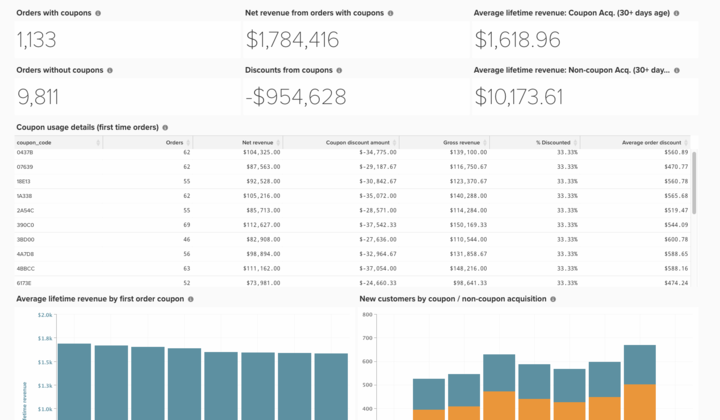

# Grundlegende Couponcode-Analyse

Die Couponleistung Ihres Unternehmens zu verstehen, ist eine interessante Möglichkeit, Ihre Bestellungen zu segmentieren und Kundengewohnheiten besser zu verstehen.

In diesem Thema werden die Schritte dokumentiert, die zur Erstellung dieser Analyse erforderlich sind, um zu verstehen, wie Kundinnen und Kunden, die Coupons erwerben, funktionieren, Trends sehen und die Nutzung einzelner Gutscheincodes verfolgen.

<!--{: width="807" height="471"}-->

## Erste Schritte

Zunächst ein Hinweis dazu, wie Couponcodes verfolgt werden. Wenn ein Kunde einen Coupon auf eine Bestellung angewendet hat, passieren drei Dinge:

* Der Rabatt wird im `base_grand_total` (Ihrer `Revenue` in Commerce Intelligence) angezeigt.
* Der Couponcode wird im Feld `coupon_code` gespeichert. Wenn dieses Feld NULL (leer) ist, ist der Bestellung kein Coupon zugeordnet.
* Der diskontierte Betrag wird in `base_discount_amount` gespeichert. Abhängig von Ihrer Konfiguration kann dieser Wert negativ oder positiv erscheinen.

Ab Commerce 2.4.7 kann ein Kunde mehr als einen Couponcode auf eine Bestellung anwenden. In diesem Fall:

* Alle angewendeten Gutscheincodes werden im `coupon_code` Feld von `sales_order_coupons` gespeichert. Der erste angewendete Couponcode wird ebenfalls im `coupon_code` Feld von `sales_order` gespeichert. Wenn dieses Feld NULL (leer) ist, ist der Bestellung kein Coupon zugeordnet.

## Erstellen einer Metrik

Der erste Schritt besteht darin, eine neue Metrik mit den folgenden Schritten zu erstellen:

* Navigieren Sie zu **[!UICONTROL Manage Data > Metrics > Create New Metric]**.

* Wählen Sie die `sales_order` aus.
* Diese Metrik führt eine **Summe** für die Spalte **base__amount** aus, sortiert nach **created_at**.
   * [!UICONTROL Filters]:
      * `Orders we count` hinzufügen (gespeicherter Filtersatz)
      * Folgendes hinzufügen:
         * `coupon_code`**IST NICHT**`[NULL]`
      * Benennen Sie die Metrik, z. B. `Coupon discount amount`.

## Dashboard erstellen

* Nachdem die Metrik erstellt wurde:
   * Navigieren Sie zu [!UICONTROL Dashboards > Dashboard Options > Create New Dashboard]**.
   * Geben Sie dem Dashboard einen Namen wie `_Coupon Analysis_`.

* Hier können Sie alle Berichte erstellen und hinzufügen.

## Erstellen von Berichten

* **Neue Berichte:**

>[!NOTE]
>
>Der [!UICONTROL Time Period]** für jeden Bericht wird als `All-time` aufgeführt. Sie können dies an Ihre Analyseanforderungen anpassen. Adobe empfiehlt, dass alle Berichte in diesem Dashboard denselben Zeitraum abdecken, z. B. `All time`, `Year-to-date` oder `Last 365 days`.

* **Bestellungen mit Coupons**
   * 
     [!UICONTROL-Metrik]: `Orders`
      * Filter hinzufügen:
         * [`A`] `coupon_code` **IST NICHT** `[NULL]`

   * [!UICONTROL Time period]: `All time`
   * 
     [!UICONTROL Intervall]: `None`
   * [!UICONTROL Chart type]:`Number (scalar)`

* **Bestellungen ohne Coupons**
   * 
     [!UICONTROL-Metrik]: `Orders`
      * Filter hinzufügen:
         * [`A`] `coupon_code` **IS** `[NULL]`

   * [!UICONTROL Time period]: `All time`
   * 
     [!UICONTROL Intervall]: `None`
   * [!UICONTROL Chart type]:`Number (scalar)`

* **Nettoumsatz aus Bestellungen mit Coupons**
   * 
     [!UICONTROL-Metrik]: `Revenue`
      * Filter hinzufügen:
         * [`A`] `coupon_code` **IST NICHT** `[NULL]`

   * [!UICONTROL Time period]: `All time`
   * 
     [!UICONTROL Intervall]: `None`
   * [!UICONTROL Chart type]: `Number (scalar)`

* **Rabatte auf Gutscheine**
   * [!UICONTROL Metric]: `Coupon discount amount`
   * [!UICONTROL Time period]: `All time`
   * 
     [!UICONTROL Intervall]: `None`
   * [!UICONTROL Chart type]: `Number (scalar)`

* **Durchschnittlicher Lebensdauerumsatz: Coupon akquirierte Kunden**
   * [!UICONTROL Metric]: `Avg lifetime revenue`
      * Filter hinzufügen:
         * [`A`] `Customer's first order's coupon_code` **IST NICHT** `[NULL]`

   * [!UICONTROL Time period]: `All time`
   * 
     [!UICONTROL Intervall]: `None`
   * [!UICONTROL Chart type]: `Number (scalar)`

* **Durchschnittlicher Umsatz während der Lebensdauer: Erworbene Kunden ohne Coupon**
   * [!UICONTROL Metric]: `Avg lifetime revenue`
      * Filter hinzufügen:
         * [A] `Customer's first order's coupon_code` **IS**`[NULL]`

   * [!UICONTROL Time period]: `All time`
   * 
     [!UICONTROL Intervall]: `None`
   * [!UICONTROL Chart type]: `Number (scalar)`

* **Details zur Couponnutzung (Erstbestellungen)**
   * `1`: `Orders`
      * Filter hinzufügen:
         * [`A`] `coupon_code` **IST ES NICHT**`[NULL]`
         * [`B`] `Customer's order number` **Gleich** `1`

   * `2`: `Revenue`
      * Filter hinzufügen:
         * [`A`] `coupon_code` **IST ES NICHT**`[NULL]`
         * [`B`] `Customer's order number` **Gleich** `1`

      * Umbenennen: `Net revenue`

   * `3`: `Coupon discount amount`
      * Filter hinzufügen:
         * [`A`] `coupon_code` **IST ES NICHT**`[NULL]`
         * [`B`] `Customer's order number` **Gleich** `1`

   * Formel erstellen: `Gross revenue`
      * [!UICONTROL Formula]: `(B – C)`
      * 
        [!UICONTROL Format]: `Currency`

   * Formel erstellen: **% Rabatt**
      * Formel: `(C / (B - C))`
      * 
        [!UICONTROL Format]: `Percentage`

   * Formel erstellen: `Average order discount`
      * [!UICONTROL Formula]: `(C / A)`
      * 
        [!UICONTROL Format]: `Percentage`

   * [!UICONTROL Time period]: `All time`
   * 
     [!UICONTROL Intervall]: `None`
   * 
     [!UICONTROL Diagrammtyp]: `Table`

* **Durchschnittlicher Lebensdauerumsatz nach Erstbestellung**
   * [!UICONTROL Metric]:**Durchschn. Lebensdauerumsatz**
      * Filter hinzufügen:
         * [`A`] `coupon_code` **IS**`[NULL]`

   * [!UICONTROL Time period]: `All time`
   * 
     [!UICONTROL Intervall]: `None`
   * [!UICONTROL Chart type]: `Number (scalar)`

* **Details zur Couponnutzung (Erstbestellungen)**
   * [!UICONTROL Metric]: `Avg lifetime revenue`
      * Filter hinzufügen:
         * [`A`] `Customer's first order's coupon_code` **IST NICHT** `[NULL]`

   * [!UICONTROL Time period]: `All time`
   * 
     [!UICONTROL Intervall]: `None`
   * [!UICONTROL Group by]: `Customer's first order's coupon_code`
   * 
     [!UICONTROL Diagrammtyp]: **Column**

* **Neue Kunden durch Coupon-/Nicht-Coupon-Akquise**
   * `1`: `New customers`
      * Filter hinzufügen:
         * [`A`] `Customer's first order's coupon_code` **IST NICHT** `[NULL]`

      * [!UICONTROL Rename]: `Coupon acquisition customer`

   * `2`: `New customers`
      * Filter hinzufügen:
         * [`A`] `coupon_code` **IS**`[NULL]`

      * [!UICONTROL Rename]: `Non-coupon acquisition customer`

   * [!UICONTROL Time period]: `All time`
   * [!UICONTROL Interval]: `By Month`
   * [!UICONTROL Chart type]: `Stacked Column`

Nachdem Sie die Berichte erstellt haben, sehen Sie im Bild oben in diesem Thema nach, wie Sie die Berichte in Ihrem Dashboard organisieren können.

>[!NOTE]
>
>Ab Adobe Commerce 2.4.7 können Kunden die Tabellen **quote_coupons** und **sales_order_coupons** verwenden, um Einblicke in die Verwendung mehrerer Gutscheine durch Kunden zu erhalten.

