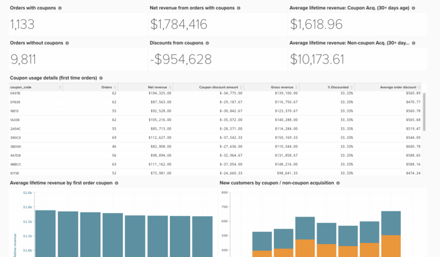

# Grundlegende Coupon-Codeanalyse

Das Verständnis der Couponleistung Ihres Unternehmens ist eine interessante Möglichkeit, Ihre Bestellungen zu unterteilen und Kundengewohnheiten besser zu verstehen.

In diesem Thema werden die Schritte beschrieben, die zur Erstellung dieser Analyse erforderlich sind, um die Leistung von mit Gutscheinen erworbenen Kunden zu verstehen, Trends zu sehen und die Verwendung von individuellen Gutscheincodes zu verfolgen.

<!--{: width="807" height="471"}-->

## Erste Schritte

Zunächst ein Hinweis zur Verfolgung von Coupon-Codes. Wenn ein Kunde einen Gutschein auf eine Bestellung angewendet hat, geschieht Folgendes:

* Ein Rabatt wird im Abschnitt `base_grand_total` Betrag (Ihre `Revenue` Metrik in Commerce Intelligence)
* Der Gutscheincode wird im `coupon_code` -Feld. Wenn dieses Feld NULL (leer) ist, ist der Bestellung kein Gutschein zugeordnet.
* Der abgezinste Betrag wird in `base_discount_amount`. Dieser Wert kann je nach Konfiguration negativ oder positiv aussehen.

## Erstellen einer Metrik

Der erste Schritt besteht darin, eine neue Metrik mit den folgenden Schritten zu erstellen:

* Navigieren Sie zu **[!UICONTROL Manage Data > Metrics > Create New Metric]**.

* Wählen Sie die `sales_order`.
* Diese Metrik führt eine **Summe** auf **base_discount_amount** Spalte, sortiert nach **created_at**.
   * [!UICONTROL Filters]:
      * Fügen Sie die `Orders we count` (Gespeicherter Filtersatz)
      * Fügen Sie Folgendes hinzu:
         * `coupon_code`**IST NICHT**`[NULL]`
      * Geben Sie der Metrik einen Namen, z. B. `Coupon discount amount`.

## Dashboard erstellen

* Nachdem die Metrik erstellt wurde:
   * Navigieren Sie zu [!UICONTROL Dashboards > Dashboard Options > Create New Dashboard]**.
   * Benennen Sie das Dashboard, z. B. `_Coupon Analysis_`.

* Hier können Sie alle Berichte erstellen und hinzufügen.

## Erstellen von Berichten

* **Neue Berichte:**

>[!NOTE]
>
>Die [!UICONTROL Time Period]** für jeden Bericht aufgeführt als `All-time`. Sie können dies nach Ihren Analyseanforderungen ändern. Adobe empfiehlt, dass alle Berichte in diesem Dashboard den gleichen Zeitraum abdecken, z. B. `All time`, `Year-to-date`oder `Last 365 days`.

* **Bestellungen mit Coupons**
   * 
     [!UICONTROL Metrik]: `Orders`
      * Filter hinzufügen:
         * [`A`] `coupon_code` **IST NICHT** `[NULL]`

   * [!UICONTROL Time period]: `All time`
   * 
     [!UICONTROL Intervall]: `None`
   * [!UICONTROL Chart type]:`Number (scalar)`

* **Bestellungen ohne Gutscheine**
   * 
     [!UICONTROL Metrik]: `Orders`
      * Filter hinzufügen:
         * [`A`] `coupon_code` **IS** `[NULL]`

   * [!UICONTROL Time period]: `All time`
   * 
     [!UICONTROL Intervall]: `None`
   * [!UICONTROL Chart type]:`Number (scalar)`

* **Nettoeinnahmen aus Bestellungen mit Coupons**
   * 
     [!UICONTROL Metrik]: `Revenue`
      * Filter hinzufügen:
         * [`A`] `coupon_code` **IST NICHT** `[NULL]`

   * [!UICONTROL Time period]: `All time`
   * 
     [!UICONTROL Intervall]: `None`
   * [!UICONTROL Chart type]: `Number (scalar)`

* **Rabatte aus Gutscheinen**
   * [!UICONTROL Metric]: `Coupon discount amount`
   * [!UICONTROL Time period]: `All time`
   * 
     [!UICONTROL Intervall]: `None`
   * [!UICONTROL Chart type]: `Number (scalar)`

* **Durchschnittlicher Umsatz während der Lebensdauer: Mit Coupons erworbene Kunden**
   * [!UICONTROL Metric]: `Avg lifetime revenue`
      * Filter hinzufügen:
         * [`A`] `Customer's first order's coupon_code` **IST NICHT** `[NULL]`

   * [!UICONTROL Time period]: `All time`
   * 
     [!UICONTROL Intervall]: `None`
   * [!UICONTROL Chart type]: `Number (scalar)`

* **Durchschnittlicher Umsatz während der Lebensdauer: Nicht kupon erworbene Kunden**
   * [!UICONTROL Metric]: `Avg lifetime revenue`
      * Filter hinzufügen:
         * [A] `Customer's first order's coupon_code` **IS**`[NULL]`

   * [!UICONTROL Time period]: `All time`
   * 
     [!UICONTROL Intervall]: `None`
   * [!UICONTROL Chart type]: `Number (scalar)`

* **Angaben zur Nutzung des Gutscheins (Erstbestellungen)**
   * Metrik `1`: `Orders`
      * Filter hinzufügen:
         * [`A`] `coupon_code` **IST NICHT**`[NULL]`
         * [`B`] `Customer's order number` **Gleich** `1`

   * Metrik `2`: `Revenue`
      * Filter hinzufügen:
         * [`A`] `coupon_code` **IST NICHT**`[NULL]`
         * [`B`] `Customer's order number` **Gleich** `1`

      * Umbenennen:  `Net revenue`

   * Metrik `3`: `Coupon discount amount`
      * Filter hinzufügen:
         * [`A`] `coupon_code` **IST NICHT**`[NULL]`
         * [`B`] `Customer's order number` **Gleich** `1`

   * Formel erstellen: `Gross revenue`
      * [!UICONTROL Formula]: `(B – C)`
      * 
        [!UICONTROL Format]: `Currency`

   * Formel erstellen:**% diskontiert**
      * Formel: `(C / (B - C))`
      * 
        [!UICONTROL Format]: `Percentage`

   * Formel erstellen: `Average order discount`
      * [!UICONTROL Formula]: `(C / A)`
      * 
        [!UICONTROL Format]: `Percentage`

   * [!UICONTROL Time period]: `All time`
   * 
     [!UICONTROL Intervall]: `None`
   * 
     [!UICONTROL Diagrammtyp]: `Table`

* **Durchschnittlicher Umsatz während der Lebensdauer nach erstmaligem Bestellcoupon**
   * [!UICONTROL Metric]:**Durchschnittlicher Umsatz während der Lebensdauer**
      * Filter hinzufügen:
         * [`A`] `coupon_code` **IS**`[NULL]`

   * [!UICONTROL Time period]: `All time`
   * 
     [!UICONTROL Intervall]: `None`
   * [!UICONTROL Chart type]: `Number (scalar)`

* **Angaben zur Nutzung des Gutscheins (Erstbestellungen)**
   * [!UICONTROL Metric]: `Avg lifetime revenue`
      * Filter hinzufügen:
         * [`A`] `Customer's first order's coupon_code` **IST NICHT** `[NULL]`

   * [!UICONTROL Time period]: `All time`
   * 
     [!UICONTROL Intervall]: `None`
   * [!UICONTROL Group by]: `Customer's first order's coupon_code`
   * 
     [!UICONTROL Diagrammtyp]: **Column**

* **Neue Kunden nach Coupon-/Nicht-Coupon-Akquise**
   * Metrik `1`: `New customers`
      * Filter hinzufügen:
         * [`A`] `Customer's first order's coupon_code` **IST NICHT** `[NULL]`

      * [!UICONTROL Rename]: `Coupon acquisition customer`

   * Metrik `2`: `New customers`
      * Filter hinzufügen:
         * [`A`] `coupon_code` **IS**`[NULL]`

      * [!UICONTROL Rename]: `Non-coupon acquisition customer`

   * [!UICONTROL Time period]: `All time`
   * [!UICONTROL Interval]: `By Month`
   * [!UICONTROL Chart type]: `Stacked Column`

Nachdem Sie die Berichte erstellt haben, erfahren Sie im Bild oben in diesem Thema, wie Sie die Berichte in Ihrem Dashboard organisieren können.
