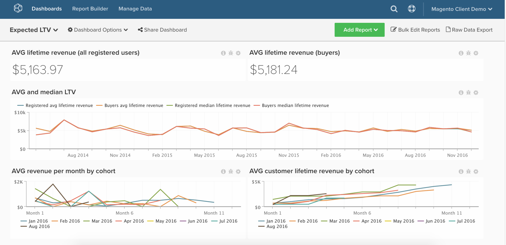

# Analyse des erwarteten Lebenszeitwerts

Dieses Thema zeigt, wie Sie ein Dashboard einrichten, das Ihnen hilft, das Wachstum des Kundenlebenszeitwerts und den erwarteten Lebenszeitwert Ihrer Kunden zu verstehen.

Diese Analyse steht nur Pro Account Kunden mit der neuen Architektur zur Verfügung. Wenn Ihr Konto Zugriff auf die `Persistent Views` in der `Manage Data` Seitenleiste hat, befinden Sie sich auf der neuen Architektur und können die hier aufgeführten Anweisungen befolgen, um diese Analyse selbst zu erstellen.

Bevor Sie beginnen, sollten Sie sich mit dem &quot;[ Report Builder“ vertraut machen](../dev-reports/cohort-rpt-bldr.md)

## Berechnete Spalten

In der Tabelle **Bestellungen** zu erstellende Spalten bei Verwendung von **30-Tage-Monaten**:

* [!UICONTROL Column name]: `Months between first order and this order`
* [!UICONTROL Column type]: `Same Table`
* &#x200B;
  [!UICONTROL Column equation]: `CALCULATION`
* [!UICONTROL Column input]: A = `Seconds between customer's first order date and this order`
* &#x200B;
  [!UICONTROL Datatype]: `Integer`
* **Definition:**`case when A is null then null when A <= 0 then '1'::int else (ceil(A)/2629800)::int end`

* [!UICONTROL Column name]: `Months since order`
* [!UICONTROL Column type]: `Same Table`
* &#x200B;
  [!UICONTROL Column equation]: `CALCULATION`
* [!UICONTROL Column input]: A = `created_at`
* &#x200B;
  [!UICONTROL Datatype]: `Integer`
* Definition `case when created_at is null then null else (ceil((extract(epoch from current_timestamp) - extract(epoch from created_at))/2629800))::int end`

In der **`orders`** zu erstellende Spalten bei Verwendung von **Kalender** Monaten:

* [!UICONTROL Column name]: `Calendar months between first order and this order`
* [!UICONTROL Column type]: `Same Table`
* &#x200B;
  [!UICONTROL Column equation]: `CALCULATION`
* [!UICONTROL Column inputs]:
   * `A` = `created_at`
   * `B` = `Customer's first order date`

* &#x200B;
  [!UICONTROL Datatype]: `Integer`
* Definition `case when (A::date is null) or (B::date is null) then null else ((date_part('year',A::date) - date_part('year',B::date))*12 + date_part('month',A::date) - date_part('month',B::date))::int end`

* [!UICONTROL Column name]: `Calendar months since order`
* [!UICONTROL Column type]: `Same Table`
* &#x200B;
  [!UICONTROL Column equation]: `CALCULATION`
* [!UICONTROL Column input]: `A` = `created_at`
* &#x200B;
  [!UICONTROL Datatype]: `Integer`
* **Definition:**`case when A is null then null else ((date_part('year',current_timestamp::date) - date_part('year',A::date))*12 + date_part('month',current_timestamp::date) - date_part('month',A::date))::int end`

* [!UICONTROL Column name]: `Is in current month? (Yes/No)`
* [!UICONTROL Column type]: `Same Table`
* &#x200B;
  [!UICONTROL Column equation]: `CALCULATION`
* [!UICONTROL Column input]: A = `created_at`
* &#x200B;
  [!UICONTROL Datatype]: `String`
* Definition `case when A is null then null when (date_trunc('month', current_timestamp::date))::varchar = (date_trunc('month', A::date))::varchar then 'Yes' else 'No' end`

## Metriken

### Anweisungen zur Metrik

Zu erstellende Metriken

* **Unterschiedliche Kunden nach Datum der ersten Bestellung**
   * Wenn Sie Gastbestellungen aktivieren, verwenden Sie `customer_email`

* In der **`orders`**
* Diese Metrik führt eine **Anzahl unterschiedlicher Werte**
* In der Spalte **`customer_id`**
* Sortiert nach dem **`Customer's first order date`** Zeitstempel

>[!NOTE]
>
>Stellen Sie sicher[ dass Sie alle neuen Spalten als Dimensionen zu Metriken hinzufügen](../../data-analyst/data-warehouse-mgr/manage-data-dimensions-metrics.md) bevor Sie neue Berichte erstellen.

## Berichte

### Berichtsanweisungen

**Erwarteter Umsatz pro Kunde und Monat**

* `A`: `Revenue (hide)`
   * `Calendar months between first order and this order` `<= X` (Wählen Sie eine vernünftige Zahl für X, z. B. 24 Monate)
   * `Is in current month?` = `No`

* &#x200B;
  [!UICONTROL -Metrik]: `Revenue`
* [!UICONTROL Filter]:

* `B`: `All time customers (hide)`
   * `Is in current month?` = `No`

* [!UICONTROL Metric]: `New customers by first order date`
* [!UICONTROL Filter]:

* `C`: `All time customers by month since first order (hide)`
   * `Calendar months since order` `<= X`
   * `Is in current month?` = `No`

* [!UICONTROL Metric]: `New customers by first order date`
* [!UICONTROL Filter]:

* [!UICONTROL Formula]: `Expected revenue`
* [!UICONTROL Formula]: `A / (B - C)`
* &#x200B;
  [!UICONTROL Format]: `Currency`

Weitere Diagrammdetails

* [!UICONTROL Time period]: `All time`
* Zeitintervall: `None`
* [!UICONTROL Group by]: `Calendar months between first order and this order` - Alle anzeigen
* Ändern Sie mithilfe des Stiftsymbols neben dem `group by` die `group by` für die `All time customers` Metrik in „Unabhängig“
* Bearbeiten Sie die `Show top/bottom` wie folgt:
   * [!UICONTROL Revenue]: `Top 24 sorted by Calendar months between first order and this order`
   * [!UICONTROL All time customers]: `Top 24 sorted by All time customers`
   * [!UICONTROL All time customers by month since first order]: `Top 24 sorted by All time customers by month since first order`

**Durchschnittlicher Umsatz pro Monat nach Kohorte**

* `A`: `Revenue`
* &#x200B;
  [!UICONTROL Metric view]: `Cohort`
* [!UICONTROL Cohort date]: `Customer's first order date`
* [!UICONTROL Perspective]: `Average value per cohort member`

**Kumulativer durchschnittlicher Umsatz pro Monat nach Kohorte**

* `A`: `Revenue`
* &#x200B;
  [!UICONTROL Metric view]: `Cohort`
* [!UICONTROL Cohort date]: `Customer's first order date`
* [!UICONTROL Perspective]: `Cumulative average value per cohort member`

Nachdem Sie alle Berichte kompiliert haben, können Sie sie im Dashboard nach Bedarf organisieren. Das Ergebnis kann wie das Bild oben auf der Seite aussehen.

Wenn Sie beim Erstellen dieser Analyse auf Fragen stoßen oder einfach das Professional Services-Team kontaktieren möchten, wenden [ sich an den Support](https://experienceleague.adobe.com/docs/commerce-knowledge-base/kb/troubleshooting/miscellaneous/mbi-service-policies.html?lang=de).
