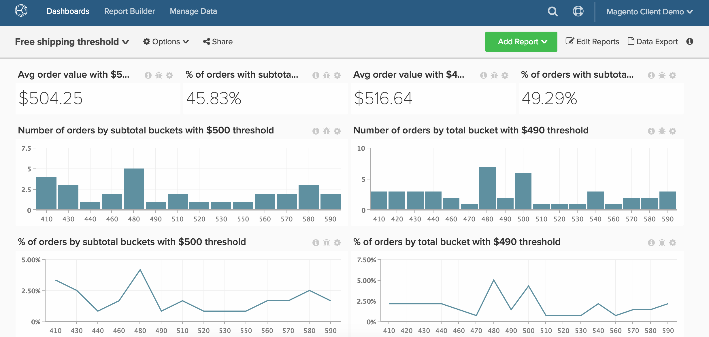

# kostenloser Versand

>[!NOTE]
>
>Dieses Thema enthält Anweisungen für Clients, die die ursprüngliche und die neue Architektur verwenden. Sie befinden sich auf der neuen Architektur, wenn der Abschnitt &quot;`Data Warehouse Views`&quot; verfügbar ist, nachdem Sie `Manage Data` in der Hauptsymbolleiste ausgewählt haben.

Dieses Thema zeigt, wie Sie ein Dashboard einrichten, das die Leistung Ihres Schwellenwerts für den kostenlosen Versand verfolgt. Dieses Dashboard, das unten dargestellt wird, ist eine hervorragende Möglichkeit, zwei Schwellenwerte für kostenlosen Versand A/B-Tests durchzuführen. Ihr Unternehmen könnte sich beispielsweise nicht sicher sein, ob Sie den kostenlosen Versand für 50 $ oder 100 $ anbieten sollten. Führen Sie einen A/B-Test mit zwei zufälligen Teilmengen Ihrer Kunden durch und führen Sie die Analyse in [!DNL Commerce Intelligence] durch.

Bevor Sie beginnen, möchten Sie zwei separate Zeiträume identifizieren, in denen Sie unterschiedliche Werte für den Schwellenwert für den kostenlosen Versand Ihres Geschäfts hatten.

Diese Analyse enthält [erweiterte berechnete Spalten](../data-warehouse-mgr/adv-calc-columns.md).

## Berechnete Spalten

Wenn Sie sich auf der ursprünglichen Architektur befinden (z. B. wenn Sie die Option `Data Warehouse Views` nicht im Menü `Manage Data` haben), wenden Sie sich an das Support-Team, um die folgenden Spalten zu erstellen. In der neuen Architektur können diese Spalten von der `Manage Data > Data Warehouse` Seite aus erstellt werden. Detaillierte Anweisungen finden Sie unten.

* **`sales_flat_order`**
   * Diese Berechnung erstellt Behälter in Inkrementen relativ zu Ihren typischen Warenkorbgrößen. Dies kann in Schritten von 5, 10, 50 bis 100 erfolgen

* **`Order subtotal (buckets)`** Originalarchitektur: wurde von einem Analyst als Teil Ihres `[FREE SHIPPING ANALYSIS]` erstellt
* **`Order subtotal (buckets)`** neue Architektur:
   * Wie bereits erwähnt, erstellt diese Berechnung Behälter in Inkrementen relativ zu Ihren typischen Warenkorbgrößen. Wenn Sie über eine native Zwischensummen-Spalte wie `base_subtotal` verfügen, kann diese als Grundlage für diese neue Spalte verwendet werden. Andernfalls kann es sich um eine berechnete Spalte handeln, die Versand und Rabatte vom Umsatz ausschließt.

  >[!NOTE]
  >
  >Die „Bucket“-Größen hängen davon ab, was für Sie als Kunde geeignet ist. Sie könnten mit Ihrem `average order value` beginnen und einige Behälter erstellen, die kleiner und größer als dieser Betrag sind. Wenn Sie sich die unten stehende Berechnung ansehen, sehen Sie, wie Sie einen Teil der Abfrage einfach kopieren, bearbeiten und zusätzliche Behälter erstellen können. Das Beispiel erfolgt in Schritten von 50.

   * `Column type - Same table, Column definition - Calculation, Column Inputs-` `base_subtotal` oder `calculated column`, `Datatype`: `Integer`
   * [!UICONTROL Calculation]: `case when A >= 0 and A<=200 then 0 - 200`
Wenn `A< 200` und `A <= 250` dann `201 - 250`
Wenn `A<251` und `A<= 300` dann `251 - 300`
Wenn `A<301` und `A<= 350` dann `301 - 350`
Wenn `A<351` und `A<=400` dann `351 - 400`
Wenn `A<401` und `A<=450` dann `401 - 450`
Sonst &#39;über 450&#39;
Ende

## Metriken

Keine neuen Metriken!!!

>[!NOTE]
>
>Stellen Sie sicher[ dass Sie alle neuen Spalten als Dimensionen zu Metriken hinzufügen](../data-warehouse-mgr/manage-data-dimensions-metrics.md) bevor Sie neue Berichte erstellen.

## Berichte

* **Durchschnittlicher Bestellwert mit Versandregel A**
   * [!UICONTROL Metric]: `Average order value`

* `A`: `Average Order Value`
* [!UICONTROL Time period]: `Time period with shipping rule A`
* &#x200B;
  [!UICONTROL Interval]: `None`
* &#x200B;
  [!UICONTROL Chart Type]: `Scalar`

* **Anzahl der Bestellungen nach Zwischensummen-Buckets mit Versandregel A**
   * [!UICONTROL Metric]: `Number of orders`

  >[!NOTE]
  >
  >Sie können das Ende abschneiden, indem Sie die oberen `X` `sorted by` `Order subtotal` (Eimer) in der `Show top/bottom` anzeigen.

* `A`: `Number of orders`
* [!UICONTROL Time period]: `Time period with shipping rule A`
* &#x200B;
  [!UICONTROL Interval]: `None`
* [!UICONTROL Group by]: `Order subtotal (buckets)`
* &#x200B;
  [!UICONTROL Chart Type]: `Column`

* **Prozent der Bestellungen nach Zwischensumme mit Versandregel A**
   * [!UICONTROL Metric]: `Number of orders`

   * [!UICONTROL Metric]: `Number of orders`
   * &#x200B;

     [!UICONTROL Gruppieren nach]: `Independent`
   * [!UICONTROL Formula]: `(A / B)`
   * &#x200B;

     [!UICONTROL Format]: `%`

* `A`: `Number of orders by subtotal (hide)`
* `B`: `Total number of orders (hide)`
* [!UICONTROL Formula]: `% of orders`
* [!UICONTROL Time period]: `Time period with shipping rule A`
* &#x200B;
  [!UICONTROL Interval]: `None`
* [!UICONTROL Group by]: `Order subtotal (buckets)`
* &#x200B;
  [!UICONTROL Chart Type]: `Line`

* **Prozent der Bestellungen mit Zwischensumme über Versandregel A**
   * [!UICONTROL Metric]: `Number of orders`
   * &#x200B;

     [!UICONTROL Perspective]: `Cumulative`

   * [!UICONTROL Metric]: `Number of orders`
   * &#x200B;

     [!UICONTROL Gruppieren nach]: `Independent`

   * [!UICONTROL Formula]: `1- (A / B)`
   * &#x200B;

     [!UICONTROL Format]: `%`

* `A`: `Number of orders by subtotal`
* `B`: `Total number of orders (hide)`
* [!UICONTROL Formula]: `% of orders`
* [!UICONTROL Time period]: `Time period with shipping rule A`
* &#x200B;
  [!UICONTROL Interval]: `None`
* [!UICONTROL Group by]: `Order subtotal (buckets)`
* &#x200B;
  [!UICONTROL Chart Type]: `Line`

Wiederholen Sie die obigen Schritte und Berichte für Versand B und den Zeitraum mit Versandregel B.

Nachdem Sie alle Berichte kompiliert haben, können Sie sie im Dashboard nach Bedarf organisieren. Das Ergebnis könnte wie das Bild oben auf dieser Seite aussehen.
