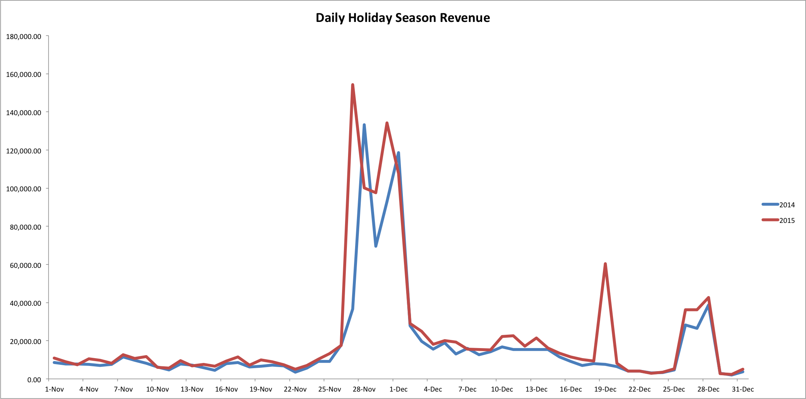

# Analyse des Weihnachtseinkaufs

Für Ihr Unternehmen könnten die Feiertage eine der geschäftigsten Zeiten des Jahres sein. Für Einzelhändler mit einem großen amerikanischen Kundenstamm umfasst die Weihnachtszeit in der Regel die Monate zwischen Thanksgiving und Neujahr.

Anstürme können zu jedem Zeitpunkt des Jahres auftreten. Wenn Ihr Unternehmen beispielsweise Shorts oder Poolzubehör verkauft, können Sie im Sommer einen Ansturm erleben. In diesem Thema werden Analysen untersucht, mit denen Sie Ihre Hochsaisons über verschiedene Jahre hinweg vergleichen können.

## Empfohlene Kennzahlen

Berücksichtigen Sie bei der Analyse der Leistung während der Weihnachtssaison [&#x200B; Analyse (oder &#x200B;](../../data-user/reports/ess-manage-data-metrics.md)) dieser Metriken:

### Anzahl neuer Kunden, Anzahl der Bestellungen, Umsatz

Um zu verstehen, wie sich das Wachstumsmuster dieses Jahres im Vergleich zu den Vorjahren darstellt, sollten Sie diese Maßnahmen analysieren. Die Anzahl der neuen Kunden, die Anzahl der neuen Bestellungen und der Umsatzbetrag zeigen Ihnen, wie Ihr Unternehmen täglich für den von Ihnen angegebenen Zeitraum (Weihnachtszeit) funktioniert. Sie können diese Kennzahlen auch aus einer kumulativen Perspektive analysieren, um zu sehen, wie sich die Metrik im Laufe der Zeit verändert.

### Durchschnittlicher Bestellwert

Diese Kennzahl zeigt den durchschnittlichen Gesamtbestellwert während der Urlaubszeiten an.

## Beispiel: Umsatz der täglichen Urlaubszeit

Nachdem Sie nun wissen, welche Metriken Sie analysieren müssen, sehen Sie sich einige Beispiel-Umsatzdaten während der Weihnachtssaison in den Monaten November und Dezember 2014 und 2015 an.

In diesem Beispiel gibt es zwei große Umsatzspitzen für 2014 und 2015: Diese Steigerungen fallen mit Black Friday und Cyber Monday zusammen. Beachten Sie, dass sich die Spitzen für 2014 und 2015 nicht am selben Tag befinden. Dies liegt daran, dass der Black Friday am 27. November 2014 und am 28. November 2015 fiel. In ähnlicher Weise war der Cyber Monday der 30. November 2014 und der 1. Dezember 2015.

Außerdem ist am 19. Dezember ein Umsatzanstieg für 2015 zu verzeichnen, der 2014 nicht eintritt. Möglicherweise wurde an diesem Samstag ein Verkauf angeboten, der im Vorjahr nicht verfügbar war.

Abgesehen von den wenigen oben genannten Terminen fallen die Einnahmen für diese beiden Jahre zusammen.

## Welche Fragen sollte ich berücksichtigen?

Damit Sie die saisonalen Trends für Ihr Unternehmen besser verstehen können, sollten Sie bei der Analyse Ihrer eigenen Daten folgende Fragen berücksichtigen:

* Sind die Trends von Jahr zu Jahr zu erwarten?
* Spiegeln die Trends Ihre Erwartungen an saisonale Variationen wider?
* Gibt es von Jahr zu Jahr Unterschiede? Können diese Unterschiede erklärt werden?
* Wurden in einem bestimmten Jahr Angebote unterbreitet?
* Wurden die Preise in einem bestimmten Jahr erhöht?
* Wurden die Werbeausgaben für ein bestimmtes Jahr erhöht?

## Was sollte ich noch analysieren?

Eine Möglichkeit besteht darin, das Kaufverhalten Ihrer Kunden während der Urlaubszeit zu analysieren. Geben Kunden, die während der Urlaubszeit erworben wurden, mehr aus oder kaufen sie häufiger ein als Kunden, die außerhalb der Urlaubszeit erworben wurden?

Eine weitere Möglichkeit besteht darin, Ihren ROI nach Kampagne während der Urlaubszeiten zu analysieren. Ist Ihr ROI für bestimmte Kampagnen, die während der Urlaubszeit ausgeführt werden, höher? Sollten Sie die Ausgaben für Kampagnen mit hohem ROI in diesen Saisons erhöhen?

Darüber hinaus können Sie die Anzahl der reduzierten Bestellungen versus Vollpreisbestellungen analysieren. [Warten die meisten Kunden auf einen Verkauf, um Bestellungen zu kaufen](../analysis/coupon-usage.md) während Ihrer Urlaubszeit oder kaufen sie Vollpreisartikel?

### verwandt

* [Analyse der Couponauswirkungen auf Kundenakquise und Kundenbindung](../analysis/coupon-impact.md)
* [Analyse des Rückkaufverhaltens von Kunden](../analysis/repurchase-behavior.md)
