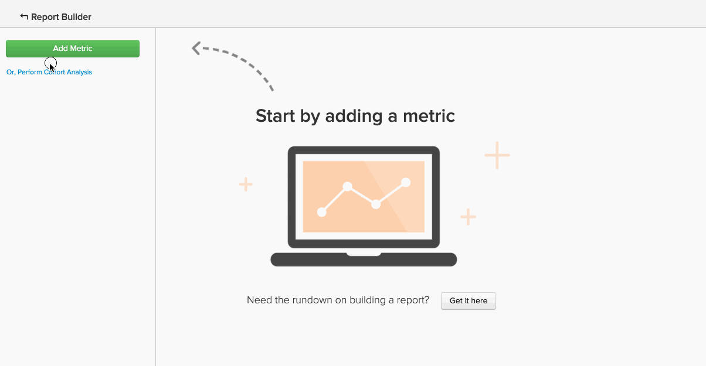

# Erweiterte berechnete Spaltentypen

Viele Analysen, die Sie erstellen möchten, beinhalten die Verwendung einer **neuen Spalte** die Sie `group by` oder `filter by` möchten. Das Tutorial [Erstellen berechneter Spalten](../data-warehouse-mgr/creating-calculated-columns.md) behandelt die Grundlagen für die meisten Anwendungsfälle, aber Sie können auch berechnete Spalten verwenden, die etwas komplexer sind als das, was der Data Warehouse-Manager erstellen kann.
{: #top}

Diese Spaltentypen können vom Adobe-Team von Data Warehouse-Analysten erstellt werden. Um eine neue berechnete Spalte zu definieren, geben Sie die folgenden Informationen an:

1. Die **`definition`** dieser Spalte (einschließlich Eingaben, Formeln oder Formatierung)
1. Die **`table`**, in der Sie die Spalte erstellen möchten
1. Alle **`example data points`**, die beschreiben, was die Spalte enthalten soll

Im Folgenden finden Sie einige gängige Beispiele für erweiterte berechnete Spalten, die Benutzende oft nützlich finden:

* [Ereignis sequenziell sortieren (oder nach Rang ordnen)](#compareevents)
* [Zeit zwischen zwei Ereignissen suchen](#twoevents)
* [Vergleichen sequenzieller Ereigniswerte](#sequence)
* [Währung umrechnen](#currency)
* [Zeitzonen konvertieren](#timezone)
* [Etwas Anderes](#else)

## Ich versuche, Ereignisse nacheinander zu bestellen {#compareevents}

Dies wird als berechnete Spalte **Ereignisnummer** bezeichnet. Das bedeutet, dass Sie versuchen, die Reihenfolge zu finden, in der Ereignisse für einen bestimmten Ereignisbesitzer, z. B. einen Kunden oder einen Benutzer, aufgetreten sind.

Beispiel:

| **`event\_id`** | **`owner\_id`** | **`timestamp`** | **`Owner's event number`** |
|-----|-----|-----|-----|
| 1 | `A` | 01.01.2015 00:00:00 | 1 |
| 2 | `B` | 01.01.2015 00:30:00 | 1 |
| 3 | `A` | 01.01.2015 02:00:00 | 2 |
| 4 | `A` | 2015-01-02 13:00:00 | 3 |
| 5 | `B` | 03.01.2015 13:00:00 | 2 |

{style="table-layout:auto"}

Eine berechnete Ereignisnummer kann verwendet werden, um Verhaltensunterschiede zwischen erstmaligen Ereignissen, Wiederholungsereignissen oder n-ten Ereignissen in Ihren Daten zu beobachten.

Möchten Sie die Spalte mit der Bestellnummer des Kunden in Aktion sehen? Klicken Sie auf das Bild, um es als „Gruppieren nach“-Dimension in einem Bericht zu verwenden.

<!--{: style="max-width: 500px;"}-->

Um diesen Typ von berechneter Spalte zu erstellen, müssen Sie Folgendes wissen:

* Die Tabelle, für die Sie diese Spalte erstellen möchten
* Das Feld, das den Eigentümer der Ereignisse identifiziert (in diesem Beispiel `owner\_id`)
* Das Feld, nach dem Sie die Ereignisse sortieren möchten (in diesem Beispiel `timestamp`)

[Nach oben](#top)

## Ich versuche die Zeit zwischen zwei Ereignissen zu finden. {#twoevents}

Dies wird als `date difference` berechnete Spalte bezeichnet. Das bedeutet, dass Sie basierend auf den Ereignis-Zeitstempeln versuchen, die Zeit zwischen zwei Ereignissen zu finden, die zu einem einzelnen Datensatz gehören.

Hier ein Beispiel:

| `id` | `timestamp\_1` | `timestamp\_2` | `Seconds between timestamp\_2 and timestamp\_1` |
|-----|-----|-----|-----|
| `A` | 01.01.2015 00:00:00 | 01.01.2015 12:30:00 | 45000 |
| `B` | 01.01.2015 08:00:00 | 01.01.2015 10:00:00 | 7200 |

{style="table-layout:auto"}

Eine berechnete Spalte für die Datumsdifferenz kann verwendet werden, um eine Metrik zu erstellen, die den Durchschnitt oder die Medianzeit zwischen zwei Ereignissen berechnet. Klicken Sie auf das Bild unten, um zu sehen, wie die `Average time to first order` Metrik in einem Bericht verwendet wird.

<!--{: style="max-width: 500px;"}-->

Um diesen Typ von berechneter Spalte zu erstellen, müssen Sie Folgendes wissen:

* Die Tabelle, für die Sie diese Spalte erstellen möchten
* Die beiden Zeitstempel, zwischen denen Sie den Unterschied erkennen möchten

[Nach oben](#top)

## Ich versuche, sequenzielle Ereigniswerte zu vergleichen. {#sequence}

Dies wird als &quot;**Ereignisvergleich“**. Dies bedeutet, dass Sie versuchen, das Delta zwischen einem Wert (Währung, Zahl, Zeitstempel) und dem entsprechenden Wert für das vorherige Ereignis des Eigentümers zu finden.

Beispiel:

| **`event\_id`** | **`owner\_id`** | **`timestamp`** | **`Seconds since owner's previous event`** |
|-----|-----|-----|-----|
| 1 | `A` | 01.01.2015 00:00:00 | NULL |
| 2 | `B` | 01.01.2015 00:30:00 | NULL |
| 3 | `A` | 01.01.2015 02:00:00 | 7720 |
| 4 | `A` | 2015-01-02 13:00:00 | 126000 |
| 5 | `B` | 03.01.2015 13:00:00 | 217800 |

{style="table-layout:auto"}

Ein sequenzieller Ereignisvergleich kann verwendet werden, um den Durchschnitt oder den Median der Zeit zwischen jedem sequenziellen Ereignis zu ermitteln. Klicken Sie auf die Abbildung unten, um die Metriken **Durchschnitt und Median Time Between Orders** in Aktion anzuzeigen.

=<!--{: style="max-width: 500px;"}-->

Um diesen Typ von berechneter Spalte zu erstellen, müssen Sie Folgendes wissen:

* Die Tabelle, für die Sie diese Spalte erstellen möchten
* Das Feld, das den Eigentümer der Ereignisse identifiziert (im Beispiel `owner\_id`)
* Das Wertfeld, zwischen dem der Unterschied für jedes sequenzielle Ereignis angezeigt werden soll (in diesem Beispiel `timestamp`)

[Nach oben](#top)

## Ich versuche, Währung zu konvertieren. {#currency}

Eine **Währungsumrechnung** berechnete Spalte rechnet Transaktionsbeträge aus einer erfassten Währung in eine Berichtswährung um, basierend auf dem Wechselkurs zum Ereigniszeitpunkt.

Beispiel:

| **`id`** | **`timestamp`** | **`transaction\_value\_EUR`** | **`transaction\_value\_USD`** |
|-----|-----|-----|-----|
| `1` | 01.01.2015 00:00:00 | 30 | 33,57 |
| `2` | 02.01.2015 00:00:00 | 50 | 55,93 |

{style="table-layout:auto"}

Um diesen Typ von berechneter Spalte zu erstellen, müssen Sie Folgendes wissen:

* Die Tabelle, für die Sie diese Spalte erstellen möchten
* Die Spalte für den Transaktionsbetrag, die Sie konvertieren möchten
* Die Spalte, die die Währung angibt, in der die Daten aufgezeichnet wurden (normalerweise ein ISO-Code)
* Die bevorzugte Berichtswährung

[Nach oben](#top)

## Ich versuche, Zeitzonen zu konvertieren. {#timezone}

Eine **Zeitzonenkonvertierung** berechnete Spalte konvertiert die Zeitstempel für eine bestimmte Datenquelle aus ihrer aufgezeichneten Zeitzone in eine Berichtszeitzone.

Beispiel:

| **`id`** | **`timestamp\_UTC`** | **`timestamp\_ET`** |
|-----|-----|-----|
| `1` | 01.01.2015 00:00:00 | 31.12.2014 :00:.00 |
| `2` | 01.01.2015 12:00:00 | 01.01.2015 07:00:00 |

{style="table-layout:auto"}

Um diesen Typ von berechneter Spalte zu erstellen, müssen Sie Folgendes wissen:

* Die Tabelle, für die Sie diese Spalte erstellen möchten
* Die Zeitstempelspalte, die Sie konvertieren möchten
* Die Zeitzone, in der die Daten aufgezeichnet wurden
* Die bevorzugte Zeitzone für Berichte

[Nach oben](#top)

## Ich versuche, etwas zu tun, das hier nicht aufgeführt ist. {#else}

Keine Sorge. Nur weil er hier nicht aufgeführt ist, heißt das noch lange nicht, dass er nicht möglich ist. Das Adobe-Team der Data Warehouse-Analysten kann Ihnen dabei helfen.

Um eine neue berechnete Spalte zu definieren[ reichen Sie ein Support-Ticket ](https://experienceleague.adobe.com/docs/commerce-knowledge-base/kb/troubleshooting/miscellaneous/mbi-service-policies.html), in dem Sie genau angeben, was Sie erstellen möchten.

## Verwandte Dokumentation

* [Berechnete Spalten erstellen](../data-warehouse-mgr/creating-calculated-columns.md)
* [Berechnete Spaltentypen](../data-warehouse-mgr/calc-column-types.md)
* [ [!DNL Google ECommerce]  mit Bestell- und Kundendaten](../data-warehouse-mgr/bldg-google-ecomm-dim.md)
