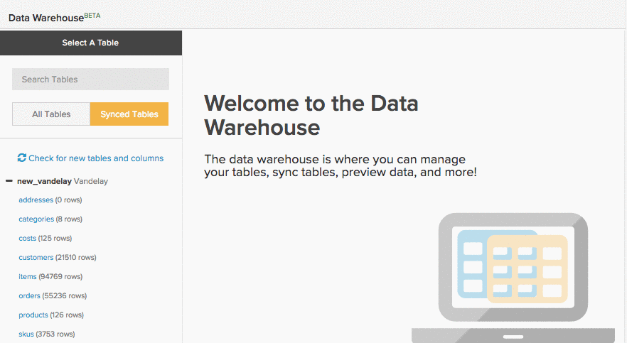
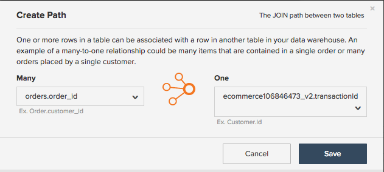
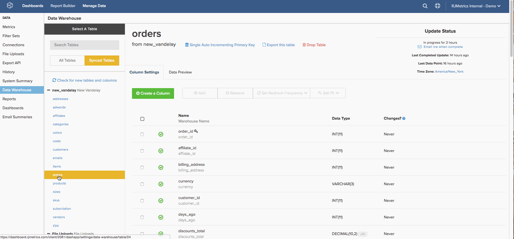

# Erstellen [!DNL Google ECommerce] Dimensionen

>[!NOTE]
>
>Erfordert [Administratorberechtigungen](../../administrator/user-management/user-management.md).

Jetzt, da Sie fertig sind [Ihr [!DNL Google ECommerce]-Konto](../../data-analyst/importing-data/integrations/google-ecommerce.md), was können Sie mit diesen Daten in [!DNL Commerce Intelligence] tun? Dieses Thema führt Sie durch die Erstellung von Dimensionen, die Ihre E-Commerce-Daten mit Ihren Bestellungen und Kundendaten verknüpfen.

Die behandelten Dimensionen bieten Ihnen die Möglichkeit, Analysen zu erstellen, die [wichtige Fragen zu Ihren Marketing-Kanälen und -Kampagnen beantworten](../../data-analyst/analysis/most-value-source-channel.md). Welcher Prozentsatz des Umsatzes stammt aus den einzelnen Quellen? Wie lässt sich der Lebenszeitwert [!DNL Facebook] erworbenen Kunden mit dem von [!DNL Google] vergleichen?

## Voraussetzungen und Übersicht

Zum Erstellen der Dimensionen in diesem Thema benötigen Sie eine [!DNL Google ECommerce], eine `orders` und eine `customers`. Diese Tabellen müssen mit [&#x200B; Data Warehouse synchronisiert werden](../../data-analyst/data-warehouse-mgr/tour-dwm.md) bevor Dimensionen erstellt werden können. Synchronisierte Tabellen werden im Abschnitt `Synced Tables` der `Data Warehouse Manager` angezeigt.

Im Folgenden finden Sie eine kurze Übersicht über das Synchronisieren von Tabellen und Spalten, wenn Sie eine Aktualisierung benötigen:

Nachdem Sie eine Verknüpfung von der `orders` zur [!DNL Google eCommerce] erstellt haben, erstellen Sie die ersten drei Dimensionen in der Liste unten. Als Nächstes verwenden Sie diese Dimensionen, um drei Benutzer-/Kundendimensionen in der `customers` zu erstellen. Um den Vorgang abzuschließen, verbinden Sie diese Spalten mit der `orders`.

Im Folgenden werden die Dimensionen beschrieben:

* **Tabelle Bestellungen**

* [!DNL Google Analytics] der Bestellung
* [!DNL Google Analytics] Medium der Bestellung
* Kampagne &quot;[!DNL Google Analytics]&quot; der Bestellung
* [!DNL Google Analytics] der ersten Bestellung des Kunden
* [!DNL Google Analytics] der Erstbestellung des Kunden
* [!DNL Google Analytics] der ersten Bestellung des Kunden

* **Tabelle Customers**

* [!DNL Google Analytics] der ersten Bestellung des Kunden
* [!DNL Google Analytics] der Erstbestellung des Kunden
* [!DNL Google Analytics] der ersten Bestellung des Kunden

## Dimensionen erstellen

Um Dimensionen zu erstellen, öffnen Sie den [Data Warehouse Manager](../data-warehouse-mgr/tour-dwm.md) indem Sie auf **[!UICONTROL Data]** > **[!UICONTROL Data Warehouse]** klicken.

### Bestelltabelle, Runde 1

In diesem Beispiel wird die Dimension **Order&#39;s [!DNL Google Analytics] Source** erstellt.

1. Klicken Sie in der Tabellenliste in der Data Warehouse auf die Tabelle (in diesem Fall `orders`), die Ihre Bestellinformationen enthält.
1. Klicken Sie auf **[!UICONTROL Create a Column]**.
1. Benennen Sie die Spalte.
1. Wählen Sie `Joined Column` aus dem Dropdown-Menü [Definition](../data-warehouse-mgr/calc-column-types.md). Dieses Beispiel arbeitet mit einer [-zu-eins-Beziehung](../data-warehouse-mgr/table-relationships.md) wobei die `eCommerce.transactionID` Spalte genau mit einer Zeile der `orders` Tabelle abgeglichen wird.
1. Als Nächstes müssen Sie den Pfad oder die Art und Weise definieren, wie die verwendete Tabelle und Spalte verbunden sind. Klicken Sie auf das Dropdown-Menü `Select a table and column` .
1. Der benötigte Pfad ist nicht verfügbar, daher müssen Sie einen neuen erstellen. Klicken Sie auf **[!UICONTROL Create new Path]**.
1. Legen Sie im angezeigten Fenster die `Many` Seite auf `orders.order\_id` oder die Spalte in der `orders` fest, die die Bestell-ID enthält.
1. Suchen Sie auf der `One` Seite die `Google ECommerce` Tabelle und legen Sie dann die Spalte auf `transactionID` fest.

   

1. Klicken Sie auf **[!UICONTROL Save]** , um den Pfad zu erstellen.
1. Nachdem der Pfad hinzugefügt wurde, klicken Sie erneut auf das Dropdown-**[!UICONTROL Select table and column]**.
1. Suchen Sie die Tabelle `ECommerce` und klicken Sie dann auf die Spalte `Source` . Dadurch werden die Bestellungen mit den Quellinformationen verknüpft.
1. Sobald Sie sich wieder im Tabellenschema befinden, klicken Sie erneut auf **[!UICONTROL Save]** , um die Dimension zu erstellen.

Im Folgenden wird der gesamte Prozess beschrieben:

Als Nächstes versuchen Sie **das [!DNL Google Analytics] Medium der Bestellung** und `campaign` zu erstellen. Für diese Dimensionen wurden nicht viele Änderungen vorgenommen. Versuchen Sie es also. Wenn Sie jedoch stecken bleiben, können Sie [Ende dieses Artikels) &#x200B;](#stuck), um zu sehen, was anders ist.

### Tabelle „Kunden“ {#customers}

In diesem Beispiel wird die Dimension **Quelle des ersten Auftrags des Kunden[!DNL Google Analytics] erstellt**.

1. Klicken Sie in der Tabellenliste in der Data Warehouse auf die Tabelle (in diesem Fall `customers`), die Ihre Kundeninformationen enthält.
1. Klicken Sie auf **[!UICONTROL Create a Column]**.
1. Benennen Sie die Spalte.
1. Wählen Sie für dieses Beispiel die `is MAX` aus der Dropdown-Liste [Definition](../../data-analyst/data-warehouse-mgr/calc-column-types.md). Die `is MIN` könnte auch funktionieren, wenn sie auf eine Textspalte mit nur einem möglichen Wert angewendet würde. Wichtig ist, sicherzustellen, dass geeignete Filter festgelegt werden, was Sie später tun.
1. Klicken Sie auf das Dropdown-Menü **[!UICONTROL Select a table and column]** und wählen Sie die `orders` Tabelle und dann die Spalte `Order's [!DNL Google Analytics] source` aus.
1. Klicken Sie auf **[!UICONTROL Save]**.
1. Sobald Sie sich wieder im Tabellenschema befinden, klicken Sie auf das Dropdown-Menü `Options` und dann auf `Filters`.
1. Klicken Sie auf **[!UICONTROL Add Filter Set]** und wählen Sie dann das `Orders we count` aus. Sie möchten, dass nur Bestellungen in den Bestellungen enthalten sind, für die Sie Filtersätze zählen. Daher ist es wichtig, dass dieser Filtersatz ausgewählt ist.
1. Klicken Sie auf **[!UICONTROL Add Filter]**. Sie möchten die [!DNL Google Analytics] des Kunden für die erste Bestellung finden, daher müssen Sie einen Filter hinzufügen:

   _orders.Customer&#39;s order number = 1

   _
1. Klicken Sie auf **[!UICONTROL Save]** , um die Dimension zu erstellen.

Als Nächstes versuchen Sie **das [!DNL Google Analytics] Medium des Kunden und** `campaign` zu erstellen. Für diese Dimensionen wurden nicht viele Änderungen vorgenommen. Versuchen Sie es also. Wenn Sie jedoch stecken bleiben, können Sie [Ende dieses Artikels) &#x200B;](#stuck), um zu sehen, was anders ist.

### Bonus: Bestelltisch, Runde 2

Sie können hier bei Bedarf stoppen, aber dieser Abschnitt ermöglicht eine weitere Analyse, indem **die [!DNL Google Analytics] Dimensionen des Kunden,** Sie im [&#x200B; Abschnitt erstellt haben](#customers) in die `orders` Tabelle aufgenommen werden. Wenn Sie die Dimensionen in diesem Abschnitt erstellen, können Sie alle Metriken analysieren, die auf Ihrer `orders`-Tabelle basieren - `Revenue`, `Number of orders`, `Distinct buyers` usw. -, indem Sie die [!DNL Google Analytics] Attribute der ersten Bestellung eines Kunden verwenden.

Dieses Beispiel verbindet die Dimension `Customer's first order's [!DNL Google Analytics] source` mit der `orders`.

1. Klicken Sie in der Tabellenliste in der Data Warehouse auf die Tabelle (in diesem Fall `orders`), die Ihre Bestellinformationen enthält.
1. Klicken Sie auf **[!UICONTROL Create a Column]**.
1. Benennen Sie die Spalte.
1. Wählen Sie `Joined Column` aus dem Dropdown-Menü Definition aus. Dadurch werden die Kundendimensionen, die Sie im vorherigen Abschnitt erstellt haben, mit der `orders`-Tabelle verbunden.
1. Klicken Sie auf das Dropdown-Menü **[!UICONTROL Select a table and column]** und wählen Sie dann die `customers` und die `Customer's first order's [!DNL Google Analytics] source` Spalte aus.
1. Wenn ein Pfad nicht automatisch ausgefüllt wird, wählen Sie den Pfad aus, der die Tabellen Customers und Orders am besten verbindet.
1. Klicken Sie auf **[!UICONTROL Save]** , um die Dimension zu erstellen.

Im Folgenden wird der gesamte Prozess beschrieben:

Schließen Sie die `Customer's first order's` Medium- und `campaign`-Dimensionen mit dem `orders` ab. Verbinden Sie die Dimensionen, und wenn es Probleme gibt, dann schauen Sie [Ende des Artikels](#stuck) wenn Sie Hilfe benötigen.

### Verpackung

Sie haben die Erstellung der Dimensionen abgeschlossen. Das bedeutet, dass Sie jetzt leistungsstarke Analysen erstellen können, mit denen die Leistung Ihrer verschiedenen Kanäle und Kampagnen verfolgt wird. Beachten Sie, dass **neue Spalten erst nach Abschluss der nächsten Aktualisierung verfügbar sein werden**.

Einige der beliebtesten Dimensionen werden in diesem Thema behandelt, aber der Himmel ist die Grenze - versuchen Sie, Ihre eigenen zu erstellen, oder fühlen Sie sich frei, uns zu kontaktieren, wenn Sie Hilfe bei der Erkundung anderer Optionen wünschen. 

### Zusätzliche Hinweise

**`Orders`Tabelle #1**: Beim Erstellen der Dimensionen &quot;`Order's [!DNL Google Analytics]` Medium“ und &quot;`campaign`&quot; ist der Unterschied die in Schritt 12 ausgewählte Spalte. In diesem Beispiel wurde die Spalte `Source`.

**`Customers`Tabelle**: Beim Erstellen der Dimensionen &quot;`Customer's first order's [!DNL Google Analytics]` Medium“ und &quot;`campaign`&quot; ist der Unterschied die in Schritt 5 ausgewählte Spalte. In diesem Beispiel war die Spalte `Order's [!DNL Google Analytics]` Quelle.

**`Orders`Tabelle #2**: Beim Verbinden des `Customer's first order's [!DNL Google Analytics]` Mediums und der `campaign` Spalten mit der `orders` Tabelle ist der Unterschied die in Schritt 5 ausgewählte Spalte. In diesem Beispiel war die Spalte `Customer's first order's [!DNL Google Analytics]` Quelle.
