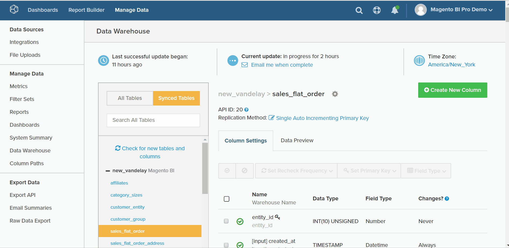
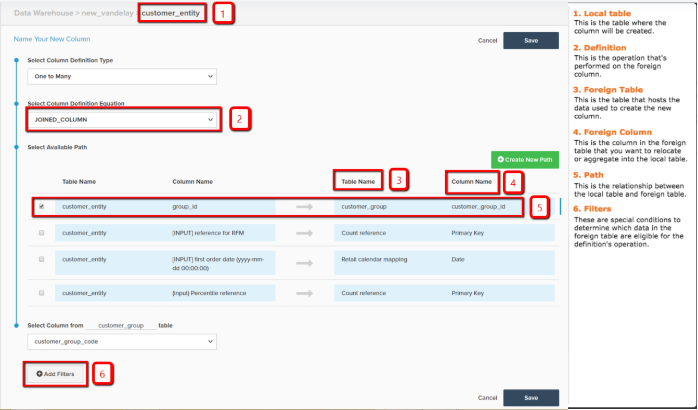

# Berechnete Spaltentypen

* [Gleiche Tabellenberechnungen](#sametable)
* [Eins bis viele Berechnungen](#onetomany)
* [Viele bis eine Berechnungen](#manytoone)
* [Praktische Referenzzuordnung](#map)
* [Erweiterte berechnete Spalten](#advanced)

Innerhalb der [Data Warehouse-Manager](../data-warehouse-mgr/tour-dwm.md)können Sie Spalten erstellen, um Ihre Daten für die Analyse zu erweitern und zu optimieren. [Diese Funktion](../data-warehouse-mgr/creating-calculated-columns.md) Sie können auf eine beliebige Tabelle im Data Warehouse-Manager zugreifen, indem Sie auf **[!UICONTROL Create New Column]**.

Hier werden die Spaltentypen beschrieben, die Sie mit dem Data Warehouse Manager erstellen können. Sie umfasst auch die Beschreibung, einen visuellen Durchgang dieser Spalte und eine [Referenzkarte](#map) aller Eingaben, die zum Erstellen einer Spalte erforderlich sind. Es gibt drei Möglichkeiten, berechnete Spalten zu erstellen:

1. [Dieselbe Tabelle berechnete Spalten](#sametable)
1. [Eins-zu-viele berechnete Spalten](#onetomany)
1. [Zahlreiche berechnete Spalten](#manytoone)

## Dieselbe Tabelle berechnete Spalten {#sametable}

Diese Spalten werden mithilfe von Eingabespalten aus derselben Tabelle erstellt.

### Alter {#age}

Eine Spalte mit dem berechneten Alter gibt die Anzahl der Sekunden zwischen der aktuellen Zeit und einer bestimmten Eingabezeit zurück.

Im folgenden Beispiel wird `Seconds since customer's most recent order` im `customers` Tabelle. Dies kann verwendet werden, um Benutzerlisten von Kunden zu erstellen, die keine Käufe getätigt haben (manchmal auch als &quot;Kurven&quot;bezeichnet) in `X days`.

### Währungsumrechner

Eine Spalte mit Währungsumrechnern konvertiert die native Währung einer Spalte in eine gewünschte neue Währung.

Im folgenden Beispiel wird `base\_grand\_total In AED`, wodurch die `base\_grand\_total` von der nativen Währung zu AED in `sales\_flat\_order` Tabelle. Diese Spalte eignet sich gut für Geschäfte mit mehreren Währungen, die in ihrer Landeswährung gemeldet werden möchten.

Bei Commerce-Clients wird die `base\_currency\_code` -Feld speichert normalerweise die nativen Währungen. Die `Spot Time` sollte mit dem Datum übereinstimmen, das in Ihren Metriken verwendet wird.

## Eins-zu-viele berechnete Spalten {#onetomany}

`One-to-Many` Spalten [Pfad zwischen zwei Tabellen verwenden](../../data-analyst/data-warehouse-mgr/create-paths-calc-columns.md). Dieser Pfad impliziert immer eine einzige Tabelle, in der ein Attribut lebt, und eine viele Tabelle, in der dieses Attribut &quot;nach unten verschoben&quot;wird. Der Pfad kann als `foreign key--primary key` Beziehung.

### Verbundene Spalte {#joined}

Eine verknüpfte Spalte verschiebt ein Attribut auf die eine Tabelle *nach* den vielen Tisch. Das klassische Beispiel von eins/n sind Kunden (eins) und Bestellungen (viele).

Im folgenden Beispiel wird die Variable `Customer's group\_id` Dimension wird in `orders` Tabelle.

## Zahlreiche berechnete Spalten {#manytoone}

Diese Spalten verwenden dieselben Pfade wie Eins-zu-viele-Spalten, weisen aber Daten in die entgegengesetzte Richtung. Die Spalte wird auf der einen Seite des Pfads erstellt, im Gegensatz zu den vielen Seiten. Aufgrund dieser Beziehung muss der Wert in der Spalte eine Aggregation sein, d. h. eine mathematische Operation, die an den Datenpunkten auf der vielen Seite durchgeführt wird. Es gibt viele Anwendungsfälle dafür und einige sind unten aufgeführt.

### Count {#count}

Dieser Typ der berechneten Spalte gibt die Anzahl der Werte für die Viele-Tabelle zurück. *onto* den einen Tisch.

Im folgenden Beispiel wird die Dimension `Customer's lifetime number of canceled orders` wird auf der `customers` -Tabelle (mit einem Filter für `orders.status`).

{: width=&quot;699&quot; height=&quot;351&quot;}

### Summe {#sum}

Eine berechnete Spalte ist die Summe der Werte auf der `many` auf den einen Tisch.

Dies kann verwendet werden, um Dimensionen auf Kundenebene zu erstellen, z. B. `Customer's lifetime revenue`.

### Min. oder Max {#minmax}

Eine berechnete Min.- oder Max.-Spalte gibt den kleinsten oder größten Datensatz zurück, der auf vielen Seiten vorhanden ist.

Dies kann verwendet werden, um Dimensionen auf Kundenebene zu erstellen, z. B. `Customer's first order date`.

### Exists {#exists}

Eine berechnete Spalte ist ein Binärtest, der bestimmt, ob ein Datensatz auf einer Vielzahl von Seiten vorhanden ist. Mit anderen Worten: Die neue Spalte gibt eine `1` wenn der Pfad mindestens eine Zeile in jeder Tabelle verbindet und `0` , wenn keine Verbindung hergestellt werden kann.

Diese Art von Dimension kann beispielsweise bestimmen, ob ein Kunde ein bestimmtes Produkt erworben hat. Verwenden eines Joins zwischen einem `customers` Tabelle und `orders` Tabelle, Filter für ein bestimmtes Produkt, Dimension `Customer has purchased Product X?` kann erstellt werden.

## Praktische Referenzzuordnung {#map}

Wenn Sie beim Erstellen einer berechneten Spalte Schwierigkeiten haben, sich vorzumerken, was alle Eingaben enthalten, halten Sie diese Referenzkarte beim Erstellen bereit:

## Erweiterte berechnete Spalten {#advanced}

Bei Ihrer Suche nach einer Analyse und Beantwortung von Fragen zu Ihrem Unternehmen kann es vorkommen, dass Sie nicht in der Lage sind, die exakte Spalte zu erstellen, die Sie benötigen.

Um eine schnelle Umgehung zu gewährleisten, empfiehlt Adobe, die [Erweiterte berechnete Spaltentypen](../../data-analyst/data-warehouse-mgr/adv-calc-columns.md) Anleitung, um zu sehen, welche Spalten das Adobe-Supportteam erstellen kann. Dieses Thema behandelt auch die Informationen, die Sie zur Erstellung der Spalte benötigen - schließen Sie sie in Ihre Anfrage ein.

## Verwandte Dokumentation

* [Berechnete Spalten erstellen](../../data-analyst/data-warehouse-mgr/creating-calculated-columns.md)
* [Pfade für berechnete Spalten erstellen/löschen](../../data-analyst/data-warehouse-mgr/create-paths-calc-columns.md)
* [Grundlegendes zu und Auswerten von Tabellenbeziehungen](../../data-analyst/data-warehouse-mgr/table-relationships.md)
