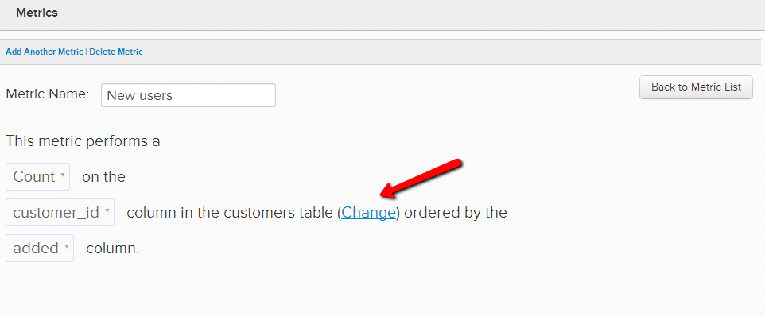
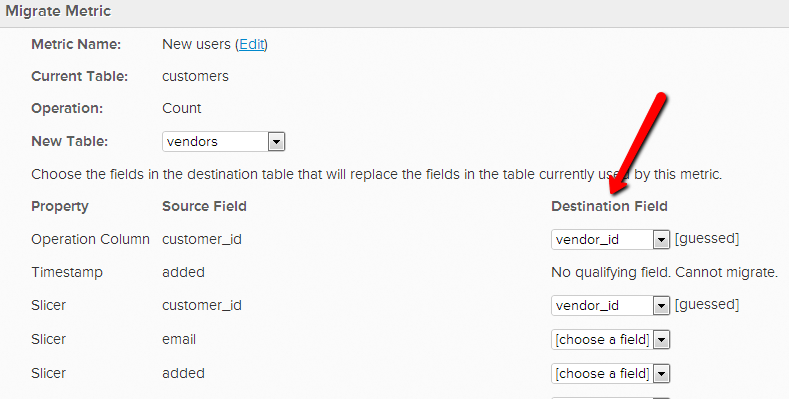
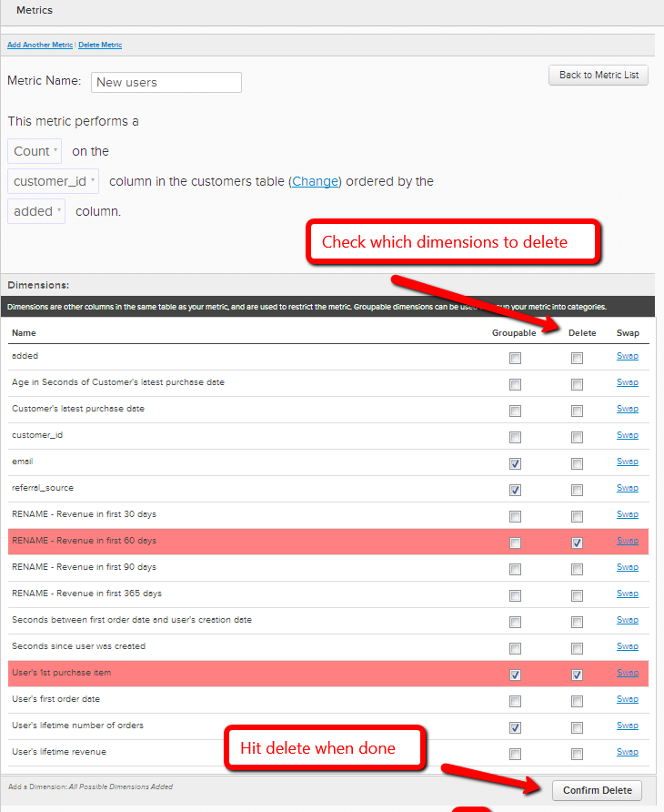

# Operationstabelle einer Metrik ändern

In bestimmten Fällen können Sie sich entscheiden, die Datentabelle zu ändern, die eine Metrik verwendet, um ihren Vorgang auszuführen. Wenn Sie beispielsweise über eine neue Benutzertabelle verfügen, möchten Sie Ihre benutzerbezogenen Metriken aus der `Users\_Old` migrieren, um stattdessen die `Users\_New` zu verwenden.

1. Navigieren Sie zu **[!UICONTROL Data]** > **[!UICONTROL Metrics]**
1. Klicken Sie **[!UICONTROL Edit]** neben der Metrik, für die Sie die `operational` wechseln möchten.
1. Klicken Sie im Editor auf **[!UICONTROL Change]**.

   
1. Wählen Sie die neue Tabelle aus, auf der Sie diese Metrik basieren möchten.
1. Ordnen Sie die vorhandenen Datendimensionen den entsprechenden Dimensionen in der neuen Tabelle zu. Wenn Sie beispielsweise eine Spalte mit dem Namen `User's registration date` haben, wählen Sie einfach aus, welche Spalte in der neuen Tabelle dieselben Datumsdaten aufzeichnet. (Siehe nächster Schritt, wenn die neue Tabelle keine übereinstimmenden Spalten enthält)

   

1. Wenn in der neuen Tabelle keine entsprechende Spalte vorhanden ist, können Sie diese entweder **in Ihrer Datentabelle erstellen** oder [Support kontaktieren](https://experienceleague.adobe.com/en/docs/commerce-knowledge-base/kb/troubleshooting/miscellaneous/mbi-service-policies) wenn es sich um eine von [!DNL Commerce Intelligence] erstellte Berechnungsspalte oder Dimension handelt. Sie können auch **Dimension aus der Metrik löschen**. Um eine nicht mehr benötigte Dimension zu löschen, gehen Sie einfach zurück zum Editor der Metrik und wählen Sie unter `Dimensions` aus, welche Dimensionen gelöscht werden sollen.

   
