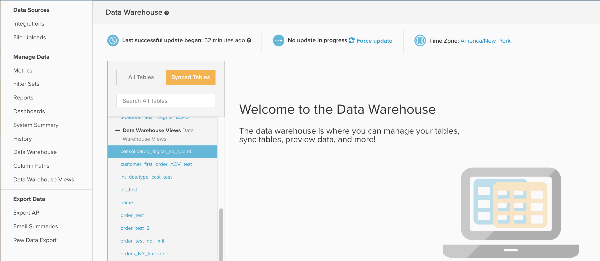

# Arbeiten mit Data Warehouse-Ansichten

In diesem Dokument werden der Zweck und die Verwendungszwecke von `Data Warehouse Views` beschrieben, auf die durch Navigieren zu **[!UICONTROL Manage Data]** > **[!UICONTROL Data Warehouse Views]** zugegriffen werden kann. Im Folgenden finden Sie eine Erläuterung der Funktionen und das Erstellen von Ansichten sowie ein Beispiel für die Verwendung von `Data Warehouse Views` zur Konsolidierung von [!DNL Facebook] und [!DNL AdWords].

## Allgemeiner Zweck

Bei der `Data Warehouse Views`-Funktion handelt es sich um eine Methode zur Erstellung neuer, in einem Warehouse gespeicherter Tabellen, indem eine vorhandene Tabelle geändert oder mehrere Tabellen mithilfe von SQL zusammengefügt oder konsolidiert werden. Nachdem ein `Data Warehouse View` durch einen Aktualisierungszyklus erstellt und verarbeitet wurde, wird es in Ihrer Data Warehouse als neue Tabelle unter der `Data Warehouse Views` Dropdown-Liste ausgefüllt, wie unten dargestellt:



Von hier aus funktioniert Ihre neue Ansicht wie jede andere Tabelle, sodass Sie neue berechnete Spalten erstellen oder Metriken und Berichte darüber erstellen können.

`Data Warehouse Views` werden hauptsächlich verwendet, um mehrere ähnliche, aber unterschiedliche Tabellen zusammenzufassen, sodass alle Berichte auf einer einzigen neuen Tabelle erstellt werden können. Einige gängige Beispiele sind die Konsolidierung der Tabellen aus einer alten Datenbank und einer Live-Datenbank, um historische und aktuelle Daten zu kombinieren, oder die Kombination mehrerer Anzeigenquellen wie Facebook und AdWords in einer einzelnen `Consolidated ad spend`.

Wenn Sie mit SQL vertraut sind, verwenden beide Konsolidierungsbeispiele die Funktion `UNION` , Sie können jedoch beim Erstellen einer neuen Ansicht eine beliebige PostgreSQL-Syntax und -Funktionen verwenden.

## Erstellen und Verwalten von Data Warehouse-Ansichten

Sie können neue `Data Warehouse Views` erstellen und vorhandene Ansichten löschen, indem Sie zu **[!UICONTROL Manage Data]** > **[!UICONTROL Data Warehouse Views]** gehen, wie unten dargestellt:


Von hier aus können Sie eine Ansicht erstellen, indem Sie den folgenden Beispielanweisungen folgen:

1. Wenn Sie eine vorhandene Ansicht betrachten, klicken Sie auf **[!UICONTROL New Data Warehouse View]** , um ein leeres Abfragefenster zu öffnen. Wenn bereits ein leeres Abfragefenster geöffnet ist, fahren Sie mit dem nächsten Schritt fort.
1. Benennen Sie die Ansicht, indem Sie in das Feld `View Name` eingeben. Der hier angegebene Name bestimmt den Anzeigenamen für die Ansicht in der Data Warehouse. `View names` sind auf Kleinbuchstaben, Zahlen und Unterstriche (_) beschränkt. Alle anderen Zeichen sind verboten.
1. Geben Sie Ihre Abfrage im Fenster mit dem Titel `Select Query` ein. Verwenden Sie dabei die standardmäßige PostgreSQL-Syntax.

   >[!NOTE]
   >
   >Ihre Abfrage muss auf bestimmte Spaltennamen verweisen. Die Verwendung des `*`Zeichens &quot;&quot; zur Auswahl aller Spalten ist nicht zulässig.

1. Wenn Sie fertig sind, klicken Sie auf **[!UICONTROL Save]** , um Ihre Ansicht zu speichern. Ihre Ansicht hat vorübergehend einen `Pending` Status, bis sie vom nächsten vollständigen Aktualisierungszyklus verarbeitet wird. Ab diesem Zeitpunkt ändert sich der Status in `Active`. Nachdem sie durch eine Aktualisierung verarbeitet wurde, kann Ihre Ansicht in Berichten verwendet werden.

Beachten Sie, dass nach dem Speichern die zugrunde liegende Abfrage, die zum Generieren eines `Data Warehouse View` verwendet wird, nicht bearbeitet werden kann. Wenn Sie die Struktur einer `Data Warehouse View` anpassen müssen, müssen Sie eine Ansicht erstellen und alle berechneten Spalten, Metriken oder Berichte manuell von der ursprünglichen Ansicht zur neuen migrieren. Nach Abschluss der Migration können Sie die Originalansicht sicher löschen. Da `Data Warehouse Views` nicht bearbeitbar sind, empfiehlt Adobe, die Ausgabe Ihrer Abfrage mit dem `SQL Report Builder` zu testen, bevor Sie Ihre Abfrage als Data Warehouse-Ansicht speichern.

## Beispiel: Daten [!DNL Facebook] und [!DNL Google AdWords]

Sehen Sie sich eines der zuvor in diesem Artikel erwähnten Beispiele genauer an: die Konsolidierung von [!DNL Facebook] und [!DNL AdWords] Ausgabendaten in einer neuen konsolidierten Werbetabelle. In den meisten Fällen umfasst dies die Konsolidierung von zwei Tabellen mit Beispieldatensätzen unten:

`Ad source: Google AdWords`

`Table name: campaigns67890`

`Sample data:`

| **`_id`** | **`campaign`** | **`adClicks`** | **`date`** | **`impressions`** | **`adCost`** |
|--- |--- |--- |--- |--- |--- |
| 1 | EEE | 60 | 05.05.2017 00:00:00 | 2000 | 10,2 |
| 2 | Ogg | 40 | 23.05.2017 00:00:00 | 900 | 4,6 |
| 3 | AAA | 22 | 12.06.2017 00:00:00 | 400 | 2,5 |
| 4 | EEE | 350 | 30.06.2017 00:00:00 | 14500 | 35 |
| 5 | FFF | 280 | 10.07.2017 00:00:00 | 10200 | 28,5 |

`Ad source: Facebook`

`Table name: facebook_ads_insights_12345`

`Sample data:`

| **`_id`** | **`campaign`** | **`adClicks`** | **`date`** | **`impressions`** | **`adCost`** |
|--- |--- |--- |--- |--- |--- |
| 1 | AAA | 25 | 01.05.2017 00:00:00 | 1200 | 5 |
| 2 | DDd | 12 | 15.05.2017 00:00:00 | 800 | 2,5 |
| 3 | AAA | 40 | 22.05.2017 00:00:00 | 2000 | 7 |
| 4 | AAA | 110 | 08.06.2017 00:00:00 | 6000 | 10 |
| 5 | CCC | 5 | 06.07.2017 00:00:00 | 300 | 1,2 |

Um eine einzelne Ausgabentabelle für Anzeigen zu erstellen, die sowohl [!DNL Facebook]- als auch [!DNL Google AdWords]-Kampagnen enthält, müssen Sie eine SQL-Abfrage schreiben und die `UNION ALL`-Funktion verwenden. Eine `UNION ALL`-Anweisung wird meist verwendet, um mehrere verschiedene SQL-Abfragen zu kombinieren und dabei die Ergebnisse jeder Abfrage an eine einzelne Ausgabe anzuhängen.

Es gibt einige Anforderungen an eine `UNION` Anweisung, die es wert ist, erwähnt zu werden, wie in der PostgreSQL-Dokumentation [beschrieben](https://www.postgresql.org/docs/8.3/queries-union.html):

* Alle Abfragen müssen dieselbe Anzahl von Spalten zurückgeben
* Die entsprechenden Spalten müssen identische Datentypen haben

Beim Ausführen einer `UNION`- oder `UNION ALL`-Anweisung spiegeln die Namen der Spalten in der endgültigen Ausgabe die Benennung der Spalten in der ersten Abfrage wider.

Für die Konsolidierung Ihrer [!DNL Facebook]- und [!DNL Google AdWords]-Ausgabendaten in einer `Data Warehouse View` ist in der Regel die Erstellung einer Tabelle mit sieben Spalten mit einer Abfrage ähnlich der folgenden erforderlich:

```sql
    SELECT
        "_id" as id,
        'AdWords' as ad_source,
        "date",
        "campaign",
        "adCost" as spend,
        "impressions",
        "adClicks" as clicks
    FROM campaigns67890
    UNION
    SELECT
        "_id" as id,
        'Facebook' as ad_source,
        "date_start" as date,
        "campaign_name" as campaign,
        "spend",
        "impressions",
        "clicks"
    FROM facebook_ads_insights_12345
```

Einige wichtige Punkte zu den oben genannten Punkten:

* Aus Gründen der Klarheit werden alle Spalten oben so aliastiert, dass die Namen in allen Abfragen übereinstimmen. Dies ist jedoch keine Voraussetzung. Die Reihenfolge, in der die Spalten in den SELECT-Abfragen aufgerufen werden, bestimmt, wie sie angeordnet werden.
* Eine neue Spalte mit dem Namen `ad_source` wird erstellt, um das Filtern nach [!DNL AdWords] oder [!DNL Facebook] Daten zu vereinfachen. Beachten Sie, dass diese Abfrage alle Daten aus beiden Tabellen kombiniert. Wenn Sie keine Spalte wie `ad_source` erstellen, gibt es keine einfache Möglichkeit, Ausgaben aus einer bestimmten Quelle zu identifizieren.

Beim Speichern der obigen Abfrage als `Data Warehouse View` wird eine Tabelle mit den Ausgaben für [!DNL Facebook] und [!DNL AdWords] erstellt, ähnlich wie unten dargestellt:

| **`id`** | **`ad_source`** | **`date`** | **`campaign`** | **`spend`** | **`impressions`** | **`clicks`** |
|--- |--- |--- |--- |--- |--- |--- |
| **1** | [!DNL Facebook] | 01.05.2017 00:00:00 | AAA | 5 | 1200 | 25 |
| **1** | [!DNL Google AdWords] | 05.05.2017 00:00:00 | EEE | 10,2 | 2000 | 60 |
| **2** | [!DNL Facebook] | 15.05.2017 00:00:00 | DDd | 2,5 | 800 | 12 |
| **2** | [!DNL Google AdWords] | 23.05.2017 00:00:00 | Ogg | 4,6 | 900 | 40 |
| **3** | [!DNL Facebook] | 22.05.2017 00:00:00 | AAA | 7 | 2000 | 40 |
| **3** | [!DNL Google AdWords] | 12.06.2017 00:00:00 | AAA | 2,5 | 400 | 22 |
| **4** | [!DNL Facebook] | 08.06.2017 00:00:00 | AAA | 10 | 6000 | 110 |
| **4** | [!DNL Google AdWords] | 30.06.2017 00:00:00 | EEE | 35 | 14500 | 350 |
| **5** | [!DNL Facebook] | 06.07.2017 00:00:00 | CCC | 1,2 | 300 | 5 |
| **5** | [!DNL Google AdWords] | 10.07.2017 00:00:00 | FFF | 28,5 | 10200 | 280 |

Anstatt für jede Anzeigenquelle einen separaten Satz von Marketing-Metriken zu erstellen, können Sie mit der obigen Tabelle nur einen einzigen Satz von Metriken erstellen, um alle Ihre Anzeigen zu erfassen.

**Suchen Sie zusätzliche Hilfe?**

Das Schreiben von SQL und das Erstellen von `Data Warehouse Views` ist nicht im Lieferumfang des technischen Supports enthalten. Das [Services-Team](https://experienceleague.adobe.com/docs/commerce-knowledge-base/kb/troubleshooting/miscellaneous/mbi-service-policies.html) bietet jedoch Unterstützung bei der Erstellung von Ansichten an. Das Supportteam kann Ihnen bei allen Fragen behilflich sein, von der Migration einer alten Datenbank mit einer neuen Datenbank bis zur Erstellung einer einzigen Data Warehouse-Ansicht für bestimmte Analysezwecke.

Normalerweise erfordert die Erstellung eines neuen `Data Warehouse View` für die Konsolidierung von 2-3 ähnlich strukturierten Tabellen fünf Stunden Service-Zeit, was etwa 1.250 US-Dollar Arbeit entspricht. Im Folgenden finden Sie jedoch einige häufige Faktoren, die die erwarteten erforderlichen Investitionen erhöhen können:

* Konsolidierung von mehr als drei Tabellen in einer Ansicht
* Erstellung von mehr als einer Data Warehouse-Ansicht
* Komplexe Verbindungs- oder Filterbedingungen
* Konsolidierung von zwei oder mehr Tabellen mit unterschiedlichen Datenstrukturen
