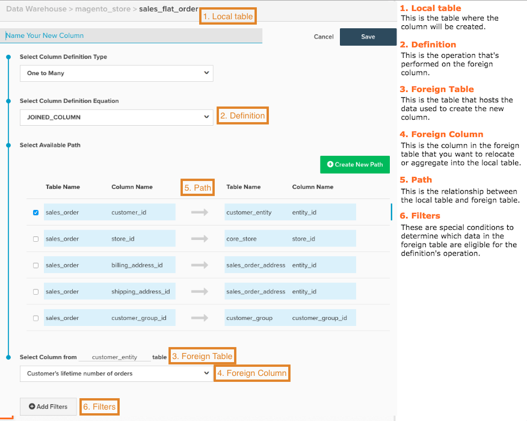

# Berechnete Spalten erstellen

Bei der Analyse Ihrer Daten ist es hilfreich, Daten aus verschiedenen Quellen zu konsolidieren. Möchten Sie den Umsatz nach Akquise-Quelle gruppieren, die Daten aus Ihrer `orders`-Tabelle verknüpfen und Daten [!DNL Google Analytics]? Vielleicht möchten Sie den Umsatz nach Kundengeschlecht gruppieren oder einem Kundenattribut Transaktionsdaten für die Segmentierung hinzufügen. In diesem Thema wird erläutert, wie Sie genau dies tun können.

Bevor Sie beginnen, empfiehlt Adobe, das [Handbuch für berechnete Spaltentypen](../../data-analyst/data-warehouse-mgr/calc-column-types.md) zu lesen, um Informationen über die Spaltentypen zu erhalten, die Sie in Data Warehouse Manager erstellen können, einschließlich der Definitionen und Beispiele.

1. Um zu beginnen, klicken Sie auf **[!DNL Manage Data > Data Warehouse]**.

1. Klicken Sie auf die Tabelle, in der Sie eine Spalte erstellen möchten. Wenn Sie beispielsweise eine `Customer Gender` Spalte für die Umsatzsegmentierung erstellen möchten, wählen Sie die Tabelle `sales_flat_order` aus.

1. Das Tabellenschema wird angezeigt. Klicken Sie auf **[!UICONTROL Create New Column]**.

1. Geben Sie der Spalte einen Namen. Beispiel: `Customer Gender`.

1. Wählen Sie die Definition für die Spalte aus. Hier ist die [Anleitung für berechnete Spaltentypen](../data-warehouse-mgr/calc-column-types.md) praktisch!

1. Bei bestimmten Spaltentypen sind etwas mehr Informationen erforderlich, um die Spalte ordnungsgemäß zu erstellen:

   * Für `One to Many` (verbundene) und `Many to One` (aggregierte) Spalten müssen Sie die Tabellen und Spalten auswählen.

   * Für einen `Same Table calculation` müssen Sie das gewünschte Datumsfeld aus der Dropdown-Liste auswählen.

Wenn Sie eine `One to Many` (verbundene) oder `Many to One` (aggregierte) Spalte erstellen, müssen Sie einen Pfad auswählen, um die beiden Tabellen zu verbinden. In diesem Schritt können Sie entweder einen vorhandenen Pfad verwenden oder einen erstellen.

>[!NOTE]
>
>Denken Sie daran, die Tabelle richtig als viele oder eine zu definieren!

* Bei Bedarf können Sie [Filter](../../data-user/reports/ess-manage-data-filters.md) auf die neue Spalte anwenden.

* Klicken Sie abschließend auf **[!UICONTROL Save]**.

Ihre neue Spalte wird in der aktuellen Tabelle mit dem Status `Pending` angezeigt. Nach Abschluss der nächsten Aktualisierung ist Ihre Spalte für die Verwendung in Metriken und Berichten verfügbar.

## Praktische Referenzkarte {#map}

Wenn Sie beim Erstellen einer berechneten Spalte Schwierigkeiten haben, sich an alle Eingaben zu erinnern, versuchen Sie, diese Referenzzuordnung beim Erstellen von praktisch zu halten:

## Verwandte Dokumentation

* [Berechnete Spaltentypen](../data-warehouse-mgr/calc-column-types.md)
* [Erweiterte berechnete Spaltentypen](../data-warehouse-mgr/adv-calc-columns.md)
* [&#x200B; [!DNL Google ECommerce]  mit Bestell- und Kundendaten](../data-warehouse-mgr/bldg-google-ecomm-dim.md)
