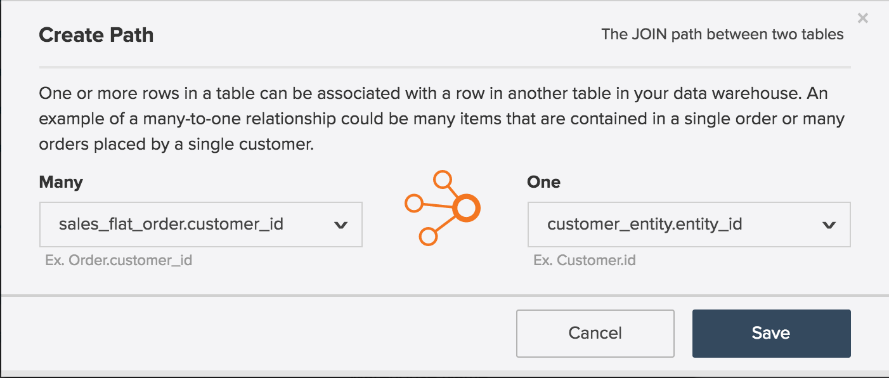
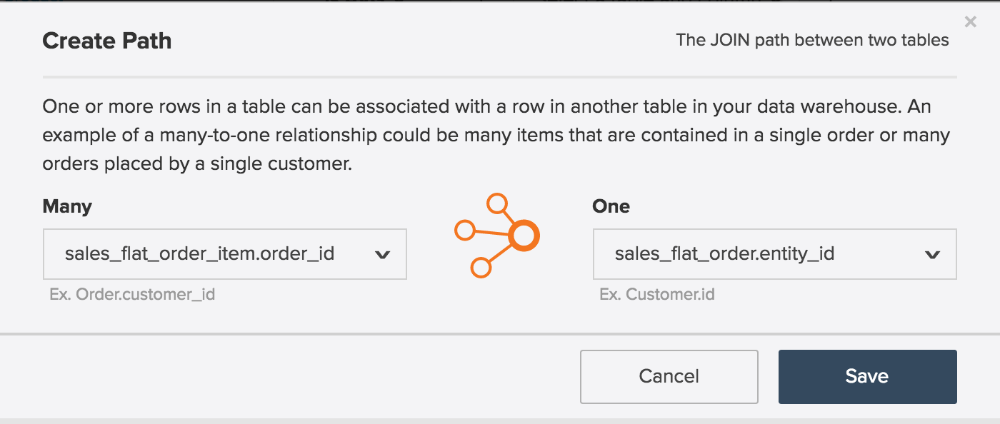

# Entitätsbeziehungsdiagramm

What is an **[!UICONTROL entity relationship (ER) diagram]**? An [!UICONTROL ER] diagram is a visualization of tables within a database and how they relate to each other. This topic contains a few [!UICONTROL ER] diagrams to help you visualize the relationship between a few common Adobe Commerce database tables.

>[!NOTE]
>
>In diesem Thema werden die Wörter **Join**, **relation** und **path** angezeigt. Diese Wörter werden alle verwendet, um zu beschreiben, wie zwei Tabellen verbunden sind.

## Commerce-[!UICONTROL ER]

Dieses `ER` stellt die Beziehungen zwischen den Kerntabellen in einer Commerce-Datenbank dar. Wenn Sie mehrere Beziehungen gleichzeitig betrachten, können Sie sehen, wie sich Daten über viele Tabellen hinweg verhalten würden.

Die folgenden Abschnitte enthalten `ER` Diagramme, die jeweils für zwei Tabellen spezifisch sind. Um ein Diagramm und die zugehörige Beschreibung anzuzeigen, klicken Sie auf die Kopfzeile für diesen Abschnitt.

## `customer\_entity & sales\_flat\_order`

Ein Kunde kann viele Bestellungen aufgeben. Die Beziehung zwischen diesen beiden Tabellen ist `customer\_entity.entity\_id = sales\_flat\_order.customer\_id`

>[!IMPORTANT]
>
>`customer\_entity.entity\_id` does not equal `sales\_flat\_order.entity\_id`. The first can be thought of as a `customer\_id` and the second can be thought of as an `order\_id.`

Wenn der Pfad zwischen diesen beiden Tabellen in [!DNL Commerce Intelligence] nicht vorhanden ist, können Sie [den Pfad erstellen](../data-warehouse-mgr/create-paths-calc-columns.md) auf der Registerkarte Data Warehouse . Wenn Sie bereit sind, den Pfad zu erstellen, wird er wie folgt definiert:

## `sales\_flat\_order & sales\_flat\_order\_item`

Eine Bestellung kann viele Artikel enthalten. Die Beziehung zwischen diesen beiden Tabellen ist `sales\_flat\_order.entity\_id = sales\_flat\_order\_item.order\_id`.

Wenn der Pfad zwischen diesen beiden Tabellen in [!DNL Commerce Intelligence] nicht vorhanden ist, können Sie [den Pfad erstellen](../data-warehouse-mgr/create-paths-calc-columns.md) auf der Registerkarte Data Warehouse . Wenn Sie bereit sind, den Pfad zu erstellen, definieren Sie ihn wie unten gezeigt.

## `catalog\_product\_entity & sales\_flat\_order\_item`

One product can be purchased many items. Die Beziehung zwischen diesen beiden Tabellen ist `catalog\_product\_entity.entity\_id = sales\_flat\_order\_item.product`.

Wenn der Pfad zwischen diesen beiden Tabellen in [!DNL Commerce Intelligence] nicht vorhanden ist, können Sie [den Pfad erstellen](../data-warehouse-mgr/create-paths-calc-columns.md) auf der Registerkarte Data Warehouse . Wenn Sie bereit sind, den Pfad zu erstellen, definieren Sie ihn wie unten gezeigt.

