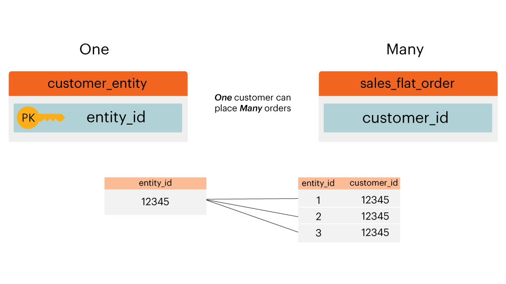

# Diagramm zur Entitätsbeziehung

Was ist ein **[!UICONTROL entity relationship (ER) diagram]**? Ein [!UICONTROL ER] -Diagramm ist eine Visualisierung von Tabellen in einer Datenbank und deren Beziehung zueinander. Dieses Thema enthält einige [!UICONTROL ER]-Diagramme, mit denen Sie die Beziehung zwischen einigen häufigen Adobe Commerce-Datenbanktabellen visualisieren können.

>[!NOTE]
>
>In diesem Thema sehen Sie die Wörter **join**, **relation** und **path**. Anhand dieser Wörter wird beschrieben, wie zwei Tabellen miteinander verbunden sind.

## Diagramm Commerce [!UICONTROL ER]

Dieses Diagramm zeigt die Beziehungen zwischen den Kerntabellen einer Commerce-Datenbank. `ER` Indem Sie mehrere Beziehungen gleichzeitig anzeigen, können Sie sehen, wie sich Daten auf viele Tabellen beziehen würden.

Die folgenden Abschnitte enthalten `ER` Diagramme, die jeweils für zwei Tabellen spezifisch sind. Um ein Diagramm und die zugehörige Beschreibung anzuzeigen, klicken Sie auf die Kopfzeile für diesen Abschnitt.

## `customer\_entity & sales\_flat\_order`

Ein Kunde kann viele Bestellungen tätigen. Die Beziehung zwischen diesen beiden Tabellen ist `customer\_entity.entity\_id = sales\_flat\_order.customer\_id`

>[!IMPORTANT]
>
>`customer\_entity.entity\_id` entspricht nicht `sales\_flat\_order.entity\_id`. Die erste kann als `customer\_id` und die zweite als `order\_id.` betrachtet werden

Wenn innerhalb von [!DNL Commerce Intelligence] der Pfad zwischen diesen beiden Tabellen nicht vorhanden ist, können Sie [den Pfad](../data-warehouse-mgr/create-paths-calc-columns.md) auf der Registerkarte &quot;Data Warehouse&quot;erstellen. Wenn Sie bereit sind, den Pfad zu erstellen, wird er wie folgt definiert:

## `sales\_flat\_order & sales\_flat\_order\_item`

Eine Bestellung kann viele Elemente enthalten. Die Beziehung zwischen diesen beiden Tabellen ist `sales\_flat\_order.entity\_id = sales\_flat\_order\_item.order\_id`.

Wenn innerhalb von [!DNL Commerce Intelligence] der Pfad zwischen diesen beiden Tabellen nicht vorhanden ist, können Sie auf der Registerkarte &quot;Data Warehouse&quot;den Pfad [erstellen](../data-warehouse-mgr/create-paths-calc-columns.md). Wenn Sie bereit sind, den Pfad zu erstellen, definieren Sie den Pfad wie unten dargestellt.

## `catalog\_product\_entity & sales\_flat\_order\_item`

Ein Produkt kann viele Artikel gekauft werden. Die Beziehung zwischen diesen beiden Tabellen ist `catalog\_product\_entity.entity\_id = sales\_flat\_order\_item.product`.

Wenn innerhalb von [!DNL Commerce Intelligence] der Pfad zwischen diesen beiden Tabellen nicht vorhanden ist, können Sie [den Pfad](../data-warehouse-mgr/create-paths-calc-columns.md) auf der Registerkarte &quot;Data Warehouse&quot;erstellen. Wenn Sie bereit sind, den Pfad zu erstellen, definieren Sie den Pfad wie unten dargestellt.

