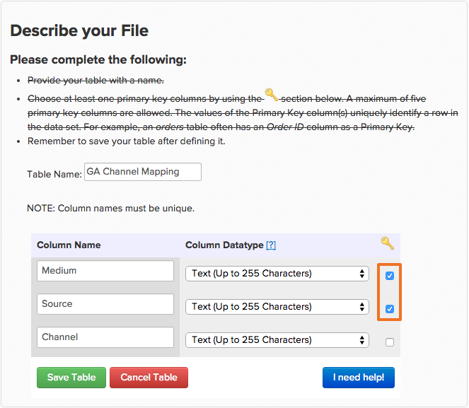

# [!DNL Google Analytics] mithilfe von Akquise-Quellen

## Was sind Kanäle? {#channels}

Das Erstellen benutzerdefinierter Segmente, um zu sehen, wie unterschiedlich der Traffic funktioniert und Trends zu beobachten, ist eine der leistungsfähigsten Verwendungen für [!DNL Google Analytics]. Eine Klasse von Segmenten, die standardmäßig in [!DNL Google Analytics] vorhanden sind, wird `Channels`. Kanäle sind eine Gruppierung allgemeiner Methoden, mit denen Personen zu Ihrer Site gelangen.  [!DNL Google Analytics] sortiert automatisch die vielen Möglichkeiten, wie Sie eine Benutzerin oder einen Benutzer gewinnen können - seien es soziale Medien, Pay-per-Click, E-Mail oder Verweis-Links - und bündelt sie in einem Behälter oder Kanal.

## Warum sehe ich meine `channels` nicht in Commerce Intelligence? {#nochannels}

`Channels` sind einfache, aggregierte Behälter von Daten. Um Ihre Akquisen in Kanal-Buckets zu sortieren, legt [!DNL Google] mithilfe bestimmter Parameter verschiedene Regeln und Definitionen fest: eine Kombination aus Akquise [Source](https://support.google.com/analytics/answer/1033173?hl=en) (die Herkunft Ihres Traffics) und Akquise [Medium](https://support.google.com/analytics/answer/6099206?hl=en) (die allgemeine Quellkategorie).

Mit diesen Buckets können Sie sich ein Bild davon machen, woher Ihr Traffic kommt. Diese Daten werden jedoch nicht nach Kanal, sondern durch eine Kombination aus Source und Medium getaggt. Da [!DNL Google] Kanalinformationen als zwei separate Datenpunkte sendet, werden Kanalgruppierungen nicht automatisch in [!DNL Commerce Intelligence] angezeigt.

## Was sind die standardmäßigen Kanalgruppierungen? Wie werden sie erstellt?

Standardmäßig richtet [!DNL Google] acht verschiedene Kanäle ein. Nachfolgend finden Sie die Regeln, die bestimmen, wie Kanäle erstellt werden.

| **channel** | **Was ist das?** | **Wie wird sie erstellt?** |
|---|---|---|
| Direkt | Jeder, der direkt auf Ihre Site kommt. | Source = `Direct` UND Medium = `(not set); OR Medium = (none)` |
| Organische Suche | Traffic, der organisch in unbezahlten Suchmaschinen eingestuft wurde. | Medium = `organic` |
| Empfehlung | Traffic, der von einem externen Link kommt, bei dem es sich nicht um eine organische Suche handelt, oder von Websites, die keine sozialen Netzwerke sind. | Medium = `referral` |
| Paid Search | Traffic mit einem UTM-Trackingcode, bei dem das Medium entweder „cpc“, „pc“ oder „paidSearch“ ist UND ein Werbenetzwerk ist, das nicht mit „Content“ übereinstimmt. | Medium = `^(cpc|ppc|paidsearch)$` UND-Werbenetzwerk ≠ `Content` |
| Sozial | Empfehlungs-Traffic, der von einem von ca. [400 sozialen ](https://www.annielytics.com/blog/analytics/sites-google-analytics-includes-in-social-reports/) kommt und nicht als Anzeigen getaggt sind. | Empfehlung für Social Source = `Yes` ODER Medium = `^(social|social-network|social-media|sm|social network|social media)$` |
| E-Mail | Traffic von Sitzungen, die mit einem Medium von „E-Mail“ getaggt sind. | UTM-Trackingcode von Medium = `email` |
| Anzeige | Traffic mit einem UTM-Trackingcode, bei dem das Medium entweder display oder cpm ist. Umfasst auch AdWords-Interaktionen, bei denen das Anzeigenverteilungsnetzwerk mit „Inhalt“ übereinstimmt | Medium = `^(display|cpm|banner)$` ODER Anzeigenverteilungsnetzwerk = `Content` UND Anzeigenformat ≠ `Text` |
| Sonstige | Sitzungen von anderen Werbekanälen (ohne Paid Search), die mit einem Medium von „cpc“, „ppc“, „cpm“, „cpv“, „cpa“, „cpp“, „Affiliate“ getaggt sind. | Medium = `^(cpv|cpa|cpp|content-text)$` |

{style="table-layout:auto"}

## Wie kann ich diese Kanalgruppierungen in meiner Data Warehouse neu erstellen? {#recreate}

Da Sie nun wissen, dass Kanäle nur noch Kombinationen aus Quellen und Medien sind, ist es ein einfacher, dreistufiger Prozess, diese Gruppierungen in Ihrer Data Warehouse neu zu erstellen.

1. **Integration [!DNL Google ECommerce]aktivieren**

   [Wenn aktiviert](../importing-data/integrations/google-ecommerce.md), stellen Sie sicher, [synchronisieren]&#x200B;(../{{ site.baseurl }}/data-analyst/data-warehouse-mgr/tour-dwm.html#syncing) die Felder **medium** und **source** in Ihrer Data Warehouse. Nach Abschluss dieses Vorgangs werden Medium- und Quellakquisitionsdaten in Ihre Data Warehouse eingebracht.

1. **Laden Sie eine Zuordnung der Kanalgruppierungen von Google hoch**

   Adobe Commerce erstellt eine Tabelle mit den Standardgruppierungen, die als Datei zugeordnet sind und die Sie [herunterladen](../../assets/ga-channel-mapping.csv) können.

   Wenn Sie [!DNL Google Analytics] sind und Ihre eigenen Kanäle erstellt haben, möchten Sie Ihre spezifischen Regeln zur Zuordnungstabelle hinzufügen, bevor Sie die Datei in [!DNL Commerce Intelligence] hochladen.

   Bringen Sie es als [-Upload in Ihre Data Warehouse](../importing-data/connecting-data/using-file-uploader.md).

   

1. **Beziehung zwischen Zuordnungen und [!DNL Google ECommerce]-Upload herstellen**

   Um eine Beziehung zwischen dem [!DNL Google ECommerce] und der Zuordnungstabelle herzustellen, [ Sie eine Support-Anfrage ](../../guide-overview.md#Submitting-a-Support-Ticket) Ihr Datenanalyst-Team und verweisen Sie auf dieses Thema. Der Analyst erstellt eine neue berechnete Spalte mit dem Namen **Channel** in der ECommerce-Tabelle. **Nach einem vollständigen** kann diese Spalte in einer `Filter` oder `Group by` verwendet werden.

Sie haben jetzt [!DNL Google Analytics Channel] Gruppierungen in Ihrer Data Warehouse, was bedeutet, dass Sie Ihre Daten aus einer neuen Perspektive analysieren können:

In diesem Beispiel haben Sie einfach mit der Segmentierung der Metrik **Anzahl der Bestellungen** nach **Kanal** begonnen. Testen Sie Ihre neue Spalte und sehen Sie, welche Trends Sie in Ihren [!DNL Google Analytics Channel] identifizieren können!

## Verwandte Dokumentation

* [Verwenden von Report Builder](../../tutorials/using-visual-report-builder.md)
* [[!DNL Google ECommerce] Daten](../importing-data/integrations/google-ecommerce-data.md)
* [[!DNL Google ECommerce] mit Bestell- und Kundendaten](../data-warehouse-mgr/bldg-google-ecomm-dim.md)
* [Welche sind Ihre wertvollsten Akquisitionsquellen und -kanäle?](../analysis/most-value-source-channel.md)
