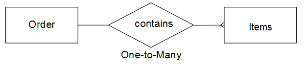

# Verstehen und Auswerten von Tabellenbeziehungen

Bei der Bewertung der Beziehung zwischen zwei gegebenen Tabellen müssen Sie verstehen, wie viele mögliche Vorkommen in einer Tabelle zu einer Entität in einer anderen gehören könnten und umgekehrt. Verwenden Sie beispielsweise eine `users` und eine `orders`. In diesem Fall möchten Sie wissen, wie viele **Bestellungen** ein bestimmter **Benutzer** aufgegeben hat und wie viele **Benutzer** eine **Bestellung** gehören könnte.

Das Verständnis von Beziehungen ist für die Aufrechterhaltung der Datenintegrität von entscheidender Bedeutung, da es die Genauigkeit Ihrer [berechneten Spalten](../data-warehouse-mgr/creating-calculated-columns.md) und [Dimensionen](../data-warehouse-mgr/manage-data-dimensions-metrics.md) beeinflusst. Weitere Informationen finden Sie unter [Beziehungstypen](#types) und [Auswerten der Tabellen in Ihrer Data Warehouse.](#eval)

## Beziehungstypen {#types}

Es gibt drei Arten von Beziehungen, die zwischen zwei Tabellen bestehen können:

1. [`Eins-zu-eins`](#onetoone)
1. [`one-to-many`](#onetomany)
1. [`Viele-zu-viele`](#manytomany)

### `One-to-One` {#onetoone}

In einer `one-to-one` Beziehung gehört ein Datensatz in Tabelle `B` nur zu einem Datensatz in Tabelle `A`. Ein Datensatz in Tabelle `A` gehört nur zu einem Datensatz in Tabelle `B`.

Beispielsweise kann eine Person in der Beziehung zwischen Personen- und Führerscheinnummern nur eine Führerscheinnummer haben, und eine Führerscheinnummer gehört nur zu einer Person.

### `One-to-Many` {#onetomany}

In einer `one-to-many` kann ein Datensatz in der Tabelle `A` zu mehreren Datensätzen in der Tabelle `B` gehören. Denken Sie an die Beziehung zwischen `orders` und `items`. Eine Bestellung kann viele Artikel enthalten, aber ein Artikel gehört zu einer einzigen Bestellung. In diesem Fall ist der `orders` die eine Seite und der `items` die viele Seite.

### `Many-to-Many` {#manytomany}

In einer `many-to-many` kann ein Datensatz in der Tabelle `B` zu mehreren Datensätzen in der Tabelle `A` gehören. Umgekehrt kann ein Datensatz in Tabelle `A` zu mehreren Datensätzen in Tabelle `B` gehören.

Denken Sie an die Beziehung zwischen **Produkten** und **Kategorien**: Ein Produkt kann zu vielen Kategorien gehören, und eine Kategorie kann viele Produkte enthalten.

## Auswerten von Tabellen {#eval}

Angesichts der zwischen Tabellen bestehenden Beziehungstypen können Sie lernen, wie Sie die Tabellen in Ihrer Data Warehouse auswerten können. Da diese Beziehungen bestimmen, wie berechnete Spalten mit mehreren Tabellen definiert werden, ist es wichtig, dass Sie verstehen, wie Sie Tabellenbeziehungen identifizieren und zu welcher Seite - `one` oder `many` - die Tabelle gehört.

Es gibt zwei Methoden, mit denen Sie die Beziehungen eines bestimmten Tabellenpaars in Ihrer Data Warehouse auswerten können. Die erste Methode verwendet ein [konzeptionelles Framework](#concept) das berücksichtigt, wie die Entitäten der Tabelle miteinander interagieren. Die zweite Methode verwendet das [Tabellenschema](#schema).

### Verwenden des Konzeptrahmens {#concept}

Diese Methode verwendet ein konzeptionelles Framework, um zu beschreiben, wie Entitäten in den beiden Tabellen miteinander interagieren können. Es ist wichtig zu verstehen, dass dieser Rahmen bewertet, was angesichts der Beziehung möglich ist.

Berücksichtigen Sie beispielsweise bei der Betrachtung von Benutzenden und Bestellungen alles, was in der Beziehung möglich ist. Ein registrierter Benutzer kann innerhalb seines Lebenszyklus keine Bestellungen, nur eine Bestellung oder mehrere Bestellungen aufgeben. Wenn Sie Ihr Geschäft gestartet haben und keine Bestellungen aufgegeben wurden, ist es möglich, dass ein bestimmter Benutzer viele Bestellungen in seinem Leben aufgeben kann. Die Tische sind entsprechend aufgestellt.

So verwenden Sie diese Methode:

1. Identifizieren Sie die in den einzelnen Tabellen beschriebene Entität. **Hinweis: Es ist normalerweise ein Substantiv**. Beispielsweise beschreiben die `user`- und `orders`-Tabellen explizit Benutzer und Bestellungen.

1. Identifizieren Sie ein oder mehrere Verben, die die Interaktion dieser Entitäten beschreiben. Wenn beispielsweise Benutzende mit Bestellungen verglichen werden, „geben“ die Benutzenden Bestellungen auf. In die andere Richtung gehen, Bestellungen „gehören“ zu Benutzern.

Diese Art von Framework kann auf jede Tabellenpaarung in Ihrer Data Warehouse angewendet werden. Auf diese Weise können Sie den Beziehungstyp leicht erkennen und feststellen, welche Tabelle eine Seite und welche Tabelle eine viele Seiten ist.

Nachdem Sie die Terminologie identifiziert haben, die beschreibt, wie die beiden Tabellen interagieren, gestalten Sie die Interaktion in beide Richtungen, indem Sie überlegen, wie sich eine bestimmte Instanz der ersten Entität auf die zweite bezieht. Im Folgenden finden Sie einige Beispiele für jede Beziehung:

### `One-to-One`

Eine bestimmte Person kann nur über eine Führerscheinnummer verfügen. Eine bestimmte Führerscheinnummer gehört nur einer Person.

Dies ist eine `one-to-one` Beziehung, bei der jede Tabelle eine Seite ist.

### `One-to-Many`

Eine bestimmte Bestellung kann möglicherweise viele Artikel enthalten. Ein bestimmter Artikel gehört nur zu einer Bestellung.

Dies ist eine `one-to-many` Beziehung, bei der die Tabelle Bestellungen die eine Seite und die Tabelle Artikel die viele Seite ist.

### `Many-to-Many`

Ein bestimmtes Produkt kann möglicherweise zu vielen Kategorien gehören. Eine bestimmte Kategorie kann möglicherweise viele Produkte enthalten.

Dies ist eine `many-to-many` Beziehung, bei der jede Tabelle eine Viele-Seite ist.

### Verwenden des Tabellenschemas {#schema}

Die zweite Methode verwendet das Tabellenschema . Das Schema definiert, welche Spalten die [`Primary`](https://en.wikipedia.org/wiki/Unique_key)- und [`Foreign`](https://en.wikipedia.org/wiki/Foreign_key) sind. Mithilfe dieser Schlüssel können Sie Tabellen verknüpfen und Beziehungstypen bestimmen.

Nachdem Sie die Spalten identifiziert haben, die zwei Tabellen miteinander verknüpfen, verwenden Sie die Spaltentypen , um die Tabellenbeziehung auszuwerten. Im Folgenden finden Sie einige Beispiele:

### `One-to-one`

Wenn die Tabellen mithilfe der `primary key` beider Tabellen verknüpft sind, wird in jeder Tabelle dieselbe eindeutige Entität beschrieben und die Beziehung `one-to-one`.

Beispielsweise kann eine `users`-Tabelle die meisten Benutzerattribute (z. B. den Namen) erfassen, während eine zusätzliche `user_source`-Tabelle die Quellen der Benutzerregistrierung erfasst. In jeder Tabelle steht eine Zeile für einen Benutzer.

### `One-to-many`

>[!NOTE]
>
>Akzeptieren Sie Gastbestellungen? Unter [Gastaufträge](../data-warehouse-mgr/guest-orders.md) erfahren Sie, wie sich Gastaufträge auf Ihre Tabellenbeziehungen auswirken können.

Wenn Tabellen mithilfe eines `Foreign key` verknüpft werden, der auf eine `primary key` verweist, beschreibt diese Einrichtung eine `one-to-many`. Die eine Seite ist die Tabelle, die die `primary key` enthält, und die viele Seite ist die Tabelle, die die `foreign key` enthält.

### `Many-to-many`

Wenn einer der folgenden Punkte zutrifft, wird die Beziehung `many-to-many`:

* `Non-primary key` Spalten werden zur Verknüpfung von zwei Tabellen verwendet
  
* Ein Teil eines zusammengesetzten `primary key` wird verwendet, um zwei Tabellen zu verknüpfen

## Nächste Schritte

Die korrekte Bewertung von Tabellenbeziehungen ist für die genaue Modellierung Ihrer Daten von entscheidender Bedeutung. Nachdem Sie nun wissen, wie Tabellen miteinander verknüpft sind, lesen Sie [Was Sie mit Data Warehouse Manager tun können](../data-warehouse-mgr/tour-dwm.md).
