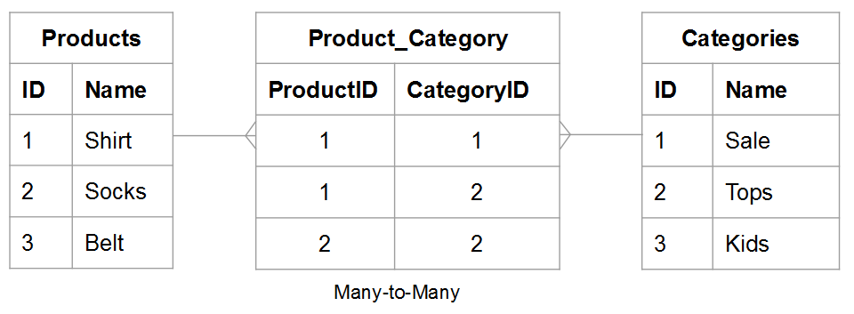
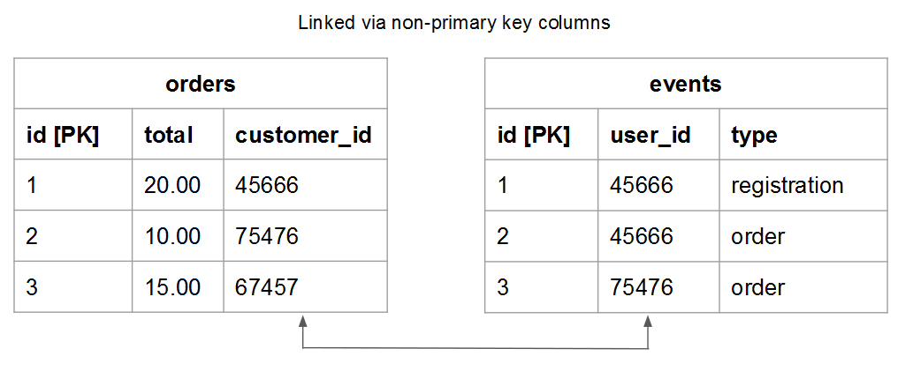

# Tabellenbeziehungen verstehen und auswerten

Bei der Beurteilung der Beziehung zwischen zwei bestimmten Tabellen müssen Sie wissen, wie viele mögliche Vorkommen in einer Tabelle einer Entität in einer anderen zugeordnet werden können, und umgekehrt. Verwenden Sie beispielsweise eine `users` und eine `orders` Tabelle. In diesem Fall möchten Sie wissen, wie viele **Bestellungen** ein **Benutzer** hat platziert und wie viele Möglichkeiten **Benutzer** ein **order** kann gehören.

Das Verständnis der Beziehungen ist für die Wahrung der Datenintegrität von entscheidender Bedeutung, da sie die Genauigkeit Ihrer [berechnete Spalten](../data-warehouse-mgr/creating-calculated-columns.md) und [Dimensionen](../data-warehouse-mgr/manage-data-dimensions-metrics.md). Weitere Informationen finden Sie unter [Beziehungstypen](#types) und [wie die Tabellen in Ihrer Data Warehouse ausgewertet werden.](#eval)

## Beziehungstypen {#types}

Es gibt drei Arten von Beziehungen, die zwischen zwei Tabellen bestehen können:

1. [&quot;Eins-zu-eins&quot;](#onetoone)
1. [&quot;Eins-zu-viele&quot;](#onetomany)
1. [&quot;viele-zu-viele&quot;](#manytomany)

### `One-to-One` {#onetoone}

In `one-to-one` Beziehung, Datensatz in Tabelle `B` nur einen Datensatz in der Tabelle `A`. Und ein Datensatz in der Tabelle `A` gehört nur zu einem Datensatz in der Tabelle `B`.

So darf beispielsweise eine Person in der Beziehung zwischen Personen und Führerscheinnummern nur eine Führerscheinnummer und eine Führerscheinnummer nur einer Person angehören.

### `One-to-Many` {#onetomany}

In `one-to-many` Beziehung, Datensatz in Tabelle `A` kann möglicherweise zu mehreren Datensätzen in der Tabelle gehören `B`. Denken Sie an die Beziehung zwischen `orders` und `items` - Eine Bestellung kann viele Elemente enthalten, aber ein Artikel gehört zu einer Bestellung. In diesem Fall wird die `orders` -Tabelle ist die eine Seite und die `items` -Tisch ist die Viele-Seite.

### `Many-to-Many` {#manytomany}

In `many-to-many` Beziehung, Datensatz in Tabelle `B` kann möglicherweise zu mehreren Datensätzen in der Tabelle gehören `A`. Und umgekehrt, ein Datensatz in einer Tabelle `A` kann möglicherweise zu mehreren Datensätzen in der Tabelle gehören `B`.

Denken Sie an die Beziehung zwischen **products** und **categories**: Ein Produkt kann zu vielen Kategorien gehören und eine Kategorie kann viele Produkte enthalten.

## Tabellen auswerten {#eval}

In Anbetracht der möglichen Beziehungen zwischen Tabellen können Sie lernen, wie die Tabellen in Ihrer Data Warehouse ausgewertet werden. Da diese Beziehungen die Definition mehrtabellarischer berechneter Spalten prägen, ist es wichtig, dass Sie verstehen, wie Tabellenbeziehungen und welche Seite identifiziert werden - `one` oder `many` - die Tabelle gehört zu.

Es gibt zwei Methoden, mit denen Sie die Beziehungen eines bestimmten Tabellenpaars innerhalb Ihrer Data Warehouse bewerten können. Die erste Methode verwendet eine [konzeptioneller Rahmen](#concept) berücksichtigt, wie die Entitäten der Tabelle miteinander interagieren. Die zweite Methode verwendet die [Schema der Tabelle](#schema).

### Verwenden des Konzeptrahmens {#concept}

Diese Methode verwendet ein konzeptionelles Framework, um zu beschreiben, wie Entitäten in den beiden Tabellen miteinander interagieren können. Es ist wichtig zu verstehen, dass in diesem Rahmen bewertet wird, was angesichts der Beziehung möglich ist.

Wenn Sie beispielsweise an Benutzer und Bestellungen denken, denken Sie an alles, was in der Beziehung möglich ist. Ein registrierter Benutzer darf innerhalb seiner Lebensdauer keine Bestellungen, nur eine oder mehrere Bestellungen aufgeben. Wenn Sie Ihr Unternehmen gestartet haben und keine Bestellungen aufgegeben wurden, ist es möglich, dass ein bestimmter Benutzer viele Bestellungen in seinem Leben aufgeben kann. Die Tische sind so gebaut, dass dies möglich ist.

So verwenden Sie diese Methode:

1. Identifizieren Sie die in jeder Tabelle beschriebene Entität. **Hinweis: ist normalerweise ein Substantiv**. Beispiel: die `user` und `orders` -Tabellen beschreiben Benutzer und Bestellungen explizit.

1. Identifizieren Sie einen oder mehrere Verben, die die Interaktion dieser Entitäten beschreiben. Wenn Benutzer beispielsweise mit Bestellungen vergleichen, &quot;platzieren&quot;Benutzer Bestellungen. In die andere Richtung weist Benutzer &quot;hinzu&quot;.

Dieser Framework-Typ kann auf jede beliebige Tabellenpaarung in Ihrer Data Warehouse angewendet werden. Auf diese Weise können Sie leicht erkennen, welcher Beziehungstyp und welche Tabelle eine einseitige ist und welche Tabelle viele Seiten aufweist.

Nachdem Sie die Terminologie identifiziert haben, die beschreibt, wie die beiden Tabellen interagieren, legen Sie die Interaktion in beide Richtungen fest, indem Sie prüfen, wie eine bestimmte Instanz der ersten Entität mit der zweiten verknüpft ist. Im Folgenden finden Sie einige Beispiele für die einzelnen Beziehungen:

### `One-to-One`

Eine Person kann nur eine Führerscheinnummer haben. Eine bestimmte Führerscheinnummer gehört nur einer Person.

Dies ist ein `one-to-one` Beziehung, wobei jede Tabelle eine Seite ist.

### `One-to-Many`

Eine bestimmte Reihenfolge kann möglicherweise viele Elemente enthalten. Ein bestimmtes Element gehört nur zu einer Bestellung.

Dies ist ein `one-to-many` -Beziehung, bei der die Auftragstabelle die eine Seite und die Elementtabelle die n Seite ist.

### `Many-to-Many`

Ein bestimmtes Produkt kann möglicherweise zu vielen Kategorien gehören. Eine bestimmte Kategorie kann möglicherweise viele Produkte enthalten.

Dies ist ein `many-to-many` Beziehung, wobei jede Tabelle eine viele Seite ist.

### Verwenden des Tabellenschemas {#schema}

Die zweite Methode verwendet das Tabellenschema. Das Schema definiert, welche Spalten die [`Primary`](https://en.wikipedia.org/wiki/Unique_key) und [`Foreign`](https://en.wikipedia.org/wiki/Foreign_key) Schlüssel. Sie können diese Schlüssel verwenden, um Tabellen miteinander zu verknüpfen und um Beziehungstypen zu bestimmen.

Nachdem Sie die Spalten identifiziert haben, die zwei Tabellen miteinander verknüpfen, verwenden Sie die Spaltentypen, um die Tabellenbeziehung auszuwerten. Im Folgenden finden Sie einige Beispiele:

### `One-to-one`

Wenn die Tabellen mit dem `primary key` aus beiden Tabellen, wird dieselbe eindeutige Entität in jeder Tabelle beschrieben und die Beziehung ist `one-to-one`.

Beispiel: eine `users` -Tabelle können die meisten Benutzerattribute (z. B. Name) erfassen, während eine zusätzliche `user_source` -Tabelle erfasst Quellen für die Benutzerregistrierung. In jeder Tabelle steht eine Zeile für einen Benutzer.

### `One-to-many`

>[!NOTE]
>
>Akzeptieren Sie Gastaufträge, siehe [Gastbestellungen](../data-warehouse-mgr/guest-orders.md) , um zu erfahren, wie sich Gastaufträge auf Ihre Tabellenbeziehungen auswirken können.

Wenn Tabellen mithilfe einer `Foreign key` auf einen `primary key`, beschreibt diese Einrichtung eine `one-to-many` Beziehung. Die eine Seite ist die Tabelle mit der `primary key` und viele Seiten die Tabelle mit der `foreign key`.

### `Many-to-many`

Wenn einer der folgenden Werte wahr ist, lautet die Beziehung `many-to-many`:

* `Non-primary key` verwendet, um zwei Tabellen zu verknüpfen
  
* Teil eines Verbundes `primary key` wird verwendet, um zwei Tabellen zu verknüpfen

## Nächste Schritte

Die korrekte Bewertung von Tabellenbeziehungen ist für eine genaue Modellierung Ihrer Daten von entscheidender Bedeutung. Nachdem Sie nun wissen, wie Tabellen miteinander verbunden sind, lesen Sie [Möglichkeiten des Data Warehouse Managers](../data-warehouse-mgr/tour-dwm.md).
