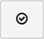

# Data Warehouse-Manager

>[!NOTE]
>
>Erfordert [Administratorberechtigungen](../../administrator/user-management/user-management.md)

Data Warehouse Manager durch Klicken auf **[!UICONTROL Manage Data > Data Warehouse]**, ist das Portal zu Ihrem [!DNL Adobe Commerce Intelligence] Data Warehouse. Mithilfe des Data Warehouse-Managers können Sie Einstellungen für die Tabellen- und Spaltensynchronisierung verwalten, einen Drilldown im Schema einer Tabelle durchführen und berechnete Spalten für die Verwendung in Berichten erstellen.

Dieses Thema behandelt:

* [Weg lernen](#learning)
* [Tabellen und Spalten synchronisieren](#syncing)
* [Berechnete Spalten erstellen](#calculated)
* [Tabellen löschen und Spalten entfernen](#delete)
* [Synchronisieren neuer Tabellen im Hintergrund](#syncnew)
* [Wann kann ich meine neuen Spalten verwenden?](#when)

## Weg lernen {#learning}

Links von `Data Warehouse Manager` -Seite enthält die Tabellenliste, mit der Sie mühelos zwischen Tabellen wechseln können. Wenn Sie eine Tabelle aus der Liste auswählen, wird der Tabellenverwaltungsbereich mit dem Schema der Tabelle gefüllt, in dem Sie die ausgewählte Tabelle ändern können.

In der Tabellenliste werden Tabellen nach ihrer Verbindungsquelle gruppiert. Diese Quellen werden unter [!UICONTROL Manage Data > Integrations] und kann entweder eine Datenbank, eine [API](https://developer.adobe.com/commerce/services/reporting/)oder einem Drittanbieter-Connector. Oben in der Tabellenliste befindet sich ein Suchfeld, mit dem Sie die gewünschten Tabellen leicht finden können.

Unter dem Suchfeld werden zwei Optionen angezeigt: `All Tables` und `Synced Tables`. Die `All Tables` listet alle Tabellen auf, die Sie Ihrer Data Warehouse zur Verfügung gestellt haben, einschließlich synchronisierter und nicht synchronisierter Tabellen.

Die `Synced Tables` zeigt alle Tabellen an, die bereits zu Ihrer Data Warehouse hinzugefügt wurden und deren Daten aus den ausgewählten Spalten repliziert werden.

Die Tabelle, nach der Sie suchen, wird nicht im `All Tables` Liste? Dafür gibt es einige mögliche Gründe:

* Die Datenquelle wurde noch nicht hinzugefügt
* Die Datenquelle ist eine Datenbank und die [!DNL Commerce Intelligence] -Benutzer, den Sie erstellt haben, hat keinen Zugriff. In diesem Fall müssen Sie oder Ihr Datenbankadministrator den Zugriff gewähren.
* Die Datenquelle oder Tabelle wurde kürzlich hinzugefügt und noch nicht synchronisiert.

## Tabellen und Spalten synchronisieren {#syncing}

### Synchronisieren neuer Tabellen und nativer Spalten

Der Data Warehouse Manager bietet Ihnen nicht nur die Möglichkeit, Ihre Datenquellen einfach anzuzeigen und zu verwalten, sondern Sie können auch die einzelnen Tabellen und Spalten auswählen, die Sie synchronisieren möchten.

1. Klicken Sie auf `All Tables` und suchen Sie die Tabelle, die Sie synchronisieren möchten.
1. Klicken Sie auf den Namen der Tabelle, um eine Vorschau des Schemas anzuzeigen. Wenn die Tabelle neu ist, werden alle Spalten als `Unsynced`.
1. Überprüfen Sie die Spalten, die Sie synchronisieren möchten.

   >[!NOTE]
   >
   >Spalten, die in einer Tabelle nativ sind, haben Aus Ihrer Datenbank in der `Location` Spalte.

1. Überprüfen Sie die `Primary Key` -Spalten - diese Spalten haben ein Schlüsselsymbol neben dem Spaltennamen. A `Primary Key` ist erforderlich, um Daten ordnungsgemäß mit der Data Warehouse zu synchronisieren.

   Wenn Sie eine Tabelle synchronisieren, die direkt aus Ihrer Datenbank stammt, kann es sein, dass `Primary Keys` nicht bezeichnet werden. Wenden Sie sich in diesem Fall an Ihren Datenbankadministrator, um das Hinzufügen eines Primärschlüssels zur Tabelle anzufordern.
1. Klicken Sie abschließend auf die  Schaltfläche.

A *Erfolg!* wird angezeigt und der Status ändert sich in `Pending` für die ausgewählten Spalten. Nach Abschluss der nächsten vollständigen Aktualisierung stehen die neu synchronisierten Tabellen und Spalten zur Verwendung in Berichten zur Verfügung. Sie können auch eine neue [Replikationsmethoden](./cfg-replication-methods.md) nach der ersten Synchronisierung.

Im Folgenden finden Sie einen kurzen Überblick über den gesamten Prozess:

### Synchronisieren neuer Tabellen im Hintergrund {#syncnew}

Wenn Sie eine große Tabelle zum ersten Mal synchronisieren, muss Ihr Data Warehouse rückwirkend alle Datenpunkte in der Tabelle erfassen, bevor Sie fortlaufend neue Daten erfassen. Wenn Ihre Tabelle groß ist, sollten Sie diese anfängliche Synchronisierung möglicherweise nicht in einer Sequenz mit Ihrer **Aktualisierungszyklus**. In diesem Fall soll die anfängliche Synchronisierung im Hintergrund in *parallel* mit allen derzeit ausgeführten Updates.

Wählen Sie die `Save and Sync Data Immediately` Option zum erstmaligen Synchronisieren dieser Tabelle.

### Überprüfen auf neue Tabellen und Spalten {#forceupdate}

Ihre Data Warehouse erkennt nicht automatisch neue Quellen, Tabellen oder Spalten, sobald sie hinzugefügt werden. Ein Synchronisierungsprozess läuft die ganze Woche über, um neue Ergänzungen zu finden und sie verfügbar zu machen. Sie können jedoch eine Struktursynchronisierung erzwingen, wenn Sie vor Ausführung des Prozesses auf neu hinzugefügte Tabellen und Spalten zugreifen möchten.

Unter der Suchleiste in der Tabellenliste befindet sich eine `Check for new tables and columns` -Link. Durch Klicken auf diesen Link wird der Prozess der Struktursynchronisierung erzwungen und gestartet. Nach 10 Minuten sind in der Regel neue Ergänzungen verfügbar. Aktualisieren Sie die Seite, um die neue Quelle, Tabelle oder Spalte anzuzeigen.

## Erstellen berechneter Spalten {#calculated}

Die einfache Möglichkeit, Daten aus all Ihren Quellen zu sehen und zu verwalten, erleichtert das Auffinden von Einblicken in Ihr Unternehmen. Im Data Warehouse-Manager können Sie jedoch noch einen Schritt weiter gehen, indem Sie berechnete Spalten in Ihren Tabellen erstellen. `Calculated` aus Ihren vorhandenen Daten neue Informationen ableiten.

Angenommen, Sie möchten `user's lifetime revenue` auf `users` -Tabelle, um Benutzer mit hohem Wert zu finden. Wenn Sie Umsätze nach Geschlecht segmentieren möchten, können Sie `customer's gender` auf `orders` Tabelle.

Weitere Informationen finden Sie hier . [Tutorial](../../data-analyst/data-warehouse-mgr/creating-calculated-columns.md).

## Tabellen löschen und Spalten entfernen {#delete}

So wie Sie Tabellen und Spalten auswählen können, um sie mit Ihrer Data Warehouse zu synchronisieren, können Sie sie auch ablegen oder entfernen.

>[!NOTE]
>
>Wenn Sie eine Tabelle löschen oder Spalten entfernen, werden alle abhängigen Berichte, Metriken, Filtersätze und Spalten gelöscht, sobald Sie den Löschvorgang bestätigt haben. Stellen Sie sicher, dass Sie dies tun möchten - **Diese Aktion kann nicht rückgängig gemacht werden.**

Wenn Sie auf **[!UICONTROL Delete]** zufällig. Eine Abhängigkeitsprüfung wird ausgeführt, bevor etwas gelöscht wird. Daher haben Sie die Möglichkeit, alles zu überprüfen, bevor Sie bestätigen.

Um Spalten zu entfernen, klicken Sie auf die Tabelle, zu der die Spalte gehört. Überprüfen Sie die Spalten, die Sie entfernen möchten, und klicken Sie auf die Schaltfläche  Schaltfläche.

Um eine synchronisierte Tabelle zu entfernen, wählen Sie alle Spalten in der Tabelle aus und klicken Sie erneut auf  Schaltfläche. Dadurch werden alle nativen und berechneten Spalten, die diese Tabelle verwenden, aus Ihrer Data Warehouse entfernt.

### Änderungen bestätigen

Unabhängig davon, ob Sie eine Tabelle ablegen oder Spalten entfernen, wird eine Abhängigkeitsprüfung ausgeführt, bevor der Löschvorgang abgeschlossen ist. Abhängigkeiten sind berechnete Spalten, Metriken, Filtersätze und Berichte, die die zu entfernende Tabelle oder Spalte(n) verwenden. Alle erkannten Abhängigkeiten werden angezeigt - an dieser Stelle können Sie den Prozess abbrechen oder auf **[!UICONTROL Confirm Changes]** , um die Tabelle abzulegen/die Spalte(n) zu entfernen.

Während gelöschte Abhängigkeiten nicht wiederhergestellt werden können, sind die Tabellen und Spalten weiterhin verfügbar, wenn Sie in Zukunft eine erneute Synchronisierung nativer Spalten benötigen.

Hier finden Sie einen kurzen Überblick über das Entfernen einer Spalte:

## Wann kann ich meine neuen Spalten verwenden? {#when}

Neue synchronisierte Spalten und neue/aktualisierte berechnete Spalten können nach Abschluss der nächsten vollständigen Aktualisierung verwendet werden. Wenn noch keine Aktualisierung ausgeführt wird, können Sie eine Aktualisierung erzwingen, indem Sie auf **[!UICONTROL Force update]** oben im `Data Warehouse` oder `Integrations` Seite. Sie können auch eine E-Mail-Benachrichtigung nach Abschluss der Aktualisierung planen, indem Sie auf **[!UICONTROL Email me when complete]**.

Wenn Sie bereit sind, Ihre neuen Spalten in Berichten zu verwenden, [müssen Sie sie zuerst zu Metriken hinzufügen](../data-warehouse-mgr/manage-data-dimensions-metrics.md). Auch wenn die Daten erst nach Abschluss der Aktualisierung verfügbar sind, können Sie in Berichten weiterhin neue Spalten verwenden. Daten im Bericht werden nach Abschluss der Aktualisierung angezeigt.

## Aufwischen

Dieser Artikel deckte eine Menge Material ab. Jetzt sollten Sie genau wissen, was eine Datenbank ist, wie Daten organisiert sind, wie Tabellen miteinander in Beziehung stehen und was Sie mit dem Data Warehouse Manager tun können.

Testen Sie Ihr Wissen durch [eine berechnete Spalte erstellen](../data-warehouse-mgr/creating-calculated-columns.md) oder [interessante Berichte erstellen](../../tutorials/using-visual-report-builder.md).
