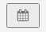

# Dashboard-weite Filterung

Mit einer Dashboard-weiten Filterung können Sie Massenbearbeitungen aller Berichte in einem bestimmten Dashboard vornehmen. Sie können dieselbe Analyse schnell über verschiedene Zeiträume oder für verschiedene Geschäfte anzeigen. Sie können die Leistung eines Vorjahres, Monats oder einer Woche einfach pro Geschäft vergleichen. Außerdem können Sie ein ganzes Dashboard aktualisieren, um eine neu gestartete Kampagne aufzunehmen.

## Datumsfilter

Um den Datumsbereich oder das Intervall der Berichte in einem Dashboard zu ändern, klicken Sie auf das Kalendersymbol in der oberen rechten Ecke ().

Sie können Daten mithilfe eines `Fixed Date Range` oder verschiedene vorab berechnete `Moving Date Ranges`:

Die `Last Full...` Die Optionen für bewegte Bereiche stellen den zuletzt vollständig abgeschlossenen Bereich dar, während `This...` ist der aktuelle, laufende Bereich. Wenn beispielsweise Juni ist, wird die Variable `Last Full Month` is _1. Mai - 31. Mai_, während `This Month` is _1. Juni - Jetzt_.

Oder erstellen Sie Ihre eigene `Custom Moving Range`\:

Wählen Sie auch aus, das Intervall zu ändern. Auswählen der Standardschaltfläche () bedeutet, dass sich nur der Datumsbereich ändert:

Um alle Berichte auf ihren ursprünglichen Datumsbereich und ihr anfängliches Intervall wiederherzustellen, klicken Sie auf **[!UICONTROL Restore Defaults]** oder klicken Sie auf **[!UICONTROL Cancel]**.

Wenn Sie einen Datumsfilter für ein Dashboard angeben, wird dieser Filter nur auf dieses Dashboard angewendet. Sie wird nicht angewendet, wenn Sie zu anderen Dashboards navigieren.

>[!NOTE]
>
>Zurzeit `Cohort Reports` und `SQL Reports` sind nicht enthalten, wenn Änderungen auf Dashboard-Ebene angewendet werden.

## Filter speichern

Um die Leistung eines bestimmten Stores zu analysieren, klicken Sie auf das Store-Symbol oben rechts (). Standardmäßig `Store Filter` auf `All Stores`, der alle Daten anzeigt [Store-Ansichten](https://experienceleague.adobe.com/docs/commerce-admin/stores-sales/site-store/store-views.html) auf Ihrer Commerce-Site verfügbar.

>[!NOTE]
>
>Ein Store-Filter ist für eine ganze [!DNL MBI] -Konto. Wenn ein Dashboard Berichte enthält, die nicht vom Filter betroffen sind (z. B. Berichte, die nicht auf Commerce-Daten basieren), werden diese Berichte bei Anwendung des Store-Filters nicht aktualisiert. Sie können [Support kontaktieren](https://experienceleague.adobe.com/docs/commerce-knowledge-base/kb/troubleshooting/miscellaneous/mbi-service-policies.html?lang=en) wenn Sie der Ansicht sind, dass ein Bericht auf der Grundlage der Store-Auswahl aktualisiert werden sollte, oder wenn Sie glauben, dass Ihr Konto-Store-Filter versehentlich deaktiviert ist.

Wenn Sie einen Store aus dem `Store Filter`festgelegt ist, behält der Filter Ihre Auswahl bei, wenn Sie zwischen Dashboards navigieren. Durch die Beibehaltung Ihrer Auswahl können Sie die Daten für den ausgewählten Store überall anzeigen, bis Sie `All Stores`.

## Filter für freigegebene Dashboards

Wenn bei freigegebenen Dashboards ein Benutzer den Datumsfilter konfiguriert, wird für andere Benutzer mit Zugriff auf das Dashboard derselbe Filter angewendet. Der Store-Filter gilt in diesem Fall jedoch nicht. Wenn der Dashboard-Eigentümer den Store-Filter konfiguriert und das Dashboard weitergibt, bleibt der konfigurierte Store-Filter nicht für einen anderen Benutzer bestehen. Ein Benutzer muss [Zugriff bearbeiten](../../data-user/dashboards/share-dashboard-with-users.md) zu einem Dashboard hinzufügen, um die Dashboard-Filter anzupassen.
