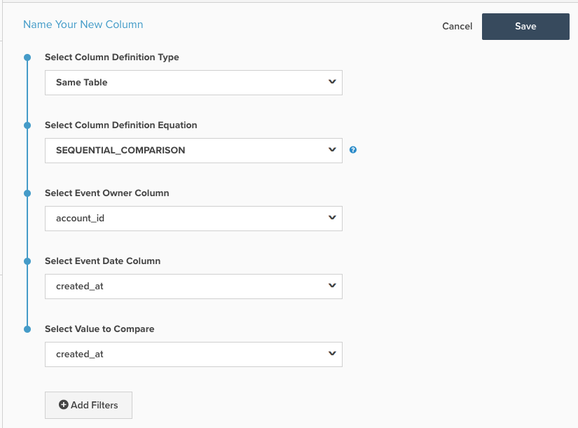

# Berechnete Spalte für sequenziellen Vergleich

In diesem Thema werden der Zweck und die Verwendung der `Sequential Comparison` berechneten Spalte auf der **[!DNL Manage Data > Data Warehouse]** Seite beschrieben. Nachfolgend finden Sie eine Erläuterung der Funktionen, gefolgt von einem Beispiel und den Methoden zu seiner Erstellung.

**Erläuterung**

Der `Sequential Comparison` Spaltentyp: ermittelt den Unterschied zwischen aufeinander folgenden Ereignissen. Der häufigste Typ `Sequential Comparison` Spalte ist die `Seconds since previous order`. Für diese Spalte sind drei Eingaben erforderlich:

1. `Event Owner`: Diese Eingabe bestimmt die Entität, für die Zeilen gruppiert werden. Beispielsweise ist in der Spalte `Seconds since previous order` der Ereignisbesitzer der Kunde, da Sie die Anzahl der Sekunden seit der vorherigen Bestellung desselben Kunden ermitteln möchten.
1. `Event Date`: Diese Eingabe erzwingt die Sequenz von Ereignissen. Im Falle von `Seconds since previous order` sollte die Spalte mit dem Zeitstempel der Bestellung die `Event Date` sein. Diese Eingabe ist immer ein Zeitstempel.
1. `Value to Compare`: Diese Eingabe ist der tatsächliche Wert, der verglichen werden soll. Dadurch wird der Wert der vorherigen Zeile vom Wert der aktuellen Zeile subtrahiert. Daher wird eine Spalte `Seconds since previous order`, die den Zeitunterschied zwischen aufeinander folgenden Bestellungen eines Kunden ermittelt. Diese Eingabe muss kein Zeitstempel sein. Ein Beispiel für einen Zeitstempel ohne Zeitstempel besteht darin, die Differenz zwischen den Bestellwerten aufeinander folgender Bestellungen eines Kunden zu ermitteln.

**Beispiel**

| **`event_id`** | **`owner_id`** | **`timestamp`** | **`Seconds since owner's previous event`** |
|--- |--- |--- |--- |
| **`1`** | A | 2015-01-01 00:00:00 | NULL |
| **`2`** | B | 2015-01-01 00:30:00 | NULL |
| **`3`** | A | 2015-01-01 02:00:00 | 7200 |
| **`4`** | A | 2015-01-02 13:00:00 | 126000 |
| **`5`** | B | 2015-01-03 13:00:00 | 217800 |

Im obigen Beispiel ist `Seconds since owner's previous event` die `Sequential Comparison` berechnete Spalte. Für die `owner_id = A` identifiziert sie zunächst eine Sequenz basierend auf der `timestamp` Spalte und subtrahiert dann die `timestamp` des vorherigen Ereignisses vom Zeitstempel des aktuellen Ereignisses. In der dritten Zeile der Tabelle - der zweiten Zeile für `owner_id A` - ist der Wert von `Seconds since owner's previous event` die Anzahl der Sekunden zwischen „2015-01-01 02:00“ und „2015-01-01 00:00:00“. Diese Differenz entspricht zwei Stunden = 7200 Sekunden.

Für diesen berechneten Spaltentyp hat die Zeile, die dem ersten Ereignis des Inhabers entspricht, einen `NULL`.

**Mechanik**

So erstellen Sie eine **Ereignisnummer** Spalte:

1. Navigieren Sie zur **[!DNL Manage Data > Data Warehouse]**.

1. Navigieren Sie zu der Tabelle, in der Sie diese Spalte erstellen möchten.

1. Klicken Sie oben rechts auf **[!UICONTROL Create New Column]** .

1. Wählen Sie `Same Table` als `Definition Type` aus (wenn sich die Spalten, die Sie vergleichen möchten, nicht in derselben Tabelle befinden, müssen Sie sie möglicherweise neu platzieren).

1. Wählen Sie `SEQUENTIAL_COMPARISON` als `Column Definition Equation` aus.

1. Wählen Sie die Eingaben wie oben beschrieben aus:
   - `Event Owner`
   - `Event Date`
   - `Value to Compare`

1. Es können auch Filter hinzugefügt werden, um Zeilen von der Berücksichtigung auszuschließen. Die ausgeschlossenen Zeilen haben einen `NULL` Wert für diese Spalte.

1. Geben Sie oben auf der Seite einen Namen für die Spalte ein und klicken Sie auf **[!UICONTROL Save]**.

1. Die Spalte kann (sofort *verwendet*.

