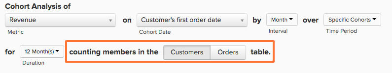

# Report Builder der Kohorte

Wollten Sie schon einmal untersuchen, wie sich unterschiedliche Untergruppen Ihrer Benutzer im Laufe der Zeit verhalten? Haben Sie sich beispielsweise schon einmal gefragt, ob Benutzer, die sich während eines Promo-Zeitraums registrieren, einen höheren durchschnittlichen Lebenszeitumsatz haben als diejenigen, die dies nicht tun? Wenn die Antwort `Yes`, dann `Cohort Report Builder` ist das perfekte Werkzeug für Sie. [!DNL MBI] wurde speziell für diese Analyse optimiert, um sie für Ihr Unternehmen relevant zu machen.

## Was ist eine Kohortenanalyse? {#what}

`Cohort` Analyse kann allgemein definiert werden als die Analyse von Benutzergruppen, die über ihre Lebenszyklen ähnliche Merkmale aufweisen. Damit können Sie Verhaltenstrends über verschiedene Benutzergruppen hinweg identifizieren.

Für eine tiefergehende Einführung in `cohort` Analyse, [Sehen Sie sich hier an.](https://www.cohortanalysis.com/) - Wir haben die Seite darauf geschrieben!

In [!DNL MBI] Dashboard, ist es einfach, Benutzer zu erstellen `cohorts` auf der Grundlage einer `cohort` Datum und eine Metrik in Ihrem Konto.

## Warum ist die Kohortenanalyse wichtig? {#important}

Wie oben erwähnt, `cohort` Mithilfe der Analyse können Sie Verhaltenstrends zwischen verschiedenen Benutzergruppen identifizieren. Mit einem soliden Verständnis, wie sich bestimmte Gruppen verhalten, können Sie Ihre Entscheidungen und Ausgaben so anpassen, dass Sie Ihren Umsatz maximieren können. Nehmen wir beispielsweise einen Lebensdauerumsatz `cohort` Analyse - obwohl diese Art von Analyse aus vielen Gründen von Vorteil ist, ist die unmittelbare, bessere Entscheidungen über die Kundenakquise.

## Wie erstelle ich eine eigene `cohort` Analyse?

### Neue Architektur

Dies sind die Anweisungen zur Verwendung der `Cohort Report Builder` auf [Neue Architektur](../../administrator/account-management/new-architecture.md).

1. Klicken **[!UICONTROL Report Builder]** auf der linken Registerkarte oder **[!UICONTROL Add Report** > **Create Report]** in jedem Dashboard.

1. Im `Report Builder` Auswahlbildschirm, klicken Sie auf **[!UICONTROL Create Report]** neben dem `Visual Report Builder` -Option.

**Hinzufügen einer Metrik**

Jetzt sind wir im `Report Builder`, fügen wir die Metrik hinzu, für die wir die Analyse durchführen möchten (Beispiel: `Revenue` oder `Orders`).

>[!NOTE]
>
>Nativ [!DNL Google Analytics] -Metriken sind nicht mit der `Cohort Report Builder`.

**Umschalten der Metrikansicht auf`Cohort`**

Dadurch wird ein neues Fenster geöffnet, in dem wir die Details der `Cohort` Bericht.

### Zum Erstellen einer `Cohort` Bericht:

1. Gruppieren der `cohorts`
1. Die `cohort` Zeitraum
1. Die Anzahl der `cohorts` in Ansicht
1. Die Mindestmenge an Daten pro `cohort` must contain
1. Zeitraum nach `cohort` Vorkommen

#### 1. Gruppierung `cohorts`

`Cohorts` werden anhand eines Zeitstempels gruppiert, z. B. **Registrierungsdatum** oder **Erstes Bestelldatum**.

>[!NOTE]
>
>Sie können nicht denselben Zeitstempel verwenden, auf dem die Metrik für die `cohort` Datum. Für eine Analyse, die dies erfordert, können Sie die `Standard report builder` anstatt.

#### 2. `Cohort` Zeitraum

Zu gruppierenden Zeitraum auswählen `cohorts` durch. Mit anderen Worten, welcher Teil des oben ausgewählten Zeitstempels ist am wichtigsten. die `week`, `month`, `quarter`oder `year`?  Ihr Bericht zeigt Daten in allen Intervallen an, die Sie hier auswählen

#### 3. und 4. Legen Sie die Anzahl der `cohorts` anzeigen und wie viele Daten die einzelnen `cohort` muss

Mithilfe dieser Parameter können Sie nur die `cohorts` an dem Sie interessiert sind, und die praktische `Preview` im unteren Bereich des Fensters wird genau angezeigt, welche Kohorten in Ihrem Bericht angezeigt werden.

Standardmäßig wird die aktuelle `cohort` wird nur berücksichtigt, wenn Sie die für jeden `cohort` nach `0`. In diesem Fall wird die `cohort` für den aktuellen Zeitraum enthält nur partielle Daten.

#### 5. Zeitraum nach `Cohort` Vorfall

Mit dieser Funktion können Sie den Datumsbereich festlegen, den Sie für die ausgewählte `cohorts`. Wenn Sie beispielsweise 24 Monate anzeigen möchten `cohorts` auf `customer's first order date`, aber Sie interessieren sich nur für die ersten drei Monate an Daten für jeden `cohort`, können Sie die `number of cohorts to view` nach `24` und `time range after cohort occurrence` nach `3`.

Das Intervall für diesen Wert ändert sich mit dem, was Sie im `cohort time period` und der Wert auf `12` Standardmäßig; Der Wert ändert sich nur, wenn Sie auf das Kalendersymbol klicken, um ihn zu bearbeiten.

#### Sonstige Hinweise

* [!UICONTROL Filters]: auf Ihre Metriken angewendet werden, bleiben intakt, wenn Sie zwischen `Standard` und `Cohort` Ansichten.

* Siehe [`Perspectives`](#perspectives).

#### Beispiel

Hier ist ein Beispiel, um alles zusammenzuziehen. In diesem Beispiel möchte ich das Bestellverhalten nach einem `cohort`den ersten Kauf, um zu sehen, ob diese Kohorte in den nächsten 6 Monaten zurückkehrt und Wiederholungskäufe tätigt.

### Alte Architektur

#### Alte Architektur {#personalinfo}

Im Folgenden finden Sie Anweisungen zur älteren Version der `Cohort Report Builder`. Wenn Sie an der Verwendung der neuen Version interessiert sind, lesen Sie [Neue Architektur](../../administrator/account-management/new-architecture.md) Weitere Informationen zur Migration zu einer [!DNL MBI] Neues Architekturkonto.

#### Wie erstelle ich eine eigene `cohort` Analyse? {#create}

`Cohort` Analyse in Aktion! Hier können wir sehen, dass der Umsatz im Laufe der Zeit kumuliert und pro Benutzer zunimmt.

In diesem Abschnitt führen wir Sie durch die Erstellung Ihrer eigenen `cohort` Analyse. Beispiele (und animierte GIF, die den Vorgang demonstrieren) finden Sie im [Beispielabschnitt](#examples) dieses Artikels.

1. Klicken **[!UICONTROL Report Builder]** auf der linken Registerkarte oder **[!UICONTROL Add Report** > **Create Report]** in jedem Dashboard.

1. Im `Report Builder Selection` Bildschirm, klicken Sie auf **[!UICONTROL Create Report]** neben dem `Cohort Analysis` -Option.

#### Hinzufügen einer Metrik

Jetzt sind wir im `Cohort Report Builder`, Fügen wir die Metrik hinzu (Beispiel: `Revenue` oder `Number of orders`), an dem wir die Analyse durchführen möchten.

>[!NOTE]
>
>Nativ [!DNL Google Analytics] -Metriken sind nicht mit der `Cohort Report Builder`.

#### Kohortendatum auswählen {#date}

Der nächste Schritt besteht darin, die `cohort date`. Dies ist das Datum, nach dem Ihre Benutzer gruppiert werden. Dies kann beispielsweise `User's first order date` oder `User's registration date`.

>[!NOTE]
>
>Sie können nicht dasselbe Datum verwenden, auf dem die Metrik basiert (Beispiel: `created at`) als `cohort date`.

#### Festlegen von Intervall und Zeitraum

Als Nächstes legen wir die `Interval` und `Time Period`.

`Interval`
Die `Interval` -Option können Sie die `length` Ihrer `cohorts`. Wenn dies beispielsweise auf `Month`wird Ihr Bericht in Monaten gemessen.

Sie können die Darstellung dieser Intervalle auf der X-Achse mithilfe der **Dauer** Menü.

`Time Period`
Verwenden Sie die `Time Period` Menü zur Auswahl eines bestimmten Benutzers `cohorts` zu analysieren. Sie können jede `cohort`, wählen Sie aus einer Liste aus, legen Sie einen Zeitraum fest oder definieren Sie einen rollierenden Zeitraum von `cohorts` einschließen. Wenn wir beispielsweise die Variable `Specific Cohorts` können wir bestimmte Monate auswählen, die in die Analyse einbezogen werden sollen:

Wenn wir unsere `cohorts` nach Registrierungsdatum und anschließend im April, Mai und Juni im `Specific Cohorts` auflisten, werden alle Benutzer, die sich in diesen Monaten registriert haben, einbezogen.

#### X-Achse definieren

under `duration`können Sie die X-Achsen-Einstellungen des Diagramms definieren. Das heißt, wie viele Zeiträume jeder Datenpunkt darstellt und wie viele Datenpunkte in die Analyse einbezogen werden sollen.

#### Auswählen der `counting members` table

Wenn Sie sich dafür entschieden haben, Benutzer nach einer `cohort date` die von einer anderen Tabelle verbunden wurden, sehen Sie möglicherweise eine `counting members in the … table` -Option.

Sehen wir uns ein Beispiel an, um diese Einstellung zu verstehen. Angenommen, Sie haben einen Bericht erstellt, in dem eine `Revenue` Metrik nach `Customer's registration date`. Sie wollten auch die Perspektive verwenden `Average value per cohort member` um den Umsatz pro Käufer im Laufe der Zeit zu sehen. Um den Durchschnittswert pro Käufer zu ermitteln, müssen wir entscheiden, nach wie vielen Käufern wir unterteilen. Ist es die Anzahl der registrierten Kunden in Ihrer `customers` -Tabelle oder ist es die Anzahl unterschiedlicher Käufer in Ihrer `orders table` für den gleichen Zeitraum?

Diese Einstellung beantwortet diese Frage. Mitglieder des `customers` enthält alle Kunden (unabhängig davon, ob sie einen Kauf getätigt haben oder nicht) im Durchschnitt. Mitglieder des `orders` enthält nur Kunden, die einen Kauf getätigt haben.

#### Perspektive auswählen {#perspective}

Nachdem Sie die Metrik definiert und wie Sie sie analysieren möchten, können Sie die `perspective` Sie verwenden möchten.

Direkt über der Berichtsvisualisierung befindet sich ein Dropdown-Menü von `perspective` -Einstellungen.

Siehe [Perspektiven](#perspectives).

## Beispiele für Kohortenanalysen {#examples}

Jetzt, da wir durchgemacht haben, wie wir eine `cohort` Analyse, lassen Sie uns einige Beispiele anschauen.

### Ich möchte wissen, wie mein Benutzer `cohorts` mit der Zeit wachsen.

In diesem Beispiel analysierten wir die `Revenue` Metrik, unsere Kohorten nach der `customer's first order date`und die Auswahl der 8 neuesten `cohorts` (definiert im `Time Period` ), die in die Analyse einbezogen werden sollen. Um zu sehen, wie die Kohorten im Laufe der Zeit wuchsen, verwendeten wir die `Cumulative Average Value per Cohort Member` `perspective`.

### Ich möchte im Durchschnitt wissen, wie viele Bestellungen ein Benutzer an verschiedenen Punkten seines Lebens tätigt.

! in der Analyse. Um die durchschnittliche Anzahl der Bestellungen für jede Kohorte anzuzeigen, haben wir die `perspective` nach `Average Value per Cohort Member`.

### Ich möchte verstehen, wie die zukünftige Kaufaktivität eines Benutzers mit der Aktivität des ersten Monats im Unternehmen verglichen wird.

## `Perspectives` {#perspectives}

`Standard`
Dies zeigt den inkrementellen Beitrag einer bestimmten Kohortengruppe zu einem beliebigen Zeitpunkt ihres Lebenszyklus. (Beispiel: Der Punkt &quot;Woche 6&quot;zeigt alle Datenpunkte an, die von Benutzern in ihrer sechsten Woche erstellt wurden.)

`Average Value per Cohort Member`
Dadurch wird die `Standard cohort` Analyse in (1) nach der Anzahl der Benutzer in jedem `cohort` hinzugefügt. Dies kann für den Vergleich der Kohortenleistung von Äpfeln mit Äpfeln nützlich sein, da nicht alle Kohortengruppen die gleiche Anzahl von Benutzern umfassen können. Beispielsweise der durchschnittliche Umsatz pro Woche mit 6 Benutzern aus einer bestimmten `cohort`.

`Cumulative`
Diese `perspective` zeigt die traditionelle `cohort` Analyse `cumulative` Basis. Mit anderen Worten, er zeigt den Gesamtbeitrag einer bestimmten Kohorte zu einem beliebigen Zeitpunkt ihres Lebenszyklus an. Beispielsweise der kumulative Umsatz von Benutzern aus einer bestimmten Kohorte nach 6 Wochen.

`Cumulative Average Value per Cohort Member`
Dadurch wird die `Cumulative` Analyse in (3) nach der Anzahl der Benutzer in jedem `cohort` hinzugefügt. Er zeigt den durchschnittlichen Beitrag über die Lebensdauer (häufig durchschnittlicher Umsatz während der Lebensdauer) pro `cohort` an jedem Punkt in der `cohort's` Leben. Beispielsweise der durchschnittliche Umsatz während der Lebensdauer nach 6 Monaten mit Benutzern, die im Juni beigetreten sind.

`Percent of First Value (show first value)`
Dadurch wird das Aggregat analysiert `cohort` Beitrag zu einem bestimmten Zeitpunkt in einem `cohort's` Lebenszyklus als Prozentsatz ihres Beitrags im ersten Zeitraum. Beispiel: Der Umsatz für Monat 6 dividiert durch den Umsatz für Monat 1 aus Benutzern, die im Juni beigetreten sind.

`Percent of First Value (hide first value)`
Dies entspricht dem `perspective` oben, allerdings wird der Wert des ersten Zeitraums von 100 % ausgeblendet.

## Aufbrechen {#finish}

Die `Cohort Report Builder` ist derzeit für die Gruppierung von Benutzern nach einem gemeinsamen `cohort date`. Sie können daran interessiert sein, die Benutzer nach einer ähnlichen Aktivität oder einem ähnlichen Attribut zu gruppieren - wenn dies der Fall ist, würden wir Ihnen gerne helfen! Wir empfehlen Ihnen, auszuchecken [Dieses Tutorial zu qualitativen Kohorten](../dev-reports/create-qual-cohort-analysis.md) um zu beginnen.
