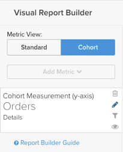
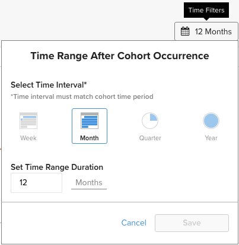
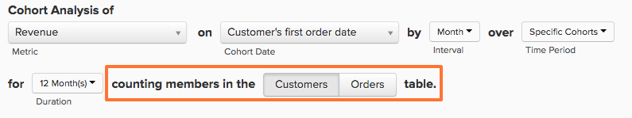
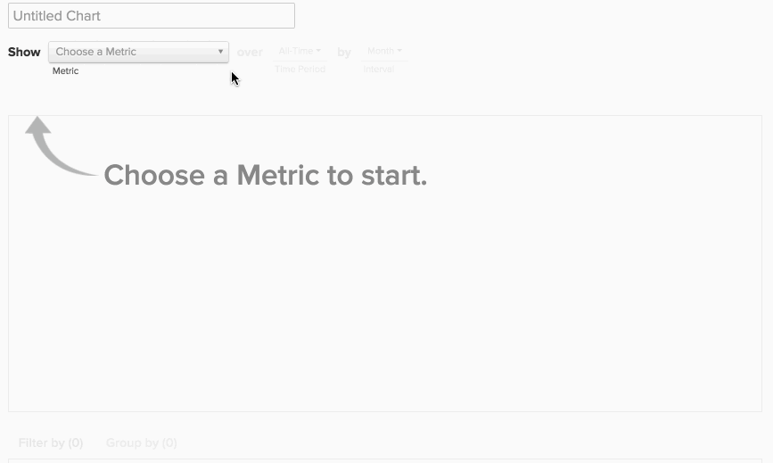

# Kohorte Report Builder

Wollten Sie schon immer einmal untersuchen, wie sich verschiedene Untergruppen Ihrer Benutzer im Laufe der Zeit verhalten? Haben Sie sich beispielsweise jemals gefragt, ob Benutzer, die sich während eines Aktionszeitraums registrieren, im Durchschnitt einen höheren Lebensdauerumsatz erzielen als Benutzer, die sich nicht registrieren? Wenn die Antwort `Yes` ist, dann ist die `Cohort Report Builder` das perfekte Tool für Sie. [!DNL Adobe Commerce Intelligence] wurde optimiert, um diese Analyse durchzuführen und für Ihr Unternehmen relevant zu machen.

## Was ist eine Kohortenanalyse? {#what}

`Cohort` Analyse kann grob definiert werden als die Analyse von Benutzergruppen, die über ihren Lebenszyklus ähnliche Merkmale aufweisen. So können Sie Verhaltenstrends in verschiedenen Benutzergruppen identifizieren.

In Ihrem [!DNL Commerce Intelligence]-Dashboard ist es einfach, `cohorts` basierend auf einem `cohort` und einer Metrik in Ihrem Konto zu erstellen.

## Warum ist die Kohortenanalyse wichtig? {#important}

Wie bereits erwähnt, ermöglicht `cohort` Analyse die Identifizierung von Verhaltenstrends bei verschiedenen Benutzergruppen. Mit einem soliden Verständnis davon, wie sich bestimmte Gruppen verhalten, können Sie Ihre Entscheidungen und Ausgaben anpassen, um Ihren Umsatz zu maximieren. Nehmen wir zum Beispiel eine Lebensdauerumsatzanalyse`cohort` während diese Art von Analyse aus vielen Gründen von Vorteil ist, ist die unmittelbare Folge bessere Entscheidungen bei der Kundenakquise.

## Wie erstelle ich meine eigene `cohort`?

### Neue Architektur

Dies sind die Anweisungen zur Verwendung des `Cohort Report Builder` auf der [Neue Architektur](../../administrator/account-management/new-architecture.md).

1. Klicken Sie auf der linken Registerkarte oder **[!UICONTROL Report Builder]** in einem beliebigen Dashboard auf **[!UICONTROL Add Report** > **Create Report]** .

1. Klicken Sie im Bildschirm zur `Report Builder` auf **[!UICONTROL Create Report]** neben der Option `Visual Report Builder` .

**Metrik hinzufügen**

Fügen Sie nun, da Sie sich im `Report Builder` befinden, die Metrik hinzu, für die Sie die Analyse durchführen möchten (Beispiel: `Revenue` oder `Orders`).

>[!NOTE]
>
>Native [!DNL Google Analytics] sind nicht mit dem `Cohort Report Builder` kompatibel.

**Schalten Sie die Metrikansicht um zu`Cohort`**

Dadurch wird ein neues Fenster geöffnet, in dem die Details des `Cohort` konfiguriert werden können.

### Für die Erstellung eines `Cohort`-Berichts sind fünf Spezifikationen erforderlich:

1. Gruppieren der `cohorts`
1. Der `cohort` Zeitraum
1. Die Anzahl der anzuzeigenden `cohorts`
1. Die Mindestmenge an Daten, die jede `cohort` enthalten muss
1. Zeitraum nach `cohort` Auftreten

#### &#x200B;1. `cohorts`

`Cohorts` werden nach einem Zeitstempel gruppiert, z. B **„Registrierungsdatum** oder **Erstbestellungsdatum**.

>[!NOTE]
>
>Sie können nicht denselben Zeitstempel verwenden, auf dem die Metrik für das `cohort` Datum basiert. Für eine Analyse, die dies erfordert, können Sie stattdessen den `Standard report builder` verwenden.

#### &#x200B;2. `Cohort`

Wählen Sie den Zeitraum aus, nach dem `cohorts` gruppiert werden sollen. Mit anderen Worten: Welcher Teil des Zeitstempels, den Sie oben ausgewählt haben, ist am wichtigsten: die `week`, `month`, `quarter` oder `year`? Ihr Bericht zeigt Daten in jedem hier ausgewählten Intervall an

#### &#x200B;3. und 4. Legen Sie fest, wie viele `cohorts` angezeigt werden sollen und wie viele Daten jede `cohort` haben muss

Diese Parameter helfen Ihnen, nur die `cohorts` anzuzeigen, die Sie interessieren, und das praktische `Preview` am unteren Fensterrand zeigt Ihnen genau, welche Kohorten in Ihrem Bericht angezeigt werden.

Standardmäßig ist die aktuelle `cohort` nur enthalten, wenn Sie die für jede `cohort` erforderliche Mindestmenge an Daten in `0` ändern. In diesem Fall umfasst die `cohort` für den aktuellen Zeitraum nur Teildaten.

#### &#x200B;5. Zeitraum nach `Cohort` Auftreten

Mit dieser Funktion können Sie den Zeitbereich der Daten festlegen, die Sie für die ausgewählte `cohorts` anzeigen. Wenn Sie beispielsweise 24 monatliche `cohorts` auf der Grundlage von `customer's first order date` anzeigen möchten, aber nur an den ersten 3 Monaten der Daten für jede `cohort` interessiert sind, können Sie die `number of cohorts to view` auf `24` und die `time range after cohort occurrence` auf `3` setzen.

Das Intervall für diesen Wert ändert sich mit dem, was Sie im `cohort time period` ausgewählt haben, und der Wert ist standardmäßig auf `12` festgelegt. Der Wert ändert sich nur, wenn Sie auf das Kalendersymbol klicken, um ihn zu bearbeiten.

#### Weitere Hinweise

* [!UICONTROL Filters]: Auf Ihre Metriken angewendet bleiben intakt, wenn Sie zwischen `Standard`- und `Cohort` wechseln.

* Siehe [`Perspectives`](#perspectives).

#### Beispiel

Hier ist ein Beispiel, um alles zusammenzufassen. In diesem Beispiel möchte ich das Bestellverhalten nach dem ersten Kauf eines `cohort` überprüfen, um festzustellen, ob diese Kohorte in den nächsten sechs Monaten wieder Käufe tätigt.

### Alte Architektur

#### Alte Architektur {#personalinfo}

Im Folgenden finden Sie spezifische Anweisungen für die Legacy-Version des `Cohort Report Builder`. Wenn Sie an der Verwendung der neuen Version interessiert sind, finden Sie unter [Neue Architektur](../../administrator/account-management/new-architecture.md) weitere Informationen über die Migration zu einem [!DNL Commerce Intelligence] Konto für eine neue Architektur.

#### Wie erstelle ich meine eigene `cohort`? {#create}

Analyse `Cohort`! Hier sehen Sie den Umsatzanstieg im Laufe der Zeit kumulativ und pro Benutzer.

Dieser Abschnitt führt Sie durch die Erstellung Ihrer eigenen `cohort`. Beispiele (und animierte GIFs zur Demonstration des Prozesses) finden Sie im [Abschnitt Beispiele](#examples) dieses Themas.

1. Klicken Sie auf der linken Registerkarte oder **[!UICONTROL Report Builder]** in einem beliebigen Dashboard auf **[!UICONTROL Add Report** > **Create Report]** .

1. Klicken Sie im `Report Builder Selection` auf **[!UICONTROL Create Report]** neben der Option `Cohort Analysis` .

#### Metrik hinzufügen

Fügen Sie nun, da Sie sich im `Cohort Report Builder` befinden, die Metrik (Beispiel: `Revenue` oder `Number of orders`) hinzu, für die Sie die Analyse durchführen möchten.

>[!NOTE]
>
>Native [!DNL Google Analytics] sind nicht mit dem `Cohort Report Builder` kompatibel.

#### Auswahl des Kohortendatums {#date}

Der nächste Schritt besteht darin, die `cohort date` anzugeben. Dies ist das Datum, nach dem Ihre Benutzer gruppiert werden. Dies kann beispielsweise `User's first order date` oder `User's registration date` sein.

>[!NOTE]
>
>Sie können nicht dasselbe Datum, an dem die Metrik erstellt wird (Beispiel: `created at`), wie die `cohort date` verwenden.

#### Einstellen des Intervalls und des Zeitraums

Legen Sie als Nächstes die `Interval` und die `Time Period` fest.

`Interval`
Mit der Option `Interval` können Sie den `length` Ihrer `cohorts` festlegen. Wenn dieser Wert beispielsweise auf `Month` festgelegt ist, wird Ihr Bericht in Monaten gemessen.

Sie können die Darstellung dieser Intervalle auf der X-Achse über das Menü **Dauer** ändern.

`Time Period`
Wählen Sie im Menü `Time Period` die zu analysierenden `cohorts` aus. Sie können jedes `cohort` anzeigen, aus einer Liste auswählen, einen Zeitbereich angeben oder einen rollierenden Zeitbereich von einzuschließenden `cohorts` definieren. Wenn Sie beispielsweise die Option `Specific Cohorts` verwendet haben, können Sie bestimmte Monate auswählen, die in die Analyse aufgenommen werden sollen:

Wenn Sie Ihre `cohorts` nach Registrierungsdatum gruppieren und dann April, Mai und Juni in der `Specific Cohorts`-Liste auswählen, werden alle Benutzer einbezogen, die sich in diesen Monaten registriert haben.

#### Definieren der X-Achse

Unter `duration` können Sie die Einstellungen für die X-Achse des Diagramms definieren. Dies bedeutet, wie viele Zeiträume jeder Datenpunkt darstellt und wie viele Datenpunkte in die Analyse aufgenommen werden sollen.

#### `counting members` auswählen

Wenn Sie Benutzer nach einem `cohort date` gruppieren möchten, der aus einer anderen Tabelle verbunden wurde, wird möglicherweise eine `counting members in the … table` Option angezeigt.

Sehen Sie sich ein Beispiel an, um diese Einstellung zu verstehen. Angenommen, Sie haben einen Bericht erstellt, der eine `Revenue` Metrik nach `Customer's registration date` kohortiert. Sie wollten auch die Perspektive `Average value per cohort member` verwenden, um den Umsatz pro Käufer im Zeitverlauf zu sehen. Um den Durchschnittswert pro Käufer zu ermitteln, müssen Sie die Anzahl der Käufer festlegen, nach denen geteilt werden soll. Ist dies die Anzahl der registrierten Kunden in Ihrer `customers`-Tabelle oder die Anzahl der einzelnen Käufer in Ihrer `orders table` für denselben Zeitraum?

Diese Einstellung beantwortet diese Frage. Die Zählung der Mitglieder in der `customers`-Tabelle umfasst alle Kunden (unabhängig davon, ob sie einen Kauf getätigt haben, je nachdem) im Durchschnitt. Die Zählung der Mitglieder in der `orders` umfasst nur Kunden, die einen Kauf getätigt haben.

#### Perspektive auswählen {#perspective}

Nachdem Sie die Metrik definiert haben und wie Sie sie analysieren möchten, können Sie die `perspective` auswählen, die Sie verwenden möchten.

Direkt über der Berichtsvisualisierung befindet sich eine Dropdown-Liste mit `perspective`.

Siehe [Perspektiven](#perspectives).

## Beispiele für die Kohortenanalyse {#examples}

Nachdem Sie nun eine `cohort` Analyse erstellt haben, sehen Sie sich einige Beispiele an.

### Ich möchte wissen, wie meine `cohorts` im Laufe der Zeit wachsen.

In diesem Beispiel haben Sie die Metrik `Revenue` analysiert, Ihre Kohorten nach `customer's first order date` gruppiert und die 8 neuesten `cohorts` (im Menü `Time Period` definiert) ausgewählt, die in die Analyse aufgenommen werden sollen. Um zu sehen, wie die Kohorten im Laufe der Zeit gewachsen sind, haben Sie die `Cumulative Average Value per Cohort Member` `perspective` verwendet.

### Ich möchte im Durchschnitt wissen, wie viele Bestellungen ein Benutzer zu verschiedenen Zeitpunkten in seinem Leben tätigt.

(../../assets/cohort2.gif

Für dieses Beispiel haben Sie die `Number of orders` Metrik analysiert, Ihre Kohorten nach `customer's first order date` gruppiert und die acht zuletzt verwendeten Kohorten (im Menü `Time Period` definiert) in die Analyse einbezogen. Um die durchschnittliche Anzahl der Bestellungen für jede Kohorte anzuzeigen, haben Sie die `perspective` in `Average Value per Cohort Member` geändert.

### Ich möchte verstehen, wie die zukünftige Kaufaktivität eines Benutzers im Vergleich zur Aktivität im ersten Monat mit dem Unternehmen abschneidet.

## `Perspectives` {#perspectives}

`Standard`
Dies zeigt den inkrementellen Beitrag einer bestimmten Kohortengruppe zu einem beliebigen Zeitpunkt in ihrem Lebenszyklus. (Beispiel: Der Punkt „Woche 6“ zeigt alle Datenpunkte an, die von Benutzenden in der sechsten Woche erstellt wurden.)

`Average Value per Cohort Member`
Dadurch wird die `Standard cohort` in (1) durch die Anzahl der Benutzenden in jeder `cohort` geteilt. Dies kann für den Vergleich der Leistung einer Kohorte auf Apfel-zu-Apfel-Basis nützlich sein, da nicht alle Kohortengruppen möglicherweise dieselbe Anzahl von Benutzern enthalten. Zum Beispiel der durchschnittliche Umsatz von Woche 6 pro Benutzerin bzw. Benutzer von einem bestimmten `cohort`.

`Cumulative`
Dieses `perspective` zeigt die herkömmliche `cohort` auf `cumulative` Basis. Mit anderen Worten, es zeigt den Gesamtbeitrag einer bestimmten Kohorte zu einem bestimmten Zeitpunkt in ihrem Lebenszyklus an. Zum Beispiel der kumulative Umsatz nach sechs Wochen von Benutzern aus einer bestimmten Kohorte.

`Cumulative Average Value per Cohort Member`
Dadurch wird die `Cumulative` in (3) durch die Anzahl der Benutzenden in jeder `cohort` geteilt. Sie zeigt den durchschnittlichen Beitrag über die gesamte Lebensdauer (häufig den durchschnittlichen Lebensdauerumsatz) pro `cohort`-Mitglied zu jedem Zeitraum im `cohort's`. Zum Beispiel der durchschnittliche lebenslange Umsatz nach sechs Monaten von Benutzern, die im Juni beigetreten sind.

`Percent of First Value (show first value)`
Darin wird der aggregierte `cohort` zu einem bestimmten Zeitpunkt in einem `cohort's` Lebenszyklus als Prozentsatz ihres Beitrags im ersten Zeitraum analysiert. Zum Beispiel der Umsatz für Monat 6 dividiert durch den Umsatz für Monat 1 der Benutzer, die im Juni beigetreten sind.

`Percent of First Value (hide first value)`
Dies entspricht dem obigen `perspective`, mit der Ausnahme, dass der Wert des ersten Zeitraums von 100 % ausgeblendet ist.

## Verpackung {#finish}

Die `Cohort Report Builder` ist für die Gruppierung von Benutzern nach einem gemeinsamen `cohort date` optimiert. Möglicherweise möchten Sie die Benutzer nach einer ähnlichen Aktivität oder einem ähnlichen Attribut gruppieren. Adobe empfiehlt, sich [&#x200B; (dieses Tutorial zu qualitativen Kohorten) &#x200B;](../dev-reports/create-qual-cohort-analysis.md), um loszulegen.
