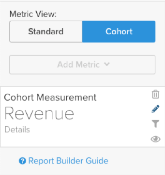
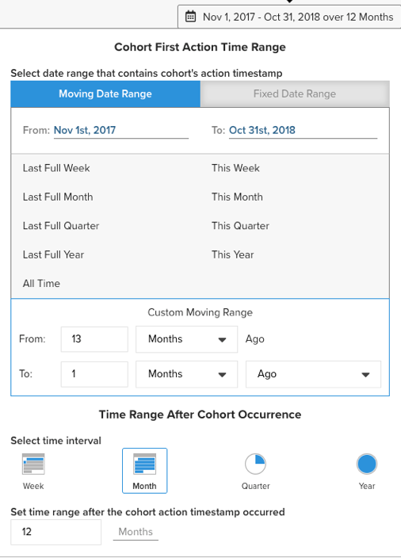

# [!DNL Cohort Report Builder] für nicht-datumsbasierte Kohorten

Die [`Cohort Report Builder`](../dev-reports/cohort-rpt-bldr.md) hilft Händlern dabei, das Verhalten verschiedener Untergruppen von Benutzern im Laufe der Zeit zu untersuchen. In der Vergangenheit wurde die `Cohort Report Builder` für die Gruppierung von Benutzern nach einem gemeinsamen `cohort date` optimiert (z. B. nach der Gruppe aller Kunden, die ihren ersten Kauf in einem bestimmten Monat getätigt haben). Mit der `Non-Date Based Cohort`-Funktion können Benutzer jetzt nach einer ähnlichen Aktivität oder einem ähnlichen Attribut gruppiert werden. Sehen Sie sich einige Anwendungsfälle für diese Funktion an.

## Anwendungsfälle

Dies ist keine umfassende Liste, aber hier sind einige potenzielle Analysen, die mit dieser Funktion durchgeführt werden können.

* Untersuchung der durch [!DNL Google] erzielten Kundeneinnahmen im Vergleich zu [!DNL Facebook]
* Analyse der Kunden, deren erster Kauf in den USA erfolgte, im Vergleich zu Kanada
* Überprüfung des Verhaltens von Kunden, die aus verschiedenen Anzeigenkampagnen gewonnen wurden

## So erstellen Sie Ihre Analyse

1. Klicken Sie auf der linken Registerkarte oder **[!UICONTROL Report Builder]** in einem beliebigen Dashboard auf **[!UICONTROL Add Report** > **Create Report]** .

1. Klicken Sie im `Report Builder Selection` auf **[!UICONTROL Create Report]** neben der Option `Visual Report Builder` .

### Metrik hinzufügen

Jetzt, da Sie sich im `Report Builder` befinden, fügen Sie die Metrik hinzu, für die Sie die Analyse durchführen möchten (Beispiel: `Revenue` oder `Orders`).

>[!NOTE]
>
>Native [!DNL Google Analytics] sind nicht mit dem `Cohort Report Builder` kompatibel. Ziel dieses Beispiels ist es, den Umsatz von Erstkunden, die über verschiedene [!DNL Google Analytics] erworben wurden, im Zeitverlauf zu betrachten.

### `Metric View` zu `Cohort` umschalten

Dadurch wird ein neues Fenster geöffnet, in dem Sie die Details des Kohortenberichts konfigurieren können.

Für die Erstellung eines Kohortenberichts sind fünf Spezifikationen erforderlich:

1. So gruppieren Sie die Kohorten
1. Kohorten auswählen
1. Zeitstempel der Aktion
1. Zeitbereich der ersten Aktion der Kohorte
1. Zeitraum nach dem Kohortenauftreten

<!--{: width="200" height="224"}-->

#### &#x200B;1. `cohorts`

`Cohorts` werden anhand eines Verhaltenscharakteristikums gruppiert, in diesem Beispiel `Customer's first order GA source`. Die hier verfügbaren Optionen sind Spalten, die bereits als `groupable` für die Metrik gekennzeichnet sind.

#### &#x200B;2. Auswahl der Kohorten

Sie können alle Ergebnisse für das angegebene Merkmal anzeigen. Da dies zu vielen `cohorts` führen kann, können Sie die spezifischen `cohorts` (die den verschiedenen für die `Customer's first order GA source` verfügbaren Werten entsprechen) auswählen, die Sie benötigen.

<!--{: width="300" height="338"}-->

#### 3. `Action timestamp`

Auf diese Weise können Sie eine andere datumsbasierte Spalte als die Spalte auswählen, in der die Metrik erstellt wird. Unten können Sie den Zeitraum auswählen, der für die jeweilige `action timestamp` gilt.

#### 4. `Cohort first action time range`

Hier wählen Sie den Datumsbereich aus, der die `cohorts action timestamp` enthält (also Kunden, die die erste Bestellung von November 2017 bis Oktober 2018 hatten). Dies kann ein beweglicher Datumsbereich oder ein fester Datumsbereich sein.

#### 5. `Time range after cohort occurrence`

Möchten Sie die `cohorts` im Zeitverlauf nach Monat, Woche oder Jahr anzeigen? Hier können Sie diese Auswahl treffen. Unter diesem Abschnitt wählen Sie die `time range` aus, nachdem der `cohort action timestamp` aufgetreten ist. Dies zeigt Ihnen beispielsweise Daten zu 12 Monaten für die Kunden, die während des Aktionszeitraums die erste Bestellung aufgegeben haben.

<!--{: width="400" height="557"}-->

>[!NOTE]
>
>[!UICONTROL Filters], die auf Ihre Metriken angewendet werden, bleiben intakt, wenn Sie zwischen `Standard`- und `Cohort` wechseln.

### verwandt

Siehe [`Perspectives`](../../data-analyst/dev-reports/cohort-rpt-bldr.md).
