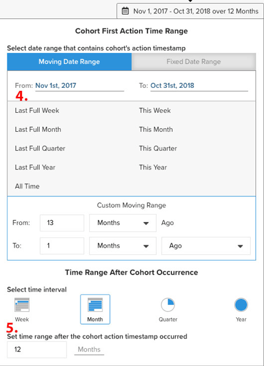

# `Cohort Report Builder for Non-Date-Based Cohorts`

Unsere [`Cohort Report Builder`](../dev-reports/cohort-rpt-bldr.md) hat Händlern dabei geholfen, zu untersuchen, wie sich verschiedene Untergruppen von Benutzern im Laufe der Zeit verhalten. In der Vergangenheit wurde die `Cohort Report Builder` wurde hauptsächlich für die Zusammenfassung von Benutzern nach einem gemeinsamen `cohort date` (z. B. der Satz aller Kunden, die in einem bestimmten Monat ihren ersten Kauf getätigt haben). Die `Non-Date Based Cohort` bietet Ihnen jetzt die Möglichkeit, Benutzer nach einer ähnlichen Aktivität oder einem ähnlichen Attribut zu gruppieren. Sehen Sie sich einige Anwendungsfälle für diese Funktion an.

## Nutzungsszenarios

Dies ist keine umfassende Liste, aber hier sind einige potenzielle Analysen aufgeführt, die mit dieser Funktion durchgeführt werden können:

* Prüfung des Umsatzes, den Kunden durch [!DNL Google] versus [!DNL Facebook]
* Analyse von Kunden, deren erster Kauf in den USA getätigt wurde, im Vergleich zu Kanada
* Betrachten Sie das Verhalten der Kunden, die durch verschiedene Werbekampagnen erworben wurden.

## Erstellen einer Analyse

1. Klicken **[!UICONTROL Report Builder]** auf der linken Registerkarte oder **[!UICONTROL Add Report** > **Create Report]** in jedem Dashboard.

1. Im `Report Builder Selection` Bildschirm, klicken Sie auf **[!UICONTROL Create Report]** neben dem `Visual Report Builder` -Option.

### Hinzufügen einer Metrik

Jetzt sind wir im `Report Builder`, fügen wir die Metrik hinzu, für die wir die Analyse durchführen möchten (Beispiel: `Revenue` oder `Orders`).

>[!NOTE]
>
>Nativ [!DNL Google Analytics] -Metriken sind nicht mit der `Cohort Report Builder`. Unser Ziel für dieses Beispiel ist es, den Umsatz von Erstbestellern, die über verschiedene GA-Quellen erworben wurden, im Laufe der Zeit zu betrachten.

### Umschalten `Metric View` nach `Cohort`

Dadurch wird ein neues Fenster geöffnet, in dem wir die Details des Kohortenberichts konfigurieren können.

Zum Erstellen eines Kohortenberichts sind fünf Spezifikationen erforderlich:

1. Gruppieren der Kohorten
1. Kohorten auswählen
1. Zeitstempel der Aktion
1. Zeitraum der ersten Aktion der Kohorte
1. Zeitraum nach Auftreten der Kohorte

{: width=&quot;200&quot; height=&quot;224&quot;}

{: width=&quot;400&quot; height=&quot;554&quot;}

#### 1. Gruppierung `cohorts`

`Cohorts` werden anhand eines Verhaltenscharakters gruppiert, in diesem Beispiel `Customer's first order GA source`. Beachten Sie, dass es sich bei den hier verfügbaren Optionen um Spalten handelt, die bereits als `groupable` für die Metrik.

#### 2. Auswahl der Kohorten

Sie haben die Möglichkeit, alle Ergebnisse für das angegebene Merkmal anzuzeigen. Da dies zu einer großen Anzahl von `cohorts`, können Sie die spezifische `cohorts` (entspricht den verschiedenen für `Customer's first order GA source`), die Sie benötigen.

<!--{: width="300" height="338"}-->

#### 3. `Action timestamp`

Auf diese Weise können Sie eine datumsbasierte Spalte auswählen, die nicht die Spalte ist, auf der die Metrik erstellt wird. Unten sehen wir, wie wir den Zeitraum auswählen, der für die angegebene `action timestamp`.

#### 4. `Cohort first action time range`

Hier wählen Sie den Datumsbereich aus, der die Variable `cohorts action timestamp` (d. h. Kunden, die die erste Bestellung von November 2017 bis Oktober 2018 aufgegeben haben). Dabei kann es sich um einen sich bewegenden Datumsbereich oder einen festen Datumsbereich handeln.

#### 5. `Time range after cohort occurrence`

Möchten Sie die `cohorts` über Zeit nach Monat, Woche oder Jahr? Hier werden Sie diese Auswahlen treffen. Unter diesem Abschnitt wählen Sie die `time range` nach `cohort action timestamp` aufgetreten. Dies zeigt Ihnen beispielsweise Daten aus zwölf Monaten für die Kunden, die innerhalb des Aktionszeitraums die erste Bestellung aufgegeben haben.

<!--{: width="400" height="557"}-->

### Sonstige Hinweise

* [!UICONTROL Filters]: auf Ihre Metriken angewendet werden, bleiben intakt, wenn Sie zwischen `Standard` und `Cohort` views
* Siehe [`Perspectives`](../../data-analyst/dev-reports/cohort-rpt-bldr.md).
