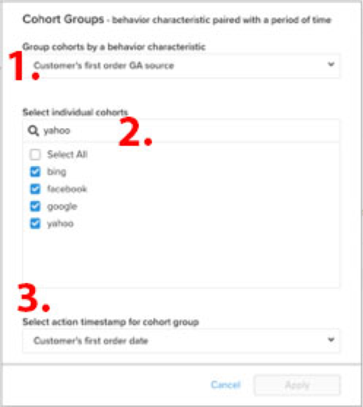

# [!DNL Cohort Report Builder] für nicht datumsbasierte Kohorten

Die [`Cohort Report Builder`](../dev-reports/cohort-rpt-bldr.md) hilft Händlern dabei, zu untersuchen, wie sich verschiedene Untergruppen von Benutzern im Laufe der Zeit verhalten. In der Vergangenheit wurde der `Cohort Report Builder` so optimiert, dass Benutzer nach einem gemeinsamen `cohort date` gruppiert werden können (z. B. nach der Gruppe aller Kunden, die in einem bestimmten Monat ihren ersten Kauf tätigten). Mit der Funktion `Non-Date Based Cohort` können Sie Benutzer nun anhand einer ähnlichen Aktivität oder eines ähnlichen Attributs gruppieren. Sehen Sie sich einige Anwendungsfälle für diese Funktion an.

## Nutzungsszenarios

Dies ist keine umfassende Liste, aber hier sind einige potenzielle Analysen, die mit dieser Funktion durchgeführt werden können.

* Untersuchung des Umsatzes von Kunden, die mit [!DNL Google] und [!DNL Facebook] erworben wurden
* Analyse von Kunden, deren erster Kauf in den USA getätigt wurde, im Vergleich zu Kanada
* Betrachten Sie das Verhalten der Kunden, die durch verschiedene Werbekampagnen erworben wurden.

## Erstellen einer Analyse

1. Klicken Sie auf der linken Registerkarte auf **[!UICONTROL Report Builder]** oder auf **[!UICONTROL Add Report** > **Create Report]** in einem beliebigen Dashboard.

1. Klicken Sie im Bildschirm `Report Builder Selection` auf **[!UICONTROL Create Report]** neben der Option `Visual Report Builder` .

### Hinzufügen einer Metrik

Nun, da Sie sich im `Report Builder` befinden, fügen Sie die Metrik hinzu, für die Sie die Analyse durchführen möchten (Beispiel: `Revenue` oder `Orders`).

>[!NOTE]
>
>Native [!DNL Google Analytics] -Metriken sind nicht mit dem `Cohort Report Builder` kompatibel. Ziel dieses Beispiels ist es, den Umsatz von Erstbestellern, die über verschiedene [!DNL Google Analytics]-Quellen erworben wurden, im Laufe der Zeit zu betrachten.

### Umschalten von `Metric View` auf `Cohort`

Dadurch wird ein neues Fenster geöffnet, in dem Sie die Details des Kohortenberichts konfigurieren können.

Zum Erstellen eines Kohortenberichts sind fünf Spezifikationen erforderlich:

1. Gruppieren der Kohorten
1. Kohorten auswählen
1. Zeitstempel der Aktion
1. Zeitraum der ersten Aktion der Kohorte
1. Zeitraum nach Auftreten der Kohorte

<!--{: width="200" height="224"}-->

#### 1. Gruppierung `cohorts`

`Cohorts` werden nach einem Verhaltenscharakter gruppiert, in diesem Beispiel `Customer's first order GA source`. Die hier verfügbaren Optionen sind Spalten, die bereits als `groupable` für die Metrik gekennzeichnet sind.

#### 2. Auswahl der Kohorten

Sie können alle Ergebnisse für das angegebene Merkmal anzeigen. Da dies zu vielen `cohorts` führen kann, können Sie den gewünschten spezifischen `cohorts` auswählen (was den verschiedenen für `Customer's first order GA source` verfügbaren Werten entspricht).

<!--{: width="300" height="338"}-->

#### 3. `Action timestamp`

Auf diese Weise können Sie eine datumsbasierte Spalte auswählen, die nicht mit der Spalte übereinstimmt, auf der die Metrik erstellt wird. Unten sehen Sie, wie Sie den Zeitraum auswählen, der für den angegebenen `action timestamp` gilt.

#### 4. `Cohort first action time range`

Hier wählen Sie den Datumsbereich aus, der den `cohorts action timestamp` enthält (d. h. Kunden, die die erste Bestellung von November 2017 bis Oktober 2018 hatten). Dabei kann es sich um einen sich bewegenden Datumsbereich oder einen festen Datumsbereich handeln.

#### 5. `Time range after cohort occurrence`

Möchten Sie die `cohorts` über einen Zeitraum nach Monat, Woche oder Jahr sehen? Hier erfolgt die Auswahl. Unter diesem Abschnitt wählen Sie die `time range` aus, nachdem die `cohort action timestamp` aufgetreten ist. Dies zeigt beispielsweise Daten aus 12 Monaten für die Kunden, die innerhalb des Aktionszeitraums die erste Bestellung aufgegeben haben.

<!--{: width="400" height="557"}-->

>[!NOTE]
>
>[!UICONTROL Filters], die auf Ihre Metriken angewendet werden, bleiben intakt, wenn Sie zwischen `Standard` und `Cohort` Ansichten wechseln.

### Verwandte

Siehe [`Perspectives`](../../data-analyst/dev-reports/cohort-rpt-bldr.md).
