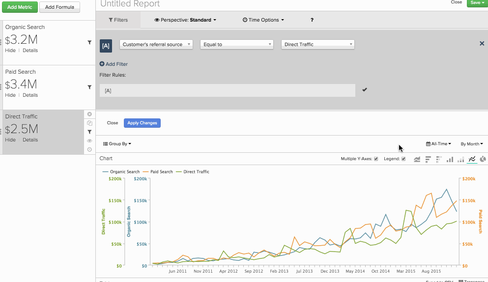

# Erstellen eines `Qualitative Cohort Analysis`

Wissen Sie, wie Ihre [!DNL Google Adwords] Kundensegmente ihren LTV im Vergleich zu den Kunden aus der organischen Suche erweitern? Haben Sie schon einmal daran gedacht, im selben Bericht eine `cohort` Analyse für verschiedene Kundensegmente nebeneinander durchzuführen? Wenn ja, hilft Ihnen ein `qualitative cohort analysis`, diese Fragen zu beantworten.

Dieses Thema geht näher darauf ein, was eine qualitative Kohorte ist, warum Sie möglicherweise am Aufbau dieser Analyse interessiert sind und wie Sie sie in [!DNL Commerce Intelligence] erstellen können.

## Was sind überhaupt `qualitative cohorts`? {#whatare}

`Cohort` Analyse im Allgemeinen kann grob definiert werden als die Analyse von Benutzergruppen, die ähnliche Eigenschaften über ihren Lebenszyklus hinweg aufweisen. So können Sie Verhaltenstrends in verschiedenen Benutzergruppen identifizieren.

Die meisten `cohort` in [!DNL Commerce Intelligence] gruppieren Benutzer nach einem gemeinsamen Datum (z. B. die Gruppe aller Kunden, die ihren ersten Kauf in einem bestimmten Monat getätigt haben). Ein `qualitative cohort` ist etwas Anderes: Es handelt sich um eine Benutzergruppe, die durch ein Merkmal definiert wird, das nicht zeitbasiert ist. Beispiele:

* Die Gruppe aller Benutzer, die von einer Anzeigenkampagne erfasst wurden
* Der Satz aller Benutzer, deren erster Kauf einen Coupon enthielt (oder nicht enthielt)
* Die Gruppe aller Benutzer mit einem bestimmten Alter

## Wie unterscheidet sich das vom normalen `cohort` Builder? {#different}

Die [`Cohort Analysis Builder`](../dev-reports/cohort-rpt-bldr.md) ist für die Gruppierung von Kohorten anhand eines zeitbasierten Merkmals optimiert. Dies eignet sich hervorragend für Analysen, die sich auf ein bestimmtes Segment von Benutzenden konzentrieren (z. B. alle Benutzenden, die über eine Paid-Search-Kampagne erworben wurden). Im `Cohort Analysis Builder` können Sie (1) auf diese bestimmte Benutzergruppe fokussieren und (2) auf ein Datum (wie das Datum der ersten Bestellung) `cohort`.

Wenn Sie jedoch das Kohortenverhalten mehrerer Benutzersegmente im selben Kohortenbericht analysieren möchten (`paid` Suche versus `organic` Suche vs. direkter Traffic, vielleicht?), kann diese erweiterte Analyse im `Report Builder` erstellt werden.

## Welche Informationen sollte ich an den Support senden, um meine Analyse einzurichten? {#support}

Das Erstellen eines `qualitative cohort` in der `Report Builder` beinhaltet, dass das Adobe-Analystenteam einige [erweiterte berechnete Spalten](../data-warehouse-mgr/creating-calculated-columns.md) auf den erforderlichen Tabellen erstellt.

Um diese zu erstellen, reichen Sie ein [Support-Ticket](https://experienceleague.adobe.com/docs/commerce-knowledge-base/kb/troubleshooting/miscellaneous/mbi-service-policies.html?lang=de) ein (und lesen Sie diesen Artikel!). Hier finden Sie, was Sie wissen müssen:

* Die `metric`, mit der Sie Ihre Kohortenanalyse durchführen möchten, und welche Tabelle verwendet wird (Beispiel: `Revenue`, basierend auf der `orders`).

* Die `user segments`, die Sie definieren möchten, und wo diese Informationen in Ihrer Datenbank vorhanden sind (Beispiel: verschiedene Werte von `User's referral source`, die in der `users`-Tabelle enthalten sind und nach unten in die `orders` verschoben wurden).

* Die `cohort date`, die Ihre Analyse verwenden soll (Beispiel: `User's first order date` Zeitstempel). Dieses Beispiel würde es uns ermöglichen, jedes Segment zu betrachten und `How does a user's revenue grow in the months following their first order date?` zu stellen.

* Die `time interval`, über die die Analyse angezeigt werden soll (Beispiel: `weeks`, `months` oder `quarters` nach der `User's first order date`).

Sobald das Adobe-Analyst-Team auf die oben genannten Fragen antwortet, haben Sie einige neue erweiterte berechnete Spalten, um Ihren Bericht zu erstellen! Folgen Sie dazu den unten stehenden Anweisungen.

## Erstellen der qualitativen Kohortenanalyse {#create}

Zunächst möchten Sie die Metrik, die Sie für die Kohorte interessieren, einmal für jedes `cohort` hinzufügen, das Sie analysieren. In diesem Beispiel möchten Sie kumulative `Revenue` sehen, die in den Monaten nach der ersten Bestellung eines Kunden getätigt wurden, und die nach `User's referral source` segmentiert sind. Das bedeutet, dass Sie für jedes Segment eine `Revenue` Metrik hinzufügen und nach dem spezifischen Segment filtern:

Zweitens sollten Sie zwei Änderungen an den Zeitoptionen des Berichts vornehmen:

1. Legen Sie die `time interval` auf `None` fest. Dies liegt daran, dass Sie nach dem Zeitintervall letztendlich als Dimension gruppieren, anstatt die üblichen Zeitoptionen zu verwenden.

1. Legen Sie die `time range` auf das Zeitfenster fest, das der Bericht abdecken soll.

In diesem Beispiel sehen Sie eine `all time` Ansicht von `Revenue`. Danach sollten Sie eine Reihe von Punkten bekommen:

Drittens nehmen Sie die Anpassung vor, um die `cohorts` einzurichten. Basierend auf den `cohort date` und `time interval`, die Sie dem Adobe-Analystenteam angegeben haben, haben Sie eine Dimension in Ihrem Konto, die die `cohort` Datierung durchführt. In diesem Beispiel wird diese benutzerdefinierte Dimension `Months between this order and customer's first order date` genannt. Mit dieser Dimension sollten Sie:

* `Group by` der Dimension mit der Option &quot;`group by`&quot;

* Wählen Sie alle Werte der `dimension` aus, an denen Sie interessiert sind

* Wählen Sie mit dem `Show top/bottom option` die X wichtigsten Monate aus, die Sie interessieren, und sortieren Sie nach der `Months between this order and customer's first order date` Dimension

Jetzt können Sie für jede angegebene `cohort` eine Zeile sehen. Sehen Sie sich jetzt das Beispiel an - Sie sehen die von den Benutzern jeder Empfehlungsquelle beigesteuerten `Revenue`, `grouped by` die Anzahl der Monate zwischen ihrer ersten Bestellung und jeder nachfolgenden Bestellung. Im Beispiel wurde auch ein `Cumulative perspective` hinzugefügt, um das `cohorts'` Gesamtwachstum anzuzeigen. Weitere Details finden Sie in der Ergebnistabelle.

Was sagt uns das? Hier ist die spezifische `Paid search` für Empfehlungen im ersten Monat des Kauflebens eines Kunden wertvoll, kann jedoch seinen Kundenstamm nicht mit wiederholten Umsätzen halten. Während `Direct Traffic` mit einem niedrigeren Betrag beginnt, akkumulieren sich die Einnahmen in den folgenden Monaten tatsächlich mit einer ähnlichen Geschwindigkeit.

Egal, wie Sie es drehen: `cohort` Analyse ist ein leistungsstarkes Tool in Ihrer Analyse-Toolbox. Diese Art der Analyse kann zu einigen interessanten Einblicken in Ihr Unternehmen führen, die in herkömmlichen `time-based cohorts` möglicherweise nicht vorhanden sind, sodass Sie bessere datengestützte Entscheidungen treffen können.
