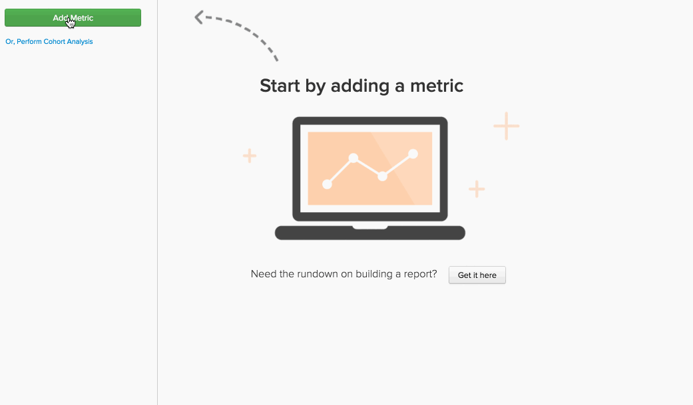

# Formeln in der `Report Builder`

In der [`Report Builder`](../../tutorials/using-visual-report-builder.md) können Sie mit den [definierten Metriken“ in &#x200B;](../../data-user/reports/ess-manage-data-metrics.md) Konto leistungsstarke Visualisierungen erstellen. Durch die Kombination dieser Metriken in einer Formel können Sie zusätzliche Einblicke aus Ihren Daten gewinnen. Dieses Thema taucht ein in die Verwendung von Formeln im `Report Builder` - lasst uns einsteigen!

## Was ist ein `formula`? {#what}

In der `Report Builder` ist eine `formula` nur eine Kombination aus einer oder mehreren Metriken, die auf einer mathematischen Logik basieren. Ein typisches Beispiel sieht wie folgt aus:

In diesem Beispiel verwenden Sie eine `Number of orders metric (A)` und eine `Distinct buyers metric (B)`, um folgende Frage zu beantworten: Wie viele Bestellungen tätigen meine Käufer im Durchschnitt jeden Monat? Die Parameter der Formel sind:

* `Definition`: Hier wenden Sie Mathematik auf die Eingabemetriken an. In diesem Beispiel gibt die Division der Anzahl der Bestellungen durch die Anzahl der einzelnen Käufer Aufschluss über die durchschnittliche Anzahl der Bestellungen. Daher lautet die Definition (A/B).

* `Format`: Gibt Ihre Formel eine Zahl, einen Zeitraum oder einen Währungsbetrag zurück? Neben der Definition der Formel befindet sich ein Dropdown-Menü, mit dem Sie das Format der Rückgabe angeben können. In diesem Fall ist es eine Zahl.

* `Miscellaneous`: Zeitstempel, Gruppierungen, Perspektiven und Filter der Formel werden alle von den Eingabemetriken übernommen. Hier gibt es nichts zu tun!

## Wie kann ich `formulas` in meinen Berichten verwenden? {#how}

Nachdem Sie nun die Grundlagen behandelt haben, sehen Sie sich einige Beispiele an.

### Beispiel: Ich möchte herausfinden, wie viel Prozent meines Umsatzes auf Erstbestellungen entfallen.

In diesem Beispiel haben Sie die Metriken `Revenue` und `Revenue (first time orders)` verwendet. Indem Sie die `Revenue (first time orders)(B)` durch die `Revenue metric (A)` teilen und das Rückgabeformat auf `Percent` setzen, können Sie den Prozentsatz des Umsatzes ermitteln, der Erstbestellungen zugeordnet werden kann.

### Beispiel: Ich möchte wissen, wie der durchschnittliche Umsatz pro Bestellung ist, wenn ich eine `promo code` anbiete und nicht.

In diesem Beispiel haben Sie die Metriken `Revenue` und `Number of orders` verwendet. Die Antwort auf diese Frage umfasst zwei Schritte: `Revenue (A)` durch die `Number of orders (B)` teilen und das Rückgabeformat auf `Currency` festlegen. Als Nächstes haben Sie nur zugelassen, dass das Formelergebnis (`Avg. Revenue per order`) angezeigt und die Ergebnisse nach `Promo code` gruppiert werden.

### Beispiel: Ich möchte den Vertrieb der UTM-Quellen meiner neuen Kunden wissen.

Um die Antwort auf diese Frage zu finden, sind einige Schritte erforderlich:

1. Zuerst haben Sie die `New Customers` Metrik hinzugefügt und dann nach `utm_source - all` gruppiert. Dies ist die Metrik `A` oder `New Customers (grouped)`.

1. Als Nächstes haben Sie die `New Customers (grouped)` dupliziert und sie auf die Verwendung einer unabhängigen Dimension festgelegt. Metrik `B` - `New customers (ungrouped)` - zeigt die Gesamtzahl der neuen Kunden an.

1. Nachdem Sie beide Metriken ausgeblendet haben, legen Sie für die Formeldefinition `A/B` fest. Das teilt die `New customers (grouped)` durch die `New Customers (ungrouped)`.

1. Als Nächstes legen Sie das Ergebnisformat auf `Percent` fest.

In diesem Beispiel haben Sie die `Stacked Columns` Perspektive verwendet, um die Ergebnisse nach Monat anzuzeigen. Auf diese Weise können wir die Verteilung neuer Kunden von Monat zu Monat vergleichen.

## Verpackung {#wrapup}

Ist Ihnen in den obigen Beispielen aufgefallen, dass die `timestamp`, `groupings`, `perspectives` und `filters` der Formel von den Eingabemetriken übernommen werden? Denken Sie daran, dass Formeln für die Verwendung von `perspectives` und [unabhängigen Zeitoptionen](../../tutorials/time-options-visual-rpt-bldr.md){: target="_blank"} verwendet werden können, genau wie Metriken.

Wenn Sie weitere Fragen zur Verwendung von Formeln in der `Report Builder` haben, wenden Sie [&#x200B; an den &#x200B;](https://experienceleague.adobe.com/docs/commerce-knowledge-base/kb/troubleshooting/miscellaneous/mbi-service-policies.html).
