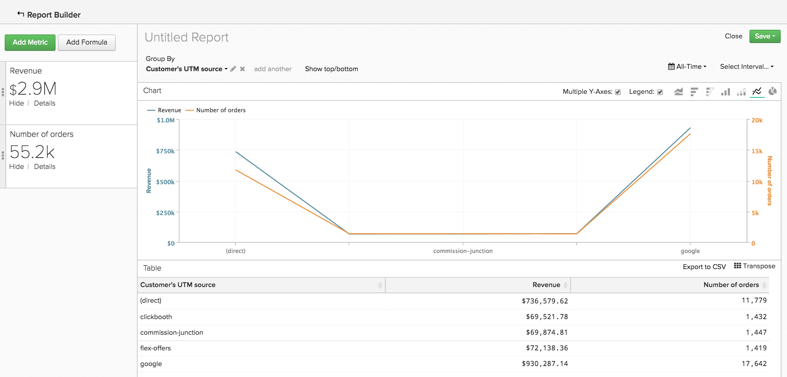

# Sortieren von Daten mit `Show Top/Bottom` Funktion

Sie können in der `Visual Report Builder` mehr tun als Analysen zu erstellen, die sich im Laufe der Zeit entwickeln. Sie können beispielsweise einen Bericht erstellen, der den Wert Ihrer Akquise- und Marketing-Kanäle aufzeigt, aber auch einen Bericht, der nur die fünf leistungsstärksten Kanäle ausgibt. Ebenso können Sie Ihre Marketing-Maßnahmen neu ausrichten, indem Sie einen Bericht erstellen, der Ihnen zeigt, welche Bundesstaaten den meisten Umsatz generieren.

Diese Art der Sortierung und Sortierung von Daten kann in Berichten vorgenommen werden, die sowohl eine `Group By` als auch eine `Time Interval of None` verwenden. Wenn sich diese beiden Elemente in einem Bericht befinden, wird die `Show Top/Bottom` Funktion über der Diagrammvorschau angezeigt. Mit dieser Funktion können Sie die oberen (höchsten zu niedrigsten) und unteren (niedrigsten zu höchsten) Datenpunkte basierend auf den von Ihnen festgelegten Parametern anzeigen.

## Wie verwende ich das? {#how}

Klicken Sie auf die **[!UICONTROL Show Top/Bottom link]**, um die Anzeige- und Sortierparameter festzulegen. Die Zahl im Textfeld kann entweder eine Ganzzahl (wie `5`) oder `ALL` sein. Als Nächstes können Sie den Bericht entweder nach Metrik ODER nach Gruppierung sortieren.

Wenn Sie beispielsweise die fünf Empfehlungsquellen anzeigen möchten, die den höchsten Umsatz gebracht haben, tun Sie dies wie folgt:

1. Fügen Sie die `Revenue` Metrik zum Bericht hinzu.

1. Fügen Sie der Metrik eine `Group By` nach Empfehlungsquelle hinzu.

1. Legen Sie `Time Interval` auf `None` fest.

1. Legen Sie in den `Show Top/Bottom` Einstellungen die Anzeige auf `5` fest, sodass nur die Empfehlungsquellen mit den fünf größten Gesamtumsatzbeträgen im Bericht enthalten sind.

>[!NOTE]
>
>Da der Bericht keine `Time Interval` hat, können sich die Werte - in diesem Fall die fünf häufigsten Empfehlungsquellen - im Laufe der Zeit ändern. Wenn eine Empfehlungsquelle eine andere hinsichtlich des Umsatzes übertrifft, ändert sich die Reihenfolge, in der die Quellen angezeigt werden.

## Wie sieht es mit der Verwendung mehrerer Metriken aus? {#multiplemetrics}

Die Verwendung dieser Funktion wird kompliziert, wenn ein Bericht mehr als eine Metrik enthält, da jede Metrik nur für sich selbst oder nach einer der Gruppierungen sortiert werden kann.

Angenommen, Sie haben einen Bericht mit den Metriken `Revenue` und `Number of orders` erstellt, gruppiert nach Empfehlungsquelle. `Revenue` können nur nach `Revenue` oder Verweisquelle sortiert werden und `Number of orders` nur nach `Number of orders` oder Verweisquelle.

Das bedeutet, dass Sie zwar nur die `Revenue` aus den `5` umsatzgenerierenden Verweisquellen anzeigen können, aber nicht die Anzahl der Bestellungen auch nach den `5` umsatzgenerierenden Verweisquellen anzeigen können. Einfach ausgedrückt: Wenn mehrere Metriken vorhanden sind, ist es am besten, jede Metrik nach Gruppierung zu sortieren.

Nachfolgend finden Sie ein Beispiel für ein Diagramm, in dem die `Revenue`-Metrik nach sich selbst und nicht nach der Gruppierung sortiert wird. Wie zu sehen ist, wird die Metrik nicht nach der Gruppierung sortiert, sondern ein seltsamer (und letztendlich nicht hilfreicher) Bericht erstellt:

Wenn Sie beide Metriken nach Gruppierung sortiert hätten, würde das Diagramm wie folgt aussehen:

## Wie werden Werte standardmäßig sortiert? {#defaultsorting}

Wenn in einem Bericht mit einer `Group by` und einer `Time Interval` von `None` nur eine Metrik enthalten ist, besteht die Standardreihenfolge in der `Visual Report Builder` darin, die höchsten Werte basierend auf der Metrik anzuzeigen. In diesem Fall ist die `Show Top/Bottom` möglicherweise nicht erforderlich, wenn dies Ihren Anforderungen entspricht.

In diesem Beispiel wird gezeigt, wie viele Opportunities Ihre Vertriebsmitarbeiter geschlossen haben. Diese Tabelle wird anhand der Metrik automatisch vom höchsten zum niedrigsten Wert sortiert, in diesem Fall `Won Opportunities`.

Wenn jedoch eine zweite Metrik hinzugefügt wird, besteht die Standardeinstellung darin, die Spitze basierend auf der Gruppierung zu sortieren. Beim Hinzufügen von Metriken und Gruppierungen basiert die Standardsortierung auf der ersten Gruppierung, der zweiten Gruppierung usw.

## Verpackung {#wrapup}

Während einige grundlegende Funktionen hier behandelt werden, hat diese Funktion viele interessante Verwendungen.

Denken Sie an das Beispiel des vorherigen Vertriebsmitarbeiters und an die Verkaufschancen. Durch das Entfernen der `Time Interval`, das Anwenden einer `Group By` und das Sortieren der Daten basierend auf der Gruppierung konnten wir uns ein detailliertes Bild über die Anzahl der gewonnenen Opportunitys jedes Partners verschaffen. Außerdem können wir mithilfe der `Show Top/Bottom`-Funktion herausfinden, wer die besten Ergebnisse erzielt.
