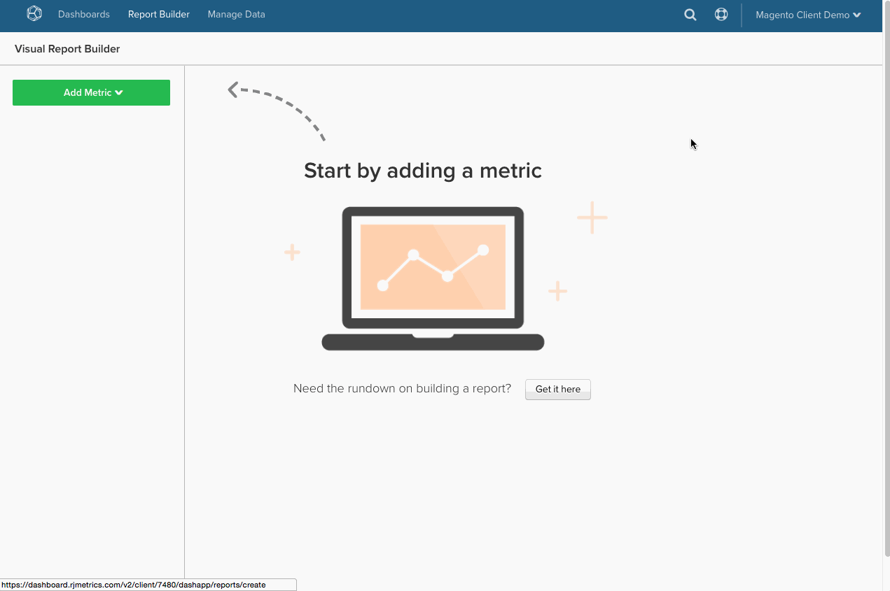
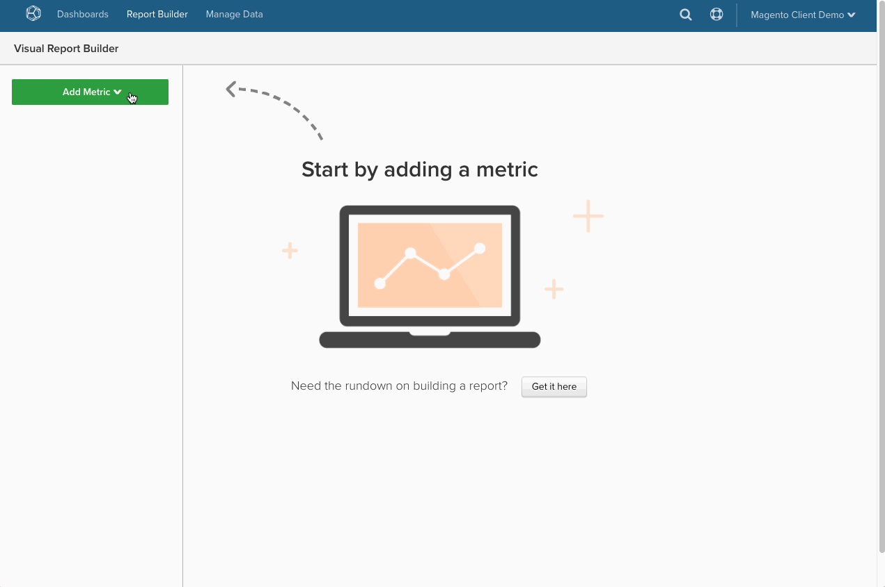

# SQL-Abfragen in Commerce Intelligence übersetzen

Haben Sie sich schon immer gefragt, wie SQL-Abfragen in die [berechnete Spalten](../data-warehouse-mgr/creating-calculated-columns.md), [Metriken](../../data-user/reports/ess-manage-data-metrics.md)und [Berichte](../../tutorials/using-visual-report-builder.md) Sie verwenden [!DNL Commerce Intelligence]? Wenn Sie ein starker SQL-Benutzer sind, sollten Sie wissen, wie SQL übersetzt wird in [!DNL Commerce Intelligence] ermöglicht es Ihnen, im [Data Warehouse Manager](../data-warehouse-mgr/tour-dwm.md) und das Beste aus dem [!DNL Commerce Intelligence] Plattform.

Am Ende dieses Themas finden Sie eine **Übersetzungsmatrix** für SQL-Abfrageklauseln und [!DNL Commerce Intelligence] -Elemente.

Sehen Sie sich zunächst eine allgemeine Abfrage an:

| | |
|--- |--- |
| `SELECT` |  |
| `a,` | Bericht `group by` |
| `SUM(b)` | `Aggregate function` (Spalte) |
| `FROM c` | `Source` table |
| `WHERE` |  |
| `d IS NOT NULL` | `Filter` |
| `AND time < X`   `AND time >= Y` | Bericht `time frame` |
| `GROUP BY a` | Bericht `group by` |

In diesem Beispiel werden die meisten Übersetzungsfälle behandelt, es gibt jedoch einige Ausnahmen. Eintauchen, beginnend mit dem `aggregate` -Funktion übersetzt wird.

## Aggregat-Funktionen

Aggregatfunktionen (z. B. `count`, `sum`, `average`, `max`, `min`) in Abfragen entweder in folgender Form: **Metrikaggregationen** oder **Spaltenaggregationen** in [!DNL Commerce Intelligence]. Der Differenzierungsfaktor ist, ob ein Join erforderlich ist, um die Aggregation durchzuführen.

Sehen Sie sich für jeden der oben genannten Beispiele an.

## Metrikaggregationen {#aggregate}

Bei der Aggregation von `within a single table`. Beispielsweise wird die `SUM(b)` Aggregatfunktion aus der obigen Abfrage würde höchstwahrscheinlich durch eine Metrik dargestellt, die die Spalte summiert `B`. 

Sehen Sie sich ein bestimmtes Beispiel an, wie ein `Total Revenue` Metriken können in [!DNL Commerce Intelligence]. Sehen Sie sich die nachstehende Abfrage an, mit der Sie versuchen zu übersetzen:

| | |
|--- |--- |
| `SELECT` |  |
| `SUM(order_total) as "Total Revenue"` | `Metric operation` (Spalte) |
| `FROM orders` | `Metric source` table |
| `WHERE` |  |
| `email NOT LIKE '%@magento.com'` | Metrik `filter` |
| `AND created_at < X`  `AND created_at >= Y` | Metrik `timestamp` (und Berichterstattung) `time range`) |

Navigieren Sie zum Metrikaufbau durch Klicken auf **[!UICONTROL Manage Data** > ** Metriken **> **Neue Metrik erstellen]**, müssen Sie zuerst die entsprechende `source` -Tabelle, die in diesem Fall der `orders` Tabelle. Anschließend würde die Metrik wie folgt eingerichtet:

## Spaltenaggregationen

Eine berechnete Spalte ist erforderlich, wenn eine Spalte aggregiert wird, die aus einer anderen Tabelle verbunden ist. So kann beispielsweise eine Spalte in der `customer` Tabelle mit `Customer LTV`, die den Gesamtwert aller mit diesem Kunden verbundenen Bestellungen im `orders` Tabelle.

Die Abfrage für diese Aggregation kann etwa wie folgt aussehen:

|  |  |
|--- |--- |
| `Select` | |
| `c.customer_id` | Aggregat-Eigentümer |
| `SUM(o.order_total) as "Customer LTV"` | Aggregat-Vorgang (Spalte) |
| `FROM customers c` | Aggregat-Eigentümertabelle |
| `JOIN orders o` | Aggregations-Quelltabelle |
| `ON c.customer_id = o.customer_id` | Pfad |
| `WHERE o.status = 'success'` | Aggregat-Filter |

Einrichten des [!DNL Commerce Intelligence] erfordert die Verwendung Ihres Data Warehouse-Managers, in dem Sie einen Pfad zwischen Ihrem `orders` und `customers` und erstellen Sie dann eine Spalte namens `Customer LTV` in der Tabelle Ihres Kunden.

Untersuchen Sie, wie Sie einen neuen Pfad zwischen dem `customers` und `orders`. Das Endziel besteht darin, eine neue aggregierte Spalte im `customers` -Tabelle, also navigieren Sie zuerst zur `customers` in der Data Warehouse angezeigt werden, klicken Sie auf **[!UICONTROL Create a Column** > ** Definition auswählen **> **SUM]**.

Wählen Sie anschließend die Quelltabelle aus. Wenn ein Pfad zu Ihrer `orders` -Tabelle aus, wählen Sie sie einfach aus der Dropdown-Liste aus. Wenn Sie jedoch einen neuen Pfad erstellen, klicken Sie auf **[!UICONTROL Create new path]** und Ihnen wird der folgende Bildschirm angezeigt:

Hier müssen Sie die Beziehung zwischen den beiden Tabellen, denen Sie beitreten möchten, sorgfältig überdenken. In diesem Fall gibt es `Many` Bestellungen, die mit `One` -Kunde, also `orders` ist auf der `Many` Seite, während die `customers` auf der `One` Seite.

>[!NOTE]
>
>In [!DNL Commerce Intelligence], `path` entspricht einem `Join` in SQL.

Nachdem der Pfad gespeichert wurde, können Sie die `Customer LTV` column! Siehe unten:

Jetzt, da Sie die neue `Customer LTV` in der Spalte `customers` -Tabelle, können Sie eine [Metrikaggregation](#aggregate) Verwendung dieser Spalte (z. B. zur Ermittlung der durchschnittlichen LTV-Anzahl pro Kunde). Sie können auch `group by` oder `filter` durch die berechnete Spalte in einem Bericht mit vorhandenen Metriken, die auf der `customers` Tabelle.

>[!NOTE]
>
>Für letztere müssen Sie jedes Mal, wenn Sie eine neue berechnete Spalte erstellen, [Dimension zu vorhandenen Metriken hinzufügen](../data-warehouse-mgr/manage-data-dimensions-metrics.md) bevor sie als `filter` oder `group by`.

Siehe [berechnete Spalten erstellen](../data-warehouse-mgr/creating-calculated-columns.md) mit Ihrem Data Warehouse Manager.

## `Group By` Klauseln

`Group By` Funktionen in Abfragen werden häufig in [!DNL Commerce Intelligence] als Spalte zur Segmentierung oder Filterung eines visuellen Berichts. Beispiel: `Total Revenue` Abfrage, die Sie zuvor untersucht haben, aber diesmal den Umsatz nach `coupon\_code` um ein besseres Verständnis davon zu gewinnen, welche Gutscheine den meisten Umsatz generieren.

Beginnen Sie mit der folgenden Abfrage:

| | |
|--- |--- |
| `SELECT coupon_code,` | Bericht `group by` |
| `SUM(order_total) as "Total Revenue"` | `Metric operation`(Spalte) |
| `FROM orders` | `Metric source` table |
| `WHERE` |  |
| `email NOT LIKE '%@magento.com'` | Metrik `filter` |
| `AND created_at < '2016-12-01'`   `AND created_at >= '2016-09-01'` | Metrik `timestamp` (und Berichterstattung) `time range`) |
| `GROUP BY coupon_code` | Bericht `group by` |

>[!NOTE]
>
>Der einzige Unterschied zu der Abfrage, mit der Sie zuvor begonnen haben, besteht darin, dass &quot;coupon\_code&quot;als Gruppe von hinzugefügt wird._

Verwenden des gleichen `Total Revenue` Metrik, die Sie zuvor erstellt haben, können Sie jetzt Ihren Bericht mit dem Umsatz erstellen, der durch Couponcode segmentiert wurde! Sehen Sie sich das unten stehende GIF an, in dem gezeigt wird, wie dieser visuelle Bericht mit Daten von September bis November eingerichtet wird:

## Formeln

Manchmal kann eine Abfrage mehrere Aggregationen umfassen, um die Beziehung zwischen verschiedenen Spalten zu berechnen. Sie können beispielsweise den durchschnittlichen Bestellwert in einer Abfrage auf zwei Arten berechnen:

* `AVG('order\_total')` ODER
* `SUM('order\_total')/COUNT('order\_id')`

Die frühere Methode würde die Erstellung einer neuen Metrik beinhalten, die einen Durchschnittswert für die `order\_total` Spalte. Die letztgenannte Methode kann jedoch direkt im ReportBuilder erstellt werden, vorausgesetzt, Sie verfügen bereits über Metriken zur Berechnung der `Total Revenue` und `Number of orders`.

Gehen Sie einen Schritt zurück und prüfen Sie die Gesamtabfrage für `Average order value`:

| | |
|--- |--- |
| `SELECT` |  |
| `SUM(order_total) as "Total Revenue"` | Metrik `operation` (Spalte) |
| `COUNT(order_id) as "Number of orders"` | Metrik `operation` (Spalte) |
| `SUM(order_total)/COUNT(order_id) as "Average order value"` | Metrik `operation` (Spalte) / Metrikvorgang(Spalte) |
| `FROM orders` | Metrik `source` table |
| `WHERE` |  |
| `email NOT LIKE '%@magento.com'` | Metrik `filter` |
| `AND created_at < '2016-12-01'`  `AND created_at >= '2016-09-01'` | Metrikzeitstempel (und Berichtszeitbereich) |

Nehmen Sie nun an, dass Sie bereits Metriken zur Berechnung der `Total Revenue` und `Number of orders`. Da diese Metriken vorhanden sind, können Sie einfach die `Report Builder` und erstellen Sie eine On-Demand-Berechnung mithilfe der Variablen `Formula` Funktion:

## Aufbrechen

Wenn Sie ein starker SQL-Benutzer sind, denken Sie darüber nach, wie Abfragen in übersetzt werden. [!DNL Commerce Intelligence] ermöglicht die Erstellung berechneter Spalten, Metriken und Berichte.

Sehen Sie sich die folgende Matrix für einen schnellen Überblick an. Dies zeigt die Entsprechung einer SQL-Klausel [!DNL Commerce Intelligence] -Element und wie es mehreren Elementen zugeordnet werden kann, je nachdem, wie es in der Abfrage verwendet wird.

## Commerce Intelligence-Elemente

| **`SQL Clause`** | **`Metric`** | **`Filter`** | **`Report group by`** | **`Report time frame`** | **`Path`** | **`Calculated column inputs`** | **`Source table`** |
|---|---|---|---|---|---|---|---|
| `SELECT` | X | - | X | - | - | X | - |
| `FROM` | - | - | - | - | - | - | X |
| `WHERE` | - | X | - | - | - | - | - |
| `WHERE` (mit Zeitelementen) | - | - | - | X | - | - | - |
| `JOIN...ON` | - | X | - | - | X | X | - |
| `GROUP BY` | - | - | X | - | - | - | - |
