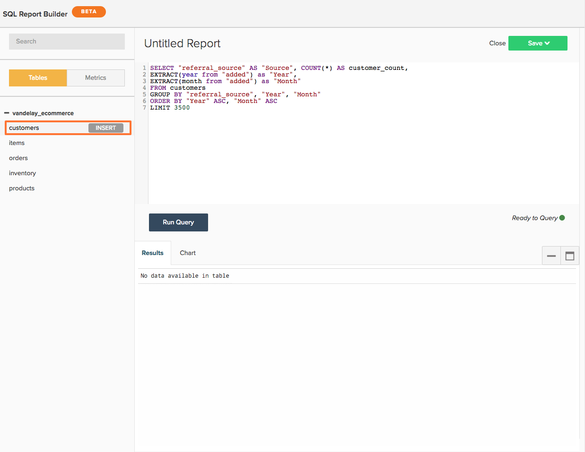

# Verwenden `SQL Report Builder`

>[!NOTE]
>
>Erfordert [Administratorberechtigungen](../../administrator/user-management/user-management.md) , um SQL-Diagramme zu erstellen und zu bearbeiten. `Standard` Benutzer können diese Diagramme in Dashboards neu anordnen und `Read-only` -Benutzer haben dasselbe Erlebnis wie herkömmliche Diagramme. Darüber hinaus `Read-only` -Benutzer haben keinen Zugriff auf den Text der Abfrage.

Siehe [Schulungsvideo](https://experienceleague.adobe.com/docs/commerce-knowledge-base/kb/how-to/mbi-training-video-sql-report-builder.html?lang=en) , um mehr zu erfahren.

`SQL`, oder Structured Query Language, ist eine Programmiersprache, die zur Kommunikation mit Datenbanken verwendet wird. In [!DNL MBI], wird SQL verwendet, um Daten aus Ihrem Data Warehouse abzufragen oder abzurufen. Sehen Sie sich die Berichte in Ihrem Dashboard an - hinter den Kulissen basiert jeder auf einer SQL-Abfrage.

Sie können die [`SQL Report Builder`](../dev-reports/sql-rpt-bldr.md) um Data Warehouse direkt abzufragen, die Ergebnisse anzuzeigen und in ein Diagramm umzuwandeln. Sie können mit der Erstellung eines Berichts beginnen, indem Sie `SQL Report Builder` durch Navigation zu **[!UICONTROL Report Builder** > **SQL Report Builder]**.

Siehe [Schulungsvideo](https://experienceleague.adobe.com/docs/commerce-knowledge-base/kb/how-to/mbi-training-video-sql-report-builder.html?lang=en) , um mehr zu erfahren.

Die `SQL Report Builder` ermöglicht Ihnen, Data Warehouse direkt abzufragen, die Ergebnisse anzuzeigen und sie schnell in ein Diagramm umzuwandeln. Das Beste an der Verwendung von SQL zum Erstellen von Berichten besteht darin, dass Sie nicht auf Aktualisierungszyklen warten müssen, um die von Ihnen erstellten Spalten zu iterieren. Wenn die Ergebnisse nicht richtig aussehen, können Sie die Abfrage schnell bearbeiten und erneut ausführen, bis die Ergebnisse Ihren Erwartungen entsprechen.

In diesem Artikel führen wir Sie durch die Verwendung der `SQL Report Builder`. Nachdem Sie Ihren Umweg kennen, sehen Sie sich unser Tutorial SQL für Visualisierungen an oder versuchen Sie, einige der von Ihnen geschriebenen Abfragen zu optimieren.

Hier finden Sie eine Übersicht darüber, was wir in diesem Artikel behandeln:

1. [Schreiben von Abfragen](#writing)

1. [Ausführen der Abfrage und Anzeigen der Ergebnisse](#runquery)

1. [Erstellen einer Visualisierung](#createviz)

1. [Bericht speichern](#save)

## SQL Report Builder-Integrationen

Im gegenwärtigen Zustand der Welt [[!DNL Google Analytics]](../importing-data/integrations/google-analytics.md) ist die einzige Integration, die nicht für die Verwendung mit der [`SQL Report Builder`](../dev-reports/sql-rpt-bldr.md). Wir arbeiten daran, diese Funktion in eine spätere Version aufzunehmen.

Um mit der Erstellung eines neuen SQL-Berichts zu beginnen, klicken Sie auf **[!UICONTROL Report Builder]** oder **[!UICONTROL Add Report]** oben in jedem Dashboard. Im `Report Picker` Bildschirm, klicken Sie auf **[!UICONTROL SQL Report Builder]** , um den SQL-Editor zu öffnen.

## Erste Schritte

Um einen Bericht zu bearbeiten, klicken Sie auf das Zahnrad () oben rechts in einem SQL-basierten Diagramm und klicken Sie auf **[!UICONTROL Edit]**.

## Schreiben von Abfragen {#writing}

>[!NOTE]
>
>`SQL Report Builder` bei Abfragen wird zwischen Groß- und Kleinschreibung unterschieden. Stellen Sie sicher, dass Sie beim Schreiben von Abfragen die richtige Groß-/Kleinschreibung verwenden, oder Sie können unerwartete Ergebnisse oder Fehler erzeugen.

Im Folgenden [Richtlinien zur Abfrageoptimierung](../../best-practices/optimizing-your-sql-queries.md), schreiben Sie eine Abfrage in den SQL-Editor.

>[!IMPORTANT]
>
>**Metriken in SQL-Berichten** - Wenn Sie eine Metrik in einen SQL-Bericht einfügen, wird die `current definition` verwendet.

Wenn die Metrik in der Zukunft aktualisiert wird, wird der SQL-Bericht *nicht* die Änderungen widerspiegeln. Sie müssen den Bericht manuell bearbeiten, damit die Änderungen wirksam werden.

Mit den Schaltflächen am oberen Rand der Seitenleiste können Sie zwischen Tabellen- und Metriklisten umschalten, die in der Variablen `SQL Report Builder`. Wenn Sie nicht sehen, wonach Sie in der Liste suchen, versuchen Sie, mithilfe der Suchleiste oben in der Seitenleiste danach zu suchen.

Sie können auch die Seitenleiste im SQL-Editor verwenden, um Metriken, Tabellen und Spalten direkt in Ihre Abfragen einzufügen, indem Sie den Mauszeiger darüber bewegen und auf **[!UICONTROL Insert]**:

>[!NOTE]
>
>Alle [SELECT-Funktion](https://www.postgresql.org/docs/9.5/sql-select.html#SQL-SELECT-LIST)oder einer Funktion, die keine Daten mutiert, die von PostgreSQL unterstützt wird, wird im SQL-Report Builder unterstützt. Dazu gehören AVG, COUNT, COUNT, COUNT DISTINCT, MIN/MAX und SUM.

Auch jeder JOIN-Typ wird unterstützt. Wir empfehlen jedoch nur die Verwendung von INNER JOIN, da dies der kostengünstigste der JOIN-Typen ist.

## Ausführen der Abfrage und Anzeigen der Ergebnisse {#runquery}

Wenn Sie Ihre Abfrage geschrieben haben, klicken Sie auf **[!UICONTROL Run Query]**. Die Ergebnisse werden in einer Tabelle unter dem SQL-Editor angezeigt:

Wenn in den Ergebnissen ein falsches Ergebnis auftritt, können Sie die Abfrage bearbeiten und erneut ausführen, bis Sie zufrieden sind.

Manchmal wird [Meldungen unterhalb des Editors mit EXPLAIN](../../best-practices/optimizing-your-sql-queries.md). Wenn eine davon angezeigt wird, bedeutet dies, dass Ihre Abfrage nicht ausgeführt wurde und eine kleine Feinabstimmung erforderlich ist.

Nachdem Sie die Bearbeitung Ihrer Abfrage abgeschlossen haben, können Sie entweder eine Visualisierung erstellen oder Ihre Arbeit in einem Dashboard speichern.

## Erstellen einer Visualisierung {#createviz}

Um eine Visualisierung mit Ihren Abfrageergebnissen zu erstellen, klicken Sie auf die Schaltfläche **[!UICONTROL Chart]** im `Results` -Bereich. Auf dieser Registerkarte wählen Sie Folgendes aus:

* Die `Series`oder der Spalte, die Sie messen möchten, z. B. **Verkaufte Artikel**.
* Die `Category`oder der Spalte, die Sie zur Segmentierung Ihrer Daten verwenden möchten, z. B. **Akquisequelle**.
* Die `Labels`oder X-Achsenwerte.

Hier sehen Sie, wie der Visualisierungsprozess aussieht:

Eine ausführliche Anleitung zum Erstellen einer Visualisierung finden Sie in unserer [Tutorial zum Erstellen von Visualisierungen aus SQL-Abfragen](../../tutorials/create-visuals-from-sql.md){: target=&quot;_blank&quot;}.

## Bericht speichern {#save}

Bevor Sie Ihre Arbeit speichern können, müssen Sie dem Bericht einen Namen geben. Denken Sie daran, dem [Best Practice-Richtlinien für die Benennung](../../best-practices/naming-elements.md){: target=&quot;_blank&quot;} und wählen Sie etwas aus, das deutlich vermittelt, was der Bericht ist!

Klicken **[!UICONTROL Save]** oben rechts im SQL-Editor und wählen Sie den Bericht aus. `Type` (`Chart` oder `Table`). Um die Elemente einzuschließen, wählen Sie das Dashboard aus, in dem der Bericht gespeichert werden soll, und klicken Sie auf **[!UICONTROL Save to Dashboard]**.

### Daten analysieren

#### `SQL Report Builder`

[`The SQL Report Builder`](../dev-reports/sql-rpt-bldr.md) bietet Ihnen die Möglichkeit, Data Warehouse direkt abzufragen, die Ergebnisse anzuzeigen und sie schnell in einen Bericht umzuwandeln. Mit SQL können Sie auch [zur Verwendung nicht verfügbarer SQL-Funktionen](https://docs.aws.amazon.com/redshift/latest/dg/c_SQL_functions.html) im `Visual` oder `Cohort` Report Builder, sodass Sie mehr Kontrolle über Ihre Daten haben.

Wir möchten erwähnen, dass berechnete Spalten, die mit SQL erstellt wurden, nicht von Aktualisierungszyklen abhängig sind, d. h., Sie können sie wie gewünscht durchlaufen und sofort Ergebnisse sehen.

>[!NOTE]
>
>Dies gilt nur für die Struktur der Spalte, nicht für die Aktualisierung der Daten. Neue Daten hängen weiterhin von erfolgreich abgeschlossenen Aktualisierungszyklen ab.

| **Das ist perfekt für ...** | **Das ist nicht so toll für ...** |
|---|---|
| Vermittelnde/erweiterte Analysten | Anfänger - Sie müssen SQL kennen. |
| SQL-Speicherung | Einfache Analysen - das Schreiben einer Abfrage kann mehr als nur die Verwendung des Visual Report Builder sein. |
| Erstellen von einmaligen berechneten Spalten | Freigabe für andere - denken Sie an Ihre Zielgruppe: Verstehen sie SQL? Andernfalls kann die Erstellung des Berichts verwirrt sein. |
| Daten mit `one-to-many` Beziehungen |  |
| Testen einer neuen Spalte oder Analyse |  |

#### Datenbank vs. SQL Editor-Ergebnisse

Meistens können Unterschiede in den Ergebnissen auf Aktualisierungszyklen zurückgeführt werden. Wenn [!DNL MBI] im Prozess der Replikation von Daten aus Ihrer Datenbank auf Ihre Data Warehouse ausgeführt wird, kann es sogar bei Verwendung derselben Abfrage zu unterschiedlichen Ergebnissen kommen.

Verbindungsprobleme können auch zu Diskrepanzen führen. Navigieren Sie zum `Connections` Seite durch Klicken auf **[!DNL Manage Data** > **Connections]**), um es auszuchecken - Gibt es einen Fehler für die betreffende Datenbankintegration? Wenn ja, müssen Sie möglicherweise [die Integration erneut authentifizieren](https://experienceleague.adobe.com/docs/commerce-knowledge-base/kb/how-to/mbi-reauthenticating-integrations.html?lang=en) um die Dinge wieder in Gang zu bringen.

Wenn all Ihre Integrationen erfolgreich verbunden sind und Sie sich nicht mitten in einem Aktualisierungszyklus befinden, kann etwas Anderes fehlschlagen.

#### Löscht das Löschen eines SQL-Berichts auch die zugrunde liegenden Spalten aus meiner Data Warehouse?

Nein, Sie verlieren keine Spalten aus Ihrer Data Warehouse, unabhängig davon, wie Sie sie erstellt haben.

Spalten, die mit der `Data Warehouse Manager` wird nicht beeinträchtigt, wenn Sie einen Bericht oder eine Abfrage löschen, die diese Daten verwendet.

Spalten, die mit der `SQL Report Builder` nicht in Ihrer Data Warehouse gespeichert werden.

#### `Report Builder` versus `SQL Report Builder`

Die `SQL Report Builder` bietet Ihnen mehr Flexibilität bei der Erstellung und Strukturierung Ihrer Diagramme - Sie können beispielsweise auswählen, welche Werte auf der `X` und `Y` Achsen. Weitere Informationen zum Erstellen von Diagrammen finden Sie im `SQL Report Builder`, sehen Sie sich unsere [Erstellen von Visualisierungen aus SQL-Abfragen](../../tutorials/create-visuals-from-sql.md) Tutorial.

#### `Cohort Report Builder` {#cohortrb}

Im Gegensatz zu `Visual Report Builder`, die [`Cohort Report Builder`](../dev-reports/cohort-rpt-bldr.md) ist für einen einzigen Zweck gedacht - die Analyse und Identifizierung von Verhaltenstrends ähnlicher Benutzergruppen im Zeitverlauf. Die Verwendung des Kohorten-Report Builders erfordert keine SQL-Kenntnisse, sodass Sie ohne Zögern direkt eintauchen können, wenn Sie gerade erst anfangen.

| **Das ist perfekt für ...** | **Das ist nicht so toll für ...** |
|---|---|
| Vermittelnde/erweiterte Analysten | Anfänger - Sie müssen Kohorten definieren. |
| Identifizieren von Verhaltenstrends im Zeitverlauf | Qualitative Analyse - sie kann [done](../dev-reports/create-qual-cohort-analysis.md), erfordert jedoch unsere Hilfe. |

## Neuerstellen von Abfragen nach dem Aktualisierungszyklus

Sie müssen Ihre Abfragen nicht neu erstellen. Mit der Variablen [`SQL Report Builder`](../dev-reports/sql-rpt-bldr.md) werden so gespeichert, wie sie im traditionellen `Report Builder`. Der Aktualisierungsprozess für SQL-Diagramme ist genau derselbe. Nach der Aktualisierung Ihrer Daten werden die Werte in Ihren Diagrammen neu berechnet und angezeigt.

>[!NOTE]
>
>Beim Löschen eines SQL-Berichts/einer SQL-Abfrage werden die zugrunde liegenden Spalten nicht aus Ihrer Data Warehouse gelöscht. Sie werden keine Spalten verlieren, unabhängig davon, wie Sie sie erstellt haben.

* Spalten, die mit dem Data Warehousen-Manager erstellt wurden, sind nicht betroffen, wenn Sie einen Bericht oder eine Abfrage löschen, die bzw. die sie verwendet.

* Spalten, die mit SQL Report Builder erstellt wurden, werden nicht in Ihrer Data Warehouse gespeichert.

## Aufbrechen {#wrapup}

Wenn Sie etwas herausforderndes ausprobieren möchten, warum versuchen Sie nicht, eine für die Visualisierung optimierte Abfrage zu schreiben? Sehen Sie sich unsere [Tutorial zum Erstellen von Visualisierungen aus SQL-Abfragen](../../tutorials/create-visuals-from-sql.md){: target=&quot;_blank&quot;}, um zu beginnen.
