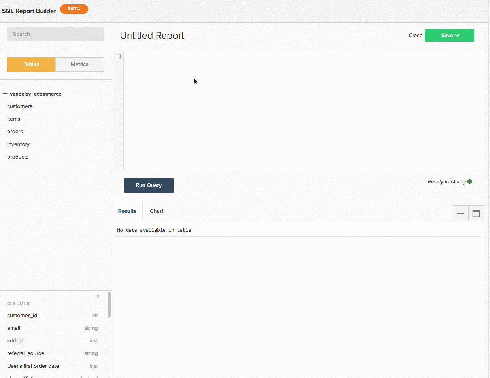
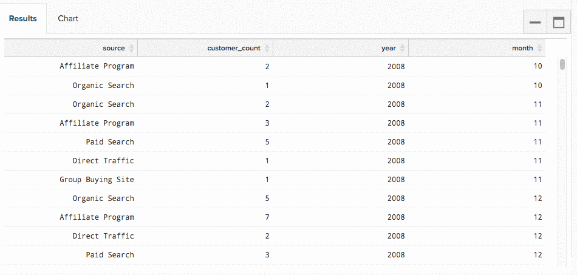

# Verwenden von [!DNL SQL Report Builder]

>[!NOTE]
>
>Erfordert [Administratorberechtigungen](../../administrator/user-management/user-management.md) um SQL-Diagramme zu erstellen und zu bearbeiten. `Standard` Benutzer können diese Diagramme in Dashboards neu anordnen und `Read-only` Benutzer haben die gleiche Erfahrung wie mit herkömmlichen Diagrammen. Darüber hinaus haben `Read-only` Benutzer keinen Zugriff auf den Text der Abfrage.

Weitere Informationen finden [&#x200B; im &#x200B;](https://experienceleague.adobe.com/docs/commerce-knowledge-base/kb/how-to/mbi-training-video-sql-report-builder.html)Schulungsvideo“.

[!DNL SQL], oder Structured Query Language, ist eine Programmiersprache, die zur Kommunikation mit Datenbanken verwendet wird. In [!DNL Commerce Intelligence] wird [!DNL SQL] zum Abfragen oder Abrufen von Daten aus Ihrer Data Warehouse verwendet. Sehen Sie sich die Berichte in Ihrem Dashboard an - hinter den Kulissen basiert jeder Bericht auf einer [!DNL SQL] Abfrage.

Sie können die [[!DNL SQL Report Builder]](../dev-reports/sql-rpt-bldr.md) verwenden, um Ihre Data Warehouse direkt abzufragen, die Ergebnisse anzuzeigen und sie in ein Diagramm umzuwandeln. Sie können mit der Erstellung eines Berichts mit dem [!DNL SQL Report Builder] beginnen, indem Sie auf **[!UICONTROL Report Builder** > **[!DNL SQL Report Builder]]** klicken.

Weitere Informationen finden [&#x200B; im &#x200B;](https://experienceleague.adobe.com/docs/commerce-knowledge-base/kb/how-to/mbi-training-video-sql-report-builder.html)Schulungsvideo“.

Mit dem [!DNL SQL Report Builder] können Sie Ihre Data Warehouse direkt abfragen, die Ergebnisse anzeigen und schnell in ein Diagramm umwandeln. Das Beste an der Verwendung von [!DNL SQL] zum Erstellen von Berichten ist, dass Sie nicht auf Aktualisierungszyklen warten müssen, um die von Ihnen erstellten Spalten zu iterieren. Wenn die Ergebnisse nicht korrekt aussehen, können Sie die Abfrage schnell bearbeiten und erneut ausführen, bis die Dinge Ihren Erwartungen entsprechen.

Dieses Thema führt Sie durch die Verwendung des [!DNL SQL Report Builder]. Wenn Sie sich schon einmal umgesehen haben, können Sie sich das Tutorial [!DNL SQL] Visualisierungen ansehen oder versuchen, einige der von Ihnen geschriebenen Abfragen zu optimieren.

In diesem Artikel behandelt:

1. [Schreiben einer Abfrage](#writing)

1. [Ausführen der Abfrage und Anzeigen der Ergebnisse](#runquery)

1. [Erstellen einer Visualisierung](#createviz)

1. [Bericht speichern](#save)

## [!DNL SQL Report Builder] Integrationen

[[!DNL Google Analytics]](../importing-data/integrations/google-analytics.md) ist die einzige Integration, die nicht für die Verwendung mit dem [[!DNL SQL Report Builder]](../dev-reports/sql-rpt-bldr.md) verfügbar ist. Diese Funktion ist in Entwicklung.

Um mit der Erstellung eines [!DNL SQL] Berichts zu beginnen, klicken Sie oben in einem beliebigen Dashboard auf **[!UICONTROL Report Builder]** oder **[!UICONTROL Add Report]**. Klicken Sie auf dem [!DNL Report Picker] Bildschirm auf **[!UICONTROL SQL Report Builder]** , um den [!DNL SQL]-Editor zu öffnen.

## Erste Schritte

Um einen Bericht zu bearbeiten, klicken Sie auf das Zahnradsymbol () in der oberen rechten Ecke eines [!DNL SQL] Diagramms und klicken Sie auf **[!UICONTROL Edit]**.

## Schreiben einer Abfrage {#writing}

>[!NOTE]
>
>Bei [!DNL SQL Report Builder]-Abfragen wird zwischen Groß- und Kleinschreibung unterschieden. Achten Sie beim Schreiben von Abfragen darauf, die richtige Groß-/Kleinschreibung zu verwenden, da sonst unerwartete Ergebnisse oder Fehler auftreten können.

Schreiben Sie gemäß [Richtlinien für &#x200B;](../../best-practices/optimizing-your-sql-queries.md) Abfrageoptimierung) eine Abfrage im [!DNL SQL].

>[!IMPORTANT]
>
>**Metriken in [!DNL SQL] Berichten** - Wenn Sie eine Metrik in einen SQL-Bericht einfügen, wird die `current definition` der Metrik verwendet.

Wenn die Metrik in Zukunft aktualisiert wird, spiegelt der SQL-*(nicht)* Änderungen wider. Sie müssen den Bericht manuell bearbeiten, damit die Änderungen wirksam werden.

Mit den Schaltflächen oben in der Seitenleiste können Sie zwischen Listen von Tabellen und Metriken wechseln, die für die Verwendung in der [!DNL SQL Report Builder] verfügbar sind. Wenn Sie nicht sehen, wonach Sie in der Liste suchen, suchen Sie in der Suchleiste oben in der Seitenleiste danach.

Sie können auch die Seitenleiste im [!DNL SQL]-Editor verwenden, um Metriken, Tabellen und Spalten direkt in Ihre Abfragen einzufügen, indem Sie den Mauszeiger über sie bewegen und auf **[!UICONTROL Insert]** klicken:

![Einfügen einer Tabelle in den [!DNL SQL]-Editor.](../../assets/SQL_RB_Insert_Table.png)

>[!NOTE]
>
>Jede [SELECT-](https://www.postgresql.org/docs/9.5/sql-select.html#SQL-SELECT-LIST) oder jede Funktion, die keine Daten mutiert und von PostgreSQL unterstützt wird, wird in der SQL-Report Builder unterstützt. Dazu gehören unter anderem AVG, COUNT, COUNT, DISTINCT, MIN/MAX und SUM.

Außerdem werden alle `JOIN` unterstützt, aber Adobe empfiehlt nur die Verwendung von INNER JOIN, da dies der kostengünstigste der `JOIN` Typen ist.

## Ausführen der Abfrage und Anzeigen der Ergebnisse {#runquery}

Wenn Sie die Abfrage fertig geschrieben haben, klicken Sie auf **[!UICONTROL Run Query]**. Die Ergebnisse werden in einer Tabelle unter dem SQL-Editor angezeigt:

Wenn in den Ergebnissen etwas nicht korrekt angezeigt wird, können Sie die Abfrage bearbeiten und erneut ausführen, bis Sie zufrieden sind.

Manchmal werden [Nachrichten unter dem Editor mit „ERKLÄREN“ in ihnen &#x200B;](../../best-practices/optimizing-your-sql-queries.md). Wenn Sie eine dieser Optionen sehen, bedeutet dies, dass Ihre Abfrage nicht ausgeführt wurde und etwas optimiert werden muss.

Nachdem Sie die Bearbeitung der Abfrage abgeschlossen haben, können Sie mit dem Erstellen einer Visualisierung oder dem Speichern Ihrer Arbeit in einem Dashboard fortfahren.

## Erstellen einer Visualisierung {#createviz}

Um eine Visualisierung mit Ihren Abfrageergebnissen zu erstellen, klicken Sie auf die Registerkarte **[!UICONTROL Chart]** im `Results` Bereich. Auf dieser Registerkarte können Sie Folgendes auswählen:

* Die `Series` oder die Spalte, die Sie messen möchten, z. B. **Artikel verkauft**.
* Die `Category` oder Spalte, die Sie zum Segmentieren Ihrer Daten verwenden möchten, z. B **&quot;**&quot;.
* Die `Labels` oder X-Achsenwerte.

Im Folgenden finden Sie einen kurzen Überblick darüber, wie der Visualisierungsprozess aussieht:

Eine ausführliche Anleitung zum Erstellen einer Visualisierung finden Sie im Tutorial [Erstellen von Visualisierungen aus SQL-Abfragen](../../tutorials/create-visuals-from-sql.md){: target="_blank"}.

## Bericht speichern {#save}

Bevor Sie Ihre Arbeit speichern können, müssen Sie dem Bericht einen Namen geben. Denken Sie daran, die [Richtlinien für die Benennung von Best Practices](../../best-practices/naming-elements.md){: target="_blank"} zu befolgen, und wählen Sie etwas aus, das klar vermittelt, was der Bericht ist!

Klicken Sie oben rechts im **[!UICONTROL Save]** auf [!DNL SQL] und wählen Sie die Report `Type` (`Chart` oder `Table`) aus. Um alles abzuschließen, wählen Sie das Dashboard aus, in dem der Bericht gespeichert werden soll, und klicken Sie auf **[!UICONTROL Save to Dashboard]**.

### Analysieren von Daten

#### [!DNL SQL Report Builder]

[[!DNL SQL Report Builder]](../dev-reports/sql-rpt-bldr.md) erhalten Sie die Möglichkeit, Ihre Data Warehouse direkt abzufragen, die Ergebnisse anzuzeigen und schnell in einen Bericht umzuwandeln. Durch die Verwendung von [!DNL SQL] können [&#x200B; auch nicht  [!DNL SQL]  Funktionen &#x200B;](https://docs.aws.amazon.com/redshift/latest/dg/c_SQL_functions.html) Report Builder `Visual` oder `Cohort` verwenden und erhalten so mehr Kontrolle über Ihre Daten.

Berechnete Spalten, die mit [!DNL SQL] erstellt wurden, sind nicht von Aktualisierungszyklen abhängig, d. h. Sie können sie nach Belieben durchlaufen und sofort die Ergebnisse sehen.

>[!NOTE]
>
>Dies gilt nur für die Struktur der Spalte, nicht für die Aktualität der Daten. Neue Daten hängen weiterhin von erfolgreich abgeschlossenen Aktualisierungszyklen ab.

| **Dies ist perfekt für…** | **Das ist nicht so toll für…** |
|---|---|
| Fortgeschrittene Analysten/Analysten | Anfänger - Sie müssen [!DNL SQL] wissen. |
| Die [!DNL SQL] | Einfache Analysen: Das Schreiben einer Abfrage kann mehr Arbeit bedeuten als das einfache Verwenden der [!UICONTROL Visual Report Builder]. |
| Erstellen von berechneten Spalten für die einmalige Verwendung | Mit anderen teilen - Überlegen Sie, ob Ihre Zielgruppe [!DNL SQL] versteht. Andernfalls können sie durch die Art und Weise, wie der Bericht erstellt wird, verwirrt werden. |
| Daten mit `one-to-many` Beziehungen |  |
| Testen einer neuen Spalte oder Analyse |  |

#### Datenbank und SQL-Editor-Ergebnisse im Vergleich

In den meisten Fällen können diese Unterschiede den Aktualisierungszyklen zugeschrieben werden. Wenn [!DNL Commerce Intelligence] Daten aus Ihrer Datenbank in Ihre Data Warehouse repliziert, können selbst bei Verwendung derselben Abfrage unterschiedliche Ergebnisse auftreten.

Verbindungsprobleme können auch zu Diskrepanzen führen. Navigieren Sie zur `Connections` Seite, indem Sie zum Überprüfen auf **[!DNL Manage Data** > **Connections]** klicken. Gibt es einen Fehler bei der betreffenden Datenbankintegration? In diesem Fall müssen Sie die Integration möglicherweise [erneut authentifizieren](https://experienceleague.adobe.com/docs/commerce-knowledge-base/kb/how-to/mbi-reauthenticating-integrations.html) um die Dinge wieder zum Laufen zu bringen.

Wenn alle Ihre Integrationen erfolgreich verbunden sind und Sie sich nicht in der Mitte eines Aktualisierungszyklus befinden, kann etwas Anderes fehlen.

#### Löscht das Löschen eines [!DNL SQL] auch die zugrunde liegenden Spalten aus meiner Data Warehouse?

Nein, Sie verlieren keine Spalten aus Ihrer Data Warehouse, unabhängig davon, wie Sie sie erstellt haben.

Mit der `Data Warehouse Manager` erstellte Spalten sind nicht betroffen, wenn Sie einen Bericht oder eine Abfrage löschen, in dem bzw. der sie verwendet werden.

Mit der [!DNL SQL Report Builder] erstellte Spalten werden nicht in Ihrer Data Warehouse gespeichert.

#### `Report Builder` versus `SQL Report Builder`

Die [!DNL SQL Report Builder] bietet Ihnen mehr Flexibilität bei der Erstellung und Strukturierung Ihrer Diagramme - Sie können beispielsweise auswählen, welche Werte auf der `X`- und `Y` angezeigt werden sollen. Weitere Informationen zum Erstellen von Diagrammen in der [!DNL SQL Report Builder] finden Sie im Tutorial [Erstellen von Visualisierungen aus [!DNL SQL] Abfragen](../../tutorials/create-visuals-from-sql.md) .

#### `Cohort Report Builder` {#cohortrb}

Anders als die [!DNL Visual Report Builder] dient die [[!DNL Cohort Report Builder]](../dev-reports/cohort-rpt-bldr.md) einem einzigen Zweck: der Analyse und Identifizierung von Verhaltenstrends ähnlicher Benutzergruppen im Laufe der Zeit. Die Nutzung des [!DNL Cohort Report Builder] erfordert keine [!DNL SQL] Kenntnisse, sodass Sie ohne zu zögern direkt eintauchen können, wenn Sie gerade erst anfangen.

| **Dies ist perfekt für…** | **Das ist nicht so toll für…** |
|---|---|
| Fortgeschrittene Analysten/Analysten | Anfänger - Sie benötigen praxisorientierte Kohorten. |
| Identifizieren von Verhaltenstrends im Zeitverlauf | Qualitative Analyse - kann [&#x200B; durchgeführt werden](../dev-reports/create-qual-cohort-analysis.md) erfordert jedoch die Unterstützung von Adobe. |

## Abfragen nach dem Aktualisierungszyklus neu erstellen

Sie müssen Ihre Abfragen nicht neu erstellen. Mit dem [[!DNL SQL Report Builder]](../dev-reports/sql-rpt-bldr.md) erstellte Berichte werden wie die im herkömmlichen `Report Builder` erstellten gespeichert. Der Aktualisierungsprozess für [!DNL SQL] Diagramme ist derselbe - nachdem Ihre Daten aktualisiert wurden, werden die Werte in Ihren Diagrammen neu berechnet und erneut angezeigt.

>[!NOTE]
>
>Beim Löschen eines [!DNL SQL] Berichts/einer Abfrage werden die zugrunde liegenden Spalten nicht aus Ihrer Data Warehouse gelöscht. Sie verlieren keine Spalten, unabhängig davon, wie Sie sie erstellt haben.

* Mit dem Data Warehouse-Manager erstellte Spalten sind nicht betroffen, wenn Sie einen Bericht oder eine Abfrage löschen, der bzw. die sie verwendet.

* Mit der SQL-Report Builder erstellte Spalten werden nicht in Ihrer Data Warehouse gespeichert.

## Verpackung {#wrapup}

Wenn Sie etwas herausfordernder ausprobieren möchten, warum sollten Sie nicht versuchen, eine Abfrage zu schreiben, die für die Visualisierung optimiert ist? Sehen Sie sich das Tutorial [Erstellen von Visualisierungen aus  [!DNL SQL] -Abfragen](../../tutorials/create-visuals-from-sql.md){: target="_blank"} an, um loszulegen.
