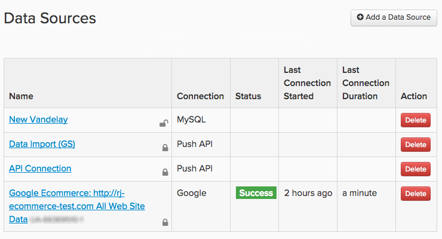

# Daten verbinden

In [!DNL Adobe Commerce Intelligence], werden Datenquellen aufgerufen. `integrations`. Nach `integration` erfolgreich verbunden ist, können Sie die Tabellen durchsuchen, die für die Synchronisierung im Data Warehouse-Manager verfügbar sind.

Integrationen werden hinzugefügt und mithilfe der `Connections` Seite, auf die durch Klicken auf **[!UICONTROL Manage Data** > **Connections]**. Hier sehen Sie:

* eine Liste aller mit Ihrem Konto verbundenen Integrationen

* Integrationstyp

* status ([!DNL Google Analytics] und [!DNL Data Import API] Verbindungen haben leere Statusfelder)

* beim letzten Verbindungstest (`Last Connection Started` Spalte) ausgeführt wurde

## Integrationstypen

Es gibt vier Möglichkeiten, Ihre Daten zu integrieren [!DNL Commerce Intelligence]: eine Datenbank verbinden, eine SaaS-Integration verbinden, eine `.csv` oder die Adobe-API verwenden.

## Datenbankintegrationen

[!DNL Commerce Intelligence] unterstützt SQL-basierte und NoSQL-Datenbanken wie [MySQL](../../importing-data/integrations/mysql-via-ssh-tunnel.md), [MICROSOFT SQL](../integrations/microsoft-sql-server.md), [MongoDB](../integrations/mongodb-via-ssh-tunnel.md), und [PostgreSQL](../integrations/postgresql.md).

Während Sie Ihre Datenbank direkt mit [!DNL Commerce Intelligence] Adobe empfiehlt die Verwendung einer bewährten Verschlüsselungsmethode wie eines SSH-Tunnels. Dadurch wird sichergestellt, dass Ihre Daten sicher und sicher bleiben, während sie in Ihre Data Warehouse gelangen.

Abhängig von der Verbindungsmethode und dem Datenbanktyp kann ein gewisser technischer Sachverstand erforderlich sein, um die Einrichtung abzuschließen.

## `SaaS` Integrationen

spree-commerce-logo.png

`SaaS` Integrationen sind Dienste wie [[!DNL Google Adwords]](../integrations/google-adwords.md), [[!DNL Salesforce]](../integrations/salesforce.md), und [[!DNL Zendesk]](../integrations/zendesk.md). Da Daten von Drittanbietern auf dem Server des Anbieters gespeichert sind, können Sie mit den Daten in Ihrer Datenbank nicht direkt darauf zugreifen.

Normalerweise richten Sie eine Integration in [!DNL Commerce Intelligence] ist so einfach wie die einfache Eingabe Ihrer Kontoanmeldeinformationen. Einige Dienste benötigen möglicherweise einen API-Schlüssel, um die Autorisierung abzuschließen. Sehen Sie sich die [Integrationsabschnitt](../integrations/integrations.md) für Anweisungen zum Generieren der benötigten Anmeldeinformationen.

## Datei-Upload

Sie wissen nicht genau, wie Sie Daten von einer zusätzlichen Quelle in Ihre Data Warehouse bekommen? [Verwenden der `File Upload` Funktion](../connecting-data/using-file-uploader.md) ist eine gute Möglichkeit, Daten abzurufen, die Sie für die tägliche Entscheidungsfindung nicht benötigen. Mithilfe der Formatierungsregeln können Sie schnell und einfach `.csv` -Dateien in Ihre Data Warehouse ein und verbinden sie mit anderen Datenquellen.

## [!DNL Commerce Intelligence] `Import API`

Wenn Sie den Abruf von Daten aus einer Ihrer eigenen Quellen lieber automatisieren möchten, können Sie die [!DNL Commerce Intelligence] `Import API`. Grundsätzlich, wenn es sich nicht in einer Datenbank oder einer `SaaS` Integration, die `Import API` -Funktion ist Ihre beste Wette.

Die Verwendung der API erfordert ein wenig technisches Know-how - jemand, der sich mit dem Schreiben und Verwalten eines kleinen Ruby- oder PHP-Skripts auskennt, ist mehr als qualifiziert.

Weitere Informationen zu den ersten Schritten mit dem `Import API`, sehen Sie sich die [Entwicklersite](https://developer.adobe.com/commerce/services/reporting/) und [Generieren eines API-Schlüssels](https://developer.adobe.com/commerce/services/reporting/import-api/).

## Hinzufügen einer Integration

Um eine Integration hinzuzufügen, klicken Sie auf **[!UICONTROL Manage Data** > **Connections]** und klicken Sie anschließend auf **[!UICONTROL Add a New Data Source]**. Klicken Sie auf das Symbol der Integration, die Sie hinzufügen möchten, und befolgen Sie die Anweisungen in den Hilfethemen, um Elemente einzurichten:

* [Integrations-FAQs](https://support.magento.com/hc/en-us/sections/360003161871-Integration-FAQ)
* [Verfügbar ](../integrations/integrations.md)
* [Tabellen konsolidieren](../../../best-practices/consolidating-your-tables.md)
* [Einschränken des Zugriffs auf Ihre Datenbank](../../../administrator/account-management/restrict-db-access.md)

**Sie sehen keine gewünschte Integration?** Einige Integrationen müssen aktiviert sein, damit sie in Ihrem Konto sichtbar sind. Wenn Sie nach etwas suchen wie [!DNL Facebook] aber nicht aufgeführt ist, [Support-Ticket einreichen](https://experienceleague.adobe.com/docs/commerce-knowledge-base/kb/troubleshooting/miscellaneous/mbi-service-policies.html).

**Wenn ein Fehlerstatus für eine Integration angezeigt wird**, sehen Sie sich die [Abschnitt zur Fehlerbehebung](https://support.magento.com/hc/en-us/sections/360003078151) für Hilfe.
