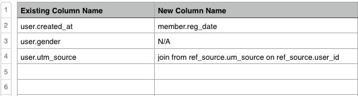

# Datenmigration

Die Migration zu einem neuen Datenbankschema, Server oder Reporting-Datenbank muss nicht aufwändig sein. Unsere **[!DNL Magento Services - Analytics]** Das Team bietet Migrationshilfe - wir tun das ganze Schwergewicht, damit Sie nicht müssen.

Um sicherzustellen, dass Ihr Übergang so reibungslos wie möglich ist, bitten wir Sie, beim Senden Ihrer Migrationsanfrage möglichst detailliert zu sein. In diesem Artikel müssen Sie nur eine Anfrage senden und mit der Migration beginnen. Wenn Sie uns ein umfassendes Bild von Ihren Bedürfnissen geben, garantieren wir Ihnen, dass Ihr Projekt richtig erfasst wird und dass die Schätzung korrekt ist.

## Erste Schritte {#started}

Bevor wir eintauchen, sollten Sie die Antworten auf diese Fragen kennen:

* **Befindet sich die neue Datenbank auf einem neuen Server?** Aktualisieren Sie vor dem Senden einer Anfrage die Einstellungen Ihrer Datenverbindung unter **[!UICONTROL Manage Data** > **Connections]**. Wenn Sie einen Auffrischungskurs dazu benötigen, gehen Sie zu [`Integrations`](../integrations/integrations.md) und finden Sie die Anweisungen für den verwendeten Datenbanktyp.
* **Sind Ihre historischen Daten in der neuen Datenbank vorhanden oder müssen sie migriert werden?** Wir können die historischen und neuen Daten während des Migrationsprozesses konsolidieren. Auch wenn Sie keine Konsolidierung benötigen, bitten wir Sie, uns in Ihrer Anfrage mitzuteilen.

Nachdem Sie die oben genannten Antworten erhalten haben, müssen wir wissen, welche Art von Migration durchgeführt wurde: wird die neue Datenbank über die [`same`](#sameschema) Schema oder wird es über ein [`different`](#newschema) schema? In den folgenden Abschnitten finden Sie detaillierte Anweisungen für jeden Migrationstyp.

## Migration zu einer neuen Datenbank mit demselben Schema {#sameschema}

Teilen Sie uns beim Senden der Anfrage mit, dass sich das Datenbankschema nicht ändert und die Verbindung bereits in [!DNL MBI].

Wenn die Datenbank einen neuen Namen aufweist, fügen Sie ihn in die Anfrage ein, damit Ihre Dashboards ordnungsgemäß migriert werden können.

Wenn sich der Datenbankname nicht ändert, ist die Migration abgeschlossen. Dashboards und Berichte werden aktualisiert, nachdem die nächste vollständige Aktualisierung abgeschlossen ist. Wir bitten Sie, uns immer noch zu kontaktieren, damit wir alle Probleme, die sich aus der Migration ergeben könnten, im Voraus erkennen können.

## Migration zu einer neuen Datenbank mit einem anderen Schema {#newschema}

>[!IMPORTANT]
>
>Wenn bestimmte Datenspalten nicht über äquivalente Spalten in der neuen Datenbank verfügen, können bestimmte Analysen im Prozess verloren gehen.

Um diese Art der Migration erfolgreich abzuschließen, müssen vorhandene Datenspalten mit den entsprechenden Elementen in der neuen Datenbank abgeglichen werden. Dies ist für Sie nicht erforderlich, aber die Durchführung der Abstimmung für uns hilft, die Bearbeitungszeit Ihrer Anfrage zu beschleunigen und den Preis der Migration zu senken.

Wenn Sie die Zuordnung selbst vornehmen möchten, befolgen Sie diese Anweisungen und fügen Sie das fertige Arbeitsblatt an Ihre Anfrage an:

1. Überprüfen Sie alle Tabellen und Spalten, die derzeit mit Ihrer Data Warehouse synchronisiert werden (**[!UICONTROL Manage Data** > **Data Warehouse]**).
1. Erstellen Sie in einer Tabelle eine Registerkarte für jede Tabelle, die in die neue Datenbank migriert werden soll.
1. Erstellen Sie in jeder Registerkarte eine Spalte für alle vorhandenen Spalten, die migriert werden müssen. Es wird empfohlen, die Benennung in etwa wie folgt vorzunehmen: `Existing column name`.
1. Außerdem müssen Sie in jedem Tab des Arbeitsblatts eine weitere Spalte für die Spaltenäquivalente in der neuen Datenbank erstellen. Es wird empfohlen, die Spalte in etwa wie folgt zu benennen: `New column name`.
1. Geben Sie die vorhandenen Spalten und ihre Entsprechungen ein. Wenn eine vorhandene Spalte keine neue Entsprechung hat, geben Sie einfach `N/A`.

   Wenn es eine neue Möglichkeit gibt, dieselben Informationen in der neuen Datenbank zu berechnen, geben Sie sie außerdem in die [`New column name`] Spalte.

Im Folgenden finden Sie ein Beispiel:

>[!NOTE]
>
>Wenn bestimmte Datenspalten nicht über äquivalente Spalten in der neuen Datenbank verfügen, können bestimmte Analysen im Prozess verloren gehen.

## Wie sende ich eine Anfrage? {#submitreq}

Sie können uns kontaktieren, indem Sie [Support anfordern](../../../guide-overview.md).

Wenn Sie die im vorherigen Abschnitt beschriebenen Schritte zur Erstellung des Spaltenabgleichs ausgeführt haben, sollten Sie diese an das entsprechende Arbeitsblatt anhängen.

## Wie geht es weiter? {#wrapup}

Die Bestimmung des Umfangs des Projekts erfordert eine gewisse Zusammenarbeit zwischen Ihnen und dem Analytiker des Commerce Services-Teams, das die Migration durchführt. Die Komplexität der Änderungen und die Reaktionsfähigkeit von Ihnen und dem Analysten wirken sich direkt auf die Dauer der Migration aus. Nachdem wir die Details verschlüsselt haben, wird ein Zeitplan erstellt und Ihnen mit einer Arbeitsaufstellung übermittelt.
