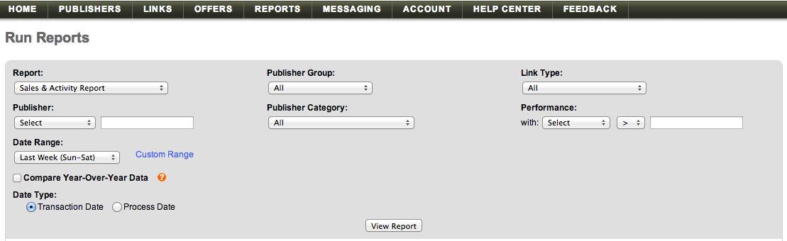

# [!DNL Linkshare] importieren

Um Ihre [!DNL Linkshare]-Daten in [!DNL Adobe Commerce Intelligence] einzubringen, müssen Sie zwei Dinge tun:

1. [Exportieren Sie die Linkshare-Daten in `.csv` Format](#export)
1. [Tabelle hochladen in [!DNL Commerce Intelligence]](../connecting-data/using-file-uploader.md)

## Exportieren von Daten aus Linkshare {#export}

1. Navigieren Sie in Ihrem [!DNL Linkshare]-Konto zu **[!UICONTROL Reports** > **Run Reports].**

1. Wählen Sie in der Dropdown-Liste `Report` die Option **[!UICONTROL Sales & Activity Report]** aus.

1. Belassen Sie alle anderen Dropdown-Optionen als Standardauswahl.

1. Wählen Sie in der Dropdown-Liste `Date Range` aus, welche Option (`Sun - Sat`, `Mon - Sun`) Ihren `Start of Week` in [!DNL Commerce Intelligence] entspricht.

1. Deaktivieren Sie das Kontrollkästchen `Compare Year-Over-Year Data` .

1. Wählen Sie unter `Data Type` die Option `Transaction Date`.

   

1. Klicken Sie auf **[!UICONTROL View Report]**.

1. Klicken Sie auf **[!UICONTROL Download]**.

   An dieser Stelle wurde eine `.csv`-Datei heruntergeladen und.

Nachdem die Datei heruntergeladen wurde, können Sie sie mit der [`File Upload`-Funktion in [!DNL Commerce Intelligence] hochladen](../connecting-data/using-file-uploader.md).
