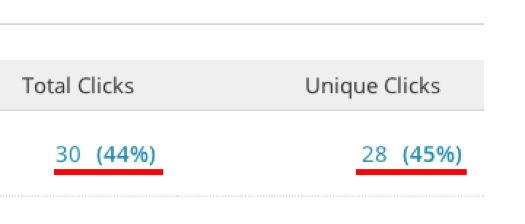

# [!DNL Mailchimp] importieren

Um sich einen umfassenden Überblick über Ihre Kampagnen zu verschaffen, können Sie Ihre [!DNL Mailchimp] E-Mail-Kampagnendaten in [!DNL Commerce Intelligence] importieren. Um den Import abzuschließen, müssen Sie für jede [!DNL Mailchimp] Kampagne, die Sie haben, Folgendes tun:

## Öffnen von Daten exportieren {#opens}

1. Navigieren Sie nach der Anmeldung bei [!DNL Mailchimp] zur Registerkarte `Campaigns` .

   

1. Klicken Sie **[!UICONTROL View Report]** neben dem Kampagnennamen.

   

1. Klicken Sie auf die **[!UICONTROL Opened]**.

   

1. Klicken Sie auf **[!UICONTROL Export]** und speichern Sie die `.csv`.

   Sie müssen dieser Datei `primary key`, `date (mm/dd/yyyy)` und `campaign name` Spalten hinzufügen. Stellen Sie sicher, dass die `primary keys` für jede Zeile eindeutig sind.

   

## Exportieren von Klickdaten {#clicks}

1. Navigieren Sie zurück zum `View Report` für die Kampagne.

1. Klicken Sie auf die `Clicked` Zahl.

   

1. Klicken Sie entweder auf die Zahl unter der Spalte `Total Clicks` ODER `Unique Clicks` .

   

1. Klicken Sie auf **[!UICONTROL Export]** und speichern Sie die `.csv`.

   Sie müssen dieser Datei `Primary Key`, `date (mm/dd/yyyy)`, `campaign name` und `URL` Spalten hinzufügen. Sie müssen nicht die vollständige URL hinzufügen, nur etwas, das Ihnen mitteilt, was angeklickt wurde.

   

1. Wiederholen Sie die Schritte 3 und 4 für jede in Ihrer E-Mail angeklickte URL und kombinieren Sie alle Daten in derselben `.csv`.

## Gesendete Daten exportieren {#sent}

1. Wechseln Sie zur Registerkarte `Campaigns` von [!DNL Mailchimp].

1. Klicken Sie **[!UICONTROL View Report]** neben dem Kampagnennamen.

1. Klicken Sie auf die Zahl neben `Recipients`.

   

1. Klicken Sie auf **[!UICONTROL Export]** und speichern Sie die `.csv`.

   Sie müssen dieser Datei `Primary Key`, `date (mm/dd/yyyy)` und `campaign name` Spalten hinzufügen.

   

## Vorbereiten von Dateien für den Upload in [!DNL Commerce Intelligence] {#upload}

Jede Datei - `Opens`, `Clicks` und `Sent` - sollte als separate Datei in [!DNL Commerce Intelligence] hochgeladen werden. Adobe empfiehlt, die Dateien mit dieser Namenskonvention zu benennen: `MailChimp\_ACTION\_DATE`. Ersetzen Sie `ACTION` durch `Open`, `Click` oder `Sent` und ersetzen Sie `DATE` durch das Exportdatum.

Wenn Sie bereit sind, die Dateien hochzuladen, verwenden Sie die [`File Upload`-Funktion](../connecting-data/using-file-uploader.md) um die Daten in Ihre Data Warehouse zu übertragen.
