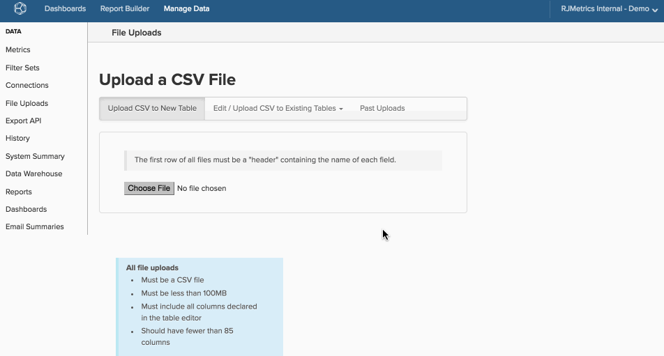

# Datei-Uploader verwenden

>[!NOTE]
>
>Erfordert [Administratorberechtigungen](../../../administrator/user-management/user-management.md).

[!DNL Adobe Commerce Intelligence] ist nicht nur aufgrund seiner Visualisierungsfunktionen leistungsstark, sondern bietet Ihnen auch die Möglichkeit, alle Ihre Daten auf einem einzigen Data Warehouse abzulegen. Sogar Daten, die außerhalb Ihrer Datenbanken und Integrationen vorhanden sind, können mit dem Tool „Datei-Upload“ im Data Warehouse-Manager in [!DNL Commerce Intelligence] eingebracht werden.

Verwenden Sie Werbekampagnen als Beispiel. Wenn Sie sowohl Online- als auch Offline-Kampagnen ausführen, können Sie nicht das gesamte Bild erhalten, wenn Sie nur Daten aus einer Online-Integration analysieren. Durch das Hochladen einer Tabelle mit den Offline-Kampagnendaten können Sie beide Datensätze analysieren und ein besseres Verständnis der Kampagnenleistung erlangen.

## Einschränkungen und Anforderungen {#require}

1. **Das einzige unterstützte Format für Datei-Uploads ist `CSV` oder`comma separated values`**. Wenn Sie in Excel arbeiten, können Sie die Datei mithilfe der Funktion Speichern unter im `.csv` Format speichern.
1. **`CSV`Dateien müssen`UTF-8 encoding`** verwenden. Meistens ist das kein Problem. Wenn dieser Fehler beim Hochladen einer Datei auftritt, ([ Sie in diesem Support-Artikel](https://experienceleague.adobe.com/docs/commerce-knowledge-base/kb/troubleshooting/miscellaneous/resolving-utf-8-errors-for-csv-file-uploads.html).
1. **Dateien dürfen nicht größer als 100 MB**. Wenn die Datei größer ist als diese, teilen Sie die Tabelle in Blöcke auf und speichern Sie sie als einzelne Dateien. Sie können die Daten anhängen, nachdem die ursprüngliche Datei geladen wurde.
1. **Alle Tabellen müssen einen`primary key`** haben. Die Tabelle muss mindestens eine Spalte enthalten, die als `primary key` verwendet werden kann, oder eine eindeutige Kennung für jede Zeile der Tabelle. Jede als `primary key` gekennzeichnete Spalte darf *nie* null sein. Eine `primary key` kann so einfach sein wie das Hinzufügen einer Spalte, die jeder Zeile eine Zahl gibt, oder es können zwei Spalten verkettet sein, um eine Spalte mit eindeutigen Werten (z. B. `campaign name` und `date`) zu erstellen.

   Wenn eine Spalte (oder mehrere Spalten) als eindeutig gekennzeichnet ist, es jedoch Duplikate gibt, werden die doppelten Zeilen nicht importiert.

## Daten zum Hochladen formatieren {#formatting}

Bevor Sie Ihre Daten in [!DNL Commerce Intelligence] hochladen können, überprüfen Sie, ob sie gemäß den Richtlinien in diesem Abschnitt formatiert sind.

### Kopfzeile {#header}

Um sicherzustellen, dass Spalten ordnungsgemäß beschriftet und importiert werden, stellen Sie sicher, dass die erste Zeile Ihres Arbeitsblatts eine Kopfzeile ist, in der die Daten in den einzelnen Spalten beschrieben werden.

Spaltennamen müssen eindeutig sein und dürfen nur Buchstaben, Zahlen, Leerzeichen und die folgenden Symbole enthalten: `$ % # /`. Wenn ein Spaltenname ein Komma enthält, wird er beim Hochladen der Datei in zwei Spalten aufgeteilt. Adobe empfiehlt außerdem, dass die Datei weniger als 85 Spalten enthält, um die Aktualisierungsgeschwindigkeit zu optimieren.

### Daten mit Kommas {#commas}

Da Dateien im `CSV` Format vorliegen müssen, kann die Verwendung von Kommas beim Hochladen von Daten zu Problemen führen. `CSV` Dateien verwenden Kommas, um neue Werte anzugeben, daher eine Spalte mit einem Namen wie `Campaigns`, `August` als zwei Spalten (`Campaigns` und `August`) anstatt als eine gelesen wird, wodurch alle Ihre Daten über eine Zeile verschoben werden. Adobe empfiehlt, Kommas nach Möglichkeit zu vermeiden. Mit `Data Preview` können Sie überprüfen, ob Ihre Daten nach Abschluss einer Aktualisierung korrekt angezeigt werden.

### Daten

Jeder Datensatz, der Datumsangaben enthält, muss das [Standarddatumsformat](https://dev.mysql.com/doc/refman/5.7/en/datetime.html) `YYYY-MM-DD HH:MM:SS` oder `MM/DD/YYYY` verwenden.

### Sonderzeichen

Einige Sonderzeichen werden nicht akzeptiert. Beispielsweise wird das Pipe-Symbol `& # 1 2 4` als Erstellen einer Spalte interpretiert und verursacht beim Hochladen einer Datei Fehler.

### Dezimalzahlen

Für Währungswerte sollte der Datentyp ausgewählt `Decimal Number`. Diese Spalten werden automatisch auf zwei Dezimalstellen im Data Warehouse gerundet. Wenn Sie Ihre Dezimalzahlen nicht runden möchten oder eine größere Genauigkeit haben möchten, sollten Sie den `Non-Currency Decimal Number` Datentyp auswählen.

### Prozentsätze

Prozentsätze müssen als Dezimalzahlen eingegeben werden. Beispiel:

| **Rechts:** | **Falsch:** |
|-----|-----|
| `.05` | `5%` |
| `.23` | `23` |

{style="table-layout:auto"}

### Werte mit führenden und/oder nachfolgenden Nullen {#zeroes}

Einige Werte in Ihrer Datei - z. B. Postleitzahlen und IDs - können mit Nullen beginnen oder enden. Um sicherzustellen, dass Nullen ordnungsgemäß gespeichert und hochgeladen werden, können Sie den Formatierungstyp ändern (z. B. [von Zahl zu Text](https://support.microsoft.com/en-us/office/format-numbers-as-text-583160db-936b-4e52-bdff-6f1863518ba4?ui=en-us&amp;rs=en-us&amp;ad=us) oder die Zahlenformatierung erzwingen.

Verwenden Sie `US ZIP codes` als Beispiel für das Ändern der Zahlenformatierung. Markieren Sie in [!DNL Excel] die Spalte, die `ZIP codes` enthält, und [ändern Sie das Zahlenformat](https://support.microsoft.com/en-us/office/display-numbers-as-postal-codes-61b55c9f-6fe3-4e54-96ca-9e85c38a5a1d?ui=en-us&amp;rs=en-us&amp;ad=us) in `ZIP code`. Sie können auch ein benutzerdefiniertes Zahlenformat auswählen und im `Type` Fenster `00000` eingeben. Beachten Sie, dass diese Methode Probleme verursachen kann, wenn einige Codes als `00000` formatiert sind und andere `00000-0000`.

Der `Type` kann [anders formatiert werden, um andere Datentypen, z. ](https://support.microsoft.com/en-us/office/keeping-leading-zeros-and-large-numbers-1bf7b935-36e1-4985-842f-5dfa51f85fe7?correlationid=e1d4c2d3-cd5d-4a14-999d-437800274a90&amp;ui=en-us&amp;rs=en-us&amp;ad=us). IDs, aufzunehmen. Wenn ein `ID` beispielsweise neun Stellen lang ist, kann der `Type` `000000000` oder `000-000-000` sein. Dies würde `123456` in `000-123-456` ändern.

[!DNL Google Docs] und [!DNL Apple Numbers] Ressourcen finden Sie in der Liste [Verwandt](#related) unten auf dieser Seite.

## Hochladen von Daten {#uploading}

Nachdem Ihre Tabelle korrekt formatiert und [!DNL Commerce Intelligence] ist, fügen Sie sie zu Ihrem Data Warehouse hinzu.

1. Um zu beginnen, gehen Sie zu **[!UICONTROL Data** > **File Uploads]**.

1. Klicken Sie auf die Registerkarte **[!UICONTROL Upload to New Table]** .

1. Klicken Sie auf **[!UICONTROL Choose File]** und wählen Sie die Datei aus. Klicken Sie auf **[!UICONTROL Open]** , um den Upload zu starten.

   Nach Abschluss des Uploads wird eine Liste der Spalten angezeigt, die in Ihrer Datei gefunden [!DNL Commerce Intelligence].

1. Überprüfen Sie, ob die Spaltennamen und Datentypen korrekt sind. Überprüfen Sie insbesondere, ob Datumsspalten als Daten und nicht als Zahlen gelesen werden.

   >[!NOTE]
   >
   >Der `datatype` ist wichtig, also überspringen Sie diesen Schritt nicht!

1. Wählen Sie die Spalte (oder Spalten) aus, aus der die `primary key` für die Tabelle bestehen soll, indem Sie die Kontrollkästchen unter dem Schlüsselsymbol verwenden.

1. Benennen Sie die Tabelle.

1. Klicken Sie auf **[!UICONTROL Save Table]**.

Ein *Erfolg!* nach dem Speichern der Tabelle wird oben im Bildschirm eine Meldung angezeigt.

Wenn Sie eine visuelle Darstellung benötigen, sehen Sie sich den gesamten Prozess an:

Hochgeladene Tabellen werden im Data Warehouse **Manager unter dem Abschnitt** Datei-Uploads“ der Tabellenliste (sowohl in den Optionen Alle Tabellen als auch Synchronisierte Tabellen) angezeigt:

## Aktualisieren oder Anhängen von Daten an eine vorhandene Tabelle {#appending}

Haben Sie neue Daten, die Sie einer bereits hochgeladenen Datei hinzufügen können? Kein Problem - Sie können Daten in [!DNL Commerce Intelligence] einfach aktualisieren und anhängen.

1. Um zu beginnen, gehen Sie zu **[!UICONTROL Manage Data** > **File Uploads]**.

1. Klicken Sie auf die Registerkarte Zu vorhandenen Tabellen **[!UICONTROL Edit/Upload `.csv`]**.

1. Klicken Sie in der Dropdown-Liste auf den Namen der Tabelle, die Sie aktualisieren oder anhängen möchten.

1. Wählen Sie im Dropdown-Menü die Option zum Umgang mit doppelten Zeilen aus:

   | Option | Beschreibung |
   |---|---|
   | `Overwrite old row with new row` | Dadurch werden vorhandene Daten mit neuen Daten überschrieben, wenn eine Zeile sowohl in der vorhandenen Tabelle als auch in der neuen Datei denselben Primärschlüssel hat. Diese Methode wird für Spalten mit Werten verwendet, die sich im Laufe der Zeit ändern, z. B. eine Statusspalte. Vorhandene Daten werden überschrieben und mit den neuen Daten aktualisiert. Zeilen mit Primärschlüsseln, die nicht in der vorhandenen Tabelle enthalten sind, werden als neue Zeilen hinzugefügt. |
   | `Retain old row; discard new row` | Dies führt dazu, dass neue Daten ignoriert werden, wenn eine Zeile sowohl in der vorhandenen Tabelle als auch in der neuen Datei denselben Primärschlüssel hat. |
   | `Purge all existing rows first and ignore duplicate keys within the file` | Dadurch werden alle vorhandenen Daten gelöscht und durch die neuen Daten aus der Datei ersetzt. Verwenden Sie diese Option nur, wenn Sie keine Daten in der vorhandenen Tabelle benötigen. |

1. Klicken Sie auf **[!UICONTROL Choose File]** und wählen Sie die Datei aus.

1. Klicken Sie auf **[!UICONTROL Open]** , um den Upload zu starten.

   Nach Abschluss des Uploads validiert [!DNL Commerce Intelligence] die Datenstruktur in der Datei. Ein *Erfolg!* nach dem Speichern der Tabelle wird oben im Bildschirm eine Meldung angezeigt.

## Datenverfügbarkeit {#availability}

Genau wie berechnete Spalten sind Daten aus Datei-Uploads nach Abschluss des nächsten Aktualisierungszyklus verfügbar. Wenn während des Datei-Uploads eine Aktualisierung ausgeführt wurde, stehen die Daten erst nach der nächsten Aktualisierung zur Verfügung. Sobald ein Aktualisierungszyklus abgeschlossen ist, können Sie zur Registerkarte `Data Preview` auf Ihrem Data Warehouse navigieren, um sicherzustellen, dass die hochgeladene Datei korrekt ist und die Daten wie erwartet angezeigt werden.

## Verpackung {#wrapup}

In diesem Thema wurden nur die Grundlagen zum Importieren von Daten behandelt. Möglicherweise möchten Sie jedoch etwas Erweiterteres tun. In den entsprechenden Artikeln finden Sie Anleitungen zum Formatieren und Importieren von Finanz-, E-Commerce- und Ausgabendaten sowie anderen Datentypen.

Außerdem ist der Datei-Upload nicht die einzige Möglichkeit, Ihre Daten in [!DNL Commerce Intelligence] zu übertragen. Die [Datenimport-API](https://developer.adobe.com/commerce/services/reporting/import-api/)-Funktionen ermöglichen es Ihnen, beliebige Daten auf Ihren [!DNL Commerce Intelligence]-Data Warehouse zu übertragen.

## verwandt {#related}

* [Formatieren und Importieren von Finanzdaten](../../../best-practices/format-import-financial-data.md)
* [Offline-/andere Anzeigenausgabendaten importieren](../connecting-data/import-offline-ad-data.md)
* [Erwartet[!DNL Google ECommerce] Daten](../integrations/google-ecommerce-data.md)

## Ressourcen von Drittanbietern

* [Anleitung zur Formatierung von Zahlen](http://www.dummies.com/how-to/content/how-to-choose-a-number-format-in-your-numbers-spre.html)
* [[!DNL Google Docs] Anleitung zur Datenformatierung](https://support.google.com/docs/answer/56470?hl=en)
