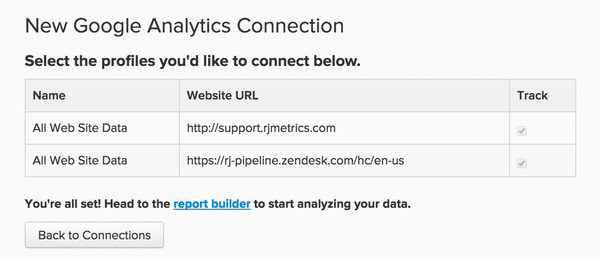

# [!DNL Google Analytics] verbinden

>[!NOTE]
>
>Erfordert [Administratorberechtigungen](../../../administrator/user-management/user-management.md).

[!DNL Google Analytics] ist der am häufigsten verwendete Webanalysedienst im Internet. Durch die Implementierung von [!DNL Google Analytics] auf Ihrer Website können Sie verfolgen, wie Besucher Ihre Site verwenden, welche Inhalte attraktiv sind, wo Besucher die Site verlassen und vieles mehr. Die Analyse dieser Metriken in [!DNL Commerce Intelligence] verbessert zusammen mit anderen Daten den allgemeinen Zustand und die Benutzerfreundlichkeit Ihrer Site.

Beginnen Sie, indem Sie Ihre [!DNL Google Analytics]-Anmeldedaten in [!DNL Commerce Intelligence]:

1. Gehe zu **[!UICONTROL Manage Data** > **Integrations]**.

1. Klicken Sie auf **[!UICONTROL Add Integration]** rechts im Bildschirm.

1. Klicken Sie auf das Symbol [!DNL Google Analytics] . Dadurch wird die Seite mit den [!DNL Google Analytics]-Anmeldeinformationen geöffnet.

1. Geben Sie Ihre [!DNL Google Analytics] ein. Nach Abschluss des Autorisierungsprozesses werden Sie zurück zu [!DNL Commerce Intelligence] weitergeleitet.

1. Eine Liste der Profil-IDs wird angezeigt. Markieren Sie die Profile, mit denen Sie eine Verbindung herstellen möchten[!DNL Commerce Intelligence]. Wenn Sie mehrere Profile haben und Hilfe bei der Identifizierung dessen benötigen, was ist, lesen Sie den Abschnitt Verbinden mehrerer [!DNL Google Analytics] Profile unten.

   <!--{: width="600px"}-->

1. Die Änderungen werden automatisch gespeichert. Klicken Sie **auf „Zurück zu**&quot;, wenn Sie fertig sind.

## Mehrere [!DNL Google Analytics] verbinden

Möglicherweise sind mehrere Websites mit einem einzigen [!DNL Google Analytics]-Konto verbunden, das durch seine eigene [!DNL Google Analytics]-Profil-ID identifiziert wird. In diesem Fall haben Sie die Möglichkeit, alle Ihre Profil-IDs in [!DNL Commerce Intelligence] einzuschließen. Markieren Sie die Profil-IDs, die Sie in den Schritt zur Profilauswahl einbeziehen möchten.

So identifizieren Sie die [!DNL Google Analytics]-Profil-ID einer bestimmten Website:

1. Anmelden bei [!DNL Google Analytics]
1. Zum [!DNL Google Analytics]-Dashboard der jeweiligen Website wechseln
1. Sehen Sie sich die URL an. Die Profil-ID entspricht den acht Zahlen, die am Ende der Zeile nach `p` folgen:

   `www.google.com/analytics/web/#home/a11345062w43527078p**XXXXXXXX**/`

## Trennen von [!DNL Google Analytics] von [!DNL Commerce Intelligence] {#disconnect}

1. Rufen Sie [!DNL Google Analytics] Seite [Kontoeinstellungen](https://accounts.google.com/) auf.
1. Klicken Sie im Abschnitt `Security` auf **[!UICONTROL edit]** neben `Authorizing` Anwendungen und Sites.
1. Klicken Sie auf **[!UICONTROL revoke access]** neben [!DNL Commerce Intelligence].

## Verwandt:

* [Erneute Authentifizierung von Integrationen](https://experienceleague.adobe.com/en/docs/commerce-knowledge-base/kb/how-to/mbi-reauthenticating-integrations)
* [Verbinden [!DNL Google Adwords]](../integrations/google-adwords.md)
* [Analyse der Website-Aktivität und der Konversionsraten der Kunden](../../analysis/web-act-cust-conversion.md)
* [Tracking von Benutzerakquise-Daten mithilfe von  [!DNL Google Analytics] -Cookies](../../analysis/google-track-user-acq.md)
