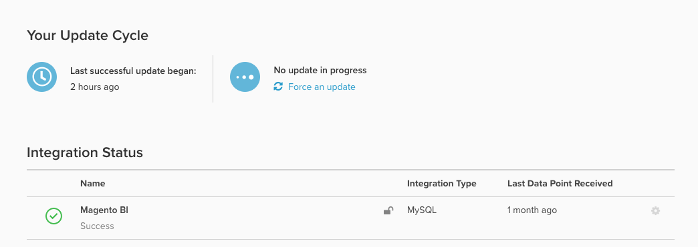

# Datenbankergebnisse im Vergleich zu [!DNL SQL Editor] Ergebnissen

Sie könnten neugierig sein, was das `Last successful update began` auf Ihrer `Integrations`-Seite ist:

## Grundlegendes zum `timestamp`

Er zeigt die `timestamp` (in der für Ihr Konto festgelegten Zeitzone) des _letzten erfolgreichen Aktualisierungszyklus_ für Ihr Konto an.

- Wenn bei einer der synchronisierten Tabellen während des letzten Aktualisierungszyklus ein Problem aufgetreten ist, wird dieser Zeitstempel *nicht aktualisiert*.
- Daher kann es Fälle geben, in denen Berichte mit neuen Daten aktualisiert wurden, aber die *Letzte erfolgreiche Aktualisierung begann* immer noch nicht abgeschlossen ist.

## Identifizieren des letzten „echten“ Datenpunkts

Der aktuelle Datenpunkt für eine bestimmte Integration wird durch den `Last Data Point Received` Zeitstempel rechts von jeder Integration bestimmt. Dieser Zeitstempel bezieht sich auf den letzten Zeitpunkt, an dem Ihr Data Warehouse erfolgreich Datenpunkte aus dieser Quelle empfangen hat, unabhängig davon, ob es sich um eine Datenbank, eine API oder eine Integration von Drittanbietern handelt.

Um die Aktualität von Daten aus *spezifischen Tabellen* zu überprüfen, empfiehlt Adobe die Erstellung eines [[!DNL SQL] Berichts](../../dev-reports/sql-rpt-bldr.md), der eine `MAX(timestamp)` der wichtigsten Tabelle in Ihrem Konto durchführt. Wenn Sie diesen Zeitstempel mit dem `Last Data Point` vergleichen, wird angezeigt, ob das Problem das gesamte Konto oder eine Teilmenge der Tabellen betraf. Adobe empfiehlt dies für drei bis vier wichtige, häufig verwendete Tabellen.

- Wenn die `MAX(timestamp)` Werte aktueller als `Last Data Point Received` sind, bedeutet dies, dass eine Teilmenge der Tabellen betroffen war, der Aktualisierungszyklus des Kontos insgesamt jedoch stabil ist.
- Wenn die `MAX(timestamp)` Werte gleich oder vor `Last Data Point Received` sind, bedeutet dies, dass der Aktualisierungszyklus des Kontos betroffen war. Senden Sie in [ Fall ein Support-Ticket](https://experienceleague.adobe.com/docs/commerce-knowledge-base/kb/troubleshooting/miscellaneous/mbi-service-policies.html).
