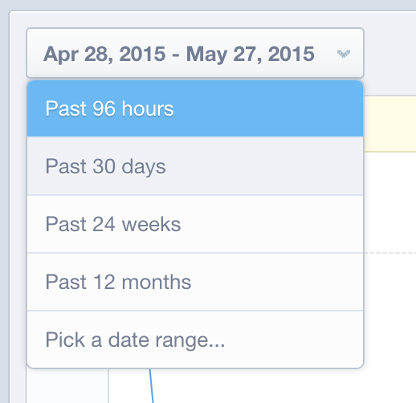

# Datenvalidierung in [!DNL Mixpanel]

Wenn [!DNL Adobe Commerce Intelligence] zum ersten Mal eine Verbindung zu Ihren [!DNL Mixpanel] Daten herstellt, kann Ihr Account Manager oder Analyst Sie auffordern, zu Validierungszwecken Datenexporte aus [!DNL Mixpanel] bereitzustellen. Auf diese Weise können Sie bestätigen, dass Sie alle Daten synchronisiert haben, die Ihnen direkt in [!DNL Mixpanel] zur Verfügung stehen.

## Datenexportvorgang: `Events`

1. Besuchen Sie Ihren `Segmentation` Abschnitt und zeigen Sie `Your Top Events` an.

   

1. `Past 96 Hours` für den Zeitraum auswählen

   

1. Scrollen Sie zum unteren rechten Teil des Berichts und exportieren Sie eine `.csv`:

   

1. Senden Sie die `.csv`-Datei an den Account Manager oder Analyst, mit dem Sie diesen Validierungsprozess durchführen.

