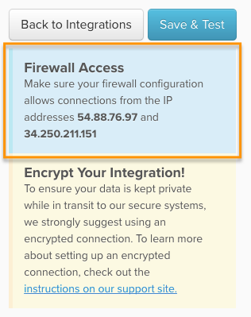

# [!DNL MongoDB] über SSH-Tunnel verbinden

Um Ihre [!DNL MongoDB] Datenbank über einen SSH-Tunnel mit [!DNL Commerce Intelligence] zu verbinden, müssen Sie einige Dinge tun:

1. [Abrufen des  [!DNL Commerce Intelligence]  Schlüssels](#retrieve)
1. [Zugriff auf die IP [!DNL Commerce Intelligence] Adresse zulassen](#allowlist)
1. [Erstellen eines Linux-Benutzers für Commerce Intelligence](#linux)
1. [Erstellen eines  [!DNL MongoDB]  für Commerce Intelligence](#mongodb)
1. [Geben Sie die Verbindungs- und Benutzerinformationen in ein [!DNL Commerce Intelligence]](#finish)

>[!NOTE]
>
>Aufgrund der technischen Natur dieses Setups empfiehlt Adobe, einen Entwickler einzubinden, um zu helfen, falls Sie dies noch nicht getan haben.

## Abrufen des [!DNL Commerce Intelligence] öffentlichen Schlüssels {#retrieve}

Die `public key` wird verwendet, um den [!DNL Commerce Intelligence] `Linux` Benutzer zu autorisieren. Der nächste Abschnitt führt Sie durch die Erstellung des Benutzers und den Import der Schlüssel.

1. Navigieren Sie zu **[!UICONTROL Data** > **Connections]** und klicken Sie auf **[!UICONTROL Add New Data Source]**.
1. Klicken Sie auf das Symbol [!DNL MONGODB] .
1. Nachdem die Seite mit den [!DNL MongoDB]-Anmeldeinformationen geöffnet wurde, ändern Sie den Umschalter `Encrypted` in `Yes`. Dadurch wird das SSH-Setup-Formular angezeigt.
1. Der `public key` befindet sich unter diesem Formular.

Lassen Sie diese Seite während des gesamten Tutorials geöffnet - Sie benötigen sie im nächsten Abschnitt und am Ende.

Wenn Sie ein wenig verloren sind, finden Sie hier, wie Sie durch [!DNL Commerce Intelligence] navigieren, um den Schlüssel abzurufen:

<!--{:.zoom}-->

## Zugriff auf die [!DNL Commerce Intelligence] IP-Adresse zulassen {#allowlist}

Damit die Verbindung erfolgreich hergestellt werden kann, müssen Sie Ihre Firewall so konfigurieren, dass der Zugriff über Ihre IP-Adressen zulässig ist. Sie sind `54.88.76.97` und `34.250.211.151`, befinden sich aber auch auf der Seite [!DNL MongoDB] Anmeldeinformationen :



## Erstellen eines `Linux` Benutzers für [!DNL Commerce Intelligence] {#linux}

>[!IMPORTANT]
>
>Wenn für die mit dem Server verknüpfte `sshd_config`-Datei nicht die Standardoption festgelegt ist, haben nur bestimmte Benutzer Serverzugriff. Dies verhindert eine erfolgreiche Verbindung mit [!DNL Commerce Intelligence]. In diesen Fällen ist es erforderlich, einen Befehl wie `AllowUsers` auszuführen, um dem `rjmetric` Zugriff auf den Server zu gewähren.

Dabei kann es sich um einen Produktions- oder Sekundärrechner handeln, sofern er Echtzeitdaten (oder häufig aktualisierte Daten) enthält. Sie können diesen Benutzer beliebig einschränken, solange er das Recht behält, eine Verbindung zum [!DNL MongoDB]-Server herzustellen.

Um den neuen Benutzer hinzuzufügen, führen Sie die folgenden Befehle als Stammordner auf Ihrem `Linux` aus:

```bash
    adduser rjmetric -p
    mkdir /home/rjmetric
    mkdir /home/rjmetric/.ssh
```

Erinnern Sie sich an die `public key`, die Sie im ersten Abschnitt abgerufen haben? Um sicherzustellen, dass der Benutzer Zugriff auf die Datenbank hat, müssen Sie den Schlüssel in `authorized_keys` importieren. Kopieren Sie den gesamten Schlüssel wie folgt in die `authorized_keys`-Datei:

```bash
    touch /home/rjmetric/.ssh/authorized_keys
    "< PASTE KEY HERE >" >> /home/rjmetric/.ssh/authorized_keys
```

Um die Erstellung des Benutzers abzuschließen, ändern Sie die Berechtigungen für den Ordner &quot;/home/rimetric“, um den Zugriff über SSH zuzulassen:

```bash
    chown -R rjmetric:rjmetric /home/rjmetric
    chmod -R 700 /home/rjmetric/.ssh
```

## Erstellen eines [!DNL Commerce Intelligence] [!DNL MongoDB] Benutzers {#mongodb}

[!DNL MongoDB] Server verfügen über zwei Ausführungsmodi: [einen mit der Option &quot;](#auth)&quot; `(mongod -- auth)` und einen ohne, [das ist der Standard](#default). Die Schritte zum Erstellen eines [!DNL MongoDB]-Benutzers hängen davon ab, welcher Modus vom Server verwendet wird. Stellen Sie sicher, dass Sie den Modus überprüfen, bevor Sie fortfahren.

### Wenn Ihr Server die `Auth` Option verwendet: {#auth}

Wenn Sie eine Verbindung zu mehreren Datenbanken herstellen, können Sie den Benutzer hinzufügen, indem Sie sich bei [!DNL MongoDB] als Admin-Benutzer anmelden und die folgenden Befehle ausführen.

>[!NOTE]
>
>Zum Anzeigen aller verfügbaren Datenbanken benötigt der [!DNL Commerce Intelligence] Benutzer die Berechtigungen zum Ausführen von `listDatabases.`

Dieser Befehl gewährt dem [!DNL Commerce Intelligence] Benutzer `to all databases`:

```bash
    use admin
    db.createUser('rjmetric', '< secure password here >', true)
```

Verwenden Sie diesen Befehl, um dem [!DNL Commerce Intelligence] Benutzer Zugriff zu gewähren `to a single database`:

```bash
    use < database name >
    db.createUser('rjmetric', '< secure password here >', true)
```

Dadurch wird eine Antwort gedruckt, die wie folgt aussieht:

```bash
    {
    "id": ObjectId("< some object id here >"),
    "user": "rjmetric",
    "readOnly": true,
    "pwd": "< some hash here >"
    }
```

### Wenn Ihr Server die Standardoption verwendet {#default}

Wenn Ihr Server den `auth` nicht verwendet, ist Ihr [!DNL MongoDB]-Server auch ohne Benutzernamen und Kennwort zugänglich. Sie sollten jedoch sicherstellen, dass die `mongodb.conf`-Datei `(/etc/mongodb.conf)` die folgenden Zeilen enthält. Wenn nicht, starten Sie Ihren Server neu, nachdem Sie sie hinzugefügt haben.

```bash
    bind_ip = 127.0.0.1
    noauth = true
```

Um Ihren [!DNL MongoDB]-Server an eine andere Adresse zu binden, passen Sie den Datenbank-Host-Namen im nächsten Schritt entsprechend an.

## Eingabe der Verbindungs- und Benutzerinformationen in [!DNL Commerce Intelligence] {#finish}

Um alles abzuschließen, müssen Sie die Verbindung und die Benutzerinformationen in [!DNL Commerce Intelligence] eingeben. Haben Sie die Seite mit den [!DNL MongoDB]-Anmeldeinformationen geöffnet gelassen? Wenn nicht, gehen Sie zu **[!UICONTROL Data > Connections]** und klicken Sie auf **[!UICONTROL Add New Data Source]** und dann auf das Symbol [!DNL MongoDB] . Vergessen Sie nicht, den Umschalter `Encrypted` in `Yes` zu ändern.

Geben Sie die folgenden Informationen auf dieser Seite ein, beginnend mit dem Abschnitt `Database Connection` :

* `Host`: `127.0.0.1`
* `Username`: Der [!DNL Commerce Intelligence] [!DNL MongoDB] Benutzername (sollte `rjmetric` sein)
* `Password`: Das [!DNL Commerce Intelligence] [!DNL MongoDB] Kennwort
* `Port`: Port von MongoDB auf dem Server (standardmäßig `27017`)
* `Database Name` (Optional): Wenn Sie nur den Zugriff auf eine Datenbank zulassen, geben Sie hier den Namen dieser Datenbank an.

Im Abschnitt `SSH Connection` :

* `Remote Address`: Die IP-Adresse oder der Hostname des Servers, auf den Sie SSH installieren möchten
* `Username`: Der [!DNL Commerce Intelligence] Linux (SSH) Benutzername (sollte rjmetrisch sein)
* `SSH Port`: Der SSH-Port auf Ihrem Server (standardmäßig 22)

Wenn Sie fertig sind, klicken Sie auf **[!UICONTROL Save Test]** , um die Einrichtung abzuschließen.

### verwandt

* [Integrationen erneut authentifizieren](https://experienceleague.adobe.com/docs/commerce-knowledge-base/kb/how-to/mbi-reauthenticating-integrations.html?lang=de)
