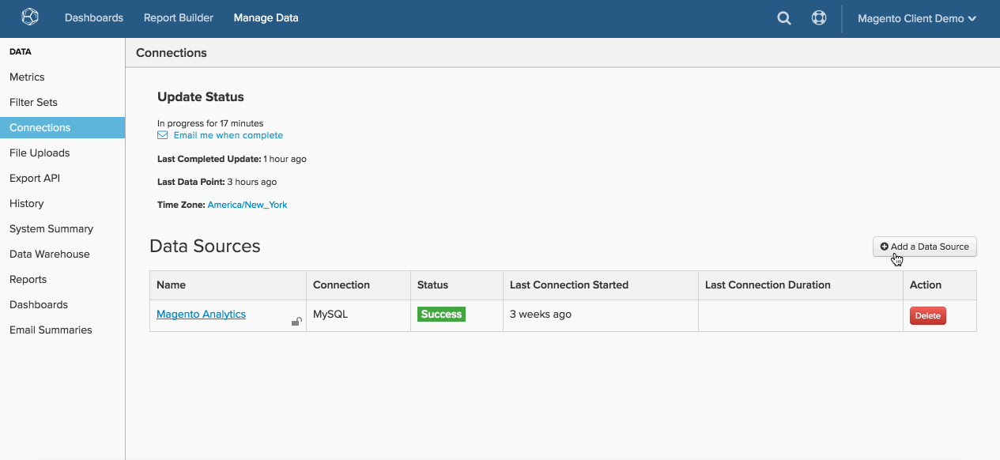

# [!DNL MySQL] über [!DNL SSH Tunnel] verbinden

* [Abrufen des öffentlichen Schlüssels [!DNL Commerce Intelligence] ](#retrieve)
* [Zugriff auf die  [!DNL Commerce Intelligence] IP-Adresse zulassen](#allowlist)
* [Linux-Benutzer für  [!DNL Commerce Intelligence] erstellen](#linux)
* [Erstellen eines [!DNL MySQL] Benutzers für  [!DNL Commerce Intelligence]](#mysql)
* [Geben Sie die Verbindung und Benutzerinformationen in [!DNL Commerce Intelligence] ein.](#finish)

## SPRINGEN ZU

* [[!DNL MySQL] via ](../integrations/mysql-via-a-direct-connection.md)
* [[!DNL MySQL] via [!DNL cPanel]](../integrations/mysql-via-cpanel.md)

Um Ihre [!DNL MySQL] -Datenbank über eine `SSH tunnel` mit [!DNL Commerce Intelligence] zu verbinden, müssen Sie einige Schritte ausführen:

1. Abrufen der [!DNL Commerce Intelligence] `public key`
1. Zugriff auf [!DNL Commerce Intelligence] `IP address` zulassen
1. Erstellen eines `Linux` Benutzers für [!DNL Commerce Intelligence]
1. Erstellen eines `MySQL` Benutzers für [!DNL Commerce Intelligence]
1. Verbindung und Benutzerinformationen in [!DNL Commerce Intelligence] eingeben


## Abrufen des öffentlichen Schlüssels [!DNL Commerce Intelligence] {#retrieve}

Der `public key` wird verwendet, um den [!DNL Commerce Intelligence] `Linux` Benutzer zu autorisieren. Im nächsten Abschnitt erstellen Sie den Benutzer und importieren den Schlüssel.

1. Gehen Sie zu **[!UICONTROL Manage Data** > **Connections]** und klicken Sie auf **[!UICONTROL Add New Data Source]**.
1. Klicken Sie auf das Symbol &quot;`MySQL`&quot;.
1. Nachdem die Seite `MySQL credentials` geöffnet wurde, stellen Sie den Umschalter `Encrypted` auf `Yes` ein. Dadurch wird das SSH-Setup-Formular angezeigt.
1. Die `public key` befindet sich unter diesem Formular.

Lassen Sie diese Seite während des Tutorials geöffnet - Sie benötigen sie im nächsten Abschnitt und am Ende.

So navigieren Sie durch [!DNL Commerce Intelligence], um den Schlüssel abzurufen:

<!--{: width="770"}-->

## Zugriff auf die [!DNL Commerce Intelligence] -IP-Adresse zulassen {#allowlist}

Damit die Verbindung erfolgreich hergestellt werden kann, müssen Sie Ihre Firewall so konfigurieren, dass der Zugriff von Ihren IP-Adressen aus gestattet wird. Sie sind `54.88.76.97` und `34.250.211.151`, befinden sich aber auch auf der Seite `MySQL credentials`. Siehe blaue Box in der obigen GIF.

## Erstellen eines [!DNL Linux] Benutzers für [!DNL Commerce Intelligence] {#linux}

Dabei kann es sich um eine Produktions- oder Sekundärmaschine handeln, sofern diese Daten in Echtzeit (oder häufig aktualisiert) enthält. Sie können [diesen Benutzer auf beliebige Weise einschränken](../../../administrator/account-management/restrict-db-access.md), solange er das Recht behält, eine Verbindung zum `MySQL`-Server herzustellen.

1. Um den neuen Benutzer hinzuzufügen, führen Sie die folgenden Befehle als Stamm auf Ihrem [!DNL Linux]-Server aus:

```bash
        adduser rjmetric -p<password>
        mkdir /home/rjmetric
        mkdir /home/rjmetric/.ssh
```

1. Erinnern Sie sich an die `public key`, die Sie im ersten Abschnitt abgerufen haben? Um sicherzustellen, dass der Benutzer Zugriff auf die Datenbank hat, müssen Sie den Schlüssel in `authorized\_keys` importieren.

   Kopieren Sie den gesamten Schlüssel wie folgt in die Datei `authorized\_keys` :

```bash
        touch /home/rjmetric/.ssh/authorized_keys
        "<PASTE KEY HERE>" >> /home/rjmetric/.ssh/authorized_keys
```

1. Um die Erstellung des Benutzers abzuschließen, ändern Sie die Berechtigungen für den Ordner &quot;`/home/rjmetric`&quot;, um den Zugriff über `SSH` zu ermöglichen:

```bash
        chown -R rjmetric:rjmetric /home/rjmetric
        chmod -R 700 /home/rjmetric/.ssh
        chmod 400 /home/rjmetric/.ssh/authorized_keys
```

>[!IMPORTANT]
>
>Wenn die mit dem Server verknüpfte `sshd\_config` -Datei nicht auf die Standardoption festgelegt ist, haben nur bestimmte Benutzer Zugriff auf den Server. Dies verhindert eine erfolgreiche Verbindung zu [!DNL Commerce Intelligence]. In diesen Fällen ist es erforderlich, einen Befehl wie `AllowUsers` auszuführen, um dem `rjmetric` -Benutzer Zugriff auf den Server zu gewähren.

## Erstellen eines [!DNL MySQL] Benutzers für [!DNL Commerce Intelligence] {#mysql}

Ihr Unternehmen erfordert möglicherweise einen anderen Prozess. Die einfachste Möglichkeit zum Erstellen dieses Benutzers besteht jedoch darin, die folgende Abfrage auszuführen, wenn Sie als Benutzer mit der Berechtigung zum Gewähren von Berechtigungen bei [!DNL MySQL] angemeldet sind:

```sql
    GRANT SELECT ON *.* TO 'rjmetric'@'localhost' IDENTIFIED BY '<secure password here>';
```

Ersetzen Sie `secure password here` durch ein sicheres Kennwort, das vom `SSH`-Kennwort abweichen kann.

Um den Zugriff dieses Benutzers auf Daten in bestimmten Datenbanken, Tabellen oder Spalten zu beschränken, können Sie stattdessen GRANT-Abfragen ausführen, die nur den Zugriff auf die Daten ermöglichen, die Sie zulassen.

## Eingabe der Verbindung und Benutzerinformationen in [!DNL Commerce Intelligence] {#finish}

Um Elemente einzuschließen, müssen Sie die Verbindung und Benutzerinformationen in [!DNL Commerce Intelligence] eingeben. Haben Sie die Seite `MySQL credentials` geöffnet gelassen? Wenn nicht, gehen Sie zu **[!UICONTROL Data** > **Connections]** und klicken Sie auf **[!UICONTROL Add New Data Source]**, dann auf das Symbol [!DNL MySQL]. Vergessen Sie nicht, den Umschalter `Encrypted` auf `Yes` festzulegen.

Geben Sie die folgenden Informationen in diese Seite ein, beginnend mit dem Abschnitt `Database Connection` :

* `Username`: Der Benutzername für den Benutzer [!DNL Commerce Intelligence] [!DNL MySQL]
* `Password`: Das Kennwort für den Benutzer [!DNL Commerce Intelligence] [!DNL MySQL]
* `Port`: [!DNL MySQL] Port auf Ihrem Server (standardmäßig 3306)
* `Host` Standardmäßig ist dies localhost. Im Allgemeinen handelt es sich dabei um den bind-address-Wert für Ihren [!DNL MySQL]-Server, der standardmäßig `127.0.0.1 (localhost)` ist, aber auch eine lokale Netzwerkadresse (z. B. `192.168.0.1`) oder die öffentliche IP-Adresse Ihres Servers sein kann.

  Der Wert befindet sich in Ihrer `my.cnf`-Datei (unter `/etc/my.cnf`) unter der Zeile, die den Wert `\[mysqld\]` enthält. Wenn die bind-address-Zeile in dieser Datei auskommentiert ist, wird Ihr Server vor externen Verbindungsversuchen geschützt.

Im Abschnitt `SSH Connection` :

* `Remote Address`: Die IP-Adresse oder der Hostname des Servers [!DNL Commerce Intelligence] wird durch einen Tunnel in
* `Username`: Der Benutzername für den Benutzer [!DNL Commerce Intelligence] SSH ([!DNL Linux])
* `SSH Port`: SSH-Port auf Ihrem Server (standardmäßig 22)

Wenn Sie fertig sind, klicken Sie auf **[!UICONTROL Save & Test]** , um das Setup abzuschließen.

## Verwandte:

* [Erneutes Authentifizieren von Integrationen](https://experienceleague.adobe.com/docs/commerce-knowledge-base/kb/how-to/mbi-reauthenticating-integrations.html)
