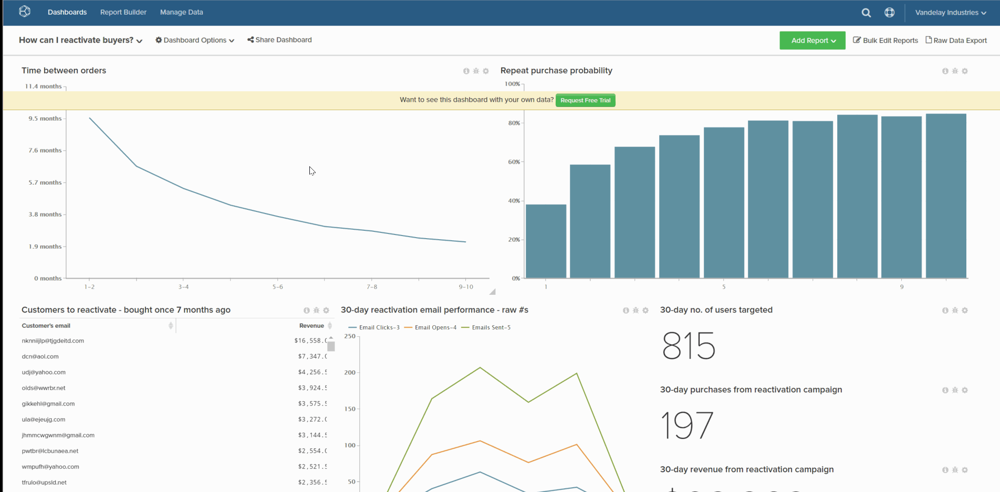

# Dashboard löschen

Wenn Sie verhindern möchten, dass Ihre Dashboard-Liste zu überladen wird, können Sie ein Dashboard löschen, wenn es nicht mehr benötigt wird. Dies lässt sich auf zwei Arten erreichen:

1. [Über die `Account Settings`-](#account): Diese Methode erfordert [Administratorberechtigungen](../../administrator/user-management/user-management.md).

1. [Über das `Dashboard Options`-](#do): Für diese Methode müssen Sie Eigentümer des Dashboards sein oder über `Edit` verfügen.

## Dashboard über die `Account Settings` löschen {#account}

1. Klicken Sie auf **[!UICONTROL Account Settings** > **Dashboards]**.

1. Klicken Sie in der Liste der Dashboards auf das Dashboard, das Sie löschen möchten.

1. Klicken Sie auf **[!UICONTROL Delete Dashboard]**.

Beispiel:

<!--{: width="703" height="346"}-->

## Löschen eines Dashboards über das `Dashboard Options` {#do}

1. Klicken Sie auf das Menü **[!UICONTROL Dashboard Options]** oben auf dem Bildschirm.

1. Klicken Sie in der Dropdown-Liste auf **[!UICONTROL Delete]**.

1. Wenn Sie zum Bestätigen aufgefordert werden, klicken Sie auf **[!UICONTROL Delete]**.

Beispiel:

<!--{: width="703" height="347"}-->
