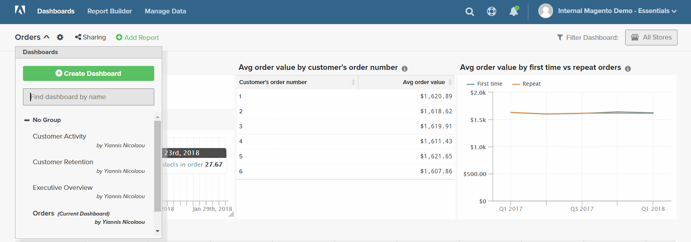

# Dashboards

[!DNL Adobe Commerce Intelligence] Dashboards bieten Ihnen einen schnellen Überblick über die Leistung und Verkaufsaktivität Ihres Stores. Einzelne Dashboards können für andere Benutzer freigegeben und in logischen Gruppen organisiert werden. Sie können auch verschiedene Berechtigungsebenen für andere Benutzer festlegen.

Es ist einfach, einen Bericht zu erstellen, ihn zu einem Dashboard hinzuzufügen und die Daten nach Excel zu exportieren. Diagramme und Berichte können in der Größe verändert und im Dashboard an eine Position verschoben werden.

## Erstellen von Dashboards {#createdash}

Dashboards sind freigebbare, thematische Behälter für die Analysen, die Sie in Report Builders erstellen. Auf diese Weise können Sie Ihr Team dazu ermutigen, in Ihrem gesamten Unternehmen zusammenzuarbeiten und eine zentrale Quelle der Wahrheit zu verwenden.

*Wenn Sie Administrator oder Standardbenutzer sind* können Sie ein Dashboard erstellen, indem Sie auf das `Dashboard Options`-Dropdown-Menü klicken und `Create New dashboard` auswählen.

Wie die von Ihnen erstellten Dashboards aussehen, liegt ganz bei Ihnen. Sie können die Elemente im Dashboard nach Belieben anordnen und in der Größe anpassen.

### Dashboard erstellen

1. Klicken Sie im Menü auf **[!UICONTROL Dashboards]**.

1. Der Name des Standard-Dashboards wird in der oberen linken Ecke der Dashboard-Kopfzeile angezeigt. Klicken Sie auf den Abwärtspfeil (), um die verfügbaren Optionen anzuzeigen.

   

1. Klicken Sie auf **[!UICONTROL Create Dashboard]**. Gehen Sie dann wie folgt vor:

   * Geben Sie einen `Name` für Ihr Dashboard ein.

   * Um eine `Group` für das Dashboard zu erstellen, geben Sie den Namen der Gruppe ein.

     Wenn Ihre Commerce-Installation beispielsweise über mehrere Store-Ansichten verfügt, können Sie für jede Store-Ansicht eine Gruppe erstellen.

   * Klicken Sie auf **[!UICONTROL Create]**.

   

   * Der Name Ihres neuen Dashboards wird in der oberen linken Ecke angezeigt. Klicken Sie auf den Abwärtspfeil (), um die Optionen anzuzeigen. Wenn Sie eine Gruppe erstellt haben, wird das neue Dashboard unterhalb der Gruppe in der Liste angezeigt.

### Bericht hinzufügen

1. Um einen Bericht hinzuzufügen, führen Sie einen der folgenden Schritte aus:

   * Klicken Sie auf der Seite auf die Eingabeaufforderung **[!UICONTROL Add a report]** .

   * Klicken Sie in der Kopfzeile des Dashboards auf **[!UICONTROL Add Report]**.

     

1. Klicken Sie auf **[!UICONTROL Create Report]** , um die **[!UICONTROL Report Builder Options]** anzuzeigen.

   

## Elemente in einem Dashboard anordnen

* Um die Größe eines Diagramms oder Berichts zu ändern, ziehen Sie die untere rechte Ecke auf die neue Größe.

* Um ein Diagramm oder einen Bericht zu verschieben, bewegen Sie den Mauszeiger über den Titel oder die Kopfzeile, bis sich der Cursor in ein Kreuz ändert. Ziehen Sie sie dann in die gewünschte Position.

## Verwalten von Dashboards {#managedash}

In **[!DNL Manage Data** > **Dashboards]** können Sie Benutzerberechtigungen für Dashboards verwalten, deren Inhaber Sie sind, nicht mehr benötigte Dashboards löschen und ein Standard-Dashboard festlegen.

### Freigeben von Dashboards {#sharingdash}

Um die [!DNL Commerce Intelligence] in Ihrem Unternehmen wirklich zu skalieren und wertvolle Einblicke zu bieten, empfiehlt Ihnen Adobe, die von Ihnen erstellten Dashboards mit anderen Team-Mitgliedern zu teilen. *Sie können Ihre eigenen Dashboards freigeben* indem Sie auf die Option `Share Dashboard` oben auf der Seite klicken.

Wenn Sie ein Dashboard freigeben, können Sie Berechtigungen für Ihre gesamte Organisation ODER für einzelne Benutzer zuweisen, sodass Sie entscheiden können, wer Ihre Berichte anzeigen und bearbeiten darf.

>[!NOTE]
>
>`Read-Only` Benutzer haben nur Zugriff auf Dashboards, die direkt für sie freigegeben sind - sie können nicht selbst nach Dashboards suchen und diese hinzufügen. Vergessen Sie nicht, sie auf dem Laufenden zu halten!

### Zugreifen auf freigegebene Dashboards {#accessshared}

*Wenn Sie ein Administrator- oder Standardbenutzer sind* Ihrem Konto ein freigegebenes Dashboard hinzufügen möchten, klicken Sie dazu auf **[!UICONTROL Dashboard Options]** und dann auf **[!UICONTROL Find]** in der Dropdown-Liste.

<!--{: width="1000" height="535"}-->

### Dashboard-Einstellungen verwalten

1. Klicken Sie im Menü auf **[!DNL Manage Data** > **Dashboards]**.

1. Geben Sie gegebenenfalls eine neue `Dashboard Name` ein.

1. Um das Dashboard einem bestimmten `Dashboard Group` zuzuweisen, wählen Sie aus der Liste der Gruppen aus.

   **`Permissions`**

   Gehen Sie wie folgt vor, um allen Benutzern denselben Zugriff auf das Dashboard zu gewähren:

   1. Wählen Sie unter **`Shared with`** eine der folgenden Optionen:

      * `View`
      * `Edit`
      * `None`

   1. Wenn Sie zur Bestätigung aufgefordert werden, klicken Sie auf **[!UICONTROL OK]** , um die Berechtigungsstufe für jeden Benutzer zu aktualisieren.

   1. Um die Berechtigungsstufe eines Kontakts zu ändern, suchen Sie den/die Benutzende(n) in der Liste und ändern Sie die Berechtigungsstufe. Die Änderung wird automatisch gespeichert.

   **`Default`**

   1. Um dieses Dashboard zum Standard für Ihr [!DNL Commerce Intelligence]-Konto zu machen, klicken Sie auf **[!UICONTROL Make Default]**.

   **`Remove`**

   1. Um das Dashboard zu entfernen, klicken Sie auf **[!UICONTROL Delete Dashboard]**.
