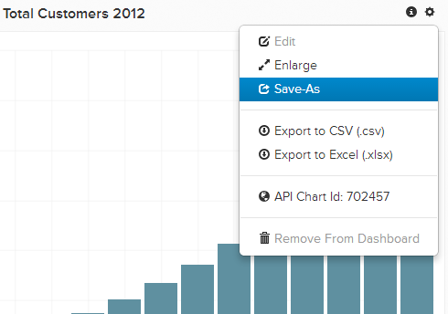

# Importieren von Diagrammen aus einem anderen Benutzer

Sie können ein Diagramm bearbeiten, das einem anderen Benutzer gehört, oder ein ähnliches Diagramm erstellen. Es ist einfach, ein Diagramm zu importieren, das derzeit einem anderen Benutzer gehört, und es in Ihrem eigenen Dashboard zu speichern.

## Grafik suchen

Suchen Sie zunächst das Diagramm, das Sie kopieren möchten, vom anderen Benutzer. Alle Dashboards, die für Sie freigegeben sind, finden Sie im `Dashboard` Seitenleiste, in der sie mit einem gemeinsamen Symbol markiert sind. Klicken Sie auf das gewünschte Dashboard.

## Grafik klonen

Wählen Sie im freigegebenen Dashboard das Diagramm aus, das Sie in Ihr eigenes Konto kopieren möchten. Klicken Sie auf das Zahnrad () und klicken Sie dann auf **[!UICONTROL Save As]**.

Sie werden aufgefordert, Ihre Kopie des Diagramms zu benennen und zu einem Ihrer vorhandenen Dashboards hinzuzufügen. Wenn Sie kein Dashboard auswählen, wird es Ihrer Liste der vorhandenen Diagramme hinzugefügt. Sie können [später hinzufügen](../../data-user/dashboards/add-charts-dashboard.md).

